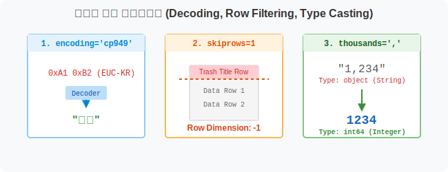

## 6.5.2 실전 공공데이터 파싱(Parsing)과 타입 캐스팅

> 💾 **[실습 파일 다운로드]**
> 본 강의의 전체 실습 코드를 직접 실행해 볼 수 있는 주피터 노트북 파일입니다. 아래 링크를 클릭하여 다운로드 후 VS Code에서 열어보세요.
> - [📥 internet_data_practice.ipynb 파일 다운로드](./internet_data_practice.ipynb) (클릭 또는 마우스 우클릭 후 '다른 이름으로 링크 저장')

## 🧮 전산학적/수학적 의미: 파서 옵션 제어 및 동적 타입 형변환(Type Casting)

인터넷 웹페이지나 공공 구청에서 제공하는 CSV 파일들은 컴퓨터 친화적이기보다는 사람 눈에 보기 좋게 타이틀 제목을 넣거나 숫자 3자리마다 콤마(`,`)를 찍어두는 경우가 많습니다. 판다스 엔진이 이러한 문자열(String) 형태의 숫자를 산술 연산 체계(Integer/Float)로 정상적으로 해독(Parsing)할 수 있도록, 불필요한 줄을 건너뛰고(`skiprows`) 천 단위 구분 기호를 제거하여 파이썬 원시 타입으로 강제 형변환(Type Casting)하는 기술을 배웁니다.



## 🏷️ 비유로 이해하기: 번역기와 찌꺼기 필터링

- **글자 깨짐 방지**: 중국어나 암호처럼 글자가 깨지면 `encoding='cp949'` 라는 한글 전용 해독 안경을 씌워줍니다.
- **불필요한 인사말 제거**: 표 맨 위에 있는 "2022년도 총괄표~" 같은 쓸데없는 제목 1줄을 잘라내고 핵심 표부터 읽어오도록 지시합니다(`skiprows=1`).
- **숫자 변장 벗기기**: `"1,234"` 처럼 콤마가 붙어있으면 컴퓨터는 이를 글자로 인식해 덧셈을 못합니다. "야, 저 쉼표(,)는 진짜 글자가 아니라 천 단위 구분 기호야!" 라고 알려줘서 진짜 숫자 `1234`로 둔갑시킵니다(`thousands=','`).


---

## 🪄 [실습 1] 한글 깨짐과 불필요한 행 제거 (`encoding`, `skiprows`)

공공데이터포털에서 가져온 대한민국 교통사고 데이터를 그대로 열어보면 여러 문제가 터집니다.

```python
import pandas as pd

# 1. encoding='cp949' : 공공기관 엑셀/CSV에서 한글이 깨질 때의 만병통치약입니다!
# 2. skiprows=1 : 첫 번째 줄에 문서 제목이 적혀있어서, 그걸 무시하고 2번째 줄(컬럼명)부터 읽게 합니다.
# 3. index_col=0 : 첫 번째 열인 '시도' 지역명을 판다스의 굵은 글씨 인덱스(이름표)로 씁니다.

traffic_raw = pd.read_csv("data/2022년도시도별교통사고.csv", encoding='cp949', skiprows=1, index_col=0)

print("--- 🩺 1차 시도: 파싱 직후의 정보 스캔 ---")
traffic_raw.info()
```
**[출력 결과]**
```text
<class 'pandas.core.frame.DataFrame'>
Index: 17 entries, 서울 to 세종
Data columns (total 3 columns):
 #   Column   Non-Null Count  Dtype 
---  ------   --------------  ----- 
 0   사고건수  17 non-null     object  <-- 🚨 경고!
 1   사망자수  17 non-null     int64 
 2   부상자수  17 non-null     object  <-- 🚨 경고!
dtypes: int64(1), object(2)
```


> **🚨 의사의 진단 소견:** 사망자수는 백 단위라 숫자로 잘 들어왔는데, 사고건수와 부상자수는 천 단위 콤마(`,`)가 찍혀 있어서 파이썬이 **문자열(`object`)**로 착각하고 있습니다. 이 상태로는 `.sum()` 같은 덧셈이 불가능합니다!

---

## 🪄 [실습 2] 진짜 숫자로 변환하기 (`thousands`)

`.read_csv()` 함수 안에 옵션 하나만 틱 추가해주면 판다스가 알아서 안경을 고쳐 쓰고 숫자로 완벽하게 변환해 줍니다.

```python
# thousands=',' 옵션을 투입하여 콤마를 제거하며 숫자로 빨아들입니다!
traffic = pd.read_csv("data/2022년도시도별교통사고.csv", encoding='cp949', skiprows=1, index_col=0, thousands=',')

print("--- 🩺 2차 시도: 다시 스캔 ---")
traffic.info()
```
**[출력 결과]**
```text
<class 'pandas.core.frame.DataFrame'>
Index: 17 entries, 서울 to 세종
Data columns (total 3 columns):
 #   Column   Non-Null Count  Dtype 
---  ------   --------------  ----- 
 0   사고건수  17 non-null     int64   <-- ✅ 완벽한 숫자로 변신!
 1   사망자수  17 non-null     int64 
 2   부상자수  17 non-null     int64   <-- ✅ 완벽한 숫자로 변신!
```


이제 숫자로 완벽히 들어왔으므로 `traffic.describe()`를 통해 평균 수치 등을 구하거나, 덧셈을 수행할 수 있습니다.

---

## 🪄 [실습 3] 덤: 숫자 데이터를 바탕으로 막대그래프 그리기

데이터의 클렌징(정제)이 숫자 형태로 완벽하게 끝났다면, 파이썬의 강력한 시각화 라이브러리인 **Seaborn** 을 이용해 이 예쁘장한 데이터프레임을 통째로 던져주어 그래프를 그릴 수 있습니다.

> **그래프 한글 깨짐 방지**: `matplotlib.pyplot`의 폰트를 맑은 고딕 등으로 세팅해야 지역명(서울, 부산)이 엑박(ㅁㅁ)으로 안 깨집니다!

```python
import seaborn as sns
import matplotlib.pyplot as plt

# ① 그래프 한글 폰트(맑은 고딕) 설정 및 마이너스 기호 깨짐 방지
plt.rcParams['font.family'] = 'Malgun Gothic'
plt.rcParams['axes.unicode_minus'] = False

# ② 특정 열(사망자수)만 뽑아내기. 
# 그리고 Seaborn이 지역별로 가로축에 뿌리기 좋게 .T (Transpose, 행/열 피벗 회전) 를 해줍니다!!
death_data = traffic[['사망자수(명)']].T

# ③ 마법의 막대그래프 함수
sns.barplot(data=death_data)

# ④ 그래프 창 띄우기
plt.show()
```


이 코드를 실행하시면 팝업창에 각 지역별 교통사고 사망자 수가 막대그래프로 예쁘게 솟아오른 것을 감상하실 수 있습니다. (데이터 클렌징의 진정한 묘미입니다!)