# 판다스 (Pandas) 핵심 가이드

파이썬 기반의 강력한 데이터 분석 및 조작 라이브러리인 **Pandas(판다스)**를 학습합니다. 주요 자료구조인 Series와 DataFrame의 생성부터 데이터 선택, 수정, 연산, 파일 입출력까지 실무에 필요한 데이터 정제 기술을 5개의 논리적인 섹션으로 나누어 살펴봅니다.


<br/>

## 🐼 Pandas란 무엇인가요?

Pandas는 파이썬에서 표 형태의 데이터(Tabular Data)를 가장 쉽고 빠르게 다룰 수 있게 해주는 라이브러리입니다. 엑셀이나 SQL과 같은 데이터베이스의 기능을 파이썬 코드 안에서 빠르고 강력하게 사용할 수 있습니다.

### 파이썬 예제 코드 살펴보기
다음은 Pandas를 사용하여 데이터를 생성하고, 조건에 맞게 필터링(조건 검색)하는 간단한 예제입니다.

```python
import pandas as pd

# 1. 딕셔너리를 활용하여 데이터프레임(DataFrame) 생성
data = {
    'Name': ['Alice', 'Bob', 'Charlie', 'Diana'],
    'Age': [25, 30, 35, 28],
    'Score': [85, 92, 78, 95]
}
df = pd.DataFrame(data)

# 2. DataFrame 출력 (원본 데이터 확인)
print("--- 원본 데이터 ---")
print(df)

# 3. 데이터 필터링: Score가 90을 초과하는 우수 학생만 추출
excellent_students = df[df['Score'] > 90]

# 4. 필터링된 결과 확인
print("\n--- 90점 초과 우수 학생 ---")
print(excellent_students)
```

<br/>

## 🪄 데이터 변환 애니메이션 (필터링 동작 원리)

아래 데이터 변환 애니메이션은 위 파이썬 코드에서 `df[df['Score'] > 90]` 구문이 어떻게 동작하여 원본 데이터프레임(왼쪽)에서 조건을 만족하는 행들만 필터링한 후 새로운 결과 데이터프레임(오른쪽)을 만들어내는지를 직관적으로 보여줍니다.

<div style="text-align: center; margin: 2rem 0;">
  
</div>

---

## 01. 판다스 기초 {#section-01}
- [01. 판다스 소개](/pandas/01_pandas_basics/01_pandas_intro/)
- [02. 시리즈 개요](/pandas/01_pandas_basics/02_series_intro/)
- [03. 데이터프레임 개요](/pandas/01_pandas_basics/03_dataframe_intro/)

## 02. 자료구조 생성 (Series & DataFrame) {#section-02}
- [04. Series 생성과 활용](/pandas/02_series_dataframe_creation/04_series_creation/)
- [05. Series 활용 함수](/pandas/02_series_dataframe_creation/05_series_functions/)
- [06. 클래스 DataFrame 생성자 개요](/pandas/02_series_dataframe_creation/06_dataframe_constructor/)
- [07. 2차원 행렬의 테이블 데이터 사용](/pandas/02_series_dataframe_creation/07_df_from_matrix/)
- [08. 딕셔너리의 테이블 데이터 사용](/pandas/02_series_dataframe_creation/08_df_from_dict/)
- [09. 여러 Series로 DataFrame 생성](/pandas/02_series_dataframe_creation/09_df_from_series/)
- [10. 여러 딕셔너리의 목록 데이터 사용](/pandas/02_series_dataframe_creation/10_df_from_dict_list/)
- [11. dict의 값으로 Series 사용](/pandas/02_series_dataframe_creation/11_df_from_series_dict/)
- [12. 열과 전체 자료형 속성 dtypes](/pandas/02_series_dataframe_creation/12_df_dtypes/)
- [13. 여러 날짜 생성을 위한 함수 date_range()](/pandas/02_series_dataframe_creation/13_date_range/)
- [14. 날짜를 포함한 데이터프레임](/pandas/02_series_dataframe_creation/14_df_with_dates/)

## 03. 데이터 참조 및 인덱싱 {#section-03}
- [15. 열 참조](/pandas/03_data_selection/15_column_selection/)
- [16. 조건 참조](/pandas/03_data_selection/16_conditional_selection/)
- [17. loc[index]로 행 참조](/pandas/03_data_selection/17_row_selection_loc/)
- [18. loc[index[i]]로 행 참조](/pandas/03_data_selection/18_row_selection_loc_i/)
- [19. 열 참조](/pandas/03_data_selection/19_col_selection_loc/)
- [20. loc[:, columns[i]]로 열 참조](/pandas/03_data_selection/20_col_selection_loc_i/)
- [21. 행과 열 참조](/pandas/03_data_selection/21_row_col_selection/)
- [22. df.iloc[첨자] 참조](/pandas/03_data_selection/22_iloc_selection/)

## 04. 데이터프레임 정보 확인 및 수정 {#section-04}
- [23. 데이터프레임 정보와 수정](/pandas/04_data_modification/23_df_info_modify/)
- [24. 데이터프레임 정보 추출과 대입](/pandas/04_data_modification/24_df_extract_assign/)
- [25. 데이터프레임 수정 대입](/pandas/04_data_modification/25_df_modify_assign/)
- [26. 데이터프레임 조건 검색](/pandas/04_data_modification/26_df_conditional_search/)
- [27. 데이터프레임 정렬](/pandas/04_data_modification/27_df_sorting/)
- [28. 데이터프레임의 다양한 수정](/pandas/04_data_modification/28_df_various_modifications/)

## 05. 데이터 입출력 및 수집 {#section-05}
- [29. csv와 엑셀 파일 활용](/pandas/05_file_io/29_csv_excel_io/)
- [30. 인터넷 자료 활용](/pandas/05_file_io/30_internet_data/)
