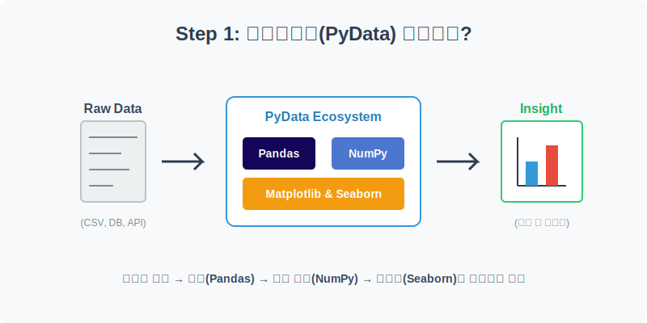
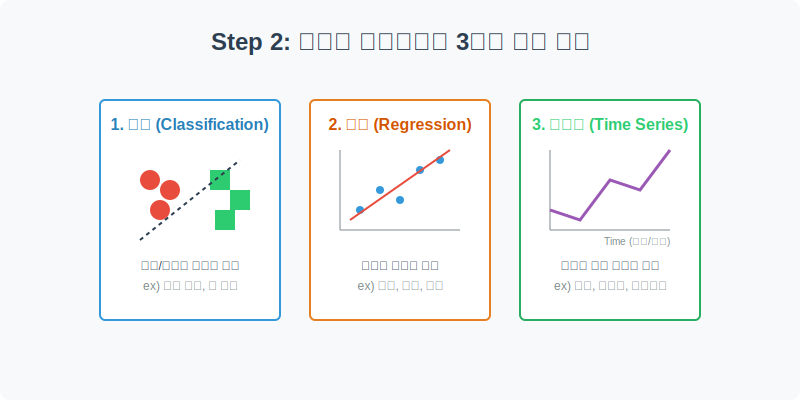
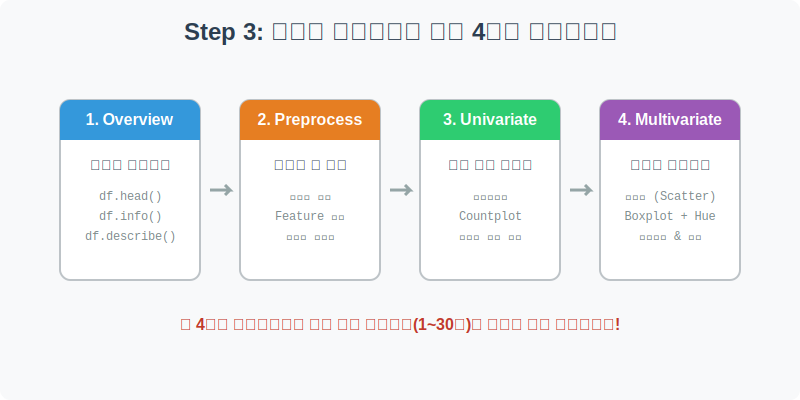

# 파이데이터(PyData) 실습 개요 및 데이터셋 이해

본격적인 데이터 분석 실습에 들어가기에 앞서, 우리가 다루게 될 **파이데이터(PyData) 생태계**와 **데이터셋의 유형**, 그리고 앞으로 모든 실습을 관통하게 될 **4단계 데이터 분석 프레임워크**에 대해 자세히 알아보겠습니다.

---

## 1. 파이데이터(PyData) 생태계란?

파이썬(Python)은 그 자체로도 훌륭한 프로그래밍 언어이지만, 데이터 분석 분야에서 압도적인 1위를 차지하게 된 이유는 바로 강력한 **PyData 생태계** 덕분입니다. 

PyData는 데이터를 다루는 데 특화된 파이썬 오픈소스 라이브러리들의 집합을 의미합니다. 수많은 원시 데이터(Raw Data)를 가져와서, 우리가 비즈니스 통찰력(Insight)을 얻을 때까지의 여정은 다음과 같은 파이데이터 핵심 도구들을 거치게 됩니다.

1. **NumPy (수치 계산)**: 파이썬에서 대규모 다차원 배열과 행렬 연산을 고속으로 처리해 주는 가장 밑바탕이 되는 수학 라이브러리입니다.
2. **Pandas (데이터 정제/조작)**: 파이썬의 '엑셀'이라고 불립니다. 표(Table) 형태의 데이터를 불러와서 결측치를 제거하고, 조건을 걸어 필터링하며, 새로운 파생 변수를 만들어내는(Feature Engineering) 등 데이터 분석의 80% 이상을 차지하는 전처리 작업을 담당합니다.
3. **Matplotlib & Seaborn (데이터 시각화)**: 숫자로만 빽빽하게 채워진 데이터를 인간의 눈으로 쉽게 이해할 수 있도록 막대그래프, 산점도, 히트맵 등 아름다운 그래픽으로 변환해 주는 시각화 도구입니다. 앞서 시각화 파트에서 짧게 맛본 기능들을 이제 실제 현업 데이터에 적용할 것입니다.

---

## 2. 우리가 학습할 데이터셋의 3가지 유형

데이터를 분석하는 가장 큰 목적은 과거의 패턴을 찾아내어 미래를 **예측(Prediction)**하거나 현상을 **분류(Classification)**하는 데 있습니다. 우리가 실습할 30개의 데이터셋은 크게 3가지 주요 유형으로 나눌 수 있습니다.

### ① 분류 (Classification) 데이터
- **특징**: 데이터의 최종 정답(Target)이 딱 떨어지는 범주나 그룹(예/아니오, A/B/C 등)인 경우입니다.
- **예시**: 타이타닉 생존 여부 예측(생존/사망), 붓꽃 품종 분류(setosa/versicolor/virginica), 유방암 진단(악성/양성), 텔레마케팅 성공 여부(가입/거절) 등.
- **주요 시각화**: `countplot`(비율 확인), `boxplot`(집단 간 수치 차이 확인)

### ② 회귀 (Regression) 데이터
- **특징**: 데이터의 최종 정답(Target)이 연속적인 숫자(수치)인 경우입니다. 정확히 얼마인지를 맞추는 것이 목표입니다.
- **예시**: 캘리포니아 집값 예측(달러), 다이아몬드 가격 예측, 레스토랑 팁 금액 분석, 학생 최종 기말 성적 예측 등.
- **주요 시각화**: `scatterplot`(두 수치의 상관관계), `regplot`(추세선), `pairplot`(다차원 변수 관계)

### ③ 시계열 (Time Series) 데이터
- **특징**: 데이터에 시간(년, 월, 일, 시간)의 흐름이 포함되어 있어, 시간에 따른 트렌드와 계절성(Seasonality)을 파악하는 것이 핵심인 경우입니다.
- **예시**: 항공기 월별 탑승객 수 변동, 주식 다우존스 지수 추이, 이커머스 월별 매출 트렌드 등.
- **주요 시각화**: `lineplot`(시간 흐름에 따른 꺾은선 차트)

---

## 3. 실습을 관통하는 4단계 분석 워크플로우

이곳에서 진행되는 총 30개의 실습 모듈은 수강생 여러분이 데이터 분석의 표준 프로세스를 몸으로 익힐 수 있도록, 일관된 **4단계 프레임워크**를 따르도록 구성되어 있습니다. 

어떤 낯선 데이터(CSV)가 주어지더라도 이 4단계를 차근차근 따라가면 훌륭한 분석 결과를 도출해 낼 수 있습니다.

* **Step 1: 데이터 살펴보기 (Overview)** 
  * 데이터를 메모리에 불러온 뒤 (`pd.read_csv` 또는 `sns.load_dataset`), `df.head()`, `df.info()` 등을 통해 데이터의 생김새와 컬럼의 의미를 파악합니다.
* **Step 2: 전처리와 데이터 정제 (Preprocess)** 
  * 텅 비어있는 결측치나 이상한 값(이상치)을 찾아내 제거하고, 머신러닝이나 시각화에 유리하도록 문자열을 숫자로 바꾸거나 새로운 파생 변수를 만들어 냅니다.
* **Step 3: 단일 변수 시각화 (Univariate EDA)** 
  * 분석의 타겟이 되는 핵심 변수 1개가 전체적으로 어떻게 분포하고 있는지 히스토그램이나 분포도 등을 그려 확인합니다.
* **Step 4: 다변수 상관관계 분석 (Multivariate EDA)** 
  * 2개 이상의 변수(예: 성별과 연봉, 나이와 심박수)를 조합해 `hue`(색상)를 입혀보고, 상관관계를 그려보며 데이터 뒤에 숨겨진 진짜 원인과 비즈니스 인사이트를 캐냅니다.

---

## 4. 실습 준비 완료!

앞선 파트들에서 파이썬 기초 문법, Numpy의 배열 처리, 그리고 시각화 툴의 기본 사용법을 익혔다면, 이제 모든 무기를 다 갖춘 셈입니다. 

이어지는 **01_titanic** 실습부터는 이 무기들을 조합하여 실제 데이터가 던져주는 퍼즐을 하나씩 풀어나가는 즐거운 데이터 탐험을 시작해 봅시다! 준비되셨나요? 다음 장으로 넘어가세요!
