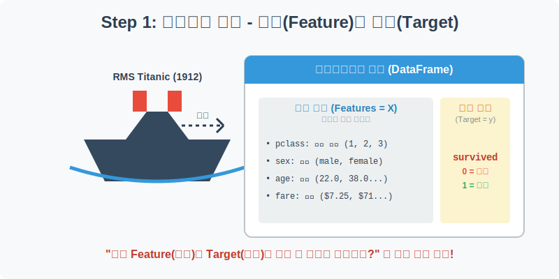
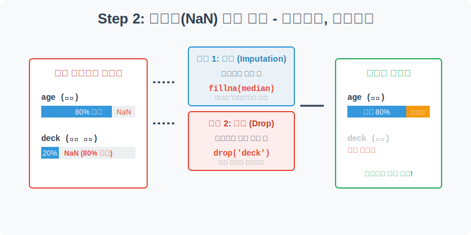
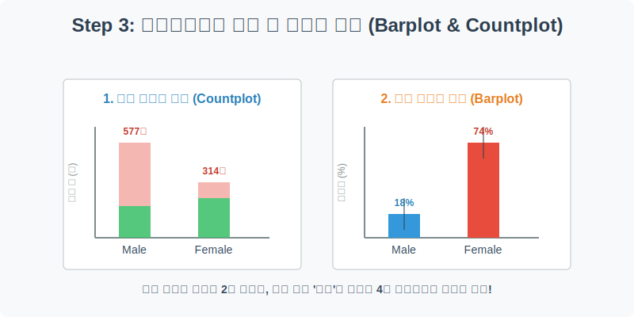
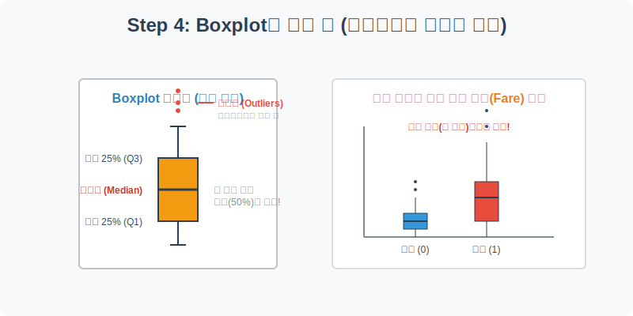

# 실전 데이터 분석 01: 타이타닉 생존자 예측 (Titanic)

## 📌 강의 개요 (30분 완성)


이 실습은 데이터 분석 및 머신러닝 분야에서 가장 유명한 **"Hello World"**와도 같은 타이타닉(Titanic) 데이터셋을 다룹니다. 1912년 발생한 타이타닉호 침몰 사고의 실제 승객 명부를 바탕으로, **"어떤 특징(성별, 나이, 객실 등급 등)을 가진 승객이 더 많이 살아남았을까?"**라는 질문에 대한 해답을 데이터를 통해 추적해 봅니다.

**학습 목표:**
* **데이터 구조의 이해:** 독립 변수(Feature)와 종속 변수(Target)의 개념을 확립합니다.
* **결측치(Missing Values) 처리:** 비어있는 데이터를 어떻게 다룰 것인지 논리적 근거를 바탕으로 결정합니다.
* **범주형 데이터 시각화:** `countplot`과 `barplot`을 활용하여 집단 간의 '생존율' 차이를 직관적으로 비교합니다.
* **분포 및 이상치 분석:** `boxplot`을 통해 수치형 데이터(요금, 나이)의 통계적 분포를 해석하는 방법을 배웁니다.

---

## Step 1: 데이터 살펴보기 (Overview)



가장 먼저 해야 할 일은 데이터를 파이썬 메모리로 불러와서 어떻게 생겼는지 확인하는 것입니다. 타이타닉 데이터는 승객의 다양한 정보(Feature)와 최종 생존 여부(Target)를 포함하고 있습니다.

```python
import pandas as pd
import seaborn as sns
import matplotlib.pyplot as plt

# 그래프 설정 (한글 폰트 및 마이너스 기호 깨짐 방지)
plt.rcParams['font.family'] = 'AppleGothic'
plt.rcParams['axes.unicode_minus'] = False
sns.set_palette("Set2") # 부드러운 파스텔톤 팔레트 적용

# Seaborn에 내장된 타이타닉 데이터셋 불러오기
df = sns.load_dataset('titanic')

# 처음 5개 행(Row) 확인
display(df.head())
```

### 💡 코드 딥다이브 (Code Deep Dive)
* `sns.load_dataset('titanic')`: Seaborn 라이브러리는 교육용으로 미리 정제된 유명한 데이터셋들을 인터넷에서 바로 다운로드하여 Pandas DataFrame 형태로 반환해 주는 편리한 기능을 제공합니다.
* `display(df.head())`: 표 형태의 데이터를 시각적으로 깔끔하게 렌더링하여 첫 5줄을 보여줍니다. 

**주요 컬럼(Columns) 해석:**
* **Target (예측해야 할 정답):**
  * `survived`: 생존 여부 (0 = 사망, 1 = 생존) - 우리가 최종적으로 분석하고자 하는 핵심 변수입니다.
* **Features (예측의 단서가 되는 정보들):**
  * `pclass`: 객실 등급 (1 = 1등석, 2 = 2등석, 3 = 3등석) - 당시의 부와 사회적 지위를 나타냅니다.
  * `sex`: 성별 (male, female)
  * `age`: 나이
  * `fare`: 지불한 티켓 요금
  * `embark_town`: 탑승한 항구 이름

---

## Step 2: 전처리와 결측치 정제 (Preprocess)



현실의 데이터는 결코 완벽하지 않습니다. 정보를 입력하지 않았거나 유실되어 **'비어있는 칸(NaN - Not a Number)'**이 반드시 존재합니다. 이를 **결측치(Missing Values)**라고 부르며, 분석 전에 반드시 해결해야 합니다.

```python
# 1. 컬럼별 결측치 개수 확인
print("--- 정제 전 결측치 확인 ---")
print(df.isnull().sum())

# 2. 'deck' 컬럼은 결측치가 너무 많아(약 77%) 정보로서의 가치가 없으므로 삭제(Drop)
df = df.drop('deck', axis=1)

# 3. 'age' 컬럼의 결측치는 전체 승객 나이의 중앙값(Median)으로 채움(Imputation)
median_age = df['age'].median()
df['age'] = df['age'].fillna(median_age)

print("\n--- 정제 후 결측치 확인 ---")
print(df.isnull().sum())
```

### 💡 분석가의 통찰 (Analyst's Insight)
* **왜 'deck'은 지우고 'age'는 살렸을까요?**
  * `deck`(갑판 번호) 컬럼은 891명의 승객 중 약 688명의 데이터가 비어 있습니다. 이를 임의의 값으로 채우면 오히려 데이터가 심각하게 왜곡되므로, 컬럼 전체를 삭제(`drop`)하는 것이 합리적입니다.
  * 반면, `age`(나이)는 탑승객의 약 20%만 누락되었습니다. 나이는 생존을 결정하는 데 매우 중요한 변수이므로 삭제하기보다는 **'대표값'**으로 채워 넣는 대치(Imputation) 전략을 씁니다. 이때 극단적인 값(아주 늙거나 아주 어린 승객)의 영향을 덜 받는 **중앙값(`median()`)**을 사용하는 것이 평균(`mean()`)을 사용하는 것보다 통계적으로 안전합니다.

---

## Step 3: 성별/객실 등급에 따른 생존율 분석 (Univariate EDA)



영화 '타이타닉'을 보면 "여성과 아이들 먼저!"라는 대사가 나옵니다. 과연 이 규칙은 실제 상황에서도 지켜졌을까요? 이를 막대그래프로 검증해 봅시다.

```python
# 1행 2열의 그래프 공간 생성 (크기는 가로 14, 세로 6)
fig, axes = plt.subplots(1, 2, figsize=(14, 6))

# 첫 번째 그래프: 성별 단순 탑승/생존자 '수' 비교 (Countplot)
sns.countplot(data=df, x='sex', hue='survived', ax=axes[0], palette=['#e74c3c', '#2ecc71'])
axes[0].set_title('성별 생존자 및 사망자 수 (Count)')
axes[0].set_xlabel('성별')
axes[0].set_ylabel('인원 수 (명)')
# 범례 이름 변경
axes[0].legend(['사망(0)', '생존(1)'])

# 두 번째 그래프: 객실 등급별 '평균 생존율' 비교 (Barplot)
sns.barplot(data=df, x='pclass', y='survived', ax=axes[1], palette='Blues_d')
axes[1].set_title('객실 등급별 생존율 (Survival Rate)')
axes[1].set_xlabel('객실 등급 (1=VIP)')
axes[1].set_ylabel('생존율 (%)')
# Y축을 0~1 (0%~100%) 로 고정하여 직관성 확보
axes[1].set_ylim(0, 1) 

plt.tight_layout()
plt.show()
```

### 💡 코드 딥다이브 & 인사이트
* `countplot`은 **절대적인 인원 수**를 셉니다. 그래프를 보면 남성 탑승객이 여성보다 훨씬 많았으나, 사망자의 대부분은 남성(빨간 막대)이 차지하고 있습니다.
* `barplot`에 y축으로 0과 1로 이루어진 `survived` 컬럼을 주면, 파이썬은 자동으로 **평균(Mean)**을 계산합니다. 즉, 생존자(1)의 평균을 낸다는 것은 곧 **'생존율(%)'**을 구한다는 뜻입니다.
* **인사이트**: 1등석 승객의 생존율은 약 60%를 상회하지만, 3등석 승객의 생존율은 25% 미만입니다. 재난 상황에서도 '자본력(부)'이 생존에 절대적인 영향을 미쳤음을 데이터가 차갑게 증명하고 있습니다.

---

## Step 4: 다변수 상관관계 및 요금 분포 (Multivariate EDA)



수치형 데이터(예: 티켓 요금 `fare`)가 그룹별로 어떻게 퍼져 있는지, 그리고 비정상적인 값(이상치)이 있는지 파악할 때는 **박스플롯(Boxplot)**이 최고의 도구입니다. 생존 여부(0, 1)에 따라 승객들이 지불한 티켓 요금의 분포를 비교해 보겠습니다.

```python
plt.figure(figsize=(10, 6))

# X축은 생존 여부, Y축은 요금, 시각적 아름다움을 위해 박스플롯 적용
sns.boxplot(data=df, x='survived', y='fare', palette='Set3', linewidth=2)

# Y축에 로그(Log) 스케일을 적용하여 시각적 왜곡 줄이기
# 요금은 0달러부터 500달러까지 편차가 너무 커서 로그 변환을 하면 박스 모양을 선명하게 볼 수 있습니다.
plt.yscale('log')

plt.title('생존 여부에 따른 티켓 요금(Fare)의 분포 (Log Scale)')
plt.xlabel('생존 여부 (0 = 사망, 1 = 생존)')
plt.ylabel('티켓 요금 (Fare)')
plt.xticks([0, 1], ['사망자 그룹', '생존자 그룹']) # X축 눈금 이름 변경
plt.grid(True, axis='y', alpha=0.3)

plt.show()
```

### 💡 시각화 차트 읽는 법
* **박스(Box)의 크기**: 데이터의 중간 50%(하위 25% ~ 상위 75%)가 모여 있는 핵심 구간입니다. 상자 안의 굵은 선은 **중앙값(Median)**입니다.
* **수염(Whisker)과 점(Outliers)**: 상자 밖으로 뻗어 나간 선은 일반적인 데이터의 한계선이며, 그 밖의 점들은 '비정상적으로 비싼 요금을 낸 승객(이상치)'을 뜻합니다.
* **인사이트**: 생존자 그룹(1)의 상자가 사망자 그룹(0)의 상자보다 확연히 위쪽에 위치해 있습니다. 이는 비싼 요금을 지불한 승객(VIP)일수록 살아남을 확률이 월등히 높았다는 사실을 재확인시켜 줍니다.

---

## Step 5: 생존 확률의 비밀, 로지스틱 회귀 (Statistical Logic)

데이터 시각화를 넘어, 실제로 AI(머신러닝)는 타이타닉 승객의 '생존 여부(0 또는 1)'를 어떻게 수학적으로 예측할까요? 정답이 0과 1로 나뉘는 분류 문제에서는 **로지스틱 함수(Sigmoid Function)**가 핵심 역할을 합니다.

> 💡 **[수포자를 위한 수학 돋보기: 시그모이드와 확률의 줄다리기]**
> 생존할 확률을 구하는 로지스틱 방정식은 다음과 같습니다:
> $$ P(\text{생존}) = \frac{1}{1 + e^{-(\beta_0 + \beta_1 \times \text{등급} + \beta_2 \times \text{성별})}} $$
> 
> * 이 공식이 복잡해 보이지만, 핵심은 $e$ (자연상수)에 붙어있는 거듭제곱 부분입니다.
> * 이 식은 어떤 값이 들어가든 결과를 **반드시 0(0%)과 1(100%) 사이의 S자 형태 곡선**으로 압축해 줍니다.
> * 마치 '죽음(0)'과 '생존(1)'이 양 끝에서 팽팽하게 줄다리기를 하는 것과 같습니다. 만약 승객이 '여성'이고 '1등석'이라면 생존 쪽으로 힘이 강하게 작용하여 확률이 0.9(90%) 쪽으로 확 기울어지고, '남성'이고 '3등석'이라면 힘이 약해 0.1(10%) 쪽으로 미끄러지는 원리입니다.

---

## 🎯 30분 강의 마무리 및 심화 과제

오늘 우리는 역사적인 타이타닉 데이터를 직접 로드하고, 결측치를 정제한 뒤, 시각화를 통해 생존에 영향을 미친 결정적 요인(성별, 객실 등급, 요금)을 밝혀냈습니다. 데이터 분석은 이처럼 흩어진 숫자 속에서 **인간 행동의 패턴과 사회적 현상을 통찰하는 강력한 도구**입니다.

### 📝 심화 과제 (Advanced Challenge)
1. **나이대별 분석:** `df['age']` 컬럼을 활용하여 히스토그램(`sns.histplot`)을 그려보세요. 그리고 `hue='survived'` 파라미터를 추가하여 어떤 나이대(예: 영유아 vs 20대)에서 가장 많이 생존했는지 시각적으로 증명해 보세요.
2. **복합 변수 교차 분석:** `sns.barplot`을 그릴 때 `x='pclass'`, `y='survived'`를 설정하고, **`hue='sex'`**를 추가해 보세요. "1등석 여성"과 "3등석 남성"의 생존율이 얼마나 극단적으로 차이가 나는지 단 한 장의 차트로 확인할 수 있습니다.
