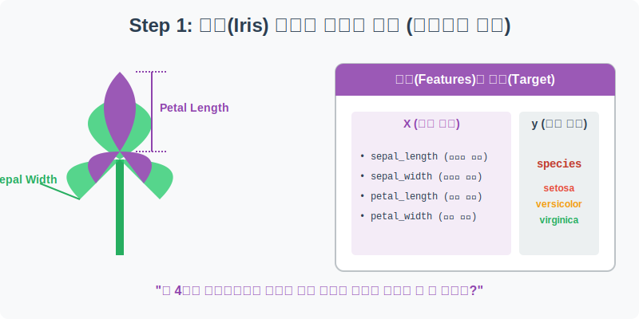
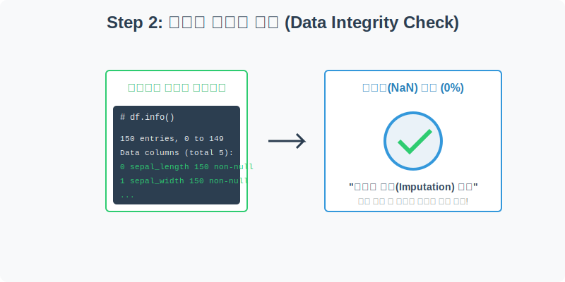
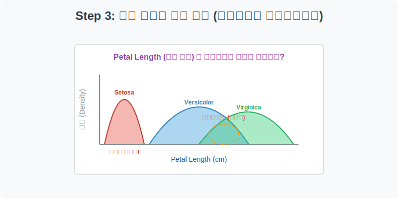
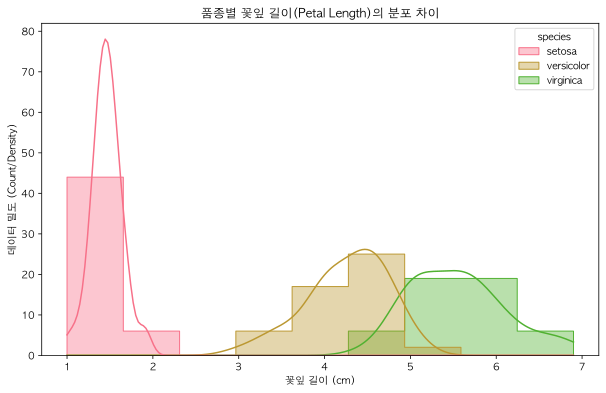
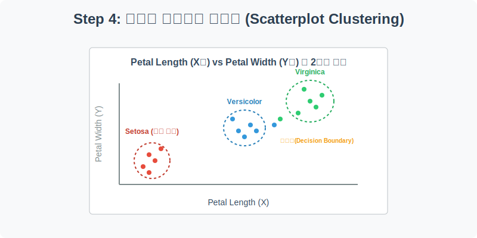
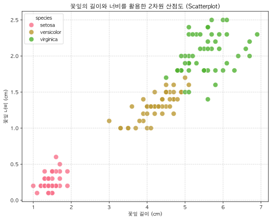

# 실전 데이터 분석 02: 붓꽃(Iris) 품종 분류

## 📌 강의 개요 (30분 완성)


이 실습은 통계학과 머신러닝의 역사에서 가장 널리 인용되는 **'피셔의 붓꽃(Fisher's Iris)'** 데이터셋을 다룹니다. 1936년에 만들어진 이 전설적인 데이터셋은 단 4가지의 단순한 형태학적 측정값(길이와 너비)만으로 식물의 종(Species)을 완벽에 가깝게 분류해 낼 수 있음을 보여줍니다.

**학습 목표:**
* **데이터 무결성 검증:** 결측치(NaN)가 전혀 없는 완벽하게 정제된 데이터셋의 특징을 살펴봅니다.
* **분포 곡선(KDE)의 해석:** `histplot`과 커널밀도함수(KDE)를 사용하여 단일 피처가 품종 분류에 얼마나 유용한지 '변별력'을 시각적으로 평가합니다.
* **다변수 산점도 (Scatterplot):** 2개의 피처를 X축과 Y축에 매핑하고 색상(`hue`)으로 품종을 구분하여, 데이터가 어떻게 **군집(Cluster)**을 이루는지 기하학적/공간적 개념을 이해합니다.
* **산점도 행렬 (Pairplot):** `pairplot`을 통해 모든 변수의 쌍을 한 번에 그려내어, 머신러닝 모델이 결정 경계(Decision Boundary)를 긋는 원리를 직관적으로 파악합니다.

---

## Step 1: 붓꽃 데이터의 구조 이해 (Overview)



먼저, 붓꽃 데이터셋을 불러와 어떤 정보들이 담겨 있는지 확인해 보겠습니다. 이 데이터는 식물학자가 3가지 품종의 붓꽃을 각각 50송이씩 꺾어 자(Ruler)로 직접 길이를 잰 실제 관측 데이터입니다.

```python
import pandas as pd
import seaborn as sns
import matplotlib.pyplot as plt

# 그래프 설정
plt.rcParams['font.family'] = 'AppleGothic'
plt.rcParams['axes.unicode_minus'] = False
sns.set_palette("husl") # 붓꽃의 화려함에 어울리는 팔레트

# Iris 데이터셋 로드
df = sns.load_dataset('iris')

# 데이터의 기초 통계량(min, max, mean 등) 확인
display(df.describe())

# 품종별 개수 확인
print(df['species'].value_counts())
```

> **💻 [실행 결과]**
> ```text
> sepal_length  sepal_width  petal_length  petal_width
> count    150.000000   150.000000    150.000000   150.000000
> mean       5.843333     3.057333      3.758000     1.199333
> std        0.828066     0.435866      1.765298     0.762238
> min        4.300000     2.000000      1.000000     0.100000
> 25%        5.100000     2.800000      1.600000     0.300000
> 50%        5.800000     3.000000      4.350000     1.300000
> 75%        6.400000     3.300000      5.100000     1.800000
> max        7.900000     4.400000      6.900000     2.500000
> species
> setosa        50
> versicolor    50
> virginica     50
> Name: count, dtype: int64
> ```


### 💡 코드 딥다이브 (Code Deep Dive)
* `df.describe()`: 데이터 프레임 내 모든 '숫자형' 컬럼에 대한 요약 통계를 한 번에 보여주는 아주 강력한 함수입니다. 가장 짧은 꽃잎이 몇 cm인지(`min`), 평균은 얼마인지(`mean`) 한눈에 파악할 수 있습니다.
* `df['species'].value_counts()`: 종속 변수(Target)인 품종이 각각 몇 개씩 있는지 셉니다. 출력 결과를 보면 `setosa`, `versicolor`, `virginica`가 각각 정확히 50개씩 균형(Balanced)을 이루고 있습니다. 이는 머신러닝 학습에 있어 가장 이상적인 데이터 형태입니다.

**주요 컬럼(Columns) 해석:**
* **독립 변수 (Features - 꽃의 형태):**
  * `sepal_length`: 꽃받침 길이 (cm)
  * `sepal_width`: 꽃받침 너비 (cm)
  * `petal_length`: 꽃잎 길이 (cm)
  * `petal_width`: 꽃잎 너비 (cm)
* **종속 변수 (Target - 우리가 맞춰야 할 정답):**
  * `species`: 붓꽃의 3가지 품종 (setosa, versicolor, virginica)

---

## Step 2: 데이터 무결성 검증 (Preprocess)



타이타닉 실습에서는 빈칸(결측치)을 채우거나 지우는 과정이 필요했습니다. 과연 이번 데이터는 어떨까요?

```python
# 데이터 정보 및 결측치 확인
print(df.info())
print("------------------------")
print("결측치 총합:")
print(df.isnull().sum())
```

> **💻 [실행 결과]**
> ```text
> <class 'pandas.DataFrame'>
> RangeIndex: 150 entries, 0 to 149
> Data columns (total 5 columns):
>  #   Column        Non-Null Count  Dtype  
> ---  ------        --------------  -----  
>  0   sepal_length  150 non-null    float64
>  1   sepal_width   150 non-null    float64
>  2   petal_length  150 non-null    float64
>  3   petal_width   150 non-null    float64
>  4   species       150 non-null    str    
> dtypes: float64(4), str(1)
> memory usage: 6.0 KB
> None
> ------------------------
> 결측치 총합:
> sepal_length    0
> sepal_width     0
> petal_length    0
> petal_width     0
> species         0
> dtype: int64
> ```


### 💡 분석가의 통찰 (Analyst's Insight)
* `df.info()` 결과를 보면 총 150개의 행(entries)이 있는데, 모든 컬럼이 `150 non-null`이라고 출력됩니다. 즉, **비어있는 칸이 단 하나도 없다(결측치 0%)**는 뜻입니다.
* 이런 교과서적으로 깨끗한 데이터를 실무에서는 'Clean Data'라고 부릅니다. 전처리 단계에서 결측치 대치(Imputation)나 이상치 제거 등의 복잡한 과정 없이, 즉각적으로 분석과 시각화 단계로 넘어갈 수 있는 매우 드물고 축복받은 상황입니다!

---

## Step 3: 단일 피처의 분류 '변별력' 확인 (Univariate EDA)



4개의 피처(꽃잎/꽃받침의 길이/너비) 중, **단 한 가지 측정값만으로도 품종을 어느 정도 맞출 수 있을까요?** 이를 확인하기 위해 특정 피처가 품종별로 어떻게 분포하는지 히스토그램과 밀도 함수를 겹쳐서 시각화해 봅니다.

```python
plt.figure(figsize=(10, 6))

# 꽃잎 길이(petal_length)의 분포를 품종(species)별로 색상을 다르게 하여 시각화
# kde=True 옵션을 켜면 데이터의 분포를 부드러운 곡선(커널 밀도 함수)으로 연결해 줍니다.
sns.histplot(data=df, x='petal_length', hue='species', kde=True, element='step', alpha=0.4)

plt.title('품종별 꽃잎 길이(Petal Length)의 분포 차이')
plt.xlabel('꽃잎 길이 (cm)')
plt.ylabel('데이터 밀도 (Count/Density)')
plt.show()
```

> **💻 [실행 결과]**
> 


### 💡 시각화 차트 읽는 법
* **Setosa (빨간색 영역)**: 그래프 맨 왼쪽에 `setosa`의 꽃잎 길이가 1~2cm 부근에 완전히 독립적으로 모여 있습니다. 다른 품종과 전혀 겹치지 않습니다. 즉, **"꽃잎 길이가 2.5cm 미만이면 무조건 Setosa이다"**라는 완벽한 규칙을 단 하나의 차트만으로 찾아낸 것입니다!
* **Versicolor vs Virginica**: 반면, 두 번째(초록색)와 세 번째(파란색) 그룹은 4.5cm~5.0cm 부근에서 겹치는(Overlap) 영역이 발생합니다. 이 구간에 속한 붓꽃은 꽃잎 길이 하나만으로는 어떤 품종인지 100% 확신하기 어렵습니다. 이를 해결하기 위해서는 변수를 하나 더 추가해야 합니다.

---

## Step 4: 다차원 공간에서의 군집화 (Multivariate EDA)



하나의 단서(꽃잎 길이)만으로 모호했던 영역을 분리하기 위해, 이번에는 '꽃잎 너비(petal_width)'라는 단서를 추가하여 2차원 공간(X-Y 평면)에 데이터를 뿌려보겠습니다.

```python
plt.figure(figsize=(9, 7))

# X축에 꽃잎 길이, Y축에 꽃잎 너비를 두고, 품종별로 색깔(hue)을 다르게 칠함
sns.scatterplot(data=df, x='petal_length', y='petal_width', hue='species', s=100, alpha=0.8)

plt.title('꽃잎의 길이와 너비를 활용한 2차원 산점도 (Scatterplot)')
plt.xlabel('꽃잎 길이 (cm)')
plt.ylabel('꽃잎 너비 (cm)')
plt.grid(True, linestyle='--', alpha=0.6)
plt.show()
```

> **💻 [실행 결과]**
> 


### 💡 차트가 말해주는 인공지능의 원리
* 산점도를 그리면 같은 색상의 점들이 서로 무리 지어 모이는 현상을 **'군집(Clustering)'**이라고 합니다.
* Step 3에서 겹쳐 보였던 Versicolor와 Virginica가, Y축(너비)이라는 새로운 차원이 추가되자 공간상에서 확연히 위아래로 찢어지며 경계선이 뚜렷해졌습니다.
* **결정 경계 (Decision Boundary):** 머신러닝(AI) 모델은 바로 이 2차원(또는 다차원) 공간상에서 파란 점과 초록 점 사이를 가로지르는 **최적의 선(방정식)**을 긋는 수학적 최적화 과정을 수행합니다. 사람이 눈으로 구분이 가능하다면, 기계(Machine)는 99.9% 이상의 정확도로 분류해 낼 수 있습니다.

---

## Step 5: 공간 상의 '거리'를 구하는 기하학적 원리 (Statistical Logic)

산점도에서 점들이 서로 뭉쳐 있는 것을 보았습니다. 그렇다면 컴퓨터는 "새로 발견된 붓꽃이 어느 품종인지" 어떻게 예측할까요? 가장 직관적인 머신러닝 알고리즘인 **K-최근접 이웃(K-Nearest Neighbors, KNN)**은 데이터 간의 **'거리'**를 계산하여 정답을 찾습니다.

> 💡 **[수포자를 위한 수학 돋보기: 피타고라스와 유클리디안 거리]**
> 컴퓨터가 2차원 공간(X축: 꽃잎 길이, Y축: 꽃잎 너비) 위에서 두 붓꽃 사이의 직선거리를 재는 공식은 우리가 중학교 때 배운 피타고라스의 정리와 완벽히 같습니다. 이를 **유클리디안 거리(Euclidean Distance)**라고 부릅니다.
> $$ d = \sqrt{(x_2 - x_1)^2 + (y_2 - y_1)^2} $$
> 
> * 미지의 붓꽃을 발견하면, 컴퓨터는 이 공식으로 기존 데이터의 모든 붓꽃들과의 거리를 전부 계산합니다.
> * 거리가 가장 짧은(가장 가까운) 이웃 꽃들을 찾은 뒤, "내 주변에 초록색 점(Versicolor)이 가장 많으니, 나도 Versicolor일 거야!"라고 다수결 투표를 통해 품종을 분류하는 것이 분류 알고리즘의 핵심 논리입니다.

---

## 🎯 30분 강의 마무리 및 심화 과제

가장 단순해 보이는 데이터지만, 붓꽃 데이터는 "좋은 피처(Feature)를 선택하고 다차원으로 결합하면, 데이터가 아름답게 군집을 이루며 완벽한 분류(Classification)가 가능해진다"는 데이터 과학의 가장 핵심적인 철학을 관통하고 있습니다.

### 📝 심화 과제 (Advanced Challenge)
1. **산점도 행렬 (Pairplot) 그려보기:** 
   우리는 4개의 피처 중 2개만 골라 산점도를 그렸습니다. 만약 4개 피처가 짝을 이룰 수 있는 모든 경우의 수(4x4=16개)를 한 번에 보고 싶다면 어떻게 할까요? 다음 코드를 실행해 보세요.
   ```python
   sns.pairplot(df, hue='species', height=2.5)
   plt.show()
   ```
   이 한 줄의 코드가 어떻게 16개의 그래프(대각선은 KDE, 나머지는 Scatter)를 그려주는지, 그리고 어떤 변수 쌍(Pair)이 가장 완벽하게 품종을 나누고 있는지 눈으로 직접 찾아보세요!
2. **꽃받침(Sepal)으로 분석해 보기:** Step 4의 코드를 수정하여 X축을 `sepal_length`, Y축을 `sepal_width`로 변경해 보세요. 꽃받침 크기만으로는 분류가 쉬울까요, 어려울까요? 겹치는 부분이 더 많아진다면 그 이유는 무엇일까요?
