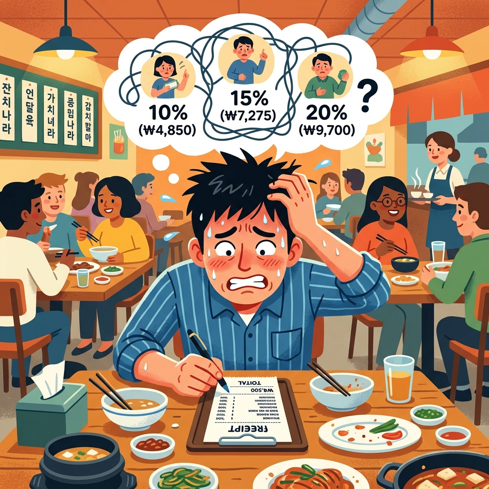
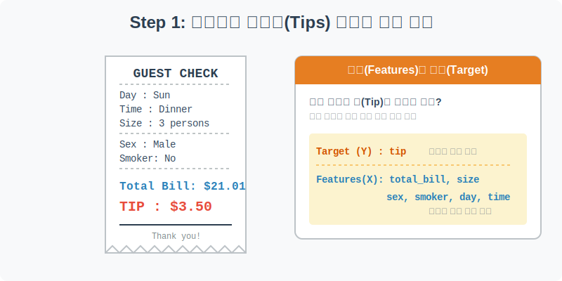
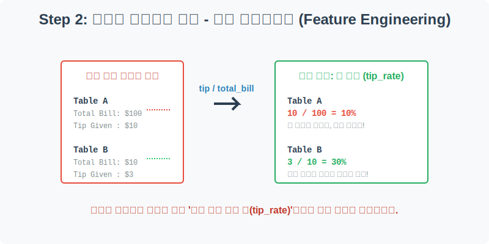
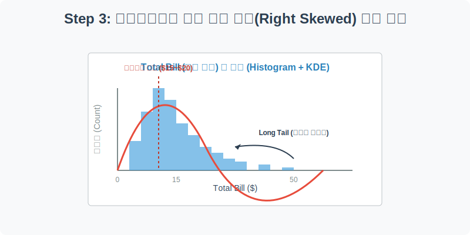
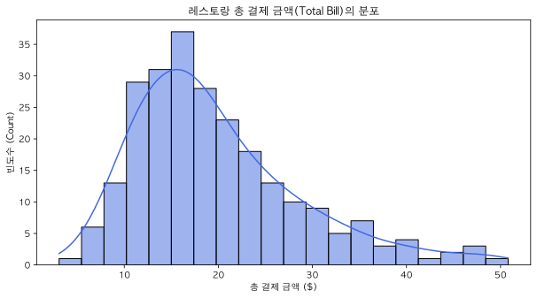
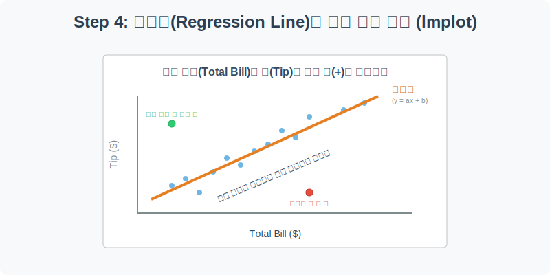
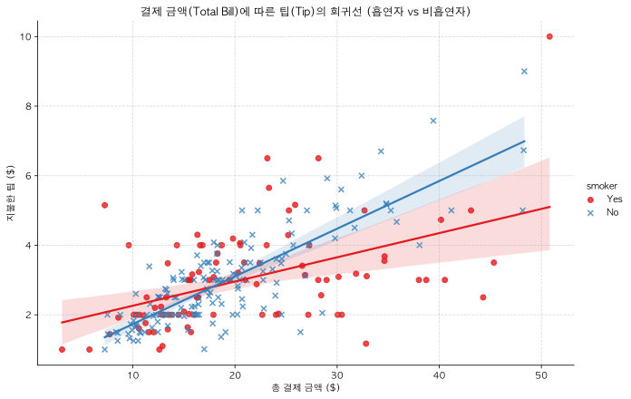

# 실전 데이터 분석 03: 레스토랑 팁(Tips) 분석과 피처 엔지니어링

## 📌 강의 개요 (30분 완성)


미국의 레스토랑 식문화에서는 결제 금액의 일정 비율(보통 15~20%)을 웨이터에게 '팁(Tip)'으로 지불하는 관행이 있습니다. 이 데이터셋은 한 웨이터가 수개월 동안 자신이 서빙한 손님들의 성별, 흡연 여부, 방문 요일과 시간, 그리고 총결제 금액과 자신이 받은 팁을 꼼꼼하게 기록한 실제 영업 데이터입니다.

**"어떤 특징을 가진 손님이 팁을 후하게 줄까?"** 
이 질문에 답하기 위해 우리는 데이터 전처리와 회귀 분석의 기초를 학습합니다.

**학습 목표:**
* **피처 엔지니어링 (Feature Engineering):** 결제 금액 대비 팁의 비율을 나타내는 파생 변수(`tip_rate`)를 직접 생성하여 분석의 질을 높입니다.
* **비대칭 분포 해석:** `histplot`을 통해 꼬리가 오른쪽으로 긴(Right-Skewed) 현실 금융 데이터의 전형적인 특징을 확인합니다.
* **상관관계와 회귀선 (Regression):** `regplot`과 `lmplot`을 사용하여 두 연속형 수치(결제 금액과 팁) 사이의 선형적인 비례 관계(추세선)를 그리고 해석합니다.

---

## Step 1: 레스토랑 영수증 데이터의 구조 (Overview)



웨이터가 기록한 장부를 열어보겠습니다. 손님의 특성(독립 변수)과 그 결과로 주어진 팁(종속 변수)을 확인합니다.

```python
import pandas as pd
import seaborn as sns
import matplotlib.pyplot as plt

# 그래프 설정
plt.rcParams['font.family'] = 'AppleGothic'
plt.rcParams['axes.unicode_minus'] = False
sns.set_palette("muted")

# Tips 데이터셋 로드
df = sns.load_dataset('tips')

# 데이터 구조 및 첫 5행 확인
print(df.info())
display(df.head())
```

> **💻 [실행 결과]**
> ```text
> <class 'pandas.DataFrame'>
> RangeIndex: 244 entries, 0 to 243
> Data columns (total 7 columns):
>  #   Column      Non-Null Count  Dtype   
> ---  ------      --------------  -----   
>  0   total_bill  244 non-null    float64 
>  1   tip         244 non-null    float64 
>  2   sex         244 non-null    category
>  3   smoker      244 non-null    category
>  4   day         244 non-null    category
>  5   time        244 non-null    category
>  6   size        244 non-null    int64   
> dtypes: category(4), float64(2), int64(1)
> memory usage: 7.4 KB
> None
>    total_bill   tip     sex smoker  day    time  size
> 0       16.99  1.01  Female     No  Sun  Dinner     2
> 1       10.34  1.66    Male     No  Sun  Dinner     3
> 2       21.01  3.50    Male     No  Sun  Dinner     3
> 3       23.68  3.31    Male     No  Sun  Dinner     2
> 4       24.59  3.61  Female     No  Sun  Dinner     4
> ```


### 💡 코드 딥다이브 (Code Deep Dive)
* `df.info()`를 실행하면 총 244건의 결제 내역이 출력되며, 결측치(NaN)가 하나도 없음을 알 수 있습니다.
* 데이터의 타입(Dtype)을 유심히 보면 `float64`(실수), `int64`(정수) 외에 `category`라는 독특한 타입이 있습니다. 남성/여성, 점심/저녁처럼 정해진 몇 가지 종류(분류) 중 하나만 가질 수 있는 데이터를 메모리에 효율적으로 저장하기 위해 Pandas가 내부적으로 사용하는 데이터 타입입니다.

**주요 컬럼(Columns) 해석:**
* **Target (예측해야 할 정답):**
  * `tip`: 웨이터가 받은 팁 금액 (달러)
* **Features (예측의 단서들):**
  * `total_bill`: 총 결제 금액 (달러)
  * `sex`: 계산한 사람의 성별 (Male, Female)
  * `smoker`: 일행 중 흡연자 포함 여부 (Yes, No)
  * `day`: 방문 요일 (Thur, Fri, Sat, Sun)
  * `time`: 식사 시간대 (Lunch, Dinner)
  * `size`: 식사 인원 수 (1명 ~ 6명)

---

## Step 2: 진짜 큰손을 찾아라! 파생 변수 생성 (Feature Engineering)



100달러어치 밥을 먹고 10달러를 팁으로 준 손님(10%)과, 10달러어치 밥을 먹고 3달러를 준 손님(30%). 누가 더 후한 손님일까요? 단순히 팁 절대 금액만 보면 전자지만, '비율'로 따지면 후자가 훨씬 팁을 잘 주는 진짜 큰손입니다. 이를 수학적으로 계산해 새로운 컬럼을 만들어 줍시다.

```python
# 팁 비율(tip_rate) 파생 변수 생성: 팁 / 총 결제 금액
df['tip_rate'] = df['tip'] / df['total_bill']

# 소수점으로 나오는 비율을 퍼센트(%)로 보고 싶다면 100을 곱해도 됩니다.
df['tip_percent'] = df['tip_rate'] * 100

# 잘 만들어졌는지 팁 관련 컬럼들만 모아서 확인
display(df[['total_bill', 'tip', 'tip_rate', 'tip_percent']].head())
```

> **💻 [실행 결과]**
> ```text
> total_bill   tip  tip_rate  tip_percent
> 0       16.99  1.01  0.059447     5.944673
> 1       10.34  1.66  0.160542    16.054159
> 2       21.01  3.50  0.166587    16.658734
> 3       23.68  3.31  0.139780    13.978041
> 4       24.59  3.61  0.146808    14.680765
> ```


### 💡 분석가의 통찰 (Analyst's Insight)
* **피처 엔지니어링(Feature Engineering)**: 원본 데이터에는 없지만, 분석가의 도메인 지식(레스토랑은 비율로 팁을 준다는 사실)을 결합하여 기존 컬럼들을 더하거나 나누어 새로운 인사이트용 컬럼을 창조해 내는 과정입니다. 
* 머신러닝 대회나 실무에서 모델의 성능을 획기적으로 끌어올리는 가장 강력한 무기가 바로 이 피처 엔지니어링입니다. 우리는 방금 가장 기초적인 피처 엔지니어링을 수행했습니다.

---

## Step 3: 결제 금액의 분포 확인 (Univariate EDA)



레스토랑에 오는 사람들은 보통 밥값을 얼마나 낼까요? `total_bill` 컬럼의 분포를 히스토그램으로 확인해 보겠습니다.

```python
plt.figure(figsize=(10, 5))

# 히스토그램 위에 부드러운 곡선(KDE)을 함께 그립니다.
sns.histplot(data=df, x='total_bill', kde=True, bins=20, color='royalblue')

plt.title('레스토랑 총 결제 금액(Total Bill)의 분포')
plt.xlabel('총 결제 금액 ($)')
plt.ylabel('빈도수 (Count)')
plt.show()
```

> **💻 [실행 결과]**
> 


### 💡 시각화 차트 읽는 법
* **우측 꼬리 분포 (Right-Skewed Distribution):** 차트를 보면 왼쪽(10~20달러 부근)에 거대한 산봉우리가 솟아 있고, 오른쪽으로 갈수록 꼬리가 길게 늘어지는 모양새를 하고 있습니다.
* 이는 대다수의 손님이 15달러 전후의 평범한 식사를 하지만, 소수의 '큰손'들이 40달러, 50달러짜리 비싼 식사를 한다는 것을 의미합니다. 돈과 관련된 데이터(소득, 자산, 결제 금액 등)는 십중팔구 이런 비대칭적인 꼬리 형태를 띠게 됩니다.

---

## Step 4: 결제 금액과 팁의 상관관계 (Multivariate EDA)



결제 금액이 커질수록 팁도 비례해서 커질까요? 이를 확인하기 위해 연속적인 두 수치의 상관관계를 직관적으로 보여주는 **회귀선이 포함된 산점도(`lmplot` 또는 `regplot`)**를 그려보겠습니다.

```python
# 흡연 여부(smoker)에 따라 추세선이 어떻게 달라지는지 비교
# lmplot은 내부적으로 figure를 알아서 생성하므로 plt.figure()를 쓰지 않습니다.
sns.lmplot(data=df, x='total_bill', y='tip', hue='smoker', 
           height=6, aspect=1.5, markers=['o', 'x'], palette='Set1')

plt.title('결제 금액(Total Bill)에 따른 팁(Tip)의 회귀선 (흡연자 vs 비흡연자)')
plt.xlabel('총 결제 금액 ($)')
plt.ylabel('지불한 팁 ($)')
plt.grid(True, linestyle='--', alpha=0.5)
plt.show()
```

> **💻 [실행 결과]**
> 


### 💡 코드 딥다이브 & 인사이트
* **`lmplot` (Linear Model Plot):** 산점도(Scatter)를 그린 후, 그 점들의 중심을 통과하는 최적의 직선(회귀선, y = ax + b)을 통계학적으로 계산하여 쫙 그어주는 강력한 함수입니다.
* 회귀선 주변의 옅은 그림자는 **신뢰구간(Confidence Interval)**입니다. 데이터가 밀집되어 있을수록 그림자가 좁고(확실함), 데이터가 적을수록 그림자가 넓게 퍼집니다(불확실함).
* **인사이트**: 비흡연자(파란 선)는 결제 금액이 오를수록 팁도 매우 정직하고 얌전하게 비례해서 올라갑니다. 반면 흡연자(빨간 선)는 밥값이 비싸도 팁을 조금만 주거나, 밥값이 싼데도 팁을 엄청 많이 주는 등 패턴이 다소 불규칙(분산이 큼)함을 시각적으로 알 수 있습니다.

> 💡 **[수포자를 위한 통계 돋보기: 선형 회귀 방정식]**  
> 선형 회귀(Linear Regression)는 수많은 점(데이터)들 사이를 관통하는 **가장 공평한 직선 하나**를 그어내는 통계 기법입니다.  
> 
> 수학 공식으로는 다음과 같이 표현됩니다:
> $$ y = mx + b $$
> - **$y$ (종속 변수):** 우리가 예측하고 싶은 값 (여기서는 **팁 금액**)
> - **$x$ (독립 변수):** 원인이 되는 값 (여기서는 **총 결제 금액**)
> - **$m$ (기울기):** $x$가 1만큼 커질 때 $y$가 얼마나 커지는지 나타내는 경사도 (결제 금액이 1달러 늘어날 때 팁이 몇 달러 늘어나는가?)
> - **$b$ (y절편):** $x$가 0일 때의 기본 $y$값
> 
> 즉, 이 직선 하나만 있으면, 어떤 손님이 100달러짜리 밥을 먹었을 때($x=100$) 팁을 대략 얼마($y$) 줄지 미래를 예측할 수 있게 됩니다! 머신러닝의 가장 훌륭한 첫걸음입니다.

---

## 🎯 30분 강의 마무리 및 심화 과제

오늘 우리는 단순한 영수증 내역에서 `tip_rate`라는 새로운 변수를 창조해 내고, 수치형 변수 간의 비례 관계를 수학적인 '선(Regression Line)'으로 요약하여 보여주는 시각화 기술을 습득했습니다.

### 📝 심화 과제 (Advanced Challenge)
1. **요일별 팁 비율 분석:** 우리가 Step 2에서 만든 `tip_rate` 변수를 사용하여, 요일(`day`)별로 팁을 후하게 주는 정도가 다른지 `sns.boxplot`으로 그려보세요. (Hint: `x='day'`, `y='tip_rate'`) 주말 손님들이 평일 손님보다 정말로 팁을 후하게 줄까요?
2. **이상치 추적:** `sns.boxplot(x='total_bill', data=df)`를 그렸을 때, 상자 바깥으로 한참 튀어나간 점(이상치)이 하나 있습니다. 결제 금액이 50달러를 넘는 이 손님은 과연 점심에 왔을까요, 저녁에 왔을까요? 혼자 왔을까요, 단체로 왔을까요? 데이터를 필터링해서 이 테이블의 정체를 직접 찾아보세요! `df[df['total_bill'] > 50]`
