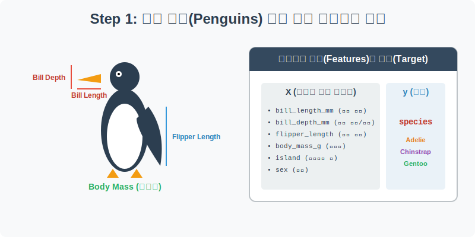
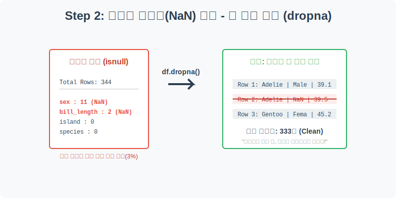
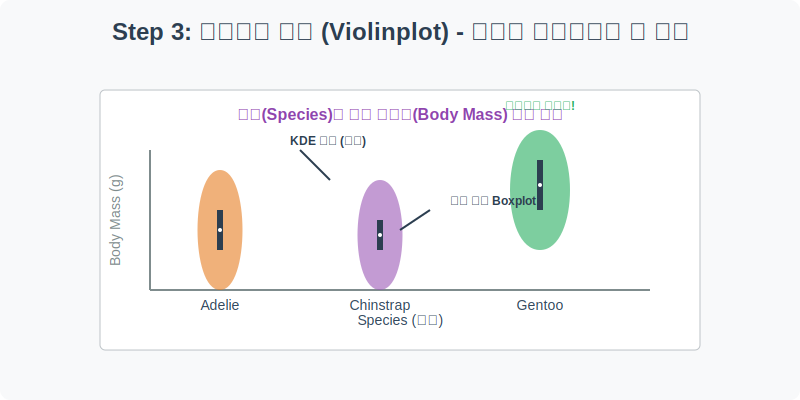
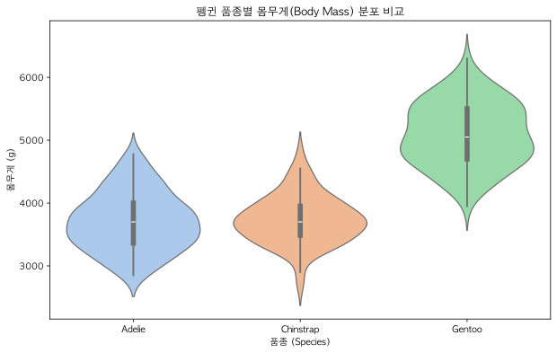
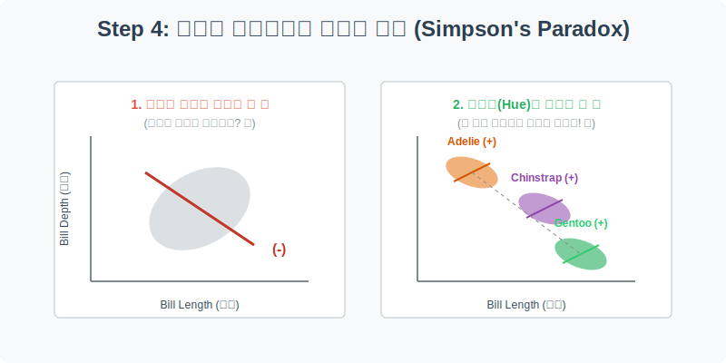
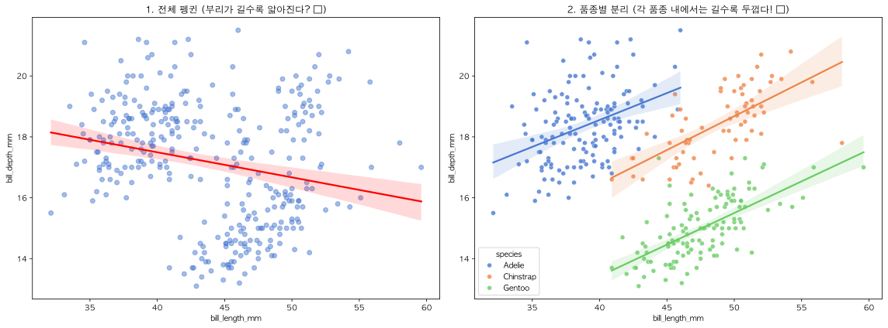

# 실전 데이터 분석 04: 남극 펭귄(Penguins) 신체 측정과 심슨의 역설

## 📌 강의 개요 (30분 완성)


이 실습은 기존의 식상한 '붓꽃(Iris)' 데이터셋을 대체하기 위해 최근 데이터 과학계에서 널리 사랑받고 있는 **팔머 펭귄(Palmer Penguins)** 데이터셋을 다룹니다. 남극 팔머 연구소에서 관측한 3가지 품종의 펭귄 신체 데이터를 분석하며, 결측치를 안전하게 삭제하는 방법과 통계학의 유명한 함정인 **'심슨의 역설(Simpson's Paradox)'**을 시각화를 통해 파훼하는 법을 배웁니다.

**학습 목표:**
* **결측치 완전 삭제 (`dropna`):** 결측치가 전체 데이터의 극히 일부일 때, 행 자체를 안전하게 제거하는 정제 기법을 배웁니다.
* **분포와 밀도의 결합 (`violinplot`):** 박스플롯(Boxplot)의 한계를 보완하여 데이터의 밀도까지 한 번에 보여주는 바이올린 플롯의 해석법을 익힙니다.
* **심슨의 역설 파훼 (`lmplot`과 `hue`):** 전체 데이터를 뭉뚱그려 분석했을 때 나오는 거짓된 결론(오류)을, 데이터를 그룹(품종)별로 쪼개어 시각화함으로써 올바르게 수정하는 고도화된 통계적 통찰력을 기릅니다.

---

## Step 1: 펭귄 신체 데이터의 구조 (Overview)



가장 먼저 펭귄 데이터를 불러와 어떤 측정 지표들이 있는지 살펴봅시다. 생물학적 피처(Feature)들을 통해 우리는 펭귄의 품종(Target)을 예측할 수 있습니다.

```python
import pandas as pd
import seaborn as sns
import matplotlib.pyplot as plt

# 그래프 설정
plt.rcParams['font.family'] = 'AppleGothic'
plt.rcParams['axes.unicode_minus'] = False

# Penguins 데이터셋 로드
df = sns.load_dataset('penguins')

# 첫 5행 확인
display(df.head())
```

> **💻 [실행 결과]**
> ```text
> species     island  bill_length_mm  ...  flipper_length_mm  body_mass_g     sex
> 0  Adelie  Torgersen            39.1  ...              181.0       3750.0    Male
> 1  Adelie  Torgersen            39.5  ...              186.0       3800.0  Female
> 2  Adelie  Torgersen            40.3  ...              195.0       3250.0  Female
> 3  Adelie  Torgersen             NaN  ...                NaN          NaN     NaN
> 4  Adelie  Torgersen            36.7  ...              193.0       3450.0  Female
> 
> [5 rows x 7 columns]
> ```


### 💡 코드 딥다이브 (Code Deep Dive)
**주요 컬럼(Columns) 해석:**
* **Target (예측해야 할 정답):**
  * `species`: 펭귄의 품종 (Adelie, Chinstrap, Gentoo)
* **Features (예측의 단서들):**
  * `island`: 펭귄이 서식하는 섬 (Torgersen, Biscoe, Dream)
  * `bill_length_mm`: 부리의 길이 (mm)
  * `bill_depth_mm`: 부리의 위아래 두께/깊이 (mm)
  * `flipper_length_mm`: 날개 길이 (mm)
  * `body_mass_g`: 몸무게 (g)
  * `sex`: 성별 (Male, Female)

---

## Step 2: 소수의 결측치 안전하게 제거하기 (Preprocess)



타이타닉 실습에서는 나이(Age)의 결측치를 중앙값으로 억지로 채워 넣었습니다. 하지만 펭귄 데이터는 어떻게 처리하는 것이 현명할까요?

```python
# 결측치 개수 확인
print("--- 정제 전 결측치 ---")
print(df.isnull().sum())
print(f"전체 데이터 개수: {len(df)}개")

# 결측치가 있는 행(Row)을 통째로 삭제
df = df.dropna()

print("\n--- 정제 후 데이터 개수 ---")
print(f"남은 데이터 개수: {len(df)}개")
```

> **💻 [실행 결과]**
> ```text
> --- 정제 전 결측치 ---
> species               0
> island                0
> bill_length_mm        2
> bill_depth_mm         2
> flipper_length_mm     2
> body_mass_g           2
> sex                  11
> dtype: int64
> 전체 데이터 개수: 344개
> 
> --- 정제 후 데이터 개수 ---
> 남은 데이터 개수: 333개
> ```


### 💡 분석가의 통찰 (Analyst's Insight)
* `df.isnull().sum()`을 확인해 보면 전체 344마리 중 성별(`sex`)이 누락된 펭귄이 11마리, 부리 길이가 누락된 펭귄이 2마리 정도 있습니다.
* 전체 데이터(344건) 대비 결측치(11건)의 비율은 겨우 **3% 남짓**입니다. 이처럼 결측치의 비율이 무시해도 될 만큼 아주 적을 때는, 평균이나 중앙값으로 억지로 대치(Imputation)하여 원본 데이터를 훼손하기보다는 **`dropna()`를 사용하여 해당 행을 깔끔하게 날려버리는 것**이 훨씬 안전하고 정석적인 방법입니다.

---

## Step 3: 몸무게 분포 비교 - 바이올린 플롯 (Univariate EDA)



세 가지 품종 중 어떤 펭귄이 가장 무거울까요? 몸무게(`body_mass_g`)의 분포를 **바이올린 플롯(Violinplot)**으로 한눈에 비교해 보겠습니다.

```python
plt.figure(figsize=(10, 6))

# Boxplot과 KDE의 장점을 합친 Violinplot
sns.violinplot(data=df, x='species', y='body_mass_g', palette='pastel', inner='box')

plt.title('펭귄 품종별 몸무게(Body Mass) 분포 비교')
plt.xlabel('품종 (Species)')
plt.ylabel('몸무게 (g)')
plt.show()
```

> **💻 [실행 결과]**
> 


### 💡 시각화 차트 읽는 법
* **바이올린 플롯(Violinplot)이란?**: 상자 그림(Boxplot)은 중앙값과 사분위수를 명확히 보여주지만, 데이터가 어디에 얼마나 뭉쳐있는지(밀도)는 알 수 없습니다. 바이올린 플롯은 내부에 미니 Boxplot을 품고 있으면서, 외곽선의 두께를 통해 **데이터의 밀도(KDE 곡선)**까지 동시에 묘사해 주는 매우 세련된 차트입니다.
* **인사이트**: 차트를 보면 Adelie와 Chinstrap은 몸무게가 3.5kg~4kg 부근에 몰려 있어 체급이 비슷합니다. 반면, 맨 오른쪽의 Gentoo 펭귄은 평균 몸무게가 5kg을 가볍게 넘는 **'독보적인 헤비급'** 펭귄임을 알 수 있습니다. 즉 몸무게만 재어봐도 젠투 펭귄은 쉽게 분류해 낼 수 있습니다.

---

## Step 4: 심슨의 역설 파훼하기 (Multivariate EDA)



"부리가 길면, 부리가 두꺼울까?" 이 단순해 보이는 질문은 데이터 분석에서 흔히 빠지는 통계적 함정을 완벽하게 보여줍니다. 전체 데이터를 뭉뚱그려 분석했을 때와, 품종별로 쪼개어 분석했을 때 결과가 180도 뒤집히는 마법을 직접 코드로 확인해 봅니다.

```python
# 1행 2열의 그래프 생성
fig, axes = plt.subplots(1, 2, figsize=(16, 6))

# [왼쪽] 전체 펭귄을 하나로 묶어서 추세선 그리기 (심슨의 역설 발생!)
sns.regplot(data=df, x='bill_length_mm', y='bill_depth_mm', ax=axes[0], 
            scatter_kws={'alpha':0.5}, line_kws={'color':'red'})
axes[0].set_title('1. 전체 펭귄 (부리가 길수록 얇아진다? ❌)')

# [오른쪽] 품종별(hue)로 나누어서 추세선 그리기 (진실)
sns.scatterplot(data=df, x='bill_length_mm', y='bill_depth_mm', hue='species', ax=axes[1], alpha=0.8)
# 각 품종별 추세선을 그리기 위해 lmplot과 유사한 시각적 효과 부여
sns.regplot(data=df[df['species']=='Adelie'], x='bill_length_mm', y='bill_depth_mm', ax=axes[1], scatter=False)
sns.regplot(data=df[df['species']=='Chinstrap'], x='bill_length_mm', y='bill_depth_mm', ax=axes[1], scatter=False)
sns.regplot(data=df[df['species']=='Gentoo'], x='bill_length_mm', y='bill_depth_mm', ax=axes[1], scatter=False)
axes[1].set_title('2. 품종별 분리 (각 품종 내에서는 길수록 두껍다! ⭕)')

plt.tight_layout()
plt.show()
```

> **💻 [실행 결과]**
> 


### 💡 통계적 함정: 심슨의 역설 (Simpson's Paradox)
* **왼쪽 차트의 오류**: 전체 펭귄을 구분 없이 하나의 그룹으로 묶고 회귀선(빨간선)을 그리면, **우하향**하는 선이 그려집니다. 즉, "부리가 길어질수록 두께는 얇아진다"는 결론이 나옵니다.
* **오른쪽 차트의 진실**: 하지만 데이터를 품종(`species`)이라는 세부 그룹으로 쪼개어 색칠(`hue`)해 보면 놀라운 일이 벌어집니다. 파란색, 주황색, 초록색 각 그룹 내부의 추세선은 명확하게 **우상향**하고 있습니다. 즉, "어떤 품종이든 부리가 길면 두께도 두껍다"는 것이 진짜 진실입니다.
* **교훈**: 이처럼 전체 데이터의 추세와, 세부 그룹으로 쪼갰을 때의 추세가 정반대로 나타나는 현상을 **'심슨의 역설'**이라고 부릅니다. 훌륭한 데이터 분석가는 겉으로 보이는 평균에 속지 않고, 데이터를 다차원으로 쪼개어 진짜 원인을 찾아내야 합니다.

---

## Step 5: 세 집단 이상의 평균 비교, 분산 분석 (Statistical Logic)

우리는 바이올린 플롯(Step 3)을 통해 '젠투 펭귄'이 유독 몸무게가 무겁다는 것을 눈으로 확인했습니다. 그렇다면 통계학적으로 세 품종의 몸무게가 유의미하게 "다르다"고 확신하려면 어떻게 해야 할까요? 집단이 3개 이상일 때는 **분산 분석(ANOVA, Analysis of Variance)** 기법을 사용합니다.

> 💡 **[수포자를 위한 수학 돋보기: 군집 내 분산 vs 군집 간 분산]**
> ANOVA의 핵심은 **F-통계량(F-statistic)**을 구하는 것입니다.
> $$ F = \frac{\text{집단 간 분산 (Between Variance)}}{\text{집단 내 분산 (Within Variance)}} $$
> 
> * **집단 내 분산(분모)**: 같은 젠투 펭귄들끼리 몸무게가 얼마나 들쭉날쭉한지를 의미합니다. (단순한 개체별 오차)
> * **집단 간 분산(분자)**: 아델리, 턱끈, 젠투 각 품종의 '평균 몸무게'들이 서로 얼마나 멀리 떨어져 있는지를 의미합니다. (품종에 따른 차이)
> * F값이 커지려면, 분모(같은 종족끼리의 차이)는 작아야 하고 분자(종족 간의 차이)는 커야 합니다. 즉, "같은 종끼리는 똘똘 뭉쳐 있고, 다른 종끼리는 멀찍이 떨어져 있을수록" F값이 폭발적으로 커지며, 우리는 "세 펭귄 품종의 몸무게는 통계적으로 확실히 다르다!"라고 결론 내릴 수 있습니다.

---

## 🎯 30분 강의 마무리 및 심화 과제

이 튜토리얼을 통해 우리는 안전한 전처리 방법론(`dropna`)과, 데이터 밀도를 보여주는 우아한 시각화(`violinplot`)를 익혔습니다. 가장 중요한 것은, 데이터를 올바른 기준(`hue`)으로 분리하지 않으면 심슨의 역설에 빠져 완전히 반대되는 비즈니스 의사결정을 내릴 수 있다는 뼈아픈 교훈을 얻었다는 점입니다.

### 📝 심화 과제 (Advanced Challenge)
1. **쉬운 회귀선 함수 `lmplot` 활용하기**: Step 4에서 오른쪽 그래프를 그리기 위해 코드가 많이 길어졌습니다. 사실 `sns.lmplot()` 함수를 사용하면 단 한 줄로 품종별 회귀선을 그릴 수 있습니다. 다음 코드를 직접 실행해 보고 그 강력함을 느껴보세요!
   ```python
   sns.lmplot(data=df, x='bill_length_mm', y='bill_depth_mm', hue='species')
   plt.show()
   ```
2. **날개 길이 분석**: X축을 날개 길이(`flipper_length_mm`), Y축을 몸무게(`body_mass_g`)로 설정하고 산점도를 그려보세요. 그리고 성별(`sex`)로 `hue`를 주어 남성과 여성 펭귄 중 어느 쪽이 날개가 더 길고 뚱뚱한지 분석해 보세요.
