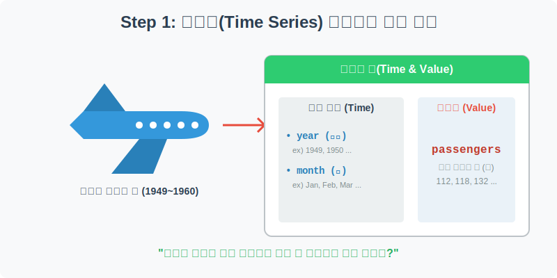
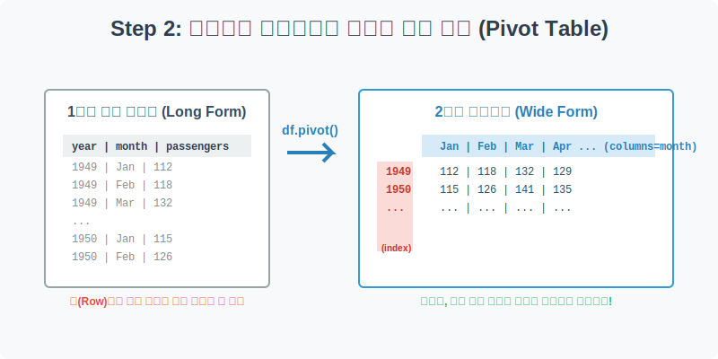
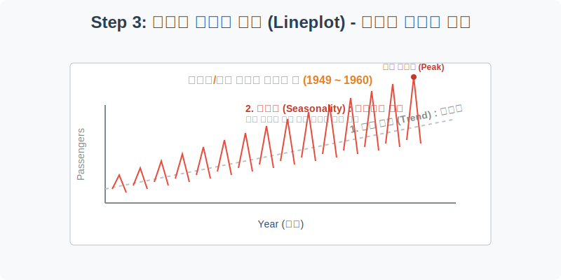
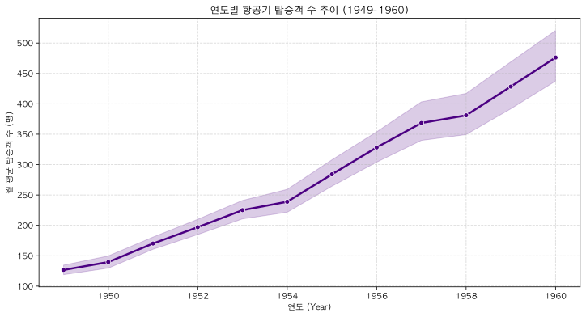
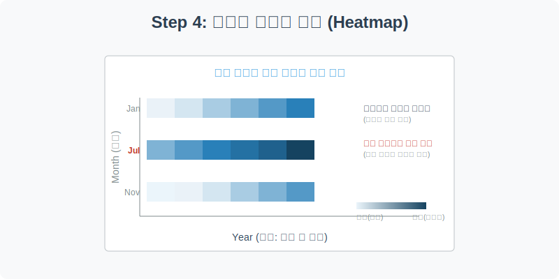
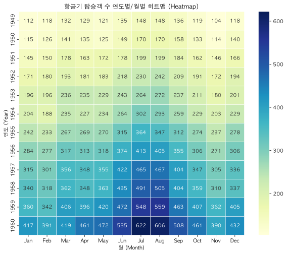

# 실전 데이터 분석 05: 항공기 탑승객 시계열 분석과 히트맵

## 📌 강의 개요 (30분 완성)


우리가 지금까지 다룬 타이타닉, 붓꽃, 팁 데이터는 '특정 시점'의 스냅샷 데이터였습니다. 하지만 주식 시장, 날씨, 매출액과 같이 **시간의 흐름(Time Series)**에 따라 변하는 데이터는 완전히 다른 분석 접근법이 필요합니다. 

이 실습에서는 1949년부터 1960년까지의 월별 항공기 탑승객 수(Flights) 데이터를 분석합니다. 시간에 따른 **장기 추세(Trend)**와 주기적으로 반복되는 **계절성(Seasonality)**을 찾아내고, 데이터를 2차원 매트릭스로 변환하여 화려한 온도계 차트(Heatmap)로 시각화하는 고급 기술을 배웁니다.

**학습 목표:**
* **시계열 데이터의 이해:** 시간 축을 가진 데이터의 특성과 그에 맞는 시각화 방법론을 익힙니다.
* **피벗 테이블(`pivot_table`)의 마법:** 아래로 길게 늘어선 1차원 데이터를 연도와 월이 교차하는 2차원 표(Wide Form)로 재구조화하는 방법을 배웁니다.
* **꺾은선 차트(`lineplot`):** 시계열 분석의 꽃인 선 그래프를 통해 장기적인 우상향 트렌드와 여름 휴가철에 피크를 찍는 계절성을 파악합니다.
* **다차원 히트맵(`heatmap`):** 숫자로 가득 찬 엑셀 표를 색상의 농도만으로 직관적으로 해석할 수 있도록 변환합니다.

---

## Step 1: 시계열 데이터의 구조 파악 (Overview)



과거 사람들은 얼마나 자주 비행기를 탔을까요? 먼저 Seaborn에 내장된 항공기 탑승객 데이터를 불러와 그 생김새를 확인해 보겠습니다.

```python
import pandas as pd
import seaborn as sns
import matplotlib.pyplot as plt

# 그래프 설정
plt.rcParams['font.family'] = 'AppleGothic'
plt.rcParams['axes.unicode_minus'] = False

# Flights 데이터셋 로드
df = sns.load_dataset('flights')

# 데이터 구조 및 첫 5행 확인
print(df.info())
display(df.head())
```

> **💻 [실행 결과]**
> ```text
> <class 'pandas.DataFrame'>
> RangeIndex: 144 entries, 0 to 143
> Data columns (total 3 columns):
>  #   Column      Non-Null Count  Dtype   
> ---  ------      --------------  -----   
>  0   year        144 non-null    int64   
>  1   month       144 non-null    category
>  2   passengers  144 non-null    int64   
> dtypes: category(1), int64(2)
> memory usage: 2.9 KB
> None
>    year month  passengers
> 0  1949   Jan         112
> 1  1949   Feb         118
> 2  1949   Mar         132
> 3  1949   Apr         129
> 4  1949   May         121
> ```


### 💡 코드 딥다이브 (Code Deep Dive)
* `df.info()`를 확인해 보면 총 144개의 데이터가 있으며 결측치는 하나도 없습니다 (144 = 12년 x 12개월).
* 데이터는 단 3개의 컬럼으로 이루어진 매우 단순한 구조를 가지고 있습니다. 하지만 이 단순한 3개의 기둥이 시계열 데이터의 핵심입니다.

**주요 컬럼(Columns) 해석:**
* **Target (우리가 관찰할 값):**
  * `passengers`: 해당 연도/월에 탑승한 승객 수 (명)
* **Features (시간 축):**
  * `year`: 연도 (1949년 ~ 1960년)
  * `month`: 월 (Jan ~ Dec)

---

## Step 2: 데이터를 입체적으로 만드는 엑셀 마법 (Preprocess)



현재 데이터는 `year`, `month`, `passengers`가 한 줄 한 줄 아래로 길게 늘어선 형태(Long Form)입니다. 컴퓨터가 읽기엔 좋지만, 인간이 한눈에 "1955년 7월과 1956년 7월을 비교"하기에는 몹시 불편합니다. 

이를 엑셀의 '피벗 테이블' 기능처럼 행(Row)과 열(Column)이 교차하는 2차원 표(Wide Form)로 변환해 봅시다.

```python
# 피벗 테이블 생성: 인덱스(행)는 연도, 컬럼(열)은 월, 값은 탑승객 수
pivot_df = df.pivot(index='year', columns='month', values='passengers')

# 2차원 매트릭스로 멋지게 변환된 데이터 확인
display(pivot_df)
```

> **💻 [실행 결과]**
> ```text
> month  Jan  Feb  Mar  Apr  May  Jun  Jul  Aug  Sep  Oct  Nov  Dec
> year                                                             
> 1949   112  118  132  129  121  135  148  148  136  119  104  118
> 1950   115  126  141  135  125  149  170  170  158  133  114  140
> 1951   145  150  178  163  172  178  199  199  184  162  146  166
> 1952   171  180  193  181  183  218  230  242  209  191  172  194
> 1953   196  196  236  235  229  243  264  272  237  211  180  201
> 1954   204  188  235  227  234  264  302  293  259  229  203  229
> 1955   242  233  267  269  270  315  364  347  312  274  237  278
> 1956   284  277  317  313  318  374  413  405  355  306  271  306
> 1957   315  301  356  348  355  422  465  467  404  347  305  336
> 1958   340  318  362  348  363  435  491  505  404  359  310  337
> 1959   360  342  406  396  420  472  548  559  463  407  362  405
> 1960   417  391  419  461  472  535  622  606  508  461  390  432
> ```


### 💡 분석가의 통찰 (Analyst's Insight)
* `df.pivot()` 함수는 파이썬 데이터 전처리의 **'꽃'**이라고 불릴 만큼 강력합니다.
* 긴 세로줄 형태의 데이터를 가로세로 바둑판 모양의 **매트릭스(Matrix)**로 변환해 줌으로써, 연도별 비교와 월별 비교가 직관적으로 가능해집니다.
* 이렇게 만든 2차원 매트릭스는 Step 4에서 화려한 색상을 입힐 히트맵(`heatmap`)의 재료로 완벽하게 쓰이게 됩니다.

---

## Step 3: 꺾은선 차트를 통한 추세와 계절성 (Univariate EDA)



시간에 따른 변화를 관찰할 때는 점이나 막대가 아닌 **선(Line)**으로 연결하는 것이 가장 직관적입니다. 원본 데이터(`df`)를 사용하여 연도별 탑승객 수 변화를 그려보겠습니다.

```python
plt.figure(figsize=(12, 6))

# X축은 시간(year), Y축은 값(passengers)을 주고 꺾은선(Lineplot)으로 연결
# hue='month' 옵션을 주지 않으면 연도별 '평균'과 신뢰구간을 자동으로 그려줍니다.
sns.lineplot(data=df, x='year', y='passengers', color='indigo', linewidth=2.5, marker='o')

plt.title('연도별 항공기 탑승객 수 추이 (1949-1960)')
plt.xlabel('연도 (Year)')
plt.ylabel('월 평균 탑승객 수 (명)')
plt.grid(True, linestyle='--', alpha=0.5)

plt.show()
```

> **💻 [실행 결과]**
> 


### 💡 시각화 차트 읽는 법
* **장기 추세 (Long-term Trend):** 그래프가 왼쪽 아래에서 오른쪽 위로 뚜렷하게 우상향하고 있습니다. 이는 1950년대에 항공 산업이 폭발적으로 성장하며 비행기를 타는 사람이 매년 꾸준히 증가했음을 명백히 보여줍니다.
* **계절성 (Seasonality)의 암시:** 이 선 그래프는 '연도별 평균'을 보여주지만, 자세히 분석하면 매년 비슷한 월(특히 여름)에 값이 치솟는 패턴을 발견할 수 있습니다. 이를 더 확실하게 눈으로 확인하기 위해 우리는 Step 4의 히트맵을 사용합니다.

---

## Step 4: 다차원 온도계 차트로 패턴 읽기 (Multivariate EDA)



Step 2에서 만들어두었던 2차원 바둑판 데이터(`pivot_df`)에 색상을 입혀서, 숫자를 읽지 않고도 어느 달에 탑승객이 터져 나갔는지 직관적으로 파악할 수 있는 **히트맵(Heatmap)**을 그려보겠습니다.

```python
plt.figure(figsize=(10, 8))

# 피벗 테이블(pivot_df)을 입력으로 받아 히트맵 생성
# annot=True를 주면 각 칸 안에 실제 숫자(승객 수)를 적어줍니다.
# fmt="d"는 숫자를 정수(decimal) 형태로 깔끔하게 표시하라는 뜻입니다.
# cmap="YlGnBu"는 Yellow -> Green -> Blue 로 갈수록 값이 커지는 색상 팔레트입니다.
sns.heatmap(pivot_df, annot=True, fmt="d", cmap="YlGnBu", linewidths=.5)

plt.title('항공기 탑승객 수 연도별/월별 히트맵 (Heatmap)')
plt.xlabel('월 (Month)')
plt.ylabel('연도 (Year)')
plt.show()
```

> **💻 [실행 결과]**
> 


### 💡 시각화 차트 읽는 법 (히트맵 완벽 해부)
1. **아래로 갈수록 짙어지는 색상 (연도별 성장):** 맨 윗줄(1949년)은 밝은 노란색 위주지만, 맨 아랫줄(1960년)은 짙은 파란색 위주입니다. 이는 Step 3에서 보았던 **'항공 산업의 꾸준한 성장(우상향 추세)'**이 그대로 반영된 것입니다.
2. **여름철의 짙은 세로줄 (계절성):** 왼쪽(겨울/봄)이나 오른쪽(가을/겨울)에 비해, 중간에 위치한 **July(7월)과 August(8월)** 세로줄이 유독 주변 달들보다 짙은 파란색을 띠고 있습니다. 이는 매년 예외 없이 여름 휴가철에 탑승객 수요가 폭발적으로 증가하는 뚜렷한 **'계절성(Seasonality)'** 패턴을 한 장의 그림으로 완벽하게 증명합니다.

---

## Step 5: 시계열 데이터의 꽃, 이동평균 (Statistical Logic)

선 그래프(Step 3)를 보면 매달 승객 수가 위아래로 삐죽삐죽 요동치는 것을 볼 수 있습니다. 데이터 분석가들은 이런 지저분한 단기 변동(노이즈)을 제거하고 굵직한 장기 트렌드만 깔끔하게 보고 싶어 합니다. 이때 사용하는 필수 통계 기법이 바로 **이동평균(Moving Average)**입니다. (주식의 '20일 이동평균선'과 같은 원리입니다.)

> 💡 **[수포자를 위한 수학 돋보기: 시계열을 다림질하는 이동평균]**
> 이동평균을 구하는 공식은 아주 단순한 '평균 구하기'의 연속입니다.
> $$ MA_t = \frac{1}{n} \sum_{i=0}^{n-1} x_{t-i} $$
> 
> * 예를 들어 3개월 이동평균(n=3)이라면, 이번 달, 지난달, 지지난달 탑승객 수를 더한 뒤 3으로 나눕니다. 다음 달이 되면 제일 오래된 달의 데이터는 버리고 새로운 달의 데이터를 추가해 다시 3으로 나눕니다.
> * 이렇게 특정 크기의 **창문(Window)**을 옆으로 한 칸씩 밀어가며(Moving) 평균(Average)을 연속적으로 구하면, 특정 달에 비정상적으로 튀어 오른 값들이 평균에 희석되어 부드럽게 깎여 나갑니다.
> * 그 결과, 마치 구겨진 옷에 다림질을 한 것처럼 데이터가 매끄러워지며, 전체 탑승객 수요가 장기적으로 어떻게 변화하고 있는지 명확한 거시적 트렌드(Trend)를 파악할 수 있게 됩니다.

---

## 🎯 30분 강의 마무리 및 심화 과제

시간의 흐름을 가진 데이터를 분석할 때는 엑셀의 피벗 기능과 같은 `pivot()` 함수로 표를 재구조화하고, 이를 `lineplot`과 `heatmap`이라는 강력한 도구로 시각화하여 **장기 트렌드**와 **반복되는 계절성**이라는 두 마리 토끼를 잡아야 함을 배웠습니다.

### 📝 심화 과제 (Advanced Challenge)
1. **월별 꺾은선 차트 분리하기:** Step 3의 코드에서 `hue='month'` 옵션을 켜보세요. (예: `sns.lineplot(data=df, x='year', y='passengers', hue='month')`) 하나의 선이 12가닥의 선으로 쫙 펼쳐지면서, 모든 선이 위로 올라가되 유독 여름(7, 8월)을 나타내는 선 2가닥이 항상 맨 꼭대기를 날아가고 있는 멋진 뷰를 감상할 수 있습니다.
2. **색상 팔레트 변경하기:** 히트맵 코드에서 `cmap`을 `"Reds"`(빨간색 톤), `"coolwarm"`(차가운 색부터 뜨거운 색까지), 혹은 `"magma"`(어두운 보라색에서 밝은 노란색으로) 등으로 자유롭게 변경해 보세요. 목적에 따라 어떤 색상이 데이터를 가장 잘 전달하는지 고민해 보는 것이 데이터 분석가의 중요한 역할입니다.
