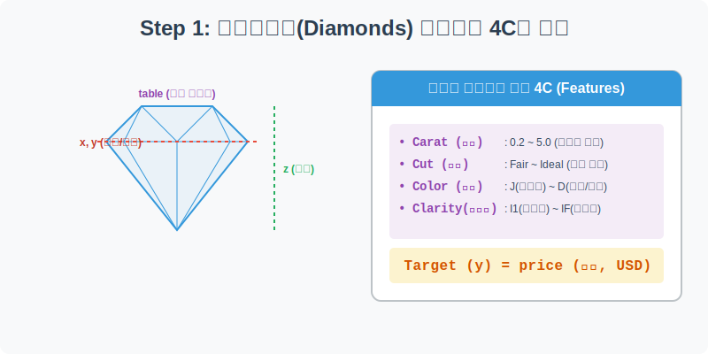
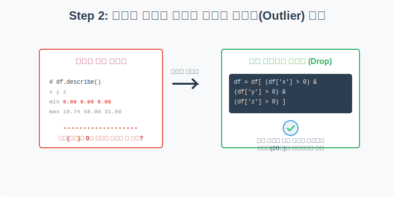
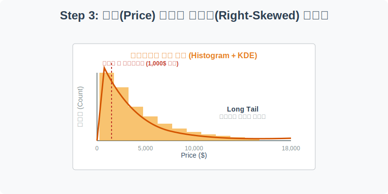
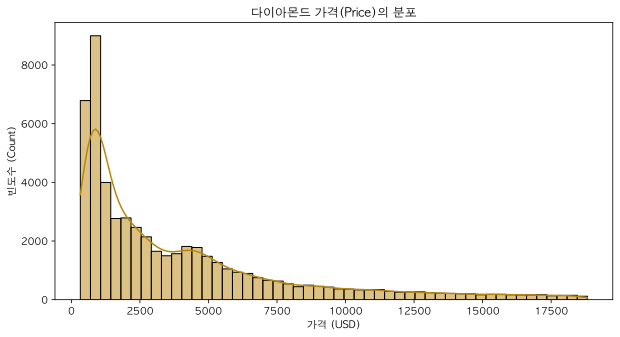
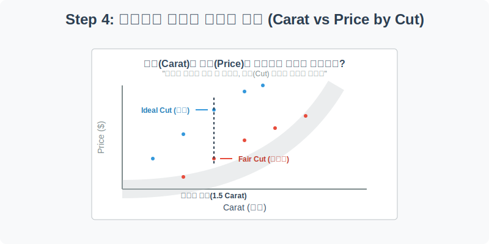
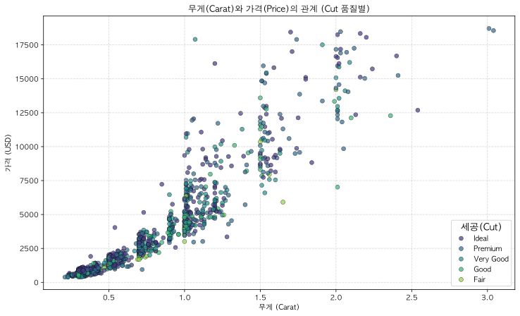

# 실전 데이터 분석 06: 다이아몬드 가격 분석과 논리적 이상치 처리

## 📌 강의 개요 (30분 완성)


이 실습에서는 약 54,000개의 다이아몬드 거래 데이터셋을 다룹니다. 흔히 다이아몬드는 무거울수록(Carat) 비싸다고 생각하지만, 실제 가격은 세공(Cut), 색상(Color), 투명도(Clarity)라는 '4C'의 복합적인 상호작용에 의해 결정됩니다.

**학습 목표:**
* **도메인 지식을 활용한 이상치 정제:** 결측치(NaN)는 없지만 논리적으로 말이 되지 않는 데이터(예: 부피가 0인 다이아몬드)를 찾아내어 필터링합니다.
* **극단적인 우측 꼬리 분포 해석:** 부의 상징인 다이아몬드 가격의 전형적인 Long-Tail 분포를 시각화합니다.
* **다변수 시각화를 통한 인사이트 도출:** 단순히 '무게와 가격'의 1차원적 관계를 넘어, '세공 품질'이 가격에 미치는 결정적 영향을 산점도(`scatterplot`)와 색상(`hue`)을 통해 입체적으로 증명합니다.

---

## Step 1: 다이아몬드의 4C와 데이터 구조 (Overview)



데이터를 분석하기 전, 보석 감정의 세계에서 가격을 결정하는 핵심 지표인 **4C(Carat, Cut, Color, Clarity)**의 개념을 이해하는 것이 필수적입니다.

```python
import pandas as pd
import seaborn as sns
import matplotlib.pyplot as plt

# 그래프 설정
plt.rcParams['font.family'] = 'AppleGothic'
plt.rcParams['axes.unicode_minus'] = False
sns.set_palette("muted")

# Diamonds 데이터셋 로드
df = sns.load_dataset('diamonds')

# 데이터 구조 및 첫 5행 확인
print(df.info())
display(df.head())
```

> **💻 [실행 결과]**
> ```text
> <class 'pandas.DataFrame'>
> RangeIndex: 53940 entries, 0 to 53939
> Data columns (total 10 columns):
>  #   Column   Non-Null Count  Dtype   
> ---  ------   --------------  -----   
>  0   carat    53940 non-null  float64 
>  1   cut      53940 non-null  category
>  2   color    53940 non-null  category
>  3   clarity  53940 non-null  category
>  4   depth    53940 non-null  float64 
>  5   table    53940 non-null  float64 
>  6   price    53940 non-null  int64   
>  7   x        53940 non-null  float64 
>  8   y        53940 non-null  float64 
>  9   z        53940 non-null  float64 
> dtypes: category(3), float64(6), int64(1)
> memory usage: 3.0 MB
> None
>    carat      cut color clarity  depth  table  price     x     y     z
> 0   0.23    Ideal     E     SI2   61.5   55.0    326  3.95  3.98  2.43
> 1   0.21  Premium     E     SI1   59.8   61.0    326  3.89  3.84  2.31
> 2   0.23     Good     E     VS1   56.9   65.0    327  4.05  4.07  2.31
> 3   0.29  Premium     I     VS2   62.4   58.0    334  4.20  4.23  2.63
> 4   0.31     Good     J     SI2   63.3   58.0    335  4.34  4.35  2.75
> ```


### 💡 코드 딥다이브 (Code Deep Dive)
**주요 컬럼(Columns) 해석:**
* **Target (예측해야 할 정답):**
  * `price`: 다이아몬드의 가격 (US 달러)
* **Features (예측의 단서가 되는 4C + 물리적 크기):**
  * `carat`: 다이아몬드의 무게 (1캐럿 = 0.2g)
  * `cut`: 세공 품질 (Ideal > Premium > Very Good > Good > Fair)
  * `color`: 색상 등급 (D가 가장 맑고 무색에 가까우며 J로 갈수록 누런빛)
  * `clarity`: 투명도 및 내포물 유무 (IF가 완벽하게 깨끗함, I1은 육안으로 흠집이 보임)
  * `x`, `y`, `z`: 각각 다이아몬드의 길이, 너비, 깊이 (mm 단위)

---

## Step 2: 논리적 에러 데이터 찾아내기 (Preprocess)



`df.info()`를 보면 53,940개의 데이터 중 결측치(NaN)는 단 하나도 없습니다. 그렇다면 이 데이터는 완벽할까요? 데이터의 요약 통계량(`describe`)을 통해 숨겨진 에러를 찾아봅시다.

```python
# 숫자형 데이터의 통계량 확인
display(df.describe())

# 논리적으로 불가능한 데이터(크기가 0인 다이아몬드) 필터링
print("\n[정제 전] 크기가 0인 다이아몬드 개수:")
print(len(df[(df['x'] == 0) | (df['y'] == 0) | (df['z'] == 0)]))

# 정상적인 데이터만 남기기 (x, y, z가 모두 0보다 큰 경우)
clean_df = df[(df['x'] > 0) & (df['y'] > 0) & (df['z'] > 0)]

print(f"\n[정제 후] 안전하게 남은 정상 데이터 개수: {len(clean_df)}개")
```

> **💻 [실행 결과]**
> ```text
> carat         depth  ...             y             z
> count  53940.000000  53940.000000  ...  53940.000000  53940.000000
> mean       0.797940     61.749405  ...      5.734526      3.538734
> std        0.474011      1.432621  ...      1.142135      0.705699
> min        0.200000     43.000000  ...      0.000000      0.000000
> 25%        0.400000     61.000000  ...      4.720000      2.910000
> 50%        0.700000     61.800000  ...      5.710000      3.530000
> 75%        1.040000     62.500000  ...      6.540000      4.040000
> max        5.010000     79.000000  ...     58.900000     31.800000
> 
> [8 rows x 7 columns]
> 
> [정제 전] 크기가 0인 다이아몬드 개수:
> 20
> 
> [정제 후] 안전하게 남은 정상 데이터 개수: 53920개
> ```


### 💡 분석가의 통찰 (Analyst's Insight)
* `df.describe()` 결과를 유심히 보면, `x`, `y`, `z`(다이아몬드의 가로, 세로, 높이)의 **최솟값(min)이 0**으로 찍혀 있습니다.
* 현실 세계에서 질량(Carat)이 존재하고 가격(Price)이 매겨진 다이아몬드의 크기(mm)가 0이라는 것은 물리적으로 불가능합니다. 이는 데이터를 입력할 때 발생한 **'휴먼 에러'**이거나 기계의 측정 오류입니다.
* 우리는 도메인 지식(물리 법칙)을 활용하여 조건문(`df['x'] > 0`)을 통해 이 비정상적인 데이터 20건을 깔끔하게 도려냈습니다.

---

## Step 3: 가격(Price)의 극단적 비대칭 분포 (Univariate EDA)



세상에는 100만 원짜리 다이아몬드가 많을까요, 1,000만 원짜리 다이아몬드가 많을까요? 가격의 분포를 히스토그램으로 확인해 봅니다.

```python
plt.figure(figsize=(10, 5))

# 데이터가 방대하므로 bins(막대 개수)를 늘려 촘촘하게 표현
sns.histplot(data=clean_df, x='price', kde=True, bins=50, color='darkgoldenrod')

plt.title('다이아몬드 가격(Price)의 분포')
plt.xlabel('가격 (USD)')
plt.ylabel('빈도수 (Count)')
plt.show()
```

> **💻 [실행 결과]**
> 


### 💡 시각화 차트 읽는 법
* **전형적인 부(Wealth)의 분포:** 차트를 보면 대다수의 다이아몬드는 1,000달러~2,000달러(약 100~300만 원) 구간에 빽빽하게 몰려 있습니다. 
* 반면, 오른쪽으로 갈수록 막대의 높이는 낮아지지만 꼬리는 18,000달러(약 2,400만 원)가 넘는 곳까지 아주 길게(Long Tail) 이어집니다.
* 머신러닝 모델을 만들 때 이렇게 한쪽으로 심하게 치우친(Right-Skewed) 데이터를 그대로 학습시키면 고가의 다이아몬드 가격을 잘 맞추지 못하는 문제가 발생합니다. 이럴 때는 추후 **로그 변환(Log Transformation)**을 통해 분포를 종 모양(정규분포)으로 예쁘게 펴주는 작업이 필요합니다.

---

## Step 4: 세공(Cut)이 가격에 미치는 마법 (Multivariate EDA)



가장 무거운 다이아몬드가 항상 가장 비쌀까요? "무게(Carat)와 가격(Price)"의 산점도를 그리고, 그 위에 "세공 품질(Cut)"이라는 세 번째 차원을 색상(`hue`)으로 덧입혀 보겠습니다.

```python
plt.figure(figsize=(12, 7))

# 데이터가 5만개가 넘어 렌더링이 너무 오래 걸리므로, 보기 좋게 1,000개만 샘플링하여 시각화
sample_df = clean_df.sample(n=1000, random_state=42)

# X축: 무게, Y축: 가격, 색상: 세공 품질
sns.scatterplot(data=sample_df, x='carat', y='price', hue='cut', 
                palette='viridis', alpha=0.7, edgecolor='k')

plt.title('무게(Carat)와 가격(Price)의 관계 (Cut 품질별)')
plt.xlabel('무게 (Carat)')
plt.ylabel('가격 (USD)')
plt.grid(True, linestyle='--', alpha=0.5)

# 범례 위치 조정
plt.legend(title='세공(Cut)', title_fontsize='13', loc='lower right')
plt.show()
```

> **💻 [실행 결과]**
> 


### 💡 코드 딥다이브 & 인사이트
* **`sample(n=1000)`**: 빅데이터를 시각화할 때 산점도에 점 5만 개를 모두 찍으면 하나의 거대한 검은색 덩어리로 변해서 패턴을 읽을 수 없게 됩니다(Overplotting 문제). 이럴 땐 데이터의 통계적 특성을 유지한 채 일부만 추출하는 샘플링이 필수적입니다.
* **차트 해석**: 
  1. 기본적으로 오른쪽(무게 증가)으로 갈수록 위(가격 상승)로 올라가는 강한 양의 상관관계가 보입니다.
  2. 하지만 X축의 `1.5 Carat` 부근을 수직으로 훑어보면 흥미로운 현상이 나타납니다. **같은 1.5캐럿이라도** 노란색/연두색 점(Ideal, Premium 급)은 가격이 10,000달러를 넘어가지만, 보라색 점(Fair 급)은 5,000달러 수준에 머물고 있습니다.
  3. 결론적으로, 아무리 돌덩이가 커도 세공사(Cutter)가 엉망으로 깎아놓으면 제값을 받지 못한다는 비즈니스적 통찰을 데이터가 증명하고 있습니다.

---

## 🎯 30분 강의 마무리 및 심화 과제

결측치(NaN)가 없다고 해서 완벽한 데이터가 아님을 배웠습니다. 분석가는 항상 해당 도메인의 상식(물리적 크기는 0보다 커야 함)을 동원해 숨겨진 에러를 찾아내야 합니다. 또한 `hue` 파라미터를 활용하면 2차원 평면 위에서도 3차원적 인사이트(무게 + 가격 + 세공품질)를 뽑아낼 수 있음을 확인했습니다.

### 📝 심화 과제 (Advanced Challenge)
1. **투명도(Clarity)의 영향력 확인:** Step 4의 시각화 코드에서 `hue='cut'` 부분을 **`hue='clarity'`**로 변경해 보세요. 세공 품질(Cut)보다 투명도(Clarity)가 가격에 미치는 영향력이 더 극적으로 보일 것입니다. (`IF` 등급이 같은 캐럿 대비 얼마나 비싼지 확인해 보세요!)
2. **상관 계수(Correlation) 히트맵 그리기:** `clean_df.corr(numeric_only=True)`를 실행하여 숫자형 변수들 간의 상관 행렬을 구하고, 이를 `sns.heatmap`으로 시각화해 보세요. 가격(`price`)과 가장 강하게 비례하는(숫자가 1에 가까운) 변수는 무엇인지 찾아보세요.
