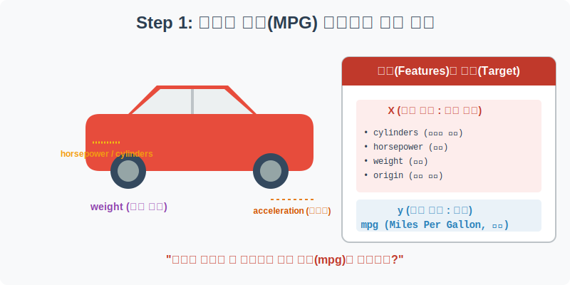
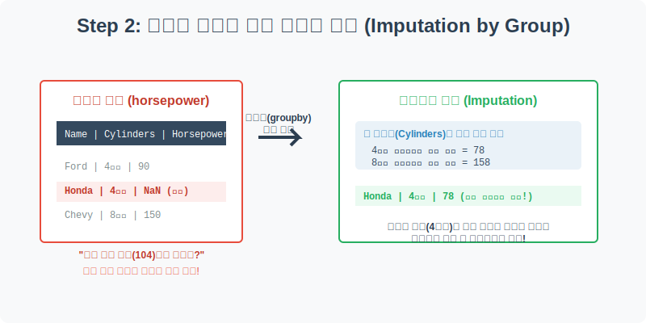
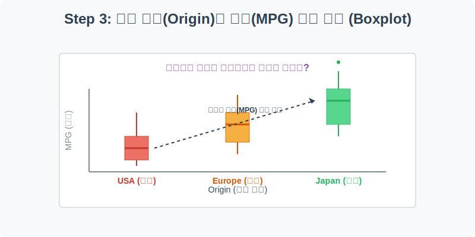
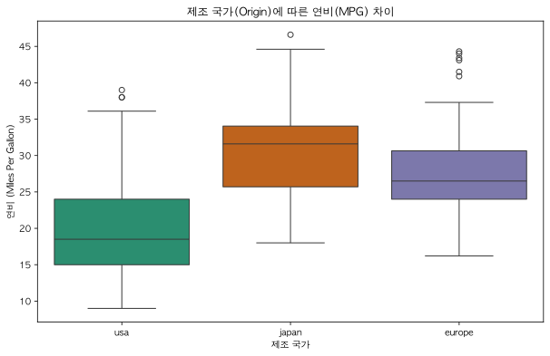
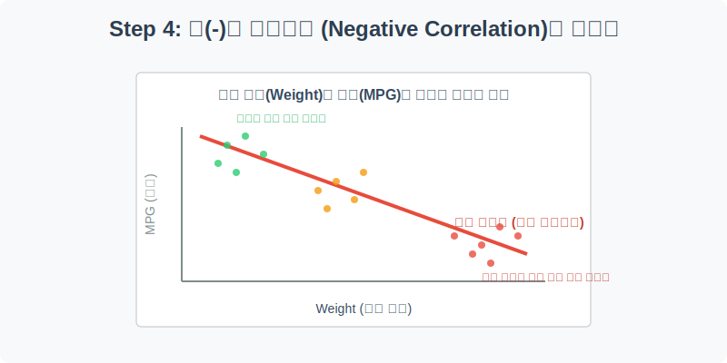
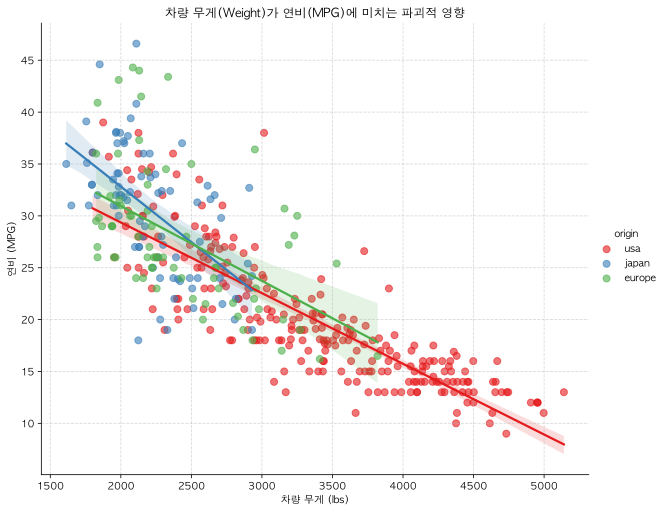

# 실전 데이터 분석 07: 자동차 연비(MPG) 분석과 스마트 결측치 대치

## 📌 강의 개요 (30분 완성)


1970년대 후반에서 1980년대 초반, 전 세계 자동차 산업은 큰 격변기를 겪었습니다. 이 시기에 미국, 유럽, 일본에서 생산된 자동차들의 제원 데이터를 담고 있는 **MPG (Miles Per Gallon, 갤런당 마일)** 데이터셋을 통해, 차량의 스펙(무게, 마력, 기통 수)이 연비에 미치는 영향을 분석해 봅니다.

**학습 목표:**
* **스마트한 결측치 대치 (Imputation by Group):** 누락된 마력(Horsepower) 데이터를 단순히 전체 평균으로 채우는 통계적 오류를 범하지 않고, 같은 스펙(기통 수)을 가진 차량들의 평균을 구해 논리적으로 대치하는 고급 기법을 배웁니다.
* **범주형 데이터의 분포 비교 (`boxplot`):** 제조 국가(미국, 일본, 유럽)별로 연비 차이가 얼마나 극심하게 났는지 박스플롯을 통해 한눈에 증명합니다.
* **음(-)의 상관관계 시각화 (`lmplot`):** 차량의 무게(Weight)와 연비(MPG)가 정확히 반비례하는 물리적 법칙을 산점도와 회귀선으로 확인하고, 국가별 자동차 제조 철학의 차이를 군집(Cluster)으로 찾아냅니다.

---

## Step 1: 자동차 제원 데이터 구조 파악 (Overview)



가장 먼저 해야 할 일은 데이터를 로드하여 어떤 스펙들이 기록되어 있는지 확인하는 것입니다.

```python
import pandas as pd
import seaborn as sns
import matplotlib.pyplot as plt

# 그래프 설정
plt.rcParams['font.family'] = 'AppleGothic'
plt.rcParams['axes.unicode_minus'] = False
sns.set_palette("Set1")

# MPG 데이터셋 로드
df = sns.load_dataset('mpg')

# 데이터 구조 및 첫 5행 확인
print(df.info())
display(df.head())
```

> **💻 [실행 결과]**
> ```text
> <class 'pandas.DataFrame'>
> RangeIndex: 398 entries, 0 to 397
> Data columns (total 9 columns):
>  #   Column        Non-Null Count  Dtype  
> ---  ------        --------------  -----  
>  0   mpg           398 non-null    float64
>  1   cylinders     398 non-null    int64  
>  2   displacement  398 non-null    float64
>  3   horsepower    392 non-null    float64
>  4   weight        398 non-null    int64  
>  5   acceleration  398 non-null    float64
>  6   model_year    398 non-null    int64  
>  7   origin        398 non-null    str    
>  8   name          398 non-null    str    
> dtypes: float64(4), int64(3), str(2)
> memory usage: 28.1 KB
> None
>     mpg  cylinders  displacement  ...  model_year  origin                       name
> 0  18.0          8         307.0  ...          70     usa  chevrolet chevelle malibu
> 1  15.0          8         350.0  ...          70     usa          buick skylark 320
> 2  18.0          8         318.0  ...          70     usa         plymouth satellite
> 3  16.0          8         304.0  ...          70     usa              amc rebel sst
> 4  17.0          8         302.0  ...          70     usa                ford torino
> 
> [5 rows x 9 columns]
> ```


### 💡 코드 딥다이브 (Code Deep Dive)
**주요 컬럼(Columns) 해석:**
* **Target (예측해야 할 정답):**
  * `mpg`: 연비 (1갤런의 연료로 갈 수 있는 마일 수. 높을수록 연비가 좋은 차!)
* **Features (예측의 단서가 되는 차량 스펙):**
  * `cylinders`: 엔진 실린더 개수 (기통 수. 4기통, 6기통, 8기통 등)
  * `displacement`: 배기량
  * `horsepower`: 마력 (엔진의 힘)
  * `weight`: 차량 무게
  * `acceleration`: 가속 성능 (0에서 60마일까지 도달하는 데 걸리는 시간)
  * `model_year`: 출시 연도 (70 ~ 82년)
  * `origin`: 제조 국가 (usa, japan, europe)
  * `name`: 자동차 모델명

---

## Step 2: 통계적 추론을 통한 결측치 복원 (Preprocess)



`df.info()` 결과를 보면 총 398대의 차 중 `horsepower`(마력) 컬럼에만 6개의 결측치가 존재합니다. 이 6개의 빈칸을 어떻게 채워야 할까요?

```python
# 1. 전체 평균으로 채우는 바보 같은 짓 (주석 처리)
# df['horsepower'] = df['horsepower'].fillna(df['horsepower'].mean())

# 2. 똑똑한 방법: 기통 수(cylinders)별 평균 마력 계산
cylinder_means = df.groupby('cylinders')['horsepower'].mean()
print("--- 기통 수에 따른 평균 마력 ---")
print(cylinder_means)

# 3. 누락된 마력을 해당 차량의 기통 수 평균으로 스마트하게 채워넣기
# transform 함수는 각 행이 속한 그룹의 평균값을 해당 행의 크기에 맞게 반환해 줍니다.
df['horsepower'] = df['horsepower'].fillna(df.groupby('cylinders')['horsepower'].transform('mean'))

print("\n결측치 처리 완료. 현재 결측치 수:", df['horsepower'].isnull().sum())
```

> **💻 [실행 결과]**
> ```text
> --- 기통 수에 따른 평균 마력 ---
> cylinders
> 3     99.250000
> 4     78.281407
> 5     82.333333
> 6    101.506024
> 8    158.300971
> Name: horsepower, dtype: float64
> 
> 결측치 처리 완료. 현재 결측치 수: 0
> ```


### 💡 분석가의 통찰 (Analyst's Insight)
* **전체 평균의 함정:** 타이타닉호 승객의 나이처럼 전체가 비슷한 분포를 이룰 때는 전체 평균(또는 중앙값)을 써도 됩니다. 하지만 자동차는 4기통 소형차(약 78마력)와 8기통 대형차(약 158마력)의 체급 차이가 극심합니다. 만약 결측치가 난 소형차에 전체 평균인 104마력을 때려 넣으면, 졸지에 소형차가 스포츠카의 힘을 내는 심각한 데이터 왜곡이 발생합니다.
* **Groupby Imputation:** 따라서 결측치를 채울 때는 항상 **"이 변수와 가장 연관성이 높은 다른 변수가 무엇일까?"**를 고민해야 합니다. 마력은 실린더(기통 수)와 물리적으로 완벽히 비례하므로, "같은 기통 수를 가진 차들의 평균"으로 채워 넣는 것이 가장 과학적인 접근법입니다.

---

## Step 3: 국가별 자동차 연비 팩트 체크 (Univariate EDA)



70년대 1, 2차 오일 쇼크(기름값 폭등)가 터졌을 때, 미국인들은 자신들이 만들던 거대한 차를 버리고 일본 차를 미친 듯이 사들이기 시작했습니다. 과연 그 이유가 무엇인지 박스플롯을 통해 확인해 보겠습니다.

```python
plt.figure(figsize=(10, 6))

# 제조 국가(origin)별 연비(mpg)를 Boxplot으로 비교
sns.boxplot(data=df, x='origin', y='mpg', palette='Dark2')

plt.title('제조 국가(Origin)에 따른 연비(MPG) 차이')
plt.xlabel('제조 국가')
plt.ylabel('연비 (Miles Per Gallon)')
plt.show()
```

> **💻 [실행 결과]**
> 


### 💡 시각화 차트 읽는 법
* **미국(usa):** 상자의 위치가 가장 밑(연비 15~20 수준)에 쳐져 있습니다. 즉, 기름을 길바닥에 쏟고 다니는 수준의 최악의 연비를 보여줍니다.
* **유럽(europe):** 중간 수준의 준수한 연비(25 전후)를 보여줍니다.
* **일본(japan):** 상자의 중앙값(Median)이 30을 가볍게 넘어서며 압도적인 1위를 차지하고 있습니다. 오일 쇼크 시대에 왜 일본 차가 세계 시장을 제패했는지 이 단 한 장의 차트가 역사적 사실을 완벽하게 입증해 줍니다.

---

## Step 4: 무게와 연비의 반비례, 그리고 제조 철학 (Multivariate EDA)



"차가 무거울수록 기름을 많이 먹는다"는 것은 초등학생도 아는 물리 법칙입니다. 이를 산점도와 회귀선으로 증명하고, 동시에 국가별로 점들의 위치(군집)가 어떻게 다른지 입체적으로 엮어서 시각화해 보겠습니다.

```python
# x축: 무게(weight), y축: 연비(mpg), hue: 제조국가(origin)
# lmplot을 사용하여 점을 뿌림과 동시에 전체 추세를 관통하는 회귀선까지 한 번에 그립니다.
sns.lmplot(data=df, x='weight', y='mpg', hue='origin', height=7, aspect=1.2, 
           palette='Set1', scatter_kws={'alpha':0.6, 's':50})

plt.title('차량 무게(Weight)가 연비(MPG)에 미치는 파괴적 영향')
plt.xlabel('차량 무게 (lbs)')
plt.ylabel('연비 (MPG)')
plt.grid(True, linestyle='--', alpha=0.5)

plt.show()
```

> **💻 [실행 결과]**
> 


### 💡 코드 딥다이브 & 인사이트
* **음(-)의 상관관계 (Negative Correlation):** 왼쪽 위에서 오른쪽 아래로 곤두박질치는 뚜렷한 **우하향** 추세선들이 보입니다. 차가 1,000파운드씩 무거워질 때마다 연비가 가차 없이 박살 나는 모습을 보여줍니다.
* **군집(Clustering)을 통한 국가별 제조 철학:**
  1. **초록색 점(Japan):** 그래프 좌측 상단에 옹기종기 모여 있습니다. 작고, 가볍고, 연비가 끝내주게 좋은 실용적인 차를 만들었다는 뜻입니다.
  2. **빨간색 점(USA):** 그래프 우측 하단에 널찍하게 흩어져 있습니다. 3,000파운드부터 심지어 5,000파운드가 넘는 무시무시한 쇳덩이 차들입니다. 크고 강한 차를 선호하는 미국 특유의 '머슬카(Muscle Car)' 감성이 데이터에 그대로 묻어납니다.

---

## 🎯 30분 강의 마무리 및 심화 과제

결측치를 억지로 평균으로 덮어버리지 않고 **그룹별 특성을 살려 지능적으로 대치(Groupby Imputation)**하는 기술은 실무에서 매우 자주 쓰이는 고급 스킬입니다. 또한, 두 변수의 산점도 위에 `hue`를 입혀 군집을 분리해 냄으로써 그 시대의 역사적 배경과 비즈니스 상황까지 유추할 수 있었습니다.

### 📝 심화 과제 (Advanced Challenge)
1. **연도별 연비 발전사 추적:** X축을 출시 연도(`model_year`), Y축을 연비(`mpg`)로 설정하여 꺾은선 차트(`sns.lineplot`)를 그려보세요. 70년대 초반에 바닥을 기던 연비가 80년대 초반으로 갈수록 어떻게 우상향하는지, 당시 자동차 회사들의 뼈를 깎는 연비 개선 노력을 데이터로 확인해 보세요.
2. **다중 변수 상관계수:** `df.corr(numeric_only=True)`를 실행해 보세요. 연비(`mpg`)와 양(+)의 상관관계를 가지는 변수가 단 하나 있습니다. 그것이 무엇인지 찾아보고, 왜 그런 결과가 나왔는지 곰곰이 생각해 보세요!
