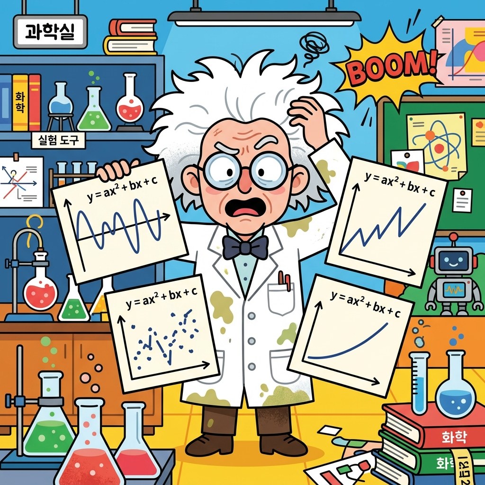
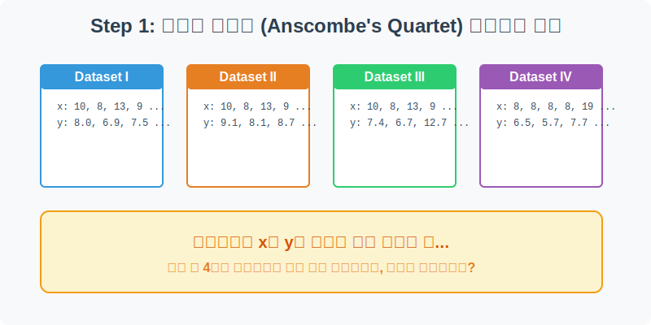
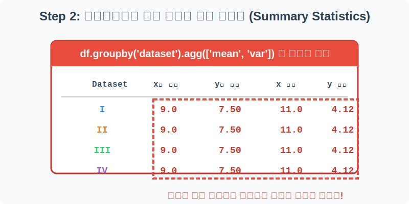
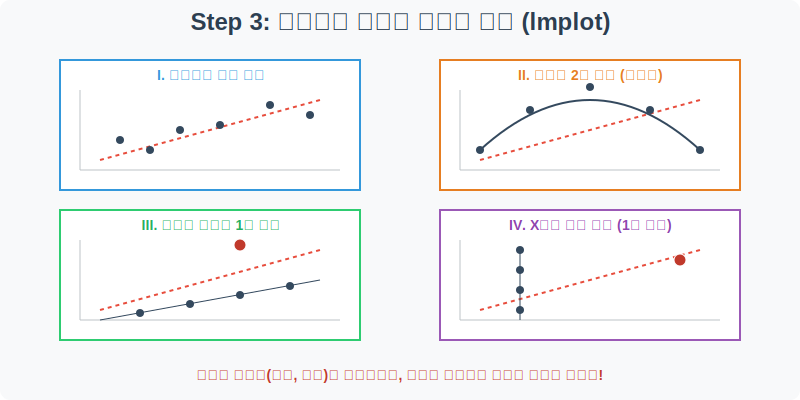
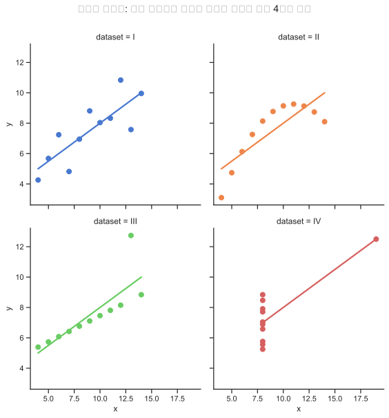
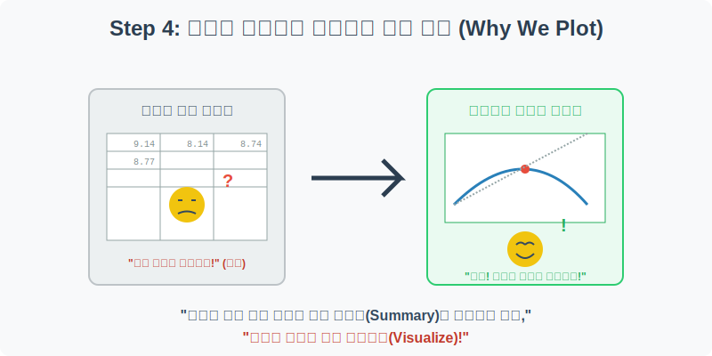

# 실전 데이터 분석 08: 앤스콤 콰르텟 (Anscombe's Quartet)과 시각화의 힘

## 📌 강의 개요 (30분 완성)


"평균과 분산 같은 숫자로 요약된 데이터만 믿으면 큰 코 다친다." 
1973년, 통계학자 프랜시스 앤스콤(Francis Anscombe)은 통계 분석 전에 **반드시 데이터를 눈으로 직접 시각화(Visualize)해야 하는 이유**를 증명하기 위해 기발한 데이터셋 4개를 만들었습니다. 이 4개의 데이터셋(콰르텟)은 통계적 요약 수치(평균, 분산, 상관계수)가 소수점 둘째 자리까지 완벽하게 일치하지만, 그래프로 그려보면 완전히 다른 기하학적 형태를 띄고 있습니다.

**학습 목표:**
* **요약 통계량의 함정:** `mean()`, `var()`, `corr()` 등 흔히 쓰이는 기초 통계 함수들이 어떻게 분석가의 눈을 가리고 거짓말을 할 수 있는지 체험합니다.
* **`lmplot`의 다중 차트 생성 (`col` 옵션):** 하나의 화면에 여러 개의 하위 차트를 분할하여 그리는 Seaborn의 강력한 패싯(Facet) 기능을 익힙니다.
* **데이터 리터러시 (Data Literacy):** 엑셀 표 안의 숫자에만 매몰되지 않고, 산점도를 통해 데이터의 진짜 패턴(선형, 비선형, 극단치)을 찾아내는 직관을 기릅니다.

---

## Step 1: 4개의 미스터리한 데이터셋 (Overview)



앤스콤 콰르텟 데이터는 로마 숫자(I, II, III, IV)로 이름 붙여진 4개의 데이터 그룹으로 이루어져 있습니다. 우선 이 데이터들의 구조를 살펴보겠습니다.

```python
import pandas as pd
import seaborn as sns
import matplotlib.pyplot as plt

# 그래프 설정
plt.rcParams['font.family'] = 'AppleGothic'
plt.rcParams['axes.unicode_minus'] = False
sns.set_theme(style="ticks")

# Anscombe 데이터셋 로드
df = sns.load_dataset('anscombe')

# 첫 5행 확인 및 어떤 데이터셋이 있는지 종류 확인
display(df.head())
print("데이터셋 종류:", df['dataset'].unique())
```

> **💻 [실행 결과]**
> ```text
> dataset     x     y
> 0       I  10.0  8.04
> 1       I   8.0  6.95
> 2       I  13.0  7.58
> 3       I   9.0  8.81
> 4       I  11.0  8.33
> 데이터셋 종류: <StringArray>
> ['I', 'II', 'III', 'IV']
> Length: 4, dtype: str
> ```


### 💡 코드 딥다이브 (Code Deep Dive)
**주요 컬럼(Columns) 해석:**
* `dataset`: 4개의 그룹을 구분하는 카테고리 (I, II, III, IV)
* `x`: x 좌표(독립 변수) 숫자 값
* `y`: y 좌표(종속 변수) 숫자 값

언뜻 보기에는 그냥 의미 없는 숫자 쌍(x, y)들이 11개씩, 총 44개가 나열되어 있을 뿐입니다. 

---

## Step 2: 통계학자들을 속인 완벽한 숫자들 (Preprocess)



우리가 앞선 실습들에서 배웠던 것처럼 데이터의 기초 특성을 파악하기 위해 통계 함수들을 돌려보겠습니다. 4개의 데이터셋을 `groupby`로 묶어서 `x`와 `y`의 평균(mean)과 분산(var)을 계산해 봅니다.

```python
# dataset(I~IV) 별로 그룹을 지어 평균과 분산을 소수점 둘째 자리까지 출력
stats = df.groupby('dataset').agg(['mean', 'var']).round(2)
display(stats)

# I번 그룹과 II번 그룹의 x, y 상관계수(Correlation) 비교
corr_I = df[df['dataset'] == 'I'][['x', 'y']].corr().iloc[0, 1]
corr_II = df[df['dataset'] == 'II'][['x', 'y']].corr().iloc[0, 1]

print(f"\n데이터셋 I의 상관계수: {corr_I:.3f}")
print(f"데이터셋 II의 상관계수: {corr_II:.3f}")
```

> **💻 [실행 결과]**
> ```text
> x          y      
>         mean   var mean   var
> dataset                      
> I        9.0  11.0  7.5  4.13
> II       9.0  11.0  7.5  4.13
> III      9.0  11.0  7.5  4.12
> IV       9.0  11.0  7.5  4.12
> 
> 데이터셋 I의 상관계수: 0.816
> 데이터셋 II의 상관계수: 0.816
> ```


### 💡 분석가의 통찰 (Analyst's Insight)
* `groupby`의 결과를 보면 충격적입니다. **4개의 데이터셋 모두 x의 평균은 9.00, y의 평균은 7.50, x의 분산은 11.00, y의 분산은 4.12**로 소수점까지 한 치의 오차도 없이 똑같습니다!
* 심지어 x와 y가 서로 얼마나 비례하는지를 나타내는 **상관계수(Correlation)조차 약 0.816**으로 동일합니다.
* 오직 숫자와 요약 통계량(Summary Statistics)만 쳐다보는 분석가라면, 여기서 당당하게 **"아! 이 4개의 데이터셋은 완벽하게 똑같은 분포와 특징을 가진 쌍둥이 데이터군!"**이라고 100% 오판하고 분석을 종료할 것입니다. 

과연 그럴까요?

> 💡 **[수포자를 위한 통계 돋보기: 평균, 분산, 표준편차]**  
> 앤스콤이 똑같이 맞춘 요약 통계량들은 데이터 분석의 가장 기본 뼈대입니다.
> 
> **1. 평균 (Mean, $\mu$)**
> $$ \mu = \frac{\sum x}{N} $$
> - 모든 데이터를 다 더해서 갯수($N$)로 나눈 값입니다. 전체 집단의 '무게 중심'을 뜻합니다.
> 
> **2. 분산 (Variance, $\sigma^2$)**
> $$ \sigma^2 = \frac{\sum (x - \mu)^2}{N} $$
> - 데이터들이 평균($\mu$)에서 얼마나 멀리 흩어져 있는지 거리를 잰 것입니다. 
> - 왜 굳이 제곱($^2$)을 할까요? 평균보다 작은 값은 거리가 마이너스(-)로 나오기 때문에, 다 더했을 때 0이 되어버리는 것을 막기 위해 양수로 강제 변환하는 수학적 꼼수입니다.
> 
> **3. 표준편차 (Standard Deviation, $\sigma$)**
> $$ \sigma = \sqrt{\sigma^2} $$
> - 분산에서 다시 루트($\sqrt{}$)를 씌운 값입니다. 분산에서 억지로 제곱을 했기 때문에 단위가 '달러$^2$', 'kg$^2$'처럼 괴상해졌으므로, 다시 원래 단위로 되돌려주기 위함입니다. "평균적으로 이 집단은 이만큼 퍼져있다"를 가장 잘 설명하는 척도입니다.
---

## Step 3: 시각화가 밝혀낸 충격적 반전 (Visualizing the Truth)



숫자가 치고 있는 사기를 깨부수는 유일한 방법은 데이터를 눈(Eye)으로 직접 보는 것, 바로 시각화(Visualization)입니다. `lmplot`을 사용해 4개의 데이터를 그림으로 그려보겠습니다.

```python
# lmplot의 'col' 파라미터를 사용하여 dataset(I~IV) 별로 그래프를 4개로 쪼개어 그립니다.
# col_wrap=2를 주면 1줄에 2개씩 그려서 가독성을 높입니다.
sns.lmplot(
    data=df, x="x", y="y", col="dataset", hue="dataset", col_wrap=2, 
    palette="muted", ci=None, height=4, scatter_kws={"s": 50, "alpha": 1}
)

# 전체 그래프의 제목 설정 (lmplot은 FacetGrid 객체이므로 fig.suptitle 사용)
plt.gcf().suptitle('앤스콤 콰르텟: 요약 통계량은 같지만 분포는 완전히 다른 4개의 세계', y=1.05)
plt.show()
```

> **💻 [실행 결과]**
> 


### 💡 시각화 차트 읽는 법
4개의 그래프에 그어진 직선(회귀선)은 기울기와 높이가 모두 똑같습니다. (통계량이 똑같기 때문입니다.) 하지만 점들의 분포는 완전히 다릅니다!
1. **Dataset I (정상):** 우리가 흔히 아는 일반적인 선형(Linear) 관계입니다. 점들이 회귀선 주변에 적당히 흩어져 우상향하고 있습니다.
2. **Dataset II (비선형):** 점들이 완벽한 곡선(포물선)을 그리고 있습니다. 즉, 이 데이터는 직선(선형 회귀)으로 분석하면 안 되는 데이터입니다!
3. **Dataset III (이상치 1):** 점들이 직선상에 완벽히 일치하지만, **단 하나의 튀는 점(Outlier)**이 전체 회귀선의 기울기를 살짝 아래로 끌어내리고 있습니다. 이 점 하나만 지우면 완벽한 직선이 됩니다.
4. **Dataset IV (이상치 2):** X값이 8인 곳에 모든 점이 일직선으로 서 있는데, 저 멀리 X=19인 곳에 있는 **극단적인 이상치 하나**가 무리하게 선을 자기 쪽으로 끌어당겨 가짜 상관관계를 만들어냈습니다.

---

## 🎯 30분 강의 마무리 및 심화 과제 (Why We Plot)



앤스콤 콰르텟은 데이터 과학 역사상 가장 위대한 교육용 데이터셋입니다. 
아무리 딥러닝과 인공지능 기술이 발전하더라도, 분석가는 반드시 코드를 짜기 전에 **차트를 먼저 그려서(Plot) 데이터의 진짜 얼굴을 눈으로 마주해야 합니다.** 숫자로 요약된 평균과 분산은 극단적인 이상치(Outlier) 하나에도 쉽게 오염되며, 데이터의 비선형적(Non-linear) 패턴을 완전히 숨겨버리기 때문입니다.

### 📝 심화 과제 (Advanced Challenge)
1. **나만의 앤스콤 콰르텟 훼손하기:** 원본 데이터 프레임(`df`)에서 Dataset IV의 마지막 행(X=19 인 이상치)의 값을 강제로 다른 값(예: X=8, Y=6)으로 변경해 보세요. 그리고 다시 `lmplot`을 그려보세요. 점 하나를 바꿨을 뿐인데 회귀선(빨간 선)이 어떻게 붕괴되는지 관찰해 보세요. 이상치가 통계에 미치는 폭력적인 영향력을 직접 눈으로 확인할 수 있습니다.
