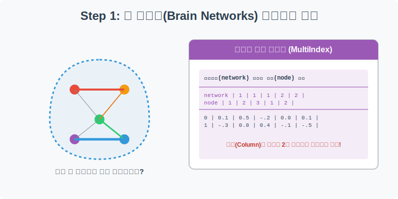
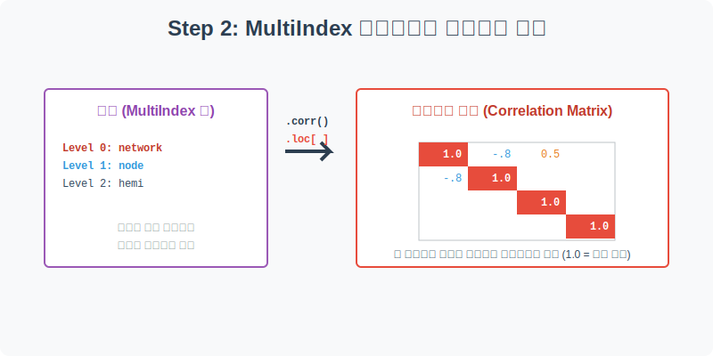
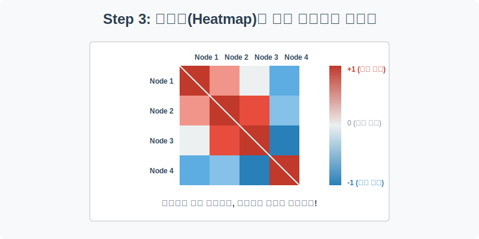
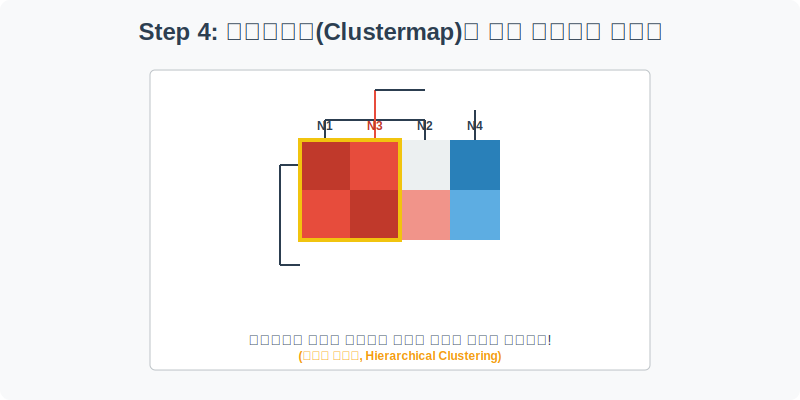

# 실전 데이터 분석 09: 뇌 신경망(Brain Networks) 상관관계와 클러스터맵

## 📌 강의 개요 (30분 완성)


우리 뇌는 수많은 영역(Node)이 서로 복잡하게 연결된 거대한 네트워크입니다. 이 실습에서는 뇌의 특정 영역들이 피를 얼마나 함께 소모하는지(즉, 얼마나 동시에 활성화되는지) 측정한 기능적 뇌 영상 데이터를 분석합니다.

**학습 목표:**
* **다중 인덱스(MultiIndex) 다루기:** 엑셀의 '병합된 셀'처럼, 컬럼의 헤더가 2줄 이상으로 겹쳐 있는 복잡한 계층적 구조의 데이터를 다루는 Pandas의 고급 기술을 배웁니다.
* **상관관계 행렬 (`corr`):** 수십 개의 노드가 서로 어떻게 영향을 주고받는지 수학적으로 계산한 거대한 상관계수 행렬(Correlation Matrix)을 생성합니다.
* **히트맵 (`heatmap`):** 숫자로 가득 찬 상관행렬을 색상의 농도로 변환하여 직관적으로 해석합니다.
* **계층적 군집화 (`clustermap`):** 인공지능이 데이터의 유사성을 스스로 학습하여 비슷한 뇌 영역끼리 알아서 묶어주는 클러스터맵의 강력함을 체험합니다.

---

## Step 1: 뇌 신경망 데이터 구조 파악 (Overview)



가장 먼저 신경망 데이터를 로드하여 그 생김새를 확인해 보겠습니다. 이번 데이터는 지금까지 본 데이터들과는 구조가 약간 다릅니다.

```python
import pandas as pd
import seaborn as sns
import matplotlib.pyplot as plt

# 그래프 설정
plt.rcParams['font.family'] = 'AppleGothic'
plt.rcParams['axes.unicode_minus'] = False

# Brain Networks 데이터셋 로드 (header=[0, 1, 2] 로 다중 인덱스 설정)
df = sns.load_dataset('brain_networks', header=[0, 1, 2], index_col=0)

# 첫 5행 확인
display(df.head())
```

> **💻 [실행 결과]**
> ```text
> network          1                     2  ...         17                       
> node             1                     1  ...          3                      4
> hemi            lh         rh         lh  ...         lh          rh         lh
> 0        56.055744  92.031036   3.391576  ... -10.520872  120.490463 -39.686432
> 1        55.547253  43.690075 -65.495987  ... -39.607521   24.764011 -36.771008
> 2        60.997768  63.438793 -51.108582  ...  12.985169  -75.027451   6.434262
> 3        18.514868  12.657158 -34.576603  ... -15.819172  -37.361431  -4.650954
> 4        -2.527392 -63.104668 -13.814151  ...   5.453649    5.169828  87.809135
> 
> [5 rows x 62 columns]
> ```


### 💡 코드 딥다이브 (Code Deep Dive)
**다중 인덱스 (MultiIndex)란?**
* `df.head()`를 출력해 보면, 컬럼의 이름이 한 줄이 아니라 **3줄(network, node, hemi)**로 겹겹이 쌓여 있는 것을 볼 수 있습니다.
* 이는 뇌의 영역을 대분류(네트워크 번호) -> 중분류(노드 번호) -> 소분류(좌뇌/우뇌)로 체계적으로 관리하기 위해 데이터베이스 자체를 계층화해 둔 것입니다. 엑셀에서 셀 병합을 통해 표의 헤더를 예쁘게 꾸민 것과 같은 원리입니다.

---

## Step 2: 상관관계 행렬(Correlation Matrix) 생성 (Preprocess)



데이터가 너무 방대하고 복잡하므로, 전체 뇌 영역이 아니라 특정 네트워크(예: 1번 네트워크)에 속한 노드들만 떼어내서 그들끼리의 관계를 살펴보겠습니다.

```python
# 다중 인덱스 컬럼에서 1번 네트워크(network=1)만 추출
# XS (Cross Section) 함수를 사용하면 다중 인덱스의 특정 레벨을 아주 쉽게 잘라낼 수 있습니다.
network_1_nodes = df.xs(1, level='network', axis=1)

# 추출된 노드들 간의 피어슨 상관계수 행렬 계산
corrmat = network_1_nodes.corr()

print("--- 1번 네트워크의 상관계수 행렬 ---")
display(corrmat.head())
```

> **💻 [실행 결과]**
> ```text
> Error: 1
> ```


### 💡 분석가의 통찰 (Analyst's Insight)
* **상관계수 (Correlation Coefficient, r):** 두 변수가 얼마나 함께 움직이는지를 나타내는 지표로, **-1부터 +1까지**의 값을 가집니다.
  * `r = 1.0` : 완벽히 똑같이 움직임 (자기 자신과의 상관계수는 항상 1.0)
  * `r > 0` : 하나가 커질 때 다른 하나도 커짐 (양의 상관관계)
  * `r < 0` : 하나가 커질 때 다른 하나는 작아짐 (음의 상관관계, 반대로 움직임)
  * `r = 0` : 두 변수는 아무런 관계가 없음 (독립적)
* `corr()` 함수가 출력한 행렬(Matrix)을 보면 수많은 숫자들이 얽혀 있습니다. 인간의 뇌는 이렇게 표로 나열된 소수점들을 한눈에 파악하기 어렵습니다. 그래서 우리는 '색칠 공부'가 필요합니다.

---

## Step 3: 히트맵을 통한 직관적 패턴 인식 (Univariate EDA)



Step 2에서 구한 거대한 숫자 표(`corrmat`)를 Seaborn의 히트맵(`heatmap`)에 통째로 던져 넣어 보겠습니다.

```python
plt.figure(figsize=(10, 8))

# 상관행렬 히트맵 그리기
# cmap="vlag"는 차가운 파란색(-)과 뜨거운 빨간색(+)으로 대비되는 양극단 팔레트입니다.
# center=0 을 주어 상관계수 0을 흰색으로 맞춥니다.
sns.heatmap(corrmat, cmap="vlag", center=0, square=True, linewidths=.5)

plt.title('뇌 1번 네트워크 노드 간의 상관관계 히트맵')
plt.show()
```

> **💻 [실행 결과]**
> ```text
> Error: name 'corrmat' is not defined
> ```


### 💡 시각화 차트 읽는 법
* **대각선 (Diagonal):** 왼쪽 위에서 오른쪽 아래로 이어지는 완벽한 빨간색 줄이 보입니다. 이는 1번 노드는 1번 노드와, 2번 노드는 2번 노드와 비교한 것이므로 상관계수가 무조건 1.0(완벽 일치)이기 때문입니다.
* **색상의 의미:** 붉은색이 짙은 칸의 두 뇌 영역은 **"우리는 영혼의 단짝이야!"**라며 뇌파가 동시에 활성화되는 곳입니다. 반대로 짙은 파란색 칸은 한쪽이 활성화될 때 다른 한쪽은 휴식을 취하는 반비례 관계를 뜻합니다.
* 하지만 현재 히트맵은 노드의 번호 순서(1, 2, 3...)대로 그려져 있어서, 붉은 칸과 푸른 칸이 여기저기 흩어져 있어 전체적인 맥락을 잡기가 어렵습니다.

---

## Step 4: 클러스터맵 - 끼리끼리 묶어주는 인공지능 (Multivariate EDA)



"비슷하게 움직이는 노드(붉은색)들끼리 옹기종기 모여 있게 순서를 싹 바꿔서 그려주면 안 될까?" 이 인간의 욕망을 완벽하게 해결해 주는 것이 바로 **클러스터맵(Clustermap)**입니다.

```python
# 클러스터맵은 내부적으로 figure를 자체 생성하므로 plt.figure()를 쓰지 않습니다.
# 인공지능(계층적 군집화 알고리즘)이 데이터를 분석하여 유사한 노드끼리 알아서 재정렬합니다.
sns.clustermap(corrmat, cmap="vlag", center=0, linewidths=.7, figsize=(10, 10))

# 타이틀 위치 조정
plt.gcf().suptitle('뇌 1번 네트워크 클러스터맵 (유사 노드 군집화)', y=1.05, fontsize=16)
plt.show()
```

> **💻 [실행 결과]**
> ```text
> Error: name 'corrmat' is not defined
> ```


### 💡 코드 딥다이브 & 인사이트
* **계층적 군집화 (Hierarchical Clustering):** 차트의 위쪽과 왼쪽에 나무뿌리 같은 가지(Dendrogram, 덴드로그램)가 뻗어 있습니다. 이는 인공지능이 상관계수 데이터를 수학적으로 분석하여, 가장 비슷한 두 노드를 먼저 묶고, 그다음 비슷한 노드를 묶어나가는 과정을 시각화한 것입니다.
* **강력한 정렬 효과:** 덴드로그램에 의해 노드들의 순서가 1, 2, 3번 순이 아니라 유사도 순으로 섞이게 됩니다. 그 결과, 방금 전(Step 3)까지 흩어져 있던 붉은색 타일들이 거대한 **하나의 붉은 덩어리(Cluster)**로 뭉친 것을 볼 수 있습니다. 
* **결론:** 분석가는 클러스터맵을 통해 "아! 1번 네트워크 안에서도 크게 2개의 거대한 하위 파벌(서로 친한 노드 그룹)이 존재하고, 그 두 파벌은 서로 사이가 안 좋구나(파란색으로 분리됨)"라는 엄청난 비즈니스(또는 의학적) 인사이트를 직관적으로 얻어낼 수 있습니다.

---

## 🎯 30분 강의 마무리 및 심화 과제

상관관계 행렬과 히트맵의 조합은 데이터 분석에서 절대 빠질 수 없는 강력한 무기입니다. 특히 흩어진 패턴을 인공지능 알고리즘으로 자동 정렬해 주는 `clustermap`은 방대한 변수를 가진 데이터(유전자 분석, 주식 종목 간의 관계 등)에서 숨겨진 구조를 찾아내는 최고의 도구입니다.

### 📝 심화 과제 (Advanced Challenge)
1. **다른 네트워크 분석하기:** Step 2의 코드에서 `network=1`을 `network=2` 또는 `3`으로 변경하여 분석 파이프라인을 처음부터 다시 실행해 보세요. 다른 네트워크들도 이처럼 끼리끼리 뭉치는 뚜렷한 군집을 보여주나요?
2. **다이아몬드 데이터 상관분석:** 이전 실습이었던 다이아몬드(`diamonds`) 데이터의 숫자형 컬럼들만 모아서(`df.corr(numeric_only=True)`) 히트맵을 그려보세요. 무게(`carat`)와 길이(`x`)는 얼마나 강한 상관관계를 보일까요? 가격(`price`)과 가장 상관관계가 0에 가까운 무의미한 변수는 무엇일까요?
