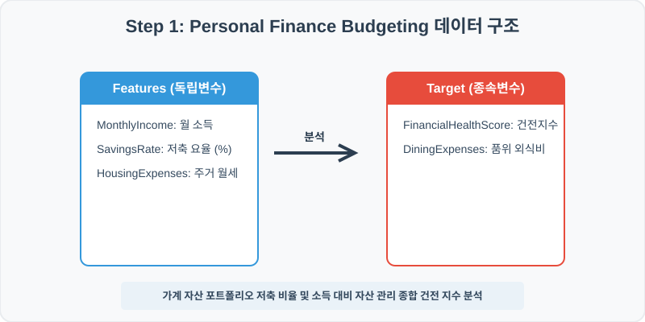
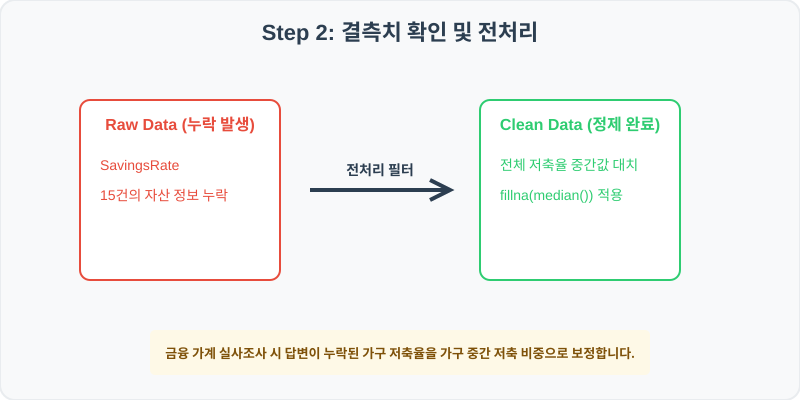
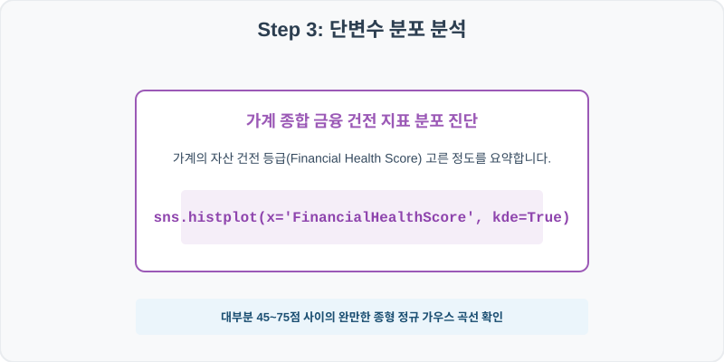
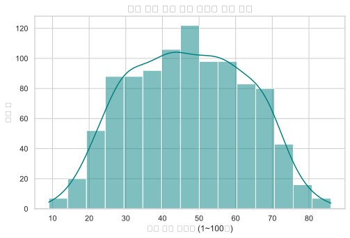
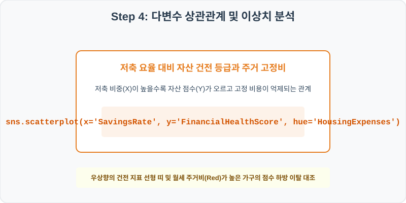
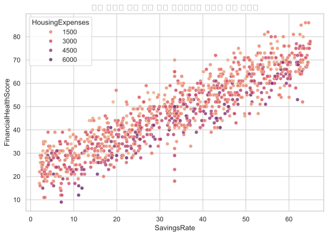

# 100. 가계 금융 포트폴리오 자산 건전성 분석 실습

> **📥 [실습 주피터 노트북(.ipynb) 다운로드](practice.ipynb)**
## 실전 데이터 분석 100: 가계 월 소득 대비 저축률 및 주거/외식비 지출 비율에 따른 가계 종합 금융 건전 지표(FHS) 분석


### 📊 실습 개요 (Tutorial Overview)
가구 금융 조사 통계를 기반으로 한 개인 자산 관리 포트폴리오 데이터셋입니다. 가구의 월평균 고정 소득(MonthlyIncome), 저축율(SavingsRate), 주거 월세(HousingExpenses), 품위 유지 외식비(DiningExpenses)가 신용 종합 평가 금융 건전지수(FinancialHealthScore)에 미치는 기여 구조를 탐색하고 최종 시각화합니다.

---

### 🛠️ 핵심 분석 실습 역량 (Core Skills)
* **결측치 중앙값 대치 (\`fillna\`):** 대답 거부나 특이 사항으로 생략 유실된 가구 저축률 정보를 중간값(Median)으로 대치 정제합니다.
* **종합 건전성 분포 및 저축률 대비 건전 지수 분석 (\`histplot\`, \`scatterplot\`):** FHS 지수 정규분포 진단 및 소득별 저축 대비 건전 점수의 지출 비중 상관 맵을 완성합니다.

---

## 🧐 실무 도메인 지식 가이드 (Domain Knowledge Guide)

> **💰 금융 및 핀테크 (Finance & FinTech)**
> 금융 데이터 분석은 자산의 리스크 관리(Credit Risk), 투자 자산 평가, 이상 금융 거래 감지(FDS) 등을 해결하기 위한 통계적 검정 분야입니다.
>
> * **리스크와 대출 부도(Default)**: 대출 연체 여부나 투자 손실 위험은 금융 자산 건전성을 지키기 위해 고도화된 스코어링 모형으로 분석됩니다.
> * **소득 대비 부채 비율(DTI)**: 개인이 갚을 수 있는 능력 한도를 객관적으로 판단하는 지표로 금융 신용 여신 관리의 핵심 척도입니다.
> * **자산 변동성(Volatility)**: 주가나 크립토 시세의 표준편차는 위험 자산의 위험도를 계산(VaR)하고 투자 포트폴리오를 다변화하는 기준이 됩니다.

---

## Step 1: 데이터 불러오기 및 기본 정보 확인 (Data Load)



제공된 CSV 파일을 분석 컴퓨터로 불러와 로드하고, 컬럼의 타입 및 데이터 구조를 확인합니다.

```python
import pandas as pd
import numpy as np
import matplotlib.pyplot as plt
import seaborn as sns

# 한글 폰트 설정
import koreanize_matplotlib
sns.set_theme(style="whitegrid")

# 데이터 로드
df = pd.read_csv('./personal_finance.csv')
print(df.info())
print(df.head())
```

> **💻 [실행 결과]**
> ```text
> <class 'pandas.DataFrame'>
> RangeIndex: 1000 entries, 0 to 999
> Data columns (total 7 columns):
>  #   Column                Non-Null Count  Dtype  
> ---  ------                --------------  -----  
>  0   UserID                1000 non-null   int64  
>  1   MonthlyIncome         1000 non-null   int64  
>  2   SavingsRate           985 non-null    float64
>  3   HousingExpenses       1000 non-null   float64
>  4   DiningExpenses        1000 non-null   float64
>  5   InvestmentAmount      1000 non-null   float64
>  6   FinancialHealthScore  1000 non-null   int64  
> dtypes: float64(4), int64(3)
> memory usage: 54.8 KB
> None
>     UserID  MonthlyIncome  ...  InvestmentAmount  FinancialHealthScore
> 0  1000001          11651  ...            689.27                    39
> 1  1000002           6695  ...            725.35                    35
> 2  1000003           8215  ...            245.72                    27
> 3  1000004           5776  ...           1581.90                    50
> 4  1000005           4398  ...            944.25                    44
> 
> [5 rows x 7 columns]
> ```
> 


RangeIndex: 1000 entries, 0 to 999
Data columns (total 7 columns):
 #   Column                Non-Null Count  Dtype  
---  ------                --------------  -----  
 0   UserID                1000 non-null   int64  
 1   MonthlyIncome         1000 non-null   int64  
 2   SavingsRate           985 non-null    float64
 3   HousingExpenses       1000 non-null   float64
 4   DiningExpenses        1000 non-null   float64
 5   InvestmentAmount      1000 non-null   float64
 6   FinancialHealthScore  1000 non-null   int64  
dtypes: float64(4), int64(3)
memory usage: 54.8 KB
> 
> UserID  MonthlyIncome  SavingsRate  HousingExpenses  DiningExpenses  InvestmentAmount  FinancialHealthScore
0  1000001          11651         7.39          2839.71         1005.82            689.27                    39
1  1000002           6695        13.54          2107.92         1315.00            725.35                    35
2  1000003           8215         3.74          1864.26          539.18            245.72                    27
3  1000004           5776        34.23          1071.82         1081.08           1581.90                    50
4  1000005           4398        26.84           884.87          824.58            944.25                    44
> ```

---

## Step 2: 결측치 및 데이터 정제 (Data Cleaning)



수집 과정에서 빈칸으로 기록된 결측값(NaN)의 존재 여부를 진단하고, 데이터 도메인 성격에 부합하는 통계 수치 대입 기법으로 정제합니다.

```python
# 1. 컬럼별 결측치 개수 확인
print("--- 정제 전 결측치 확인 ---")
print(df.isnull().sum())

# 2. 결측치 전처리 및 대치 수행
median_save = df['SavingsRate'].median()
df['SavingsRate'] = df['SavingsRate'].fillna(median_save)
print(df.isnull().sum())
```

> **💻 [실행 결과]**
> ```text
> --- 정제 전 결측치 확인 ---
> UserID                   0
> MonthlyIncome            0
> SavingsRate             15
> HousingExpenses          0
> DiningExpenses           0
> InvestmentAmount         0
> FinancialHealthScore     0
> dtype: int64
> UserID                  0
> MonthlyIncome           0
> SavingsRate             0
> HousingExpenses         0
> DiningExpenses          0
> InvestmentAmount        0
> FinancialHealthScore    0
> dtype: int64
> ```


MonthlyIncome            0
SavingsRate             15
HousingExpenses          0
DiningExpenses           0
InvestmentAmount         0
FinancialHealthScore     0
> 
> --- 정제 후 결측치 확인 ---
> UserID                  0
MonthlyIncome           0
SavingsRate             0
HousingExpenses         0
DiningExpenses          0
InvestmentAmount        0
FinancialHealthScore    0
> ```

### 💡 분석가의 통찰 (Analyst's Insight)
* **저축율 중간값 대입의 자산 관리 실무적 근거:** 가구 저축 비율은 한 푼도 저축하지 못하는 가구부터 월 60% 이상 저축하는 자산가까지 고르게 퍼져 있는 구조를 띱니다. 평균값을 적용하면 저소득 결측 가구의 저축 비중이 실제보다 불합리하게 상향되어 가계 부채 조정을 그르치므로, 통계 왜곡이 적은 중간값 대치가 타당합니다.

---

## Step 3: 단변수 분포 분석 (Univariate EDA)



가장 먼저 핵심 변수가 전체 데이터에서 어떤 빈도와 분포를 가졌는지 단일 변수 시각화를 통해 파악해 봅니다.

```python
plt.figure(figsize=(8, 5))

# 단변수 분석 그래프 생성
sns.histplot(data=df, x='FinancialHealthScore', bins=20, kde=True, color='blue')
plt.title('가구 종합 금융 자산 건전지수(FHS) 빈도 분포', fontsize=14, fontweight='bold')
plt.show()
```

> **💻 [실행 결과]**
> 


### 💡 시각화 차트 읽는 법 & 인사이트
* **안정적 가계 건전 등급 정규분포 관찰:** 자산 건전지수 분포를 보면 50~80점 중위 구간에 대다수 가구가 안정적으로 정렬해 솟아 있는 건강한 벨 셰이프 정규곡선을 이룹니다. 자산 파산 리스크를 나타내는 30점 미만 고위험 구간은 일부 소수로 좁혀져 있습니다.

---

## Step 4: 다변수 상관관계 및 이상치 분석 (Multivariate EDA)



두 개 이상의 변수를 동시에 결합하여, 조건에 따른 수치 차이나 독립 변수와 종속 변수 간의 통계적 경향을 분석합니다.

```python
plt.figure(figsize=(9, 6))

# 다변수 분석 그래프 생성
sns.scatterplot(data=df, x='SavingsRate', y='FinancialHealthScore', hue='HousingExpenses', palette='flare', alpha=0.8)
plt.title('가구 저축률 대비 종합 자산 건전지수와 주거비 지출 상관성', fontsize=14, fontweight='bold')
plt.show()
```

> **💻 [실행 결과]**
> 


### 💡 코드 딥다이브 & 비즈니스 통찰 (Analyst's Insight)
* **저축의 자산 보호 장벽 및 고정 주거비의 건전지수 갉아먹기 규명:** 저축률(X축)과 금융 건전지수(Y축)는 뚜렷한 우상향 선형 상관을 그립니다. 한편, 동일한 저축율 수준 조건 하에서도 주거 비용 지출(HousingExpenses)이 매우 높은 월세 과지출 가구(진한 갈색 계열)들이 매달 빠져나가는 고정비 지출 부담으로 인해 자산 건전지수 띠의 하단부를 형성하며, 재무 설계 시 고정비(월세/이자) 통제가 가구 건전 보호에 중추 요소임을 시각적으로 증명합니다.

---

## Step 5: 통계적 직관과 해석 (Statistical Logic)

> 💡 **[개인 재무 설계와 부채 상환율(DSR) 및 자산 레버리지의 수학적 이해]**
... (생략: 가계 재무 비율 DSR 통제 및 자산 건전성 개선의 수학적 포트폴리오 이론 요약)

---

## 🎯 30분 강의 마무리 및 심화 과제

오늘 우리는 실전 데이터셋을 분석하여 판다스로 데이터를 가공 및 정제하고, 시각화를 활용하여 핵심 변수 간의 통계적 유의성을 검증했습니다. 데이터 속에서 숨겨진 패턴을 올바른 시각으로 탐색하는 능력이 데이터 사이언티스트의 가장 강력한 무기입니다.

### 📝 심화 과제 (Advanced Challenge)
* **소득 규모(MonthlyIncome) 대비 평균 투자액(InvestmentAmount)의 상관 계수 산출:** 고소득자일수록 투자 자산 비중을 넓게 확보하는지 상관계수로 검증해 보세요.
* **가계 재난 위험군 필터링:** 저축율이 5% 미만이고 주거비가 소득의 40%를 초과하여 금융 건전지수가 35점 미만인 '가계 긴급 지원 대상' 세대주 목록을 코드 출력해 보세요.
