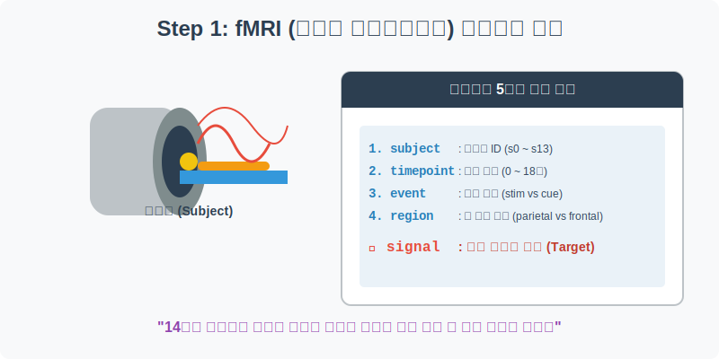
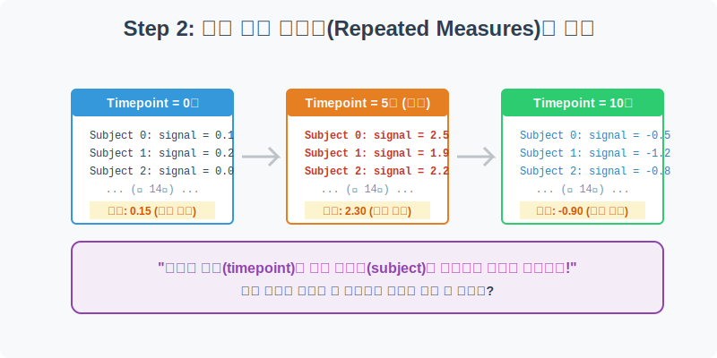
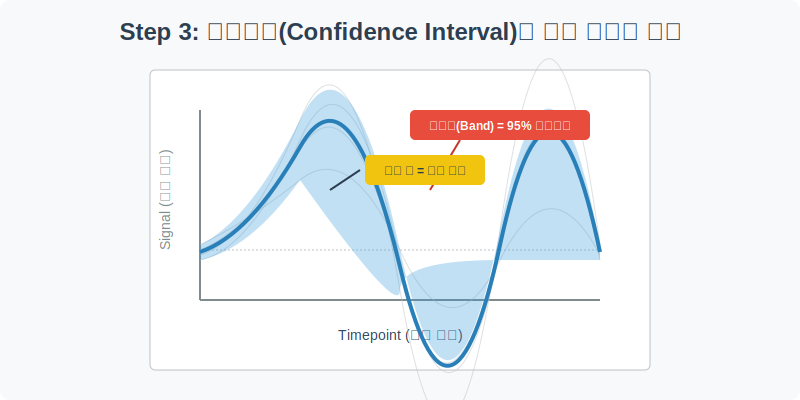
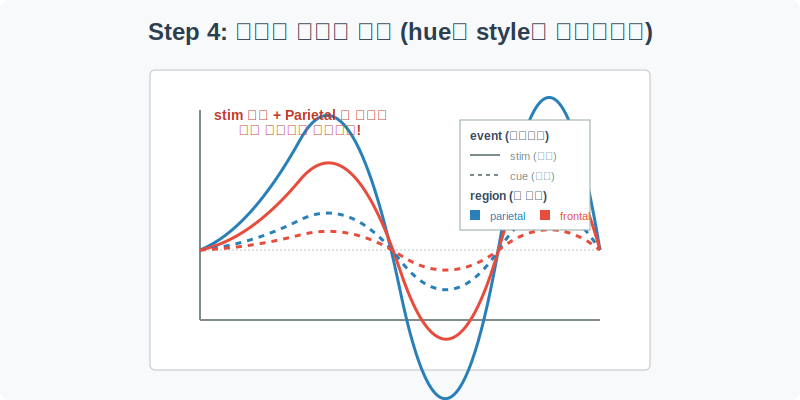

# 실전 데이터 분석 10: fMRI 시계열 분석과 신뢰구간(Confidence Interval)

## 📌 강의 개요 (30분 완성)


우리가 병원에서 흔히 보는 MRI(자기공명영상)가 뇌의 정적인 '구조'를 찍는 사진이라면, **fMRI(기능적 자기공명영상)**는 피가 뇌의 어느 부위로 쏠리는지를 실시간 동영상처럼 촬영하여 뇌의 '기능'을 측정하는 기술입니다.

이 실습에서는 14명의 피험자(Subject)에게 특정 자극(Event)을 주었을 때, 시간에 따라 뇌의 두 부위(Region)에서 발생하는 뇌파 신호(Signal)의 변화를 추적합니다. 

**학습 목표:**
* **반복 측정(Repeated Measures) 데이터 이해:** 동일한 시간대에 14명 피험자의 데이터가 겹쳐 있을 때 발생하는 통계적 오차를 이해합니다.
* **신뢰구간(Confidence Interval) 시각화:** Seaborn의 `lineplot`이 내부적으로 부트스트래핑(Bootstrapping) 연산을 수행하여 95% 신뢰구간 밴드(그림자)를 자동으로 그려주는 원리를 배웁니다.
* **다차원 데이터 비교 (`hue` & `style`):** 색상(자극 종류)과 선의 모양(뇌 부위)을 동시에 조합하여 복잡한 다차원 데이터를 단 한 장의 시계열 차트로 깔끔하게 요약합니다.

---

## Step 1: fMRI 데이터의 5가지 핵심 기둥 (Overview)



뇌 과학자들이 실험실에서 수집한 1,064건의 생체 데이터를 로드하고, 그 구조를 뜯어보겠습니다.

```python
import pandas as pd
import seaborn as sns
import matplotlib.pyplot as plt

# 그래프 설정
plt.rcParams['font.family'] = 'AppleGothic'
plt.rcParams['axes.unicode_minus'] = False
sns.set_palette("muted")

# fMRI 데이터셋 로드
df = sns.load_dataset('fmri')

# 데이터 구조 및 첫 5행 확인
print(df.info())
display(df.head())
```

### 💡 코드 딥다이브 (Code Deep Dive)
**주요 컬럼(Columns) 해석:**
* **Target (우리가 예측하거나 분석할 값):**
  * `signal`: 뇌파 신호의 강도. (수치가 높을수록 해당 뇌 부위가 활발하게 일하고 있다는 뜻입니다.)
* **Features (실험 조건들):**
  * `subject`: 피험자 ID (s0 ~ s13까지 총 14명)
  * `timepoint`: 시간 흐름 (0초부터 18초까지)
  * `event`: 실험 자극 (stim: 강한 자극, cue: 약한 신호)
  * `region`: 측정 부위 (parietal: 두정엽, frontal: 전두엽)

---

## Step 2: 반복 측정 데이터의 본질 (Preprocess)



시계열 데이터를 분석하기 전에, "시간이 0초일 때" 데이터가 몇 개나 있는지 확인해 봅시다.

```python
# 시간이 0초(timepoint == 0)인 순간의 데이터만 필터링
time_0_df = df[df['timepoint'] == 0]

print(f"0초일 때 존재하는 총 데이터 개수: {len(time_0_df)}개")

# 0초일 때의 데이터 5개만 샘플로 확인
display(time_0_df.head())
```

### 💡 분석가의 통찰 (Analyst's Insight)
* 일반적인 주식 데이터나 날씨 데이터라면 2024년 1월 1일의 종가는 딱 **1개** 존재합니다.
* 하지만 이 fMRI 데이터는 0초(Timepoint=0)에 무려 **56개**의 데이터(14명 피험자 x 2개 자극 x 2개 뇌 부위)가 겹쳐 있습니다.
* 이렇게 동일한 시점에 여러 관측치가 존재하는 데이터를 **반복 측정(Repeated Measures)** 데이터라고 부릅니다. 이들을 꺾은선 그래프(`lineplot`)로 그릴 때, 수십 개의 점을 어떻게 이을 것인지가 다음 Step 3의 핵심 주제입니다.

---

## Step 3: 선 그래프가 그려주는 신뢰구간의 마법 (Univariate EDA)



14명 피험자의 수많은 데이터 덩어리를 시간의 흐름(`timepoint`)에 따른 신호 강도(`signal`)로 그려보겠습니다.

```python
plt.figure(figsize=(10, 6))

# X축은 시간, Y축은 뇌파 신호.
# 데이터에 다수의 피험자가 겹쳐 있으므로, Seaborn은 자동으로 '평균' 선을 그리고
# 그 주변에 통계적 오차를 나타내는 95% 신뢰구간(Confidence Interval) 밴드를 칠합니다.
sns.lineplot(data=df, x='timepoint', y='signal', color='indigo', linewidth=3)

plt.title('시간 흐름에 따른 뇌파 신호(Signal)의 변화와 신뢰구간')
plt.xlabel('시간 (Timepoint)')
plt.ylabel('신호 강도 (Signal)')
plt.axhline(0, color='gray', linestyle='--') # 0을 기준으로 기준선(Baseline) 추가
plt.show()
```

### 💡 시각화 차트 읽는 법
* **가운데 굵은 선 (Mean):** 해당 시간대에 측정된 14명 피험자의 뇌파 신호들을 모두 더해 평균을 낸 궤적입니다. 대략 5~6초 부근에서 뇌파가 가장 강력하게 요동치는 것을 볼 수 있습니다.
* **주변의 반투명한 그림자 (Confidence Interval Band):** 이 그림자가 바로 Seaborn `lineplot`의 꽃인 **95% 신뢰구간**입니다. 인간은 기계가 아니기 때문에 14명의 피험자가 동일한 자극을 받아도 뇌파 강도는 미세하게 다릅니다. 이 그림자가 좁을수록 "모든 사람의 뇌파가 비슷하게 반응했다"는 뜻이고, 그림자가 넓을수록 "사람마다 반응의 개인차가 컸다"는 통계적 오차(Uncertainty)를 직관적으로 보여줍니다.

---

## Step 4: 다차원 비교 (자극 종류 vs 뇌 부위) (Multivariate EDA)



이제 본격적으로 데이터를 쪼개서 비교해 보겠습니다. 자극의 종류(`event`)에 따라 선의 **색상(Color)**을 다르게 하고, 뇌의 부위(`region`)에 따라 선의 **모양(Style)**을 다르게 하여 총 4개의 궤적을 한 화면에 그려봅니다.

```python
plt.figure(figsize=(12, 7))

# hue: 색상으로 자극 종류 분리 (stim vs cue)
# style: 선의 종류(실선, 점선 등)로 뇌 부위 분리 (parietal vs frontal)
# markers=True를 주면 각 데이터 포인트마다 마커(점)를 예쁘게 찍어줍니다.
sns.lineplot(
    data=df, x='timepoint', y='signal', 
    hue='event', style='region', 
    markers=True, dashes=True, linewidth=2.5, err_style='band'
)

plt.title('자극 종류(Event) 및 뇌 부위(Region)에 따른 뇌파 변화 비교', fontsize=16)
plt.xlabel('시간 (Timepoint)', fontsize=12)
plt.ylabel('신호 강도 (Signal)', fontsize=12)
plt.axhline(0, color='black', linewidth=1, linestyle='--')

# 범례 위치를 바깥으로 빼서 그래프를 가리지 않게 조정
plt.legend(bbox_to_anchor=(1.05, 1), loc='upper left')
plt.tight_layout() # 그래프가 잘리지 않게 여백 자동 조정
plt.show()
```

### 💡 코드 딥다이브 & 인사이트
* **단 한 장의 그림에 4차원 데이터 요약:** 이 차트는 시간(X), 신호(Y), 자극 종류(색상), 뇌 부위(선 모양)라는 무려 4개의 차원을 단 한 장의 2D 평면에 완벽하게 욱여넣은 데이터 시각화의 걸작입니다.
* **결론 도출:** 
  1. 가장 위로 높이 치솟는 실선 파란 선(`stim` 자극 + `parietal` 부위)을 주목하세요. 피험자에게 강한 자극(stim)을 주었을 때 뇌의 두정엽(parietal) 부위가 가장 강력하고 민감하게 반응(5초경 피크)한다는 사실을 알 수 있습니다.
  2. 반면, 주황색 점선들(`cue` 자극)은 X축(0점) 근처에서 거의 미동도 하지 않습니다. 약한 단서(cue)만 주었을 때는 뇌가 크게 반응하지 않는다는 것을 증명합니다.

---

## 🎯 30분 강의 마무리 및 심화 과제

`sns.lineplot`은 단순히 점과 점을 잇는 기능이 아닙니다. X축의 한 포인트에 Y값이 여러 개 존재할 경우, 자동으로 통계적 부트스트래핑(Bootstrapping) 연산을 수행하여 평균과 신뢰구간을 그려주는 강력한 통계 시각화 도구임을 잊지 마세요. 

### 📝 심화 과제 (Advanced Challenge)
1. **오차 밴드 지우기:** Step 4의 `lineplot` 파라미터에 **`errorbar=None`** (과거 버전의 경우 `ci=None`)을 추가해 보세요. 통계적 오차를 보여주는 그림자가 사라지고 선들만 깔끔하게 남아, 트렌드(Trend)만을 더 명확하게 비교해 볼 수 있습니다. 
2. **피험자별 개별 차트 그리기:** 만약 14명의 피험자가 각각 어떻게 반응했는지 개별적으로 보고 싶다면 어떻게 해야 할까요? `hue='subject'` 파라미터를 추가하면, 14가닥의 선이 뻗어 나가는 어지럽지만 웅장한 스파게티 차트(Spaghetti Chart)를 감상하실 수 있습니다.
