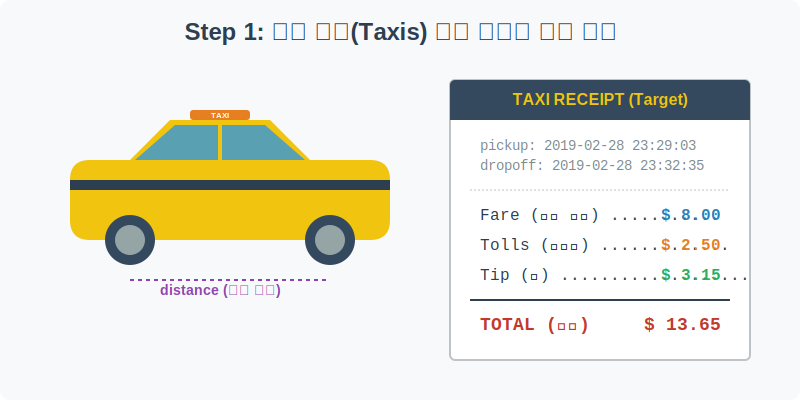
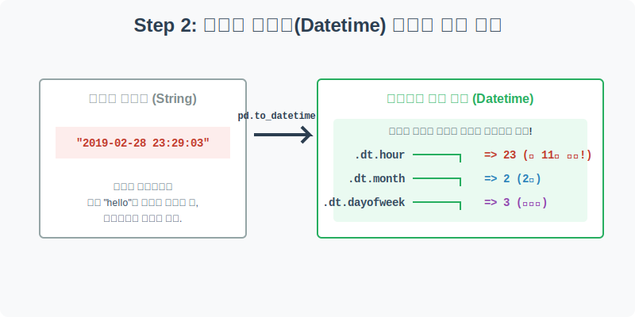
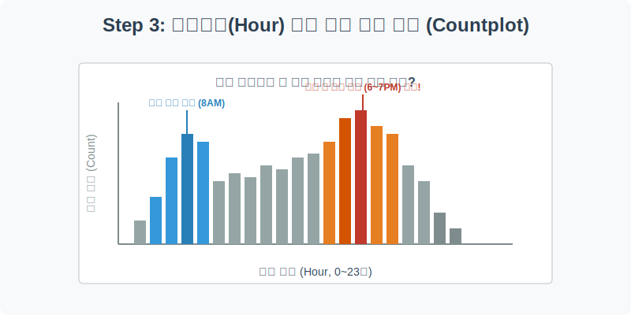
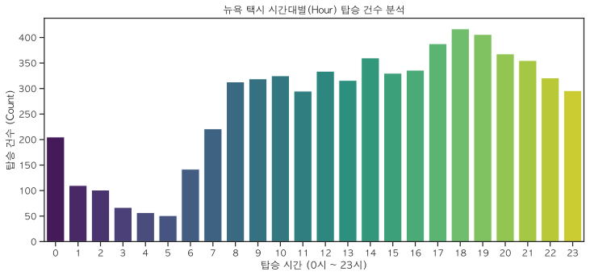
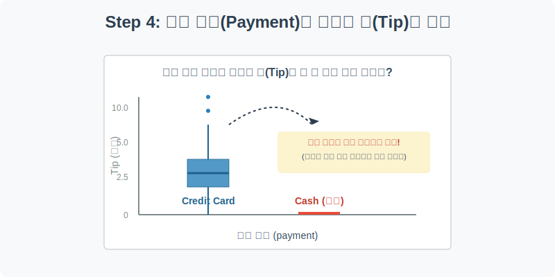
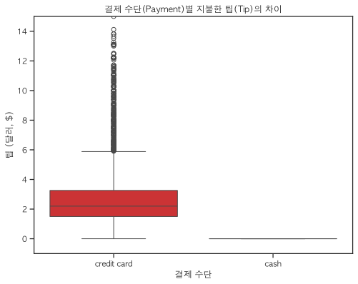

# 실전 데이터 분석 11: 뉴욕 택시 시계열 전처리와 숨겨진 비즈니스 로직 

## 📌 강의 개요 (30분 완성)


뉴욕시(NYC)를 누비는 옐로우 캡(Yellow Cab)과 그린 캡(Green Cab)의 실제 탑승 기록 데이터를 분석합니다. 단순한 숫자를 넘어 "뉴욕 시민들은 몇 시에 택시를 가장 많이 탈까?" 혹은 "결제 수단에 따라 팁(Tip)을 주는 비율이 다를까?"와 같은 실생활의 비즈니스 인사이트를 도출해 냅니다.

**학습 목표:**
* **시계열 데이터 다루기 (`pd.to_datetime`):** 컴퓨터에게 단순한 '글자(String)'로 인식되는 날짜/시간 데이터를 파워풀한 '시간 객체(Datetime)'로 변환하여 탑승 시간(hour)이나 요일(day of week)을 추출하는 방법을 배웁니다.
* **시간대별 패턴 분석 (`countplot`):** 출퇴근 러시 아워(Rush Hour)의 피크 타임을 시각화하여 교통 수요 패턴을 찾아냅니다.
* **데이터 속 숨겨진 비즈니스 로직 파악:** 현금 결제(Cash)의 경우 팁(Tip)이 0원으로 기록되는 시스템 상의 허점(기사들의 미신고)을 발견하고, 이를 데이터 클리닝에 반영하는 통찰력을 기릅니다.

---

## Step 1: 뉴욕 택시 영수증 데이터 구조 파악 (Overview)



택시 미터기에 기록되는 요금 명세서(영수증)가 데이터베이스에 어떻게 저장되어 있는지 확인해 보겠습니다.

```python
import pandas as pd
import seaborn as sns
import matplotlib.pyplot as plt

# 그래프 설정
plt.rcParams['font.family'] = 'AppleGothic'
plt.rcParams['axes.unicode_minus'] = False
sns.set_palette("Set2")

# Taxis 데이터셋 로드
df = sns.load_dataset('taxis')

# 데이터 구조 및 첫 5행 확인
print(df.info())
display(df.head())
```

> **💻 [실행 결과]**
> ```text
> <class 'pandas.DataFrame'>
> RangeIndex: 6433 entries, 0 to 6432
> Data columns (total 14 columns):
>  #   Column           Non-Null Count  Dtype         
> ---  ------           --------------  -----         
>  0   pickup           6433 non-null   datetime64[us]
>  1   dropoff          6433 non-null   datetime64[us]
>  2   passengers       6433 non-null   int64         
>  3   distance         6433 non-null   float64       
>  4   fare             6433 non-null   float64       
>  5   tip              6433 non-null   float64       
>  6   tolls            6433 non-null   float64       
>  7   total            6433 non-null   float64       
>  8   color            6433 non-null   str           
>  9   payment          6389 non-null   str           
>  10  pickup_zone      6407 non-null   str           
>  11  dropoff_zone     6388 non-null   str           
>  12  pickup_borough   6407 non-null   str           
>  13  dropoff_borough  6388 non-null   str           
> dtypes: datetime64[us](2), float64(5), int64(1), str(6)
> memory usage: 703.7 KB
> None
>                pickup             dropoff  ...  pickup_borough  dropoff_borough
> 0 2019-03-23 20:21:09 2019-03-23 20:27:24  ...       Manhattan        Manhattan
> 1 2019-03-04 16:11:55 2019-03-04 16:19:00  ...       Manhattan        Manhattan
> 2 2019-03-27 17:53:01 2019-03-27 18:00:25  ...       Manhattan        Manhattan
> 3 2019-03-10 01:23:59 2019-03-10 01:49:51  ...       Manhattan        Manhattan
> 4 2019-03-30 13:27:42 2019-03-30 13:37:14  ...       Manhattan        Manhattan
> 
> [5 rows x 14 columns]
> ```


### 💡 코드 딥다이브 (Code Deep Dive)
**주요 컬럼(Columns) 해석:**
* `pickup`, `dropoff`: 승차 시간과 하차 시간
* `passengers`: 탑승 승객 수
* `distance`: 주행 거리 (마일)
* `fare`: 기본 요금 (미터기 요금)
* `tip`: 지불한 팁 (달러)
* `tolls`: 통행료 (다리나 터널 통과 시)
* `total`: 총 지불 금액 (fare + tip + tolls + 기타 세금)
* `color`: 택시 종류 (yellow: 맨해튼 중심, green: 외곽 지역)
* `payment`: 결제 수단 (credit card, cash)

---

## Step 2: 문자열을 시간 객체로 변환하기 (Preprocess)



`df.info()` 결과를 자세히 보면 `pickup`과 `dropoff` 컬럼의 타입이 `object`(문자열)로 되어 있습니다. 이 상태로는 "몇 시에 탔는지"를 계산할 수 없으므로, 판다스의 강력한 무기인 **`pd.to_datetime`**을 사용해야 합니다.

```python
# 1. 문자열을 시간(Datetime) 객체로 변환
df['pickup'] = pd.to_datetime(df['pickup'])
df['dropoff'] = pd.to_datetime(df['dropoff'])

# 2. '탑승 시간(시간대)'과 '탑승 요일'이라는 새로운 파생 변수(Feature) 생성
df['pickup_hour'] = df['pickup'].dt.hour
df['pickup_day'] = df['pickup'].dt.day_name() # 월~일요일 이름 반환

# 변환이 잘 되었는지 확인
display(df[['pickup', 'pickup_hour', 'pickup_day']].head())
```

> **💻 [실행 결과]**
> ```text
> pickup  pickup_hour pickup_day
> 0 2019-03-23 20:21:09           20   Saturday
> 1 2019-03-04 16:11:55           16     Monday
> 2 2019-03-27 17:53:01           17  Wednesday
> 3 2019-03-10 01:23:59            1     Sunday
> 4 2019-03-30 13:27:42           13   Saturday
> ```


### 💡 분석가의 통찰 (Analyst's Insight)
* `dt` 접근자(Accessor): 판다스에서 날짜 데이터 뒤에 `.dt`를 붙이면, 연/월/일/시/분/초는 물론이고 요일, 분기 등 인간이 쓰는 모든 시간 개념을 마법처럼 쏙쏙 뽑아낼 수 있습니다. 이 기법은 시계열 데이터 분석에서 **절대 모르면 안 되는 가장 중요한 스킬**입니다.

---

## Step 3: 출퇴근 러시 아워 분석 (Univariate EDA)



Step 2에서 만들어낸 `pickup_hour` (0시~23시) 변수를 이용해, 하루 중 뉴욕 택시가 가장 바쁜 시간대가 언제인지 `countplot`으로 세어보겠습니다.

```python
plt.figure(figsize=(12, 5))

# 시간대별 탑승 건수를 막대 그래프로 시각화
sns.countplot(data=df, x='pickup_hour', palette='viridis')

plt.title('뉴욕 택시 시간대별(Hour) 탑승 건수 분석')
plt.xlabel('탑승 시간 (0시 ~ 23시)')
plt.ylabel('탑승 건수 (Count)')
plt.show()
```

> **💻 [실행 결과]**
> 


### 💡 시각화 차트 읽는 법
* **아침 러시 아워 (Morning Rush):** 새벽 5시를 기점으로 급격히 상승하여 **아침 8~9시**에 1차 피크를 찍습니다. 직장인들의 출근 시간대입니다.
* **저녁 러시 아워 (Evening Rush):** 퇴근 시간이 시작되는 오후 5시(17시)부터 가파르게 오르기 시작해 **저녁 6~7시(18~19시)**에 하루 중 가장 높은 최고점을 찍습니다. 퇴근 후 저녁 식사나 약속 장소로 이동하는 수요가 겹친 뉴욕의 교통 체증 시간대입니다.

---

## Step 4: 결제 수단에 숨겨진 팁(Tip)의 진실 (Multivariate EDA)



"현금으로 결제하는 사람들은 팁을 안 줄까?" 이 흥미로운 주제를 확인하기 위해, 결제 수단(`payment`)에 따른 팁(`tip`) 금액의 분포를 박스플롯으로 그려봅시다.

```python
plt.figure(figsize=(8, 6))

# 결제 수단(신용카드 vs 현금)에 따른 팁(Tip)의 분포 비교
sns.boxplot(data=df, x='payment', y='tip', palette='Set1')

plt.title('결제 수단(Payment)별 지불한 팁(Tip)의 차이')
plt.xlabel('결제 수단')
plt.ylabel('팁 (달러, $)')
plt.ylim(-1, 15) # 팁이 너무 높은 극단치(이상치)를 잘라내고 보기 좋게 확대
plt.show()
```

> **💻 [실행 결과]**
> 


### 💡 코드 딥다이브 & 인사이트 (매우 중요!)
* **차트 해석:** 
  * `credit card` (신용카드) 결제 건은 팁의 중앙값이 약 2.5달러 부근에 형성되어 있으며, 대부분 1~4달러 사이의 팁을 지불합니다.
  * 하지만 `cash` (현금) 결제 건을 보면 상자(Box) 자체가 아예 보이지 않고 **바닥(0달러)에 납작하게 붙어 있습니다.**
* **데이터의 함정 (Business Logic):** 현금을 내는 사람들은 진짜로 팁을 한 푼도 주지 않는 매정한 사람들일까요? 아닙니다. 뉴욕 택시 시스템 상 신용카드 리더기는 팁을 자동으로 더해서 전산망에 기록하지만, **기사가 손님에게 직접 받은 현금 팁은 본인 주머니로 들어가고 시스템(미터기)에 0원으로 입력**하기 때문입니다.
* **데이터 분석가의 덕목:** 분석가는 단순히 박스플롯을 보고 "현금 손님은 팁을 안 줍니다!"라고 보고서를 쓰면 안 됩니다. 이 차이는 **'시스템의 기록 방식(System bias)'**에서 온 것임을 간파하고, 추후 머신러닝으로 '팁 액수 예측 모델'을 만들 때는 반드시 **현금 결제 데이터를 삭제(Drop)**하고 신용카드 데이터만으로 학습시켜야 한다는 중대한 결정을 내려야 합니다.

---

## 🎯 30분 강의 마무리 및 심화 과제

시간이 문자열로 저장되어 있을 때 `to_datetime`을 사용하는 것은 데이터 전처리의 기초이자 핵심입니다. 또한, 그래프 위에 그려진 숫자를 액면 그대로 믿지 않고, 그 이면에 숨겨진 비즈니스적인 규칙(기사들의 현금 팁 미신고)을 찾아내는 것이 진정한 데이터 분석가의 역할임을 배웠습니다.

### 📝 심화 과제 (Advanced Challenge)
1. **요일별 패턴 분석:** Step 3의 `countplot`에서 `x='pickup_hour'` 대신에, Step 2에서 미리 만들어둔 **`x='pickup_day'`**를 넣어 요일별 탑승량을 비교해 보세요. (단, 요일 순서가 월, 화, 수... 순으로 정렬되지 않고 뒤죽박죽 나올 텐데, `order=['Monday', 'Tuesday', ...]` 파라미터를 추가해서 예쁘게 정렬해 보세요!)
2. **거리에 따른 기본 요금 회귀선:** `sns.lmplot(data=df, x='distance', y='fare')`를 그려보세요. 주행 거리(X)가 늘어남에 따라 기본 요금(Y)이 얼마나 칼같이 선형적으로 오르는지(미터기의 무서움)를 눈으로 확인해 보세요.
