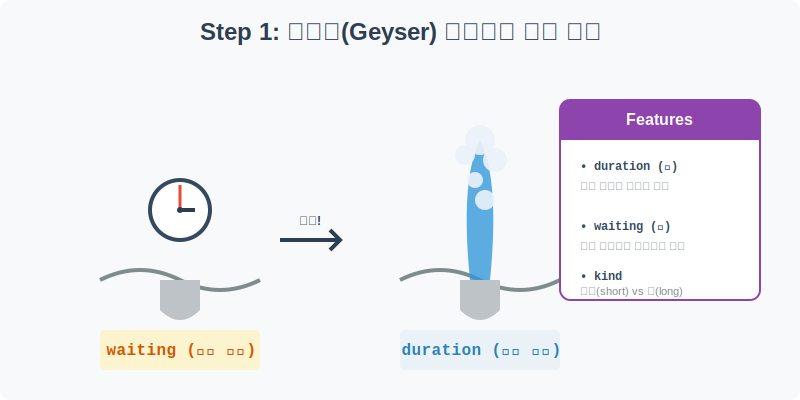
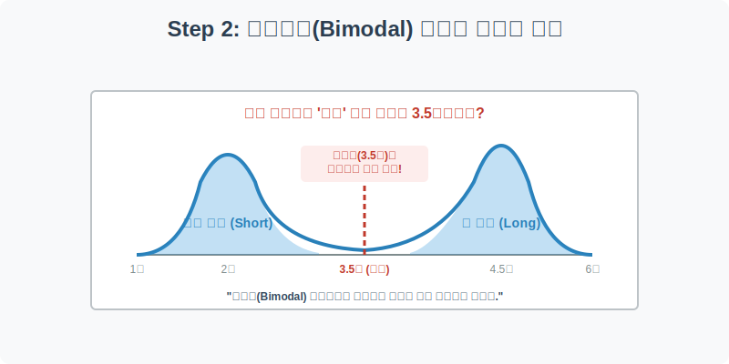
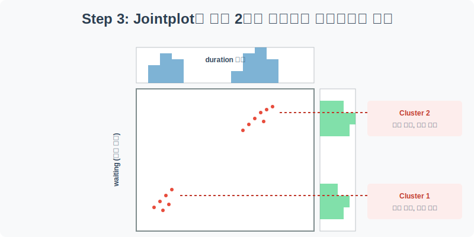
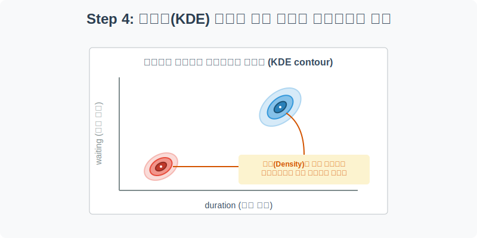

# 실전 데이터 분석 12: 간헐천 쌍봉형(Bimodal) 분포와 등고선 시각화

## 📌 강의 개요 (30분 완성)


미국 옐로스톤 국립공원에는 세계에서 가장 유명한 간헐천인 '올드 페이스풀(Old Faithful)'이 있습니다. 이 간헐천은 주기적으로 뜨거운 물기둥을 하늘로 뿜어냅니다. 

이 실습에서는 간헐천이 한 번 뿜어져 나오는 시간(`duration`)과 다음 폭발까지 기다리는 대기 시간(`waiting`) 데이터를 분석합니다. 데이터가 하나의 봉우리(정규분포)를 띠지 않고 두 개의 극단적인 봉우리(쌍봉형, Bimodal)를 띨 때 **'평균(Mean)'이라는 요약 통계량이 얼마나 쓸모없고 위험해지는지** 시각화를 통해 배웁니다.

**학습 목표:**
* **쌍봉형(Bimodal) 분포의 이해:** 히스토그램을 통해 데이터가 두 개의 그룹으로 완벽하게 쪼개지는 현상을 목격하고, 평균값의 함정을 이해합니다.
* **`jointplot` 활용:** 산점도(Scatter)와 외곽 히스토그램(Marginal)을 한 화면에 결합하여 두 변수의 관계와 각각의 밀도를 동시에 분석합니다.
* **KDE(커널 밀도 추정) 등고선:** 점이 너무 빽빽하게 겹쳐 있을 때, 이를 2차원 지형도(등고선)처럼 그려서 머신러닝 군집화(Clustering)의 아이디어를 얻어냅니다.

---

## Step 1: 올드 페이스풀 간헐천 데이터 구조 (Overview)



수십 년 전 관광객들을 위해 통계학자들이 기록해 둔 간헐천 분출 데이터를 불러옵니다.

```python
import pandas as pd
import seaborn as sns
import matplotlib.pyplot as plt

# 그래프 설정
plt.rcParams['font.family'] = 'AppleGothic'
plt.rcParams['axes.unicode_minus'] = False
sns.set_palette("Set2")

# Geyser 데이터셋 로드
df = sns.load_dataset('geyser')

# 데이터 구조 및 첫 5행 확인
print(df.info())
display(df.head())
```

### 💡 코드 딥다이브 (Code Deep Dive)
**주요 컬럼(Columns) 해석:**
* `duration`: 물기둥이 뿜어져 나오는 지속 시간 (분 단위)
* `waiting`: 다음 폭발이 일어날 때까지 기다려야 하는 대기 시간 (분 단위)
* `kind`: 분출의 종류를 나타내는 범주형 데이터 (`short`는 짧은 분출, `long`은 긴 분출)

이 데이터셋에는 결측치가 없습니다. 바로 핵심적인 데이터의 분포를 파헤쳐 보겠습니다.

---

## Step 2: 평균값의 치명적 함정 (쌍봉형 분포)



간헐천이 평균적으로 몇 분 동안 물을 뿜는지 계산해 보고, 이 평균값이 얼마나 터무니없는 숫자인지 히스토그램으로 확인해 봅니다.

```python
plt.figure(figsize=(10, 5))

# 1. 평균값 계산
mean_duration = df['duration'].mean()
print(f"간헐천 분출 시간의 평균: {mean_duration:.2f}분")

# 2. 분출 시간(duration) 히스토그램 시각화 (KDE 곡선 추가)
sns.histplot(data=df, x='duration', kde=True, color='teal', bins=30)

# 3. 평균값을 빨간색 점선으로 표시
plt.axvline(mean_duration, color='red', linestyle='--', linewidth=2, label=f'평균 ({mean_duration:.1f}분)')

plt.title('간헐천 분출 시간(Duration)의 쌍봉형(Bimodal) 분포')
plt.xlabel('분출 시간 (분)')
plt.ylabel('빈도수')
plt.legend()
plt.show()
```

### 💡 시각화 차트 읽는 법
* **평균의 배신:** 파이썬으로 계산한 분출 시간의 평균은 약 **3.5분**(빨간 점선)입니다. 하지만 히스토그램을 보면 3.5분 부근의 막대는 거의 텅 비어 있습니다! 즉, "평균적으로 3.5분 뿜는다"고 말하는 것은 최악의 분석입니다. 현실에는 3.5분 뿜는 간헐천이 사실상 존재하지 않기 때문입니다.
* **쌍봉형(Bimodal) 분포:** 데이터는 2분 부근에서 작게 한 번(`short`), 4.5분 부근에서 거대하게 한 번(`long`) 솟아오르는 쌍봉 낙타의 등 같은 모양을 하고 있습니다. 이럴 때는 데이터를 통째로 분석하지 말고 **"짧은 분출 그룹"과 "긴 분출 그룹"으로 쪼개서(Clustering)** 분석하는 것이 정석입니다.

---

## Step 3: 조인트 플롯(Jointplot)으로 두 변수 동시에 잡기 (Multivariate EDA)



그렇다면 "분출 시간이 짧으면 다음 분출까지 대기 시간도 짧을까?"라는 가설을 세워봅시다. 두 변수(X, Y)의 산점도와 각각의 1차원 히스토그램을 한 방에 그려주는 `jointplot`을 사용해 보겠습니다.

```python
# Jointplot 생성 (hue='kind'를 주어 짧은/긴 분출을 색상으로 구분)
sns.jointplot(
    data=df, x='duration', y='waiting', 
    hue='kind', palette='husl', 
    height=8, s=60, alpha=0.8
)

# 조인트 플롯은 Figure 수준의 함수이므로 suptitle 사용
plt.gcf().suptitle('분출 시간(Duration)과 대기 시간(Waiting)의 Jointplot', y=1.02)
plt.show()
```

### 💡 코드 딥다이브 & 인사이트
* **외곽 히스토그램 (Marginal Plot):** 위쪽과 오른쪽에 그려진 작은 히스토그램을 보면 `duration`뿐만 아니라 `waiting`(대기 시간) 역시 쌍봉형 분포를 가진다는 것을 알 수 있습니다.
* **산점도의 완벽한 군집(Cluster):** 
  1. **좌측 하단 (분홍색, short):** 약 2분 동안 짧게 뿜고 나면, 다음 폭발까지 약 50분 정도만 대기합니다.
  2. **우측 상단 (초록색, long):** 약 4.5분 동안 길게 뿜고 나면, 에너지를 많이 소모했기 때문에 다음 폭발까지 약 80분을 푹 쉬어야(대기해야) 합니다.
* 이처럼 자연계의 물리 법칙이 두 개의 완벽한 그룹(군집)으로 나뉜다는 점을 `jointplot` 하나로 완벽하게 증명했습니다.

---

## Step 4: 등고선(KDE) 차트로 밀도 파악하기 (Advanced EDA)



만약 데이터(점)가 5만 개쯤 된다면 산점도는 그냥 거대한 색칠된 네모 상자처럼 떡져 보일 것입니다. 이때 데이터가 어느 곳에 가장 빽빽하게 모여 있는지를 지형도(등고선)처럼 그려주는 **KDE(Kernel Density Estimation)** 차트를 그려보겠습니다.

```python
plt.figure(figsize=(10, 8))

# 산점도를 그리지 않고(점들을 숨기고), 데이터의 밀도를 등고선(contour)으로 그립니다.
# fill=True를 주면 등고선 안쪽을 색칠하여 직관성을 높입니다.
sns.kdeplot(
    data=df, x='duration', y='waiting', 
    hue='kind', fill=True, alpha=0.6, palette='husl', levels=10
)

plt.title('간헐천 군집의 2차원 밀도 추정 (KDE Contour)', fontsize=16)
plt.xlabel('분출 시간 (Duration)')
plt.ylabel('대기 시간 (Waiting)')
plt.show()
```

### 💡 시각화 차트 읽는 법
* 등고선 차트는 데이터 과학에서 머신러닝, 특히 **비지도 학습(Unsupervised Learning - K-Means Clustering 등)**을 시각화할 때 매우 자주 쓰이는 기법입니다.
* 가장 색이 진하고 좁은 안쪽 동그라미가 바로 그 그룹의 "가장 전형적인 패턴(중심, Centroid)"이 위치한 곳(산봉우리 정상)입니다.
* 이 지형도를 관광청 직원이 본다면, "방금 올드 페이스풀이 4분 30초 동안 물을 뿜었으니(Long), 다음 폭발은 약 80분 뒤일 확률이 가장 높습니다!"라고 관광객들에게 자신 있게 안내할 수 있을 것입니다.

---

## 🎯 30분 강의 마무리 및 심화 과제

쌍봉형 분포에서 함부로 '평균'을 말하는 것이 얼마나 위험한지 시각적으로 확인했습니다. 또한 `jointplot`을 통해 두 변수의 개별 분포와 결합 관계를 동시에 파악하고, 점이 너무 많을 때는 `kdeplot`의 등고선을 통해 밀집도를 파악하는 고급 기술까지 습득했습니다.

### 📝 심화 과제 (Advanced Challenge)
1. **Jointplot 종류 변경:** Step 3의 `sns.jointplot()` 파라미터 중에 `kind='hex'`를 넣어보세요. (단, `hue` 파라미터는 잠시 지워야 합니다). 산점도의 점 대신 육각형(Hexagon) 모양의 벌집 차트가 생성되며, 점이 많이 뭉친 곳일수록 육각형의 색이 진해지는 것을 볼 수 있습니다.
2. **머신러닝의 상상력:** 이 데이터셋에서 만약 `kind`(short/long 정답지) 컬럼이 없다면, 컴퓨터(AI)는 X(duration)와 Y(waiting) 좌표 점들만 보고 스스로 두 개의 그룹(좌측 하단, 우측 상단)으로 선을 그어 나눌 수 있을까요? 이것이 바로 K-Means 군집화 알고리즘의 핵심 원리입니다.
