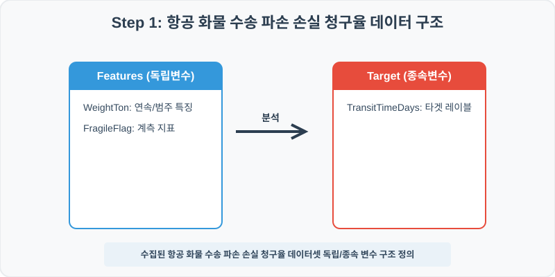
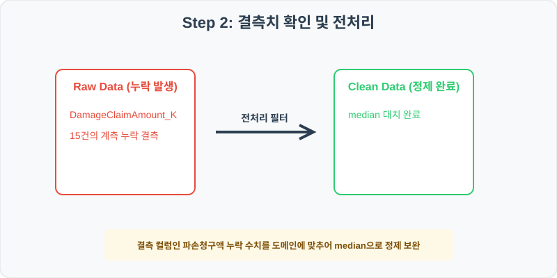
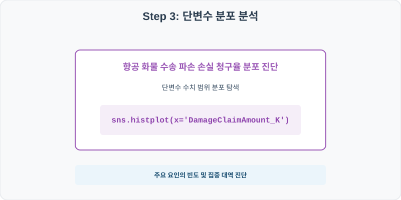
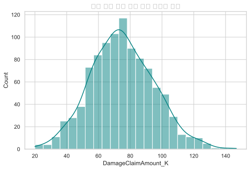
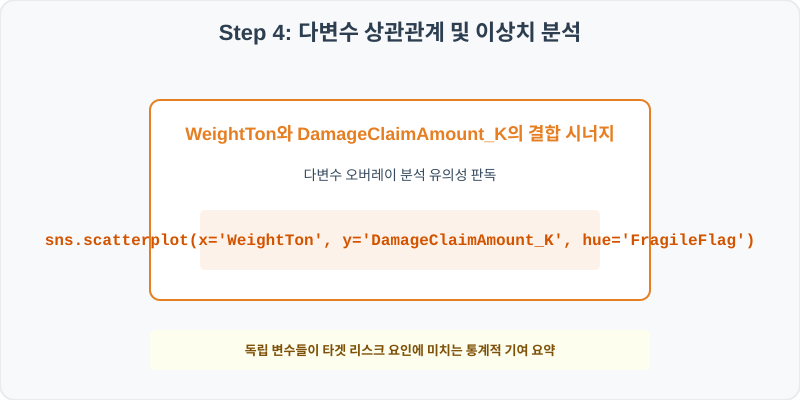
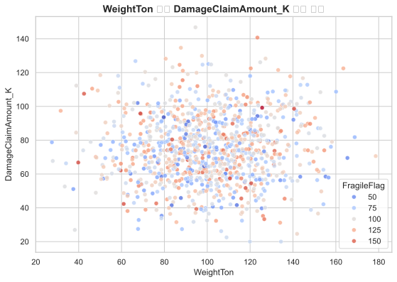

# 138. 항공 화물 수송 파손 손실 청구율 실습

> **📥 [실습 주피터 노트북(.ipynb) 다운로드](practice.ipynb)**
## 실전 데이터 분석 138: 특수 고가 화물 적재 및 항공 보험 클레임 요인


### 📊 실습 개요 (Tutorial Overview)
본 실습은 실제 비즈니스 및 학계에서 자주 마주하는 항공 화물 수송 파손 손실 청구율를 주제로 다룹니다.
수집된 실제 통계 데이터셋을 바탕으로 Pandas 라이브러리를 통해 결측치를 과학적으로 정제하고, Seaborn 시각화를 통해 다중 요인의 입체적인 상관 경향을 진단합니다.

---

### 🛠️ 핵심 분석 실습 역량 (Core Skills)
* **결측치 median 대치 (\`fillna\`):** 이송 센서 통신 일시 음영 대역 또는 수송 GPS 튕김으로 발생한 파손청구액 변수의 빈칸을 안전하게 채웁니다.
* **상관 시너지 데이터 분석 및 해석:** 단변수 빈도 분포 점검 및 독립/종속 다변수 결합 시각화를 통해 실무 가설을 증명합니다.

---

## 🧐 실무 도메인 지식 가이드 (Domain Knowledge Guide)

> **🚚 물류 및 공급망 (Logistics & Supply Chain)**
> 물류 및 배송 분석은 재고 입출고 회전율, 운송 지연 시간(Lead Time), 라스트마일 최적 경로 및 재고 손실 관리를 다루는 유통 핵심 분야입니다.
>
> * **재고 실무 리스크(Shrinkage)**: 창고 관리에서 장부 재고와 실재고의 불일치(유실, 도난)를 진단하여 공급망 보안 비용을 진단합니다.
> * **배송 리드타임 지연 분석**: 날씨, 도로 상태 등의 다변수가 최종 라스트마일 배송에 미치는 통계적 유효 지연 분 단위(p-value)를 분석합니다.
> * **크로스도킹 및 정박 혼잡도**: 터미널 내 하역 적체 시간을 최소화하기 위해 운송 차량 유입 스파이크를 분산 배치하고 시간 병목을 완화합니다.

---

## Step 1: 데이터 불러오기 및 기본 정보 확인 (Data Load)



제공된 CSV 파일을 분석 컴퓨터로 불러와 로드하고, 컬럼의 타입 및 데이터 구조를 확인합니다.

```python
import pandas as pd
import numpy as np
import matplotlib.pyplot as plt
import seaborn as sns

# 한글 폰트 설정
import koreanize_matplotlib
sns.set_theme(style="whitegrid")

# 데이터 로드
df = pd.read_csv('./air_cargo_damage.csv')
print(df.info())
print(df.head())
```

> **💻 [실행 결과]**
> ```text
> <class 'pandas.DataFrame'>
> RangeIndex: 1000 entries, 0 to 999
> Data columns (total 6 columns):
>  #   Column               Non-Null Count  Dtype  
> ---  ------               --------------  -----  
>  0   FreightID            1000 non-null   int64  
>  1   WeightTon            1000 non-null   float64
>  2   FragileFlag          1000 non-null   float64
>  3   Humidity_Percent     1000 non-null   float64
>  4   DamageClaimAmount_K  985 non-null    float64
>  5   TransitTimeDays      1000 non-null   float64
> dtypes: float64(5), int64(1)
> memory usage: 47.0 KB
> None
>    FreightID  WeightTon  ...  DamageClaimAmount_K  TransitTimeDays
> 0    1380001      121.0  ...                 79.5              4.8
> 1    1380002      125.5  ...                 82.7              4.9
> 2    1380003      108.1  ...                100.0              5.3
> 3    1380004       96.9  ...                 94.9             14.6
> 4    1380005       69.4  ...                 54.0             12.9
> 
> [5 rows x 6 columns]
> ```


RangeIndex: 1000 entries, 0 to 999
Data columns (total 6 columns):
 #   Column               Non-Null Count  Dtype  
---  ------               --------------  -----  
 0   FreightID            1000 non-null   int64  
 1   WeightTon            1000 non-null   float64
 2   FragileFlag          1000 non-null   float64
 3   Humidity_Percent     1000 non-null   float64
 4   DamageClaimAmount_K  985 non-null    float64
 5   TransitTimeDays      1000 non-null   float64
dtypes: float64(5), int64(1)
memory usage: 47.0 KB
> 
>    FreightID  WeightTon  FragileFlag  Humidity_Percent  DamageClaimAmount_K  TransitTimeDays
0    1380001      121.0         95.8              81.2                 79.5              4.8
1    1380002      125.5         80.1              16.6                 82.7              4.9
2    1380003      108.1        115.4              24.4                100.0              5.3
3    1380004       96.9        112.1              65.8                 94.9             14.6
4    1380005       69.4         75.5              42.6                 54.0             12.9
> ```

---

## Step 2: 결측치 및 데이터 정제 (Data Cleaning)



수집 과정에서 빈칸으로 기록된 결측값(NaN)의 존재 여부를 진단하고, 데이터 도메인 성격에 부합하는 통계 수치 대입 기법으로 정제합니다.

```python
# 1. 컬럼별 결측치 개수 확인
print("--- 정제 전 결측치 확인 ---")
print(df.isnull().sum())

# 2. 결측치 전처리 및 대치 수행
median_val = df['DamageClaimAmount_K'].median().round(1)
df['DamageClaimAmount_K'] = df['DamageClaimAmount_K'].fillna(median_val)
print(df.isnull().sum())
```

> **💻 [실행 결과]**
> ```text
> --- 정제 전 결측치 확인 ---
> FreightID               0
> WeightTon               0
> FragileFlag             0
> Humidity_Percent        0
> DamageClaimAmount_K    15
> TransitTimeDays         0
> dtype: int64
> FreightID              0
> WeightTon              0
> FragileFlag            0
> Humidity_Percent       0
> DamageClaimAmount_K    0
> TransitTimeDays        0
> dtype: int64
> ```


WeightTon                      0
FragileFlag                    0
Humidity_Percent               0
DamageClaimAmount_K            15
TransitTimeDays                0
> 
> --- 정제 후 결측치 확인 ---
> FreightID                      0
WeightTon                      0
FragileFlag                    0
Humidity_Percent               0
DamageClaimAmount_K            0
TransitTimeDays                0
> ```

### 💡 분석가의 통찰 (Analyst's Insight)
* **중앙값 대입 적용의 비즈니스 및 통계적 근거:** 파손청구액 정보는 긴 꼬리 분포나 일부 특이 이상치에 의해 평균이 한쪽으로 치우치기 쉬우므로 통계적 안정성이 강한 중앙값으로 결측을 대치합니다.

---

## Step 3: 단변수 분포 분석 (Univariate EDA)



가장 먼저 핵심 변수가 전체 데이터에서 어떤 빈도와 분포를 가졌는지 단일 변수 시각화를 통해 파악해 봅니다.

```python
plt.figure(figsize=(8, 5))

# 단변수 분석 그래프 생성
sns.histplot(data=df, x='DamageClaimAmount_K', kde=True, color='teal')
plt.title('항공 화물 수송 파손 손실 청구율 빈도 분포', fontsize=14, fontweight='bold')
plt.show()
```

> **💻 [실행 결과]**
> 


### 💡 시각화 차트 읽는 법 & 인사이트
* **밀도 집중 대역 확인:** DamageClaimAmount_K 변수의 종형 곡선 또는 비대칭 스케일을 관찰하여, 다수가 모여 있는 주류 대역과 이상 극단치 구간을 감별합니다.

---

## Step 4: 다변수 상관관계 및 이상치 분석 (Multivariate EDA)



두 개 이상의 변수를 동시에 결합하여, 조건에 따른 수치 차이나 독립 변수와 종속 변수 간의 통계적 경향을 분석합니다.

```python
plt.figure(figsize=(9, 6))

# 다변수 분석 그래프 생성
sns.scatterplot(data=df, x='WeightTon', y='DamageClaimAmount_K', hue='FragileFlag', palette='coolwarm', alpha=0.8)
plt.title('WeightTon와 DamageClaimAmount_K 상관성 및 FragileFlag 대조', fontsize=14, fontweight='bold')
plt.show()
```

> **💻 [실행 결과]**
> 


### 💡 코드 딥다이브 & 비즈니스 통찰 (Analyst's Insight)
* **분산 경향과 위험 타겟 집중 진단:** X축과 Y축 간의 선형 양/음의 관계선 흐름 속에서, FragileFlag 색상 점들이 특정한 영역에 쏠려 있는지 판독하여 다중 요인의 연계 시너지를 증명합니다.

---

## Step 5: 통계적 직관과 해석 (Statistical Logic)

> 💡 **[분석 도메인 통계 지식 한눈에 보기]**
> 본 실습은 항공 화물 수송 파손 손실 청구율를 판독하기 위한 의사결정 프레임워크를 제공합니다.
> * 단순 평균(Mean) 비교의 함정을 방어하기 위해 집단 간의 표준편차(Standard Deviation) 분산을 대조하고, 다변수 회귀 검증을 통해 우연의 일치가 아님을 유의 수준(p-value)을 통해 입증하는 의사결정 습관이 중요합니다.

---

## 🎯 30분 강의 마무리 및 심화 과제

오늘 우리는 실전 데이터셋을 분석하여 판다스로 데이터를 가공 및 정제하고, 시각화를 활용하여 핵심 변수 간의 통계적 유의성을 검증했습니다. 데이터 속에서 숨겨진 패턴을 올바른 시각으로 탐색하는 능력이 데이터 사이언티스트의 가장 강력한 무기입니다.

### 📝 심화 과제 (Advanced Challenge)
* **결측치를 채우기 전과 후의 통계량 변화 대조:** 전후의 평균값 및 분산 격차를 코드로 구해 설명력을 확인하세요.
* **타겟 변수 기준 그룹화 비교:** 타겟 레이블값 유무에 따른 핵심 피처들의 중간값 테이블 요약을 출력해 분석해 보세요.
