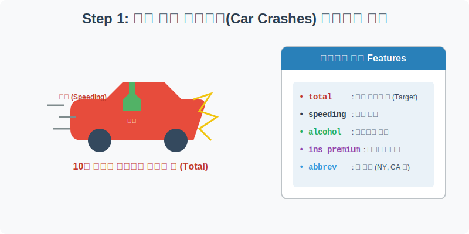
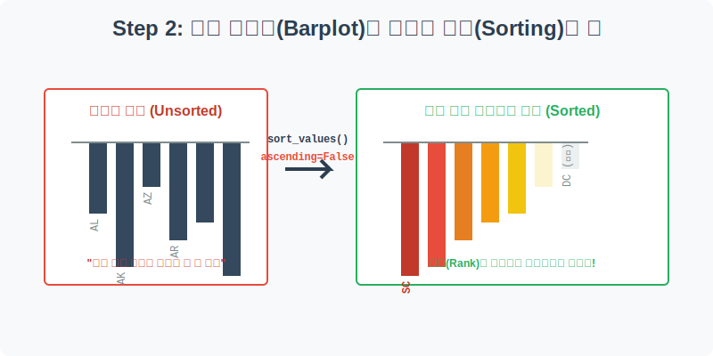
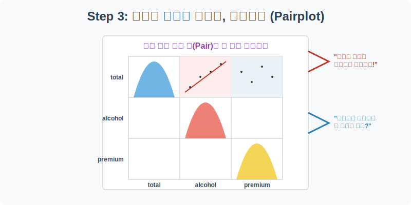
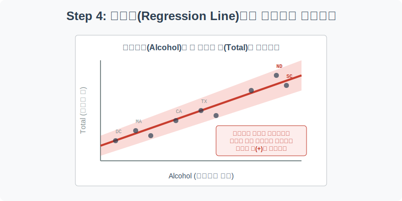

# 실전 데이터 분석 13: 교통사고와 음주운전의 상관관계 및 페어플롯

## 📌 강의 개요 (30분 완성)


미국 50개 주(States)와 워싱턴 D.C.에서 발생한 교통사고 통계 데이터를 분석합니다. 주마다 과속 비율, 음주운전 비율, 그리고 자동차 보험료가 다릅니다. 이 요소들이 전체 교통사고 사망자 수(Total)에 어떤 영향을 미치는지 데이터로 증명해 봅니다.

**학습 목표:**
* **데이터 정렬의 미학 (`sort_values`):** 막대 그래프를 그릴 때, 데이터를 단순히 알파벳 순서가 아닌 값의 크기(오름차순/내림차순)로 정렬하여 직관적인 순위표를 만드는 방법을 배웁니다.
* **다변수 탐색의 끝판왕 (`pairplot`):** 여러 개의 숫자형 변수들이 서로 어떻게 얽혀 있는지, 모든 조합의 산점도를 단 한 줄의 코드로 스캔하는 강력한 페어플롯을 익힙니다.
* **인과관계 추론 (`lmplot`):** 음주운전 비율과 총 사망자 수가 얼마나 정직하게 궤를 같이 하는지 회귀선(Regression Line)을 그어 인과관계를 입증합니다.

---

## Step 1: 교통사고 제원 데이터 구조 (Overview)



가장 먼저 각 주의 교통사고 지표들이 어떻게 기록되어 있는지 확인합니다.

```python
import pandas as pd
import seaborn as sns
import matplotlib.pyplot as plt

# 그래프 설정
plt.rcParams['font.family'] = 'AppleGothic'
plt.rcParams['axes.unicode_minus'] = False
sns.set_palette("Set2")

# Car Crashes 데이터셋 로드
df = sns.load_dataset('car_crashes')

# 데이터 구조 및 첫 5행 확인
print(df.info())
display(df.head())
```

### 💡 코드 딥다이브 (Code Deep Dive)
**주요 컬럼(Columns) 해석:**
* **Target:**
  * `total`: 10억 마일당 전체 교통사고 사망자 수
* **Features:**
  * `speeding`: 과속에 의한 사고 비율
  * `alcohol`: 음주운전에 의한 사고 비율
  * `not_distracted`: 운전 중 딴짓(스마트폰 등)을 하지 않은 비율
  * `no_previous`: 과거 사고 이력이 없는(첫 사고인) 운전자 비율
  * `ins_premium`: 해당 주의 자동차 평균 보험료 (달러)
  * `ins_losses`: 보험사가 운전자에게 지급한 손해 배상금
  * `abbrev`: 주의 이름 약자 (NY=뉴욕, CA=캘리포니아, DC=워싱턴 D.C. 등)

---

## Step 2: 막대 그래프(Barplot)와 데이터 정렬의 힘 (Preprocess)



가장 직관적인 질문을 던져봅시다. "미국에서 교통사고 사망자가 가장 많은 주(최악)와 가장 적은 주(최상)는 어디일까?" 
막대 그래프를 그리기 전에 **반드시** 거쳐야 하는 데이터 정렬 작업을 해보겠습니다.

```python
plt.figure(figsize=(15, 6))

# 1. total(사망자 수)을 기준으로 내림차순 정렬 (높은 곳 -> 낮은 곳)
# 정렬을 하지 않으면 주 이름 알파벳 순(A~Z)으로 그려져서 순위를 알 수 없습니다.
sorted_df = df.sort_values(by='total', ascending=False)

# 2. 정렬된 데이터를 막대 그래프로 시각화
sns.barplot(data=sorted_df, x='abbrev', y='total', palette='Reds_r')

plt.title('미국 주별(State) 10억 마일당 교통사고 사망자 수 순위')
plt.xlabel('State (주 이름 약자)')
plt.ylabel('총 사망자 수 (Total)')
plt.xticks(fontsize=8) # 글씨가 겹치지 않게 폰트 크기 조절
plt.show()
```

### 💡 분석가의 통찰 (Analyst's Insight)
* `sort_values(ascending=False)`라는 단 한 줄의 코드가 차트의 품질을 180도 바꿉니다.
* **최악의 주 (왼쪽):** 사우스캐롤라이나(`SC`), 노스다코타(`ND`) 등이 사망률 1, 2위를 다투고 있습니다.
* **최고의 주 (오른쪽):** 워싱턴 D.C.(`DC`), 매사추세츠(`MA`) 등은 사망률이 매우 낮습니다. 주로 대도시 인프라가 잘 갖춰져 속도를 낼 수 없거나 교통 시스템이 엄격한 곳들입니다.

---

## Step 3: 다변수 탐색의 끝판왕, 페어플롯 (Multivariate EDA 1)



사망자 수(`total`)에 가장 큰 영향을 미치는 요인은 무엇일까요? 과속? 음주? 아니면 비싼 보험료? 이 모든 변수들의 관계를 일일이 그려보기엔 시간이 부족합니다. 이때 사용하는 것이 바로 `pairplot`입니다.

```python
# 분석할 핵심 숫자형 변수들만 추려냅니다.
columns_to_plot = ['total', 'speeding', 'alcohol', 'ins_premium']
sub_df = df[columns_to_plot]

# 페어플롯(Pairplot) 그리기
# 대각선에는 히스토그램이, 나머지 칸에는 변수 짝(Pair)별 산점도가 그려집니다.
sns.pairplot(sub_df, height=2.5, plot_kws={'alpha': 0.7, 'color': 'darkcyan'})

plt.suptitle('주요 변수 간의 다중 상관관계 (Pairplot)', y=1.02, fontsize=16)
plt.show()
```

### 💡 시각화 차트 읽는 법
페어플롯은 데이터 분석 초기에 **"어디를 파헤치면 금맥이 나올까?"**를 빠르게 스캔하는 레이더 역할을 합니다.
1. **`total`과 `alcohol`이 만나는 칸:** 점들이 왼쪽 아래에서 오른쪽 위로 아주 가느다랗고 뚜렷하게 우상향하는 모습을 보입니다. (강한 양의 상관관계)
2. **`total`과 `speeding`이 만나는 칸:** 역시 우상향하긴 하지만, 음주운전보다는 점들이 더 넓게 흩어져 있습니다. (중간 양의 상관관계)
3. **`total`과 `ins_premium`(보험료)이 만나는 칸:** 점들이 규칙 없이 동그랗게 구름처럼 뭉쳐 있습니다. (아무 관계 없음)

---

## Step 4: 회귀선(Regression)으로 인과관계 입증하기 (Multivariate EDA 2)



Step 3에서 발견한 가장 뚜렷한 단서(total과 alcohol)를 `lmplot`으로 확대하여, 통계적 확신을 가져봅시다.

```python
# 음주운전(X)과 총 사망자 수(Y)의 산점도와 회귀선을 그립니다.
sns.lmplot(data=df, x='alcohol', y='total', height=6, aspect=1.5, 
           line_kws={'color': 'red', 'linewidth': 3}, 
           scatter_kws={'color': 'black', 's': 50, 'alpha': 0.6})

plt.title('음주운전(Alcohol)과 교통사고 사망자 수(Total)의 상관관계', fontsize=16)
plt.xlabel('음주운전 연루 사고 비율')
plt.ylabel('총 사망자 수 (Total)')
plt.grid(True, linestyle='--', alpha=0.5)

plt.show()
```

### 💡 코드 딥다이브 & 인사이트
* 붉은색 회귀선(Regression Line)을 감싸고 있는 투명한 그림자(신뢰구간)가 매우 얇습니다. 이는 X(음주운전) 값이 주어졌을 때 Y(사망자) 값을 오차 없이 아주 잘 예측할 수 있다는 뜻입니다.
* 데이터가 증명하는 진실은 냉혹합니다. **"주(State)의 음주운전 비율이 높아지면, 예외 없이 그 주의 교통사고 사망자 수 역시 폭증한다"**는 것을 보여줍니다. 반면 과속(`speeding`)이나 보험료(`ins_premium`)는 이만큼의 강력한 설명력을 가지지 못했습니다.

> 💡 **[수포자를 위한 통계 돋보기: 피어슨 상관계수 (Correlation, $r$)]**  
> 페어플롯과 회귀선에서 우리가 눈으로 확인한 "비례하는 정도"를 숫자로 정확하게 표현한 것이 바로 **상관계수($r$)**입니다.
> 
> $$ r = \frac{\sum (x - \mu_x)(y - \mu_y)}{\sqrt{\sum (x - \mu_x)^2 \sum (y - \mu_y)^2}} $$
> - 공식이 무시무시해 보이지만, 핵심은 **분자(공분산)**에 있습니다. $x$(음주운전)가 평균보다 클 때 $y$(사망자)도 평균보다 크면 양수(+)가 곱해져서 전체 값이 커집니다. 반대로 움직이면 음수(-)가 됩니다.
> - **분모(표준편차의 곱)**는 왜 나눌까요? $x$와 $y$가 원래 가진 '덩치(스케일)'가 다르기 때문에, 그 덩치로 나누어 주어 **무조건 -1에서 1 사이의 값**으로 예쁘게 찌그러뜨리기(표준화) 위함입니다.
> - **$r = 1$**: 완벽한 양의 비례 (한 치의 오차도 없는 직선)
> - **$r = 0$**: 아무 관계 없음 (둥근 구름 모양)
> - **$r = -1$**: 완벽한 반비례 (완벽히 엇갈림)

---

## 🎯 30분 강의 마무리 및 심화 과제

카테고리(주 이름 등)별 데이터를 막대 그래프로 그릴 때는 **반드시 데이터를 크기 순으로 정렬(`sort_values`)**해야 시각화의 가치가 생깁니다. 또한, 변수가 너무 많을 때는 `pairplot`으로 전체적인 그림을 스캔하고, 가장 유의미한 변수 짝을 찾아 `lmplot`으로 정밀 타격하는 워크플로우를 실무에서 적극 활용하시기 바랍니다.

### 📝 심화 과제 (Advanced Challenge)
1. **상관계수 행렬 그리기:** `sub_df.corr()`를 실행하고, 이를 `sns.heatmap`으로 칠해보세요. 시각적으로 보았던 `total`과 `alcohol`의 강한 상관관계가 숫자(약 0.85 이상)로 얼마나 높게 찍히는지 눈으로 직접 확인해 보세요.
2. **과속과 음주의 관계:** 페어플롯에서 `speeding`과 `alcohol`이 만나는 칸을 다시 한번 유심히 보세요. 과속을 많이 하는 주일수록 음주운전도 많이 할까요? 만약 그렇다면 왜 그런 현상이 벌어질지 인문학적인 상상력을 동원해 보세요!
