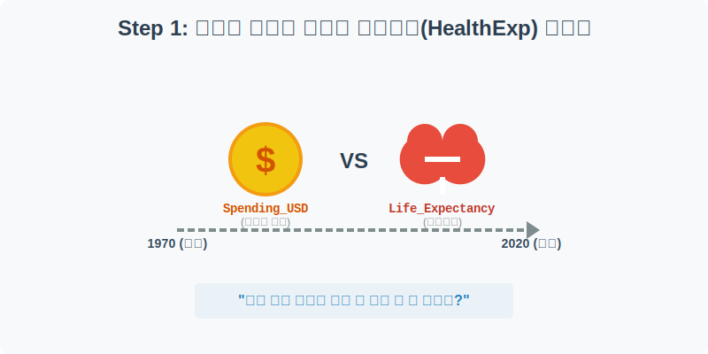
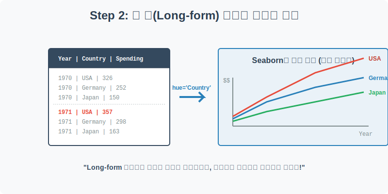
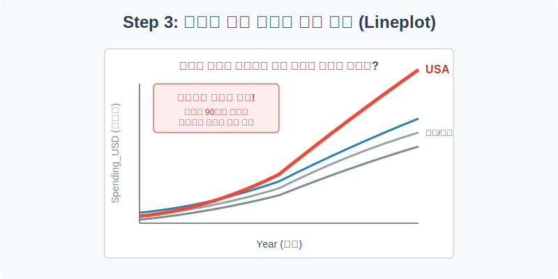
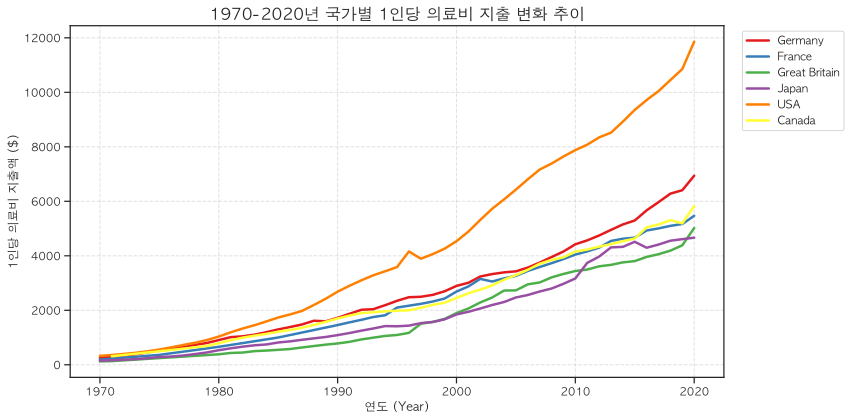
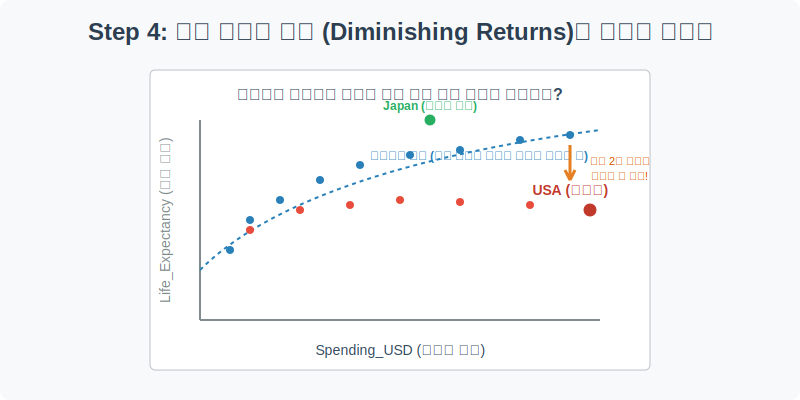
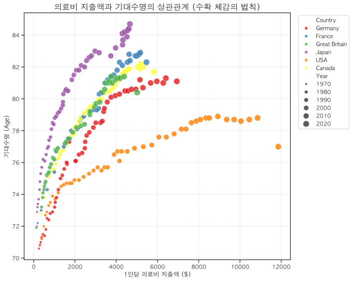

# 실전 데이터 분석 14: 의료비와 기대수명의 경제학 (수확 체감의 법칙)

## 📌 강의 개요 (30분 완성)


"국가가 국민의 건강을 위해 돈(의료비)을 많이 쓰면 쓸수록, 국민들은 더 오래 살까?" 이 근원적인 질문에 답하기 위해 1970년부터 2020년까지 주요 선진국들의 의료비 지출(Spending)과 기대수명(Life Expectancy)의 변화 추이를 추적합니다.

**학습 목표:**
* **롱 폼(Long-form) 데이터의 이해:** 사람이 읽기 좋은 엑셀 스타일의 가로형 표(Wide-form)와 컴퓨터가 시각화를 그리기 좋은 세로형 표(Long-form)의 차이를 이해합니다.
* **시계열 다중 선 그래프 (`lineplot`):** `hue` 파라미터를 활용해 국가별 의료비 지출이 50년간 어떻게 변해왔는지 궤적을 비교합니다.
* **수확 체감의 법칙과 데이터 스토리텔링 (`scatterplot`):** 돈을 쏟아부었음에도 기대수명이 늘어나지 않는 미국의 기형적인 데이터 패턴을 발견하고, 이를 시각적으로 고발(Highlight)하는 스토리텔링 기법을 배웁니다.

---

## Step 1: HealthExp 데이터셋 구조 파악 (Overview)



1970년부터 수십 년간 누적된 국가별 의료비 및 수명 데이터를 로드해 봅니다.

```python
import pandas as pd
import seaborn as sns
import matplotlib.pyplot as plt

# 그래프 설정
plt.rcParams['font.family'] = 'AppleGothic'
plt.rcParams['axes.unicode_minus'] = False
sns.set_palette("Set1")

# HealthExp 데이터셋 로드
df = sns.load_dataset('healthexp')

# 데이터 구조 및 첫 5행 확인
print(df.info())
display(df.head())
```

> **💻 [실행 결과]**
> ```text
> <class 'pandas.DataFrame'>
> RangeIndex: 274 entries, 0 to 273
> Data columns (total 4 columns):
>  #   Column           Non-Null Count  Dtype  
> ---  ------           --------------  -----  
>  0   Year             274 non-null    int64  
>  1   Country          274 non-null    str    
>  2   Spending_USD     274 non-null    float64
>  3   Life_Expectancy  274 non-null    float64
> dtypes: float64(2), int64(1), str(1)
> memory usage: 8.7 KB
> None
>    Year        Country  Spending_USD  Life_Expectancy
> 0  1970        Germany       252.311             70.6
> 1  1970         France       192.143             72.2
> 2  1970  Great Britain       123.993             71.9
> 3  1970          Japan       150.437             72.0
> 4  1970            USA       326.961             70.9
> ```


### 💡 코드 딥다이브 (Code Deep Dive)
**주요 컬럼(Columns) 해석:**
* `Year`: 측정 연도 (1970 ~ 2020)
* `Country`: 국가 이름 (USA, Germany, Japan, Great Britain, France, Canada)
* `Spending_USD`: 1인당 연간 의료비 지출액 (달러, 인플레이션 조정됨)
* `Life_Expectancy`: 태어난 아이가 생존할 것으로 기대되는 수명 (나이)

---

## Step 2: 롱 폼(Long-form) 데이터 구조의 이해 (Preprocess)



`df.head()`를 보면 "1970년 미국, 1970년 독일... 1971년 미국, 1971년 독일..." 이런 식으로 연도와 국가가 아래로 길게 늘어선 것을 볼 수 있습니다.

### 💡 분석가의 통찰 (Analyst's Insight)
* **Wide-form (엑셀 스타일):** 인간이 눈으로 읽기에는 칼럼에 '미국', '독일', '일본'이 있고, 로우에 '1970', '1971'이 있는 거대한 2차원 표가 훨씬 편합니다.
* **Long-form (데이터베이스 스타일):** 하지만 Seaborn 같은 시각화 라이브러리는 현재 우리가 가진 데이터처럼 `Year`와 `Country`가 한 줄 한 줄(Row) 기록된 형태를 가장 좋아합니다. 그래야 `sns.lineplot(x='Year', y='Spending_USD', hue='Country')` 단 한 줄의 명령어로 컴퓨터가 알아서 국가별 그룹핑을 하고 색상을 칠해줄 수 있기 때문입니다.

이 데이터는 이미 완벽한 Long-form이므로 별도의 전처리 없이 바로 시각화로 넘어가겠습니다.

---

## Step 3: 시간에 따른 의료비 지출 폭증 (Univariate EDA)



지난 50년간 각 국가의 의료비 지출(`Spending_USD`)이 어떻게 변해왔는지 꺾은선 그래프로 확인해 보겠습니다.

```python
plt.figure(figsize=(12, 6))

# 연도별 의료비 지출을 국가별(hue)로 나누어 시각화
sns.lineplot(data=df, x='Year', y='Spending_USD', hue='Country', linewidth=2.5)

plt.title('1970-2020년 국가별 1인당 의료비 지출 변화 추이', fontsize=16)
plt.xlabel('연도 (Year)')
plt.ylabel('1인당 의료비 지출액 ($)')
plt.grid(True, linestyle='--', alpha=0.6)

# 범례 위치 조정
plt.legend(bbox_to_anchor=(1.02, 1), loc='upper left')
plt.tight_layout()
plt.show()
```

> **💻 [실행 결과]**
> 


### 💡 시각화 차트 읽는 법
* 1970년대에는 모든 선진국들이 사이좋게 바닥(약 $500 미만)에 모여 있었습니다.
* 하지만 1990년대를 기점으로 빨간색 선(**USA, 미국**)이 다른 나라들과의 궤도를 이탈하여 미친 듯한 기울기로 수직 상승(Exponential growth)하기 시작합니다. 
* 2020년 기준, 미국은 다른 유럽/아시아 선진국들에 비해 **무려 2배 이상(약 $11,000)**의 의료비를 지출하는 압도적인 1위 국가가 되었습니다. 과연 미국인들은 그 돈을 쓴 만큼 가장 오래 살고 있을까요?

---

## Step 4: 수확 체감의 법칙과 미국의 비효율 (Multivariate EDA)



이제 X축을 의료비 지출로, Y축을 기대수명으로 놓고 점을 찍어(산점도) 그 실체를 확인해 보겠습니다.

```python
plt.figure(figsize=(10, 8))

# 의료비 지출(X)과 기대수명(Y)의 상관관계 산점도
# 연도(Year)의 흐름을 점의 크기(size)로 표현하여 시간의 흐름을 3차원으로 담습니다.
sns.scatterplot(
    data=df, x='Spending_USD', y='Life_Expectancy', 
    hue='Country', size='Year', sizes=(20, 150), alpha=0.8
)

plt.title('의료비 지출액과 기대수명의 상관관계 (수확 체감의 법칙)', fontsize=16)
plt.xlabel('1인당 의료비 지출액 ($)')
plt.ylabel('기대수명 (Age)')
plt.grid(True, linestyle='--', alpha=0.5)

plt.legend(bbox_to_anchor=(1.02, 1), loc='upper left')
plt.tight_layout()
plt.show()
```

> **💻 [실행 결과]**
> 


### 💡 코드 딥다이브 & 인사이트 (매우 중요!)
* **수확 체감의 법칙 (Law of Diminishing Returns):** 다른 나라(독일, 일본, 영국 등)의 점들을 보면 초반에는 돈을 쓸수록 수명이 가파르게 늘어나지만, 어느 순간(약 $4,000 부근)부터는 돈을 아무리 써도 수명이 크게 늘지 않고 완만해지는 로그 함수(Logarithmic) 형태를 그립니다. 즉, 현대 의학의 한계에 부딪히는 것입니다.
* **최고의 가성비 (일본):** 녹색 점(Japan)은 다른 나라들과 비슷한 돈을 쓰면서도 가장 높은 Y축(약 84세)에 도달해 있습니다.
* **최악의 비효율 (미국):** 빨간 점(USA)을 보세요. 혼자 우측으로 아득하게 멀리(X축 $11,000 이상) 뻗어 나가며 엄청난 돈을 쏟아붓고 있습니다. 하지만 Y축(기대수명)은 **고작 77~78세에 머물러 심지어 곤두박질치기(코로나 시기 등)까지** 합니다. 
* **결론:** 데이터 분석은 단순히 숫자를 보여주는 것이 아닙니다. 이 한 장의 차트는 "미국의 민영화된 의료 시스템이 엄청난 돈을 낭비하고 있으나 국민 건강 증진에는 실패했다"는 강력한 경제적/사회적 고발장이 됩니다.

---

## 🎯 30분 강의 마무리 및 심화 과제

`lineplot`을 통해 시간의 흐름을 추적하고, `scatterplot`의 2차원 공간에서 점의 크기(`size`)를 조절하여 시간이라는 3번째 차원을 추가하는 기법을 배웠습니다. 무엇보다도 그래프 속에서 군집에서 튕겨져 나간 이상치(미국)를 발견하고 비즈니스적 통찰을 이끌어내는 과정을 경험했습니다.

### 📝 심화 과제 (Advanced Challenge)
1. **미국 데이터만 분리하기:** 데이터프레임 필터링(`df[df['Country'] == 'USA']`)을 통해 미국 데이터만 따로 빼낸 뒤, 미국의 연도별 기대수명 `lineplot`을 그려보세요. 최근 연도에 기대수명이 꺾이는 무서운 현상을 관찰할 수 있습니다.
2. **FacetGrid 활용:** 6개 국가의 선이 한곳에 뭉쳐 있어서 보기 어렵다면, 이전 실습에서 배운 `sns.relplot(kind='line', col='Country', col_wrap=3)`을 활용하여 6개의 개별 차트로 쪼개서(패싯) 깔끔하게 시각화해 보세요.
