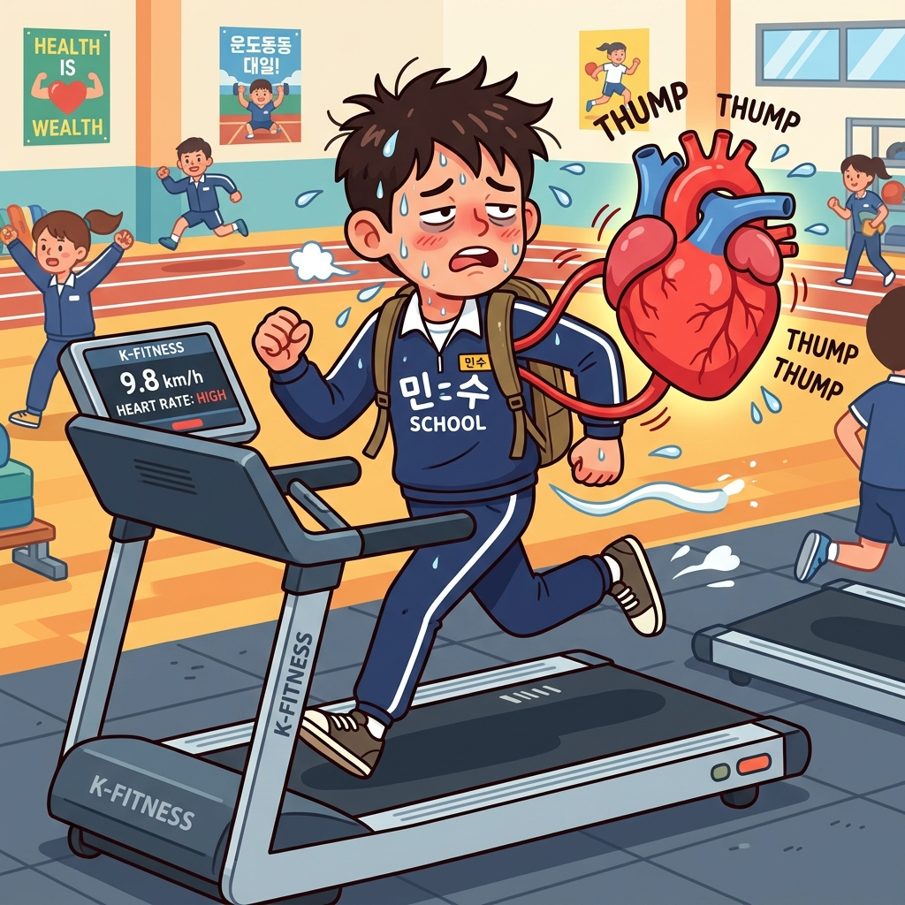
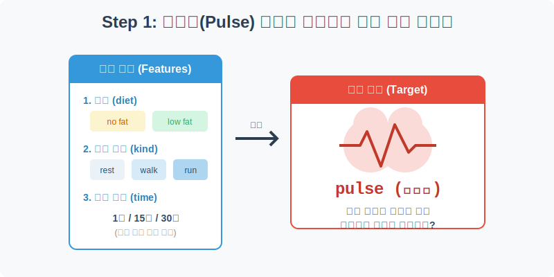
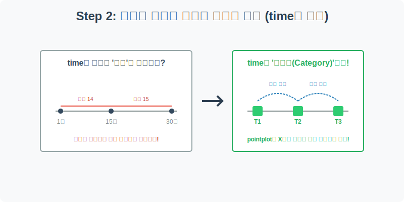
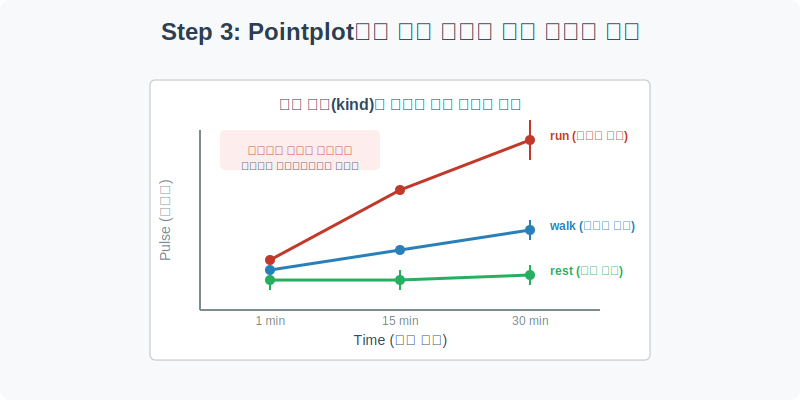
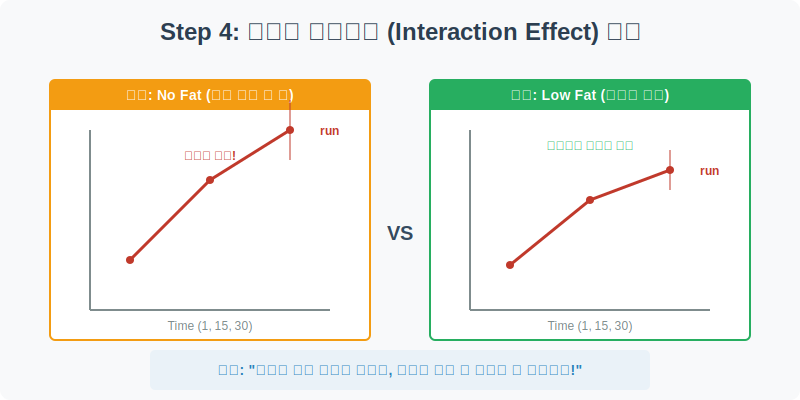

# 실전 데이터 분석 15: 범주형 시계열 데이터와 상호작용 효과 (Pointplot)

## 📌 강의 개요 (30분 완성)


우리가 운동을 하면 심장 박동(Pulse)이 빨라집니다. 그렇다면 걷기(Walk)와 달리기(Run)의 심박수 상승폭은 얼마나 다를까요? 혹시 운동 전에 먹은 식단(지방 섭취 여부)이 심장에 미치는 무리(부하)를 다르게 만들지는 않을까요?

이 실습에서는 30명의 피험자를 대상으로 3가지 운동과 2가지 식단을 적용하여 시간에 따른 심박수를 측정한 의학/생리학 데이터를 분석합니다.

**학습 목표:**
* **연속형 변수와 범주형 변수의 차이:** 시간(`time`)을 1분, 15분, 30분이라는 단순한 숫자가 아닌 '측정 시점(Category)'으로 다뤄야 하는 이유를 배웁니다.
* **추이와 오차를 동시에 잡는 `pointplot`:** 시간에 따른 변화율(기울기)과 통계적 오차(Error bar)를 막대 그래프보다 훨씬 직관적으로 보여주는 포인트 플롯을 활용합니다.
* **상호작용 효과 (Interaction Effect):** 식단(Diet)과 운동 종류(Kind)라는 두 가지 독립 변수가 만났을 때, 타겟(Pulse)에 미치는 놀라운 시너지(또는 상쇄) 효과를 분석합니다.

---

## Step 1: 운동 실험 데이터 구조 (Overview)



실험 참가자들이 어떤 조건(Feature)에서 어떤 결과(Target)를 측정당했는지 확인해 봅시다.

```python
import pandas as pd
import seaborn as sns
import matplotlib.pyplot as plt

# 그래프 설정
plt.rcParams['font.family'] = 'AppleGothic'
plt.rcParams['axes.unicode_minus'] = False
sns.set_palette("Set1")

# Exercise 데이터셋 로드
df = sns.load_dataset('exercise')

# 데이터 구조 및 첫 5행 확인
print(df.info())
display(df.head())
```

### 💡 코드 딥다이브 (Code Deep Dive)
**주요 컬럼(Columns) 해석:**
* **Target:**
  * `pulse`: 심박수 (BPM)
* **Features:**
  * `id`: 피험자 고유 번호 (총 30명)
  * `diet`: 식단 종류 (`no fat` 무지방, `low fat` 저지방)
  * `kind`: 운동 종류 (`rest` 휴식, `walk` 걷기, `run` 달리기)
  * `time`: 측정 시점 (`1 min`, `15 min`, `30 min`)

---

## Step 2: 시간(time)을 범주형으로 다루는 이유 (Preprocess)



`df.info()`를 보면 `time` 컬럼의 타입이 숫자(int)가 아니라 `category`로 되어 있습니다. 왜 그럴까요?

### 💡 분석가의 통찰 (Analyst's Insight)
* 만약 `time`을 1, 15, 30이라는 **연속형 숫자(Numeric)**로 다룬다면, X축에 그래프를 그릴 때 1과 15 사이의 간격(14)과 15와 30 사이의 간격(15)이 미세하게 달라집니다.
* 하지만 이 실험에서 1, 15, 30은 물리적인 시간의 흐름이라기보다는 **T1(시작), T2(중간), T3(끝)**이라는 3번의 '측정 단계(Categorical)'를 의미합니다.
* 따라서 이를 범주형으로 강제하여, X축에 동일한 간격으로 배치하는 것이 통계 시각화(특히 Pointplot)의 정석입니다.

---

## Step 3: 포인트 플롯(Pointplot)으로 보는 심박수 추이 (Univariate EDA)



시간이 지남에 따라 3가지 운동 종류별로 심박수가 어떻게 변하는지 확인해 보겠습니다.

```python
plt.figure(figsize=(10, 6))

# Pointplot 시각화
# x축은 측정 시점(time), y축은 심박수(pulse), 선 색상은 운동 종류(kind)
sns.pointplot(data=df, x='time', y='pulse', hue='kind', palette='Set2', 
              markers=['o', 's', 'D'], linestyles=['-', '--', ':'])

plt.title('시간 흐름(Time)과 운동 종류(Kind)에 따른 심박수 변화 추이')
plt.xlabel('측정 시점 (분)')
plt.ylabel('심박수 (Pulse)')
plt.grid(axis='y', linestyle='--', alpha=0.6)
plt.show()
```

### 💡 시각화 차트 읽는 법
* **포인트 플롯(Pointplot)의 장점:** 점을 이어주는 '기울기(Slope)'를 통해 변화율을 극적으로 보여줍니다. 
* **운동별 차이:**
  * `rest` (휴식): 1분이든 30분이든 심박수가 90 부근에서 **평행선(기울기 0)**을 유지합니다.
  * `walk` (걷기): 시간이 지날수록 심박수가 서서히(완만한 기울기로) 상승하여 약 100을 돌파합니다.
  * `run` (달리기): 처음에는 걷기와 비슷하게 출발하지만, 15분부터 심박수가 가파르게 치솟아 30분에는 무려 **130 근처까지 폭발적으로 상승**합니다. 또한 세로로 그어진 막대(Error bar)가 가장 긴 것으로 보아, 사람마다 달리기 시 심박수 차이(개인차)가 가장 크다는 것도 알 수 있습니다.

---

## Step 4: 다변수 상호작용 효과 (Interaction Effect) 분석 (Multivariate EDA)



여기서 끝이 아닙니다. "식단(`diet`)"이라는 변수를 추가해 볼까요? 
지방을 전혀 먹지 않은 그룹(`no fat`)과 지방을 조금 섭취한 그룹(`low fat`) 간에, 달리기 시 심장 부하가 어떻게 다를까요?

```python
# FacetGrid 개념을 활용하는 catplot을 사용하여, 식단(diet)에 따라 차트를 좌우로 분할(col)합니다.
sns.catplot(
    data=df, x='time', y='pulse', hue='kind', col='diet', 
    kind='point', palette='Set2', height=6, aspect=1
)

plt.suptitle('식단(Diet)과 운동(Kind)이 심박수에 미치는 상호작용 효과', y=1.05, fontsize=16)
plt.show()
```

### 💡 코드 딥다이브 & 인사이트 (매우 중요!)
* **차트 해석:** 
  * 왼쪽 차트 (`no fat`, 무지방): 달리기를 했을 때, 30분 시점에 심박수가 **약 140까지** 미친 듯이 솟구칩니다. 심장에 엄청난 무리가 오고 있습니다.
  * 오른쪽 차트 (`low fat`, 저지방): 달리기를 했을 때, 30분 시점에 심박수가 **약 120 근처**에서 비교적 안정적으로 방어됩니다.
* **통계적 통찰 (Interaction Effect):** 단순히 "달리기를 하면 심박수가 오른다"는 1차원적 분석을 넘어, **"달리기라는 변수는 '무지방 식단'이라는 변수와 결합했을 때, 그 효과가 기하급수적으로 폭발하는 상호작용(Synergy)을 일으킨다"**는 심층적인 의학적/생리학적 결론을 내릴 수 있습니다. (적당한 지방 섭취가 격렬한 운동 시 심장 보호에 유리할 수 있다는 가설 도출)

---

## 🎯 30분 강의 마무리 및 심화 과제

`pointplot`은 여러 범주(Category) 간의 값의 '변화 추이'를 비교할 때 막대 그래프나 꺾은선 그래프보다 훨씬 뛰어난 직관성을 제공합니다. 또한 `catplot(col=...)`을 활용하여 3개 이상의 다차원 변수가 만들어내는 강력한 상호작용 효과를 찾아내는 시각화 기술을 마스터했습니다.

### 📝 심화 과제 (Advanced Challenge)
1. **포인트 플롯 커스텀:** Step 3의 `sns.pointplot`에서 `dodge=True` 파라미터를 추가해 보세요. 측정 시점이 겹쳐서 오차 막대(Error bar)가 잘 안 보일 때, 선들을 양옆으로 살짝씩 빗겨서 그려주어 가독성을 높이는 꿀팁입니다.
2. **Boxplot과의 비교:** Step 4의 코드를 그대로 복사한 뒤, `kind='point'`를 `kind='box'`로 변경하여 실행해 보세요. 시간에 따른 변화의 '흐름'을 보기에는 Boxplot보다 Pointplot이 압도적으로 유리하다는 점을 확실히 깨닫게 될 것입니다.
