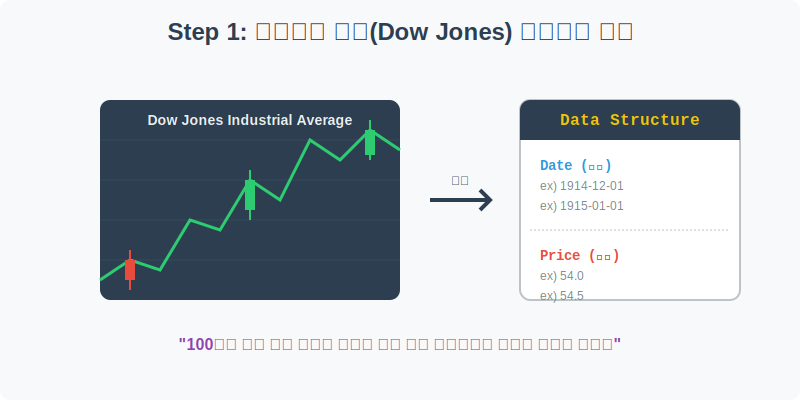
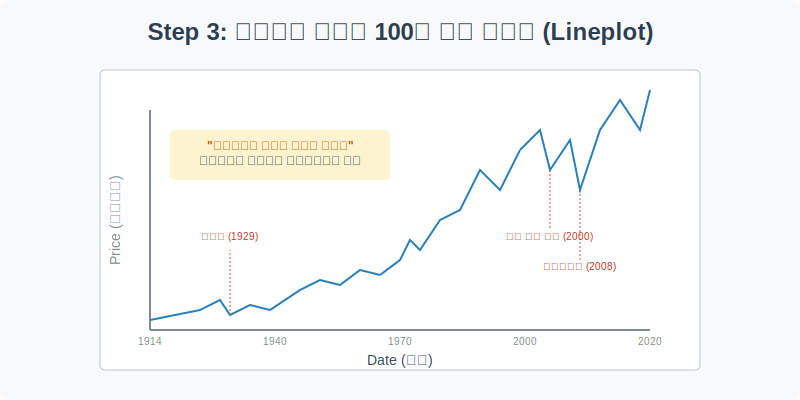
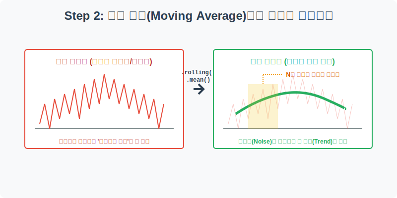
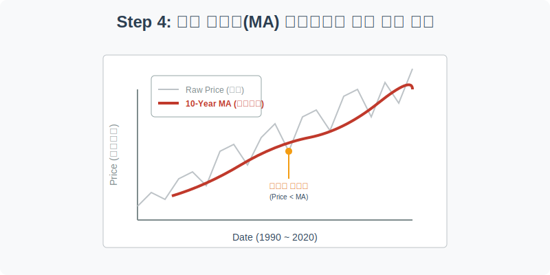

# 실전 데이터 분석 16: 다우존스 100년의 역사와 이동 평균선(Moving Average)

## 📌 강의 개요 (30분 완성)


미국 주식 시장의 전체적인 흐름을 보여주는 가장 대표적인 지표, '다우존스 산업평균지수(Dow Jones Industrial Average)'의 100년 치 역사적 데이터를 분석합니다. 주식 차트 분석에서 가장 기본이 되는 시계열 데이터 처리와 이동 평균선 기법을 배웁니다.

**학습 목표:**
* **시계열 데이터 로드 및 시각화:** 날짜(Date)와 가격(Price)으로 이루어진 아주 단순한 2차원 데이터를 어떻게 파이프라인에 올리고 꺾은선 그래프(`lineplot`)로 그리는지 복습합니다.
* **이동 평균선 (Moving Average) 원리:** 매일매일 극심하게 출렁이는 주식 데이터의 잔파도(Noise)를 깎아내고, 장기적인 추세(Trend)만 남기는 판다스의 `.rolling().mean()` 기술을 익힙니다.
* **차트 오버레이 (Overlay):** 원본 주가 그래프 위에 이동 평균선을 겹쳐 그려서 '하락장(Price < MA)'과 '상승장(Price > MA)'을 직관적으로 구분하는 재무 데이터 분석의 기초를 다집니다.

---

## Step 1: 다우존스 데이터 구조 파악 (Overview)



1914년 제1차 세계대전 직전부터 1968년까지의 과거 다우존스 지수 데이터를 불러옵니다.

```python
import pandas as pd
import seaborn as sns
import matplotlib.pyplot as plt

# 그래프 설정
plt.rcParams['font.family'] = 'AppleGothic'
plt.rcParams['axes.unicode_minus'] = False
sns.set_palette("Set1")

# Dowjones 데이터셋 로드
df = sns.load_dataset('dowjones')

# 데이터 구조 및 첫 5행 확인
print(df.info())
display(df.head())
```

### 💡 코드 딥다이브 (Code Deep Dive)
**주요 컬럼(Columns) 해석:**
* `Date`: 측정 날짜 (연-월-일). 다행히 이 데이터셋은 처음부터 타입이 문자열(object)이 아닌 `datetime64[ns]`로 잘 세팅되어 있습니다. 따라서 별도의 `pd.to_datetime` 변환을 할 필요가 없습니다!
* `Price`: 해당 날짜의 다우존스 주가지수 (달러).

---

## Step 2: 100년의 역사를 한눈에 (Univariate EDA)


*(Step 3 이미지 참고: 자본주의 우상향의 역사)*

우선 아무런 가공을 하지 않은 원본(Raw) 주가 데이터를 꺾은선 그래프로 시원하게 그려보겠습니다.

```python
plt.figure(figsize=(12, 5))

# 원본 날짜별 주가지수를 꺾은선 그래프로 시각화
sns.lineplot(data=df, x='Date', y='Price', color='royalblue', linewidth=1.5)

plt.title('다우존스 산업평균지수 역사적 추이 (1914 ~ 1968)', fontsize=16)
plt.xlabel('연도 (Date)')
plt.ylabel('주가지수 (Price)')
plt.grid(True, linestyle='--', alpha=0.5)

plt.show()
```

### 💡 시각화 차트 읽는 법
* **대공황 (The Great Depression):** 1929년, 하늘 높은 줄 모르고 치솟던 차트가 1930년대를 맞이하며 말 그대로 '수직 낙하'하는 끔찍한 폭락장을 눈으로 확인할 수 있습니다.
* **장기적 우상향:** 그럼에도 불구하고 차트를 멀리서 떨어져 보면, 1940년대 이후 제2차 세계대전을 거치며 결국 전고점을 돌파하고 끝없이 우상향하는 자본주의의 강력한 회복 탄력성을 엿볼 수 있습니다.

---

## Step 3: 노이즈를 제거하는 마법, 이동 평균선 (Preprocess)



주식 차트는 매일매일 오르락내리락(Volatility) 거립니다. 이런 잔파도에 흔들리지 않고 거대한 해류(Trend)를 파악하기 위해 **이동 평균선(Moving Average, MA)**이라는 파생 변수를 만들어 보겠습니다.

```python
# 1. 데이터를 날짜(Date) 순으로 확실하게 오름차순 정렬 (과거 -> 현재)
df = df.sort_values('Date')

# 2. 12개월(1년) 이동 평균선 계산
# .rolling(window=12) : 현재 행을 포함하여 직전 12개의 데이터를 하나로 묶음(창문)
# .mean() : 그 묶인 12개 데이터의 평균을 구함
df['MA_12'] = df['Price'].rolling(window=12).mean()

# 처음 11개의 데이터는 묶을 수 있는 과거 데이터가 모자라기 때문에 NaN(결측치)이 발생합니다.
display(df.head(15))
```

### 💡 분석가의 통찰 (Analyst's Insight)
* **이동 평균(Moving Average)의 원리:** 주가가 어제 100달러, 오늘 50달러로 반토막이 났다고 해서 회사가 하루아침에 반쪽짜리가 된 것은 아닙니다. 일시적인 패닉 셀링(노이즈)일 수 있습니다. 따라서 최근 12개월 치의 가격을 전부 더해 평균을 내면, 어쩌다 발생한 하루이틀의 폭락이나 폭등 꼬리는 깎여나가고 진짜 '회사의 가치 흐름'만 남게 됩니다.

---

## Step 4: 원본 가격과 이동 평균선의 오버레이 (Multivariate EDA)



이제 원본 주가(가느다란 선) 위에 우리가 방금 만든 1년 이동 평균선(두꺼운 선)을 겹쳐서 그려보겠습니다.

```python
plt.figure(figsize=(14, 6))

# 1. 원본 주가 그래프 (가늘고 연하게)
sns.lineplot(data=df, x='Date', y='Price', color='lightslategray', 
             linewidth=1.5, alpha=0.7, label='Raw Price (원본)')

# 2. 12개월 이동 평균선 (두껍고 강렬하게)
sns.lineplot(data=df, x='Date', y='MA_12', color='crimson', 
             linewidth=3, label='12-Month Moving Average (1년 추세)')

plt.title('다우존스 지수와 1년 이동평균선(MA) 비교 분석', fontsize=16)
plt.xlabel('연도 (Date)')
plt.ylabel('주가지수 (Price)')
plt.grid(True, linestyle=':', alpha=0.6)
plt.legend(loc='upper left')

plt.show()
```

### 💡 코드 딥다이브 & 인사이트 (매우 중요!)
* **노이즈 캔슬링:** 붉은색의 두꺼운 이동 평균선은 회색 원본 선의 날카로운 톱니바퀴들을 부드럽게 깎아내어, 마치 산의 둥그런 능선처럼 보여줍니다.
* **추세 매매의 기초 (골든크로스 / 데드크로스):**
  * 회색 선(실제 주가)이 붉은색 선(1년 평균)보다 **아래(Price < MA)**로 푹 꺼지는 시기가 있습니다. 이는 최근 주가가 1년 치 평균치보다도 못한 상태, 즉 **'완연한 하락장(Bear Market)'**에 진입했음을 의미합니다. (1930년대 대공황 구간 등)
  * 반대로 회색 선이 붉은색 선을 뚫고 위로 올라가면 **'상승장(Bull Market)'**의 신호탄으로 해석할 수 있습니다. 

---

## 🎯 30분 강의 마무리 및 심화 과제

시계열 데이터에서 가장 흔하게 쓰이는 판다스의 `.rolling().mean()` 기법을 통해, 날뛰는 주식 데이터의 노이즈를 잠재우고 진짜 트렌드를 읽어내는 금융 데이터 분석가의 기초 소양을 익혔습니다.

### 📝 심화 과제 (Advanced Challenge)
1. **장기 추세선 만들기:** `window=12` (1년) 대신 `window=60` (5년) 짜리 초장기 이동 평균선 파생 변수(`MA_60`)를 하나 더 만들어 보세요. 그리고 Step 4의 그래프에 선을 3개(원본, 1년 선, 5년 선) 동시에 그려보세요. 5년 선은 훨씬 더 무겁고 완만하게 움직이는 것을 관찰할 수 있습니다.
2. **결측치 채우기 (Backfill):** Step 3에서 `.rolling()`을 수행하면 초기 11개 데이터가 `NaN`이 됩니다. 만약 이 결측치들을 머신러닝에 넣어야 해서 강제로 채워야 한다면, 판다스의 `.bfill()` (뒤의 데이터로 앞을 채우는 기법)을 사용하여 깔끔하게 빈칸을 없애보세요!
