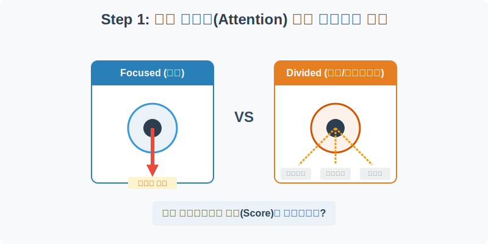
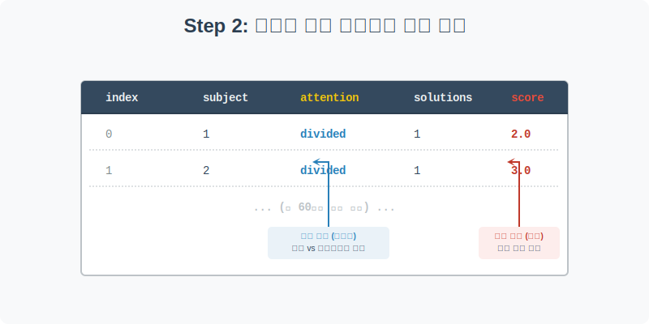
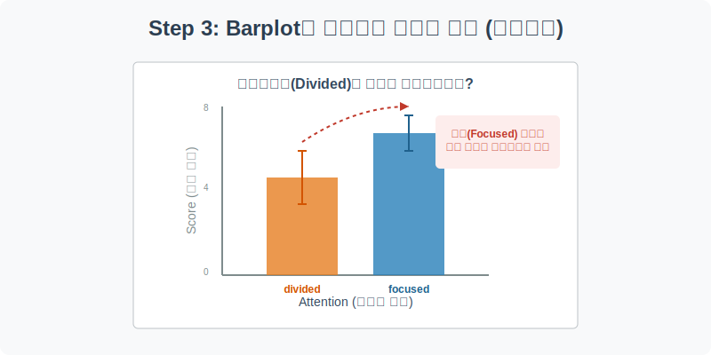
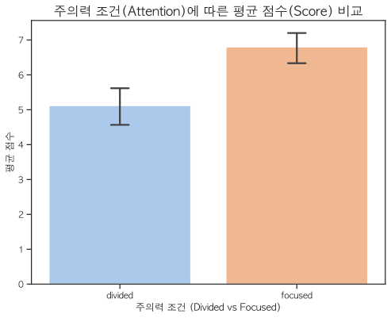
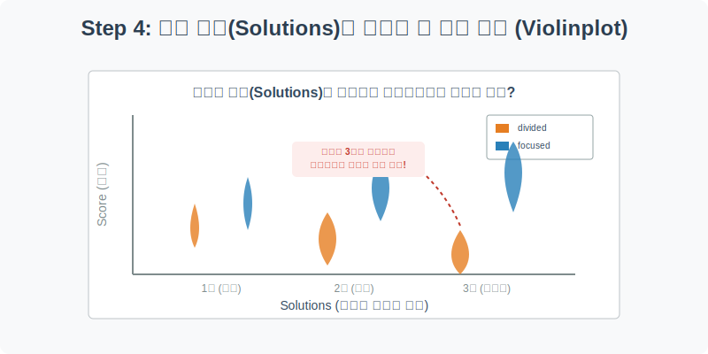
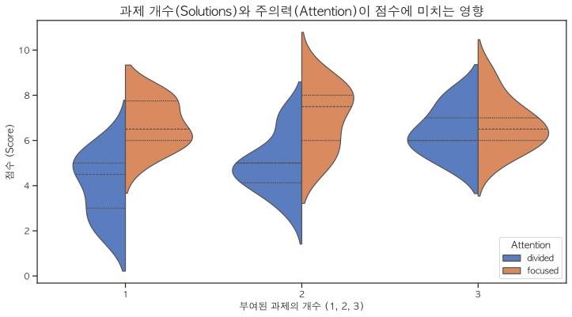

# 실전 데이터 분석 17: 멀티태스킹의 비효율성과 분산 분석(ANOVA)의 기초

## 📌 강의 개요 (30분 완성)


"음악을 들으면서, 스마트폰 메신저를 확인하며, 수학 문제를 풀면 성적이 떨어질까?" 누구나 한 번쯤 가져보았을 이 궁금증을 인지 심리학자들의 실제 통제 실험(Controlled Experiment) 데이터를 통해 증명해 봅니다.

**학습 목표:**
* **실험 설계 데이터의 이해:** 독립 변수(원인)를 통제하고 종속 변수(결과)를 측정하는 의학/심리학 실험 데이터의 전형적인 구조를 파악합니다.
* **막대 그래프(`barplot`)와 신뢰구간:** 단순히 평균 점수를 비교하는 것을 넘어, '통계적으로 우연이 아닌 진짜 차이인지'를 오차 막대(Error bar)로 판별하는 법을 배웁니다.
* **바이올린 플롯(`violinplot`)을 통한 심층 분석:** 과제의 난이도(개수)가 올라갈 때 멀티태스킹 그룹의 성적이 어떻게 파국으로 치닫는지 데이터로 입증합니다.

---

## Step 1: 인지 심리학 실험 데이터의 이해 (Overview)



실험실에서 수집된 60명의 피험자 데이터를 불러옵니다.

```python
import pandas as pd
import seaborn as sns
import matplotlib.pyplot as plt

# 그래프 설정
plt.rcParams['font.family'] = 'AppleGothic'
plt.rcParams['axes.unicode_minus'] = False
sns.set_palette("Set1")

# Attention 데이터셋 로드
df = sns.load_dataset('attention')

# 데이터 구조 및 첫 5행 확인
print(df.info())
display(df.head())
```

> **💻 [실행 결과]**
> ```text
> <class 'pandas.DataFrame'>
> RangeIndex: 60 entries, 0 to 59
> Data columns (total 5 columns):
>  #   Column      Non-Null Count  Dtype  
> ---  ------      --------------  -----  
>  0   Unnamed: 0  60 non-null     int64  
>  1   subject     60 non-null     int64  
>  2   attention   60 non-null     str    
>  3   solutions   60 non-null     int64  
>  4   score       60 non-null     float64
> dtypes: float64(1), int64(3), str(1)
> memory usage: 2.5 KB
> None
>    Unnamed: 0  subject attention  solutions  score
> 0           0        1   divided          1    2.0
> 1           1        2   divided          1    3.0
> 2           2        3   divided          1    3.0
> 3           3        4   divided          1    5.0
> 4           4        5   divided          1    4.0
> ```


### 💡 코드 딥다이브 (Code Deep Dive)
**주요 컬럼(Columns) 해석:**
* **독립 변수 (연구자가 조작한 원인):**
  * `attention`: 주의력 조건. `divided`(분산된 주의력, 즉 멀티태스킹) vs `focused`(집중된 주의력, 한 가지 일만 함)
  * `solutions`: 부여된 과제의 개수 (1개, 2개, 3개)
* **종속 변수 (연구자가 관찰한 결과):**
  * `score`: 과제 해결 점수 (Target)

---

## Step 2: 그룹별 평균 점수 비교하기 (Preprocess)



그래프를 그리기 전에, 판다스의 `groupby`를 활용하여 두 그룹(`divided` vs `focused`)의 단순 평균 점수를 수치로 먼저 확인해 보겠습니다.

```python
# attention(주의력 조건)에 따른 score(점수)의 평균 계산
mean_scores = df.groupby('attention')['score'].mean().reset_index()

display(mean_scores)
```

> **💻 [실행 결과]**
> ```text
> attention     score
> 0   divided  5.116667
> 1   focused  6.800000
> ```


### 💡 분석가의 통찰 (Analyst's Insight)
* 출력 결과를 보면 `focused`(집중) 그룹의 평균 점수가 `divided`(멀티태스킹) 그룹보다 더 높게 나옵니다.
* 하지만 데이터 분석가는 여기서 멈추면 안 됩니다. **"이 차이가 그저 운이 좋아서(우연히 똑똑한 사람들이 집중 그룹에 배정되어서) 발생한 것은 아닐까?"**라는 의심을 가져야 합니다. 이를 눈으로 확인시켜 주는 도구가 바로 시각화의 신뢰구간(Error bar)입니다.

---

## Step 3: Barplot이 보여주는 잔인한 진실 (Univariate EDA)



Seaborn의 `barplot`을 사용하여 두 그룹의 평균 점수를 그리고, 통계적 오차 범위를 확인해 봅니다.

```python
plt.figure(figsize=(8, 6))

# 막대 그래프 그리기 (Seaborn은 자동으로 평균을 구하고 95% 신뢰구간 에러바를 그려줍니다)
sns.barplot(data=df, x='attention', y='score', palette='pastel', capsize=0.1)

plt.title('주의력 조건(Attention)에 따른 평균 점수(Score) 비교', fontsize=16)
plt.xlabel('주의력 조건 (Divided vs Focused)')
plt.ylabel('평균 점수')
plt.show()
```

> **💻 [실행 결과]**
> 


### 💡 시각화 차트 읽는 법
* **파란색 막대(Focused) vs 주황색 막대(Divided):** 시각적으로 집중 그룹의 막대가 훨씬 높습니다.
* **오차 막대 (Error bar, 95% 신뢰구간):** 막대 위에 그려진 까만 선(I 모양)을 주목하세요. 집중 그룹의 가장 낮은 오차 범위(하한선)조차도, 멀티태스킹 그룹의 가장 높은 오차 범위(상한선)보다 위에 붕 떠 있습니다. 
* **결론:** 두 막대의 오차 막대가 서로 겹치지 않는다는 것은, **"멀티태스킹이 집중하는 것보다 점수가 낮다는 것은 우연이 아니라 통계적인 진실(유의미한 차이)이다"**라는 것을 시각적으로 완벽하게 증명한 셈입니다.

---

## Step 4: 과제가 늘어날 때 벌어지는 파국 (Multivariate EDA)



이번에는 과제의 개수(`solutions`)라는 난이도 변수를 추가해 봅시다. 
막대 그래프 대신 데이터의 전체적인 분포(뚱뚱한 정도)를 보여주는 **바이올린 플롯(`violinplot`)**을 사용하여, 데이터의 민낯을 아주 깊숙이 파헤쳐 보겠습니다.

```python
plt.figure(figsize=(12, 6))

# X축은 과제의 개수(solutions), Y축은 점수(score)
# hue를 attention으로 주어 하나의 바이올린을 반으로 쪼개서(split=True) 양쪽을 비교합니다.
sns.violinplot(
    data=df, x='solutions', y='score', hue='attention', 
    split=True, inner="quartile", palette="muted"
)

plt.title('과제 개수(Solutions)와 주의력(Attention)이 점수에 미치는 영향', fontsize=16)
plt.xlabel('부여된 과제의 개수 (1, 2, 3)')
plt.ylabel('점수 (Score)')
plt.legend(title='Attention', loc='lower right')
plt.show()
```

> **💻 [실행 결과]**
> 


### 💡 코드 딥다이브 & 인사이트 (매우 중요!)
* **Split=True의 마법:** 왼쪽(파란색)은 분산 그룹, 오른쪽(주황색)은 집중 그룹입니다. 서로 등을 맞대고 있어서 직관적인 비교가 가능합니다.
* **과제가 1개일 때:** 파란색과 주황색의 뚱뚱한 부분(데이터가 많이 모여 있는 곳)의 높이가 비슷합니다. 즉, 쉬운 일 1개만 할 때는 딴짓(멀티태스킹)을 좀 하더라도 성적에 큰 타격이 없습니다.
* **과제가 3개로 늘어났을 때 (파국):** 주황색(집중) 그룹은 여전히 높은 점수대에서 뚱뚱함을 유지하며 잘 버티고 있습니다. 하지만 파란색(멀티태스킹) 그룹을 보세요. 위쪽은 홀쭉해지고 바닥(낮은 점수)으로 무게 중심이 완전히 무너져 내렸습니다. 
* **최종 결론:** "인간의 뇌는 난이도가 높고 복잡한 여러 과제를 처리할 때, 멀티태스킹을 시도하면 인지 능력이 완전히 박살(Crash) 난다."

---

## 🎯 30분 강의 마무리 및 심화 과제

A/B 테스트(두 그룹 간의 차이 비교)를 할 때 단순히 평균값(막대의 높이)만 믿어서는 안 되며, 반드시 오차 막대(신뢰구간)가 겹치지 않는지를 확인하는 습관을 들여야 합니다. 또한 `violinplot`을 활용하면 데이터가 어디에 많이 뭉쳐 있고 흩어져 있는지, 평균 뒤에 숨겨진 진짜 분포의 생김새를 찾아낼 수 있습니다.

### 📝 심화 과제 (Advanced Challenge)
1. **Stripplot 더하기:** Step 4의 `violinplot` 차트 위에 `sns.stripplot(data=df, x='solutions', y='score', hue='attention', dodge=True)` 코드를 추가해 보세요. 바이올린 모양 위에 실제 60명의 피험자 점수 데이터(점)가 구슬처럼 예쁘게 찍혀서, 데이터의 투명성을 한층 더 높일 수 있습니다.
2. **Boxplot으로 변경:** Step 4의 `violinplot`을 `boxplot`으로만 바꿔서 그려보세요. 아웃라이어(이상치)를 찾는 데는 `boxplot`이 유리하지만, 데이터가 어디에 뚱뚱하게 몰려 있는지(밀도)를 보는 데는 `violinplot`이 압도적으로 유리하다는 것을 깨달을 수 있습니다.
