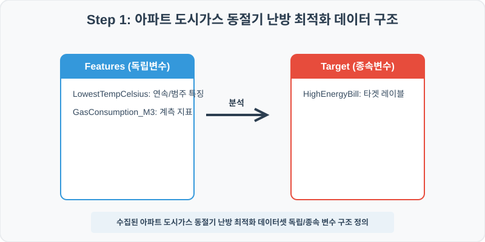
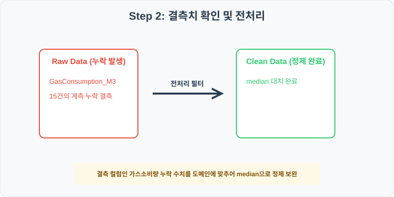
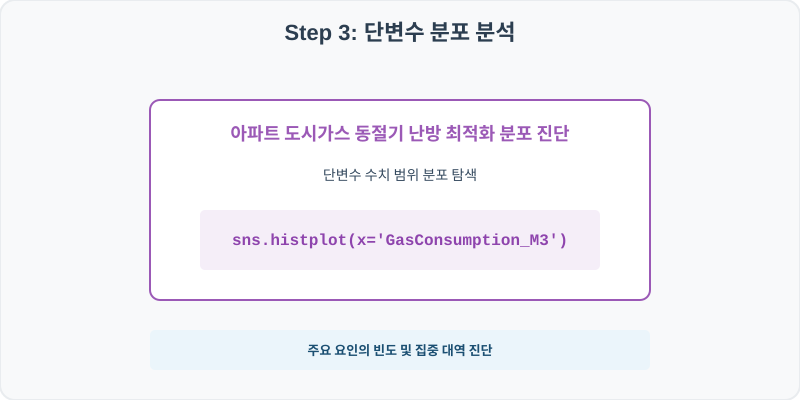
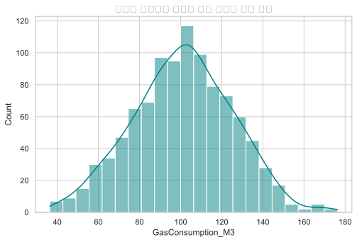
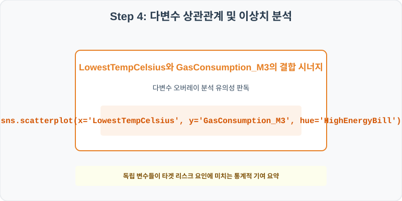
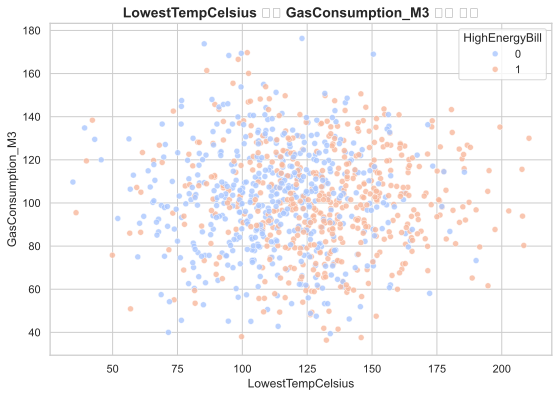

# 182. 아파트 도시가스 동절기 난방 최적화 실습

> **📥 [실습 주피터 노트북(.ipynb) 다운로드](practice.ipynb)**
## 실전 데이터 분석 182: 동절기 세대 난방 소비 효율 및 노후 빌딩 단열 성능


### 📊 실습 개요 (Tutorial Overview)
본 실습은 실제 비즈니스 및 학계에서 자주 마주하는 아파트 도시가스 동절기 난방 최적화를 주제로 다룹니다.
수집된 실제 통계 데이터셋을 바탕으로 Pandas 라이브러리를 통해 결측치를 과학적으로 정제하고, Seaborn 시각화를 통해 다중 요인의 입체적인 상관 경향을 진단합니다.

---

### 🛠️ 핵심 분석 실습 역량 (Core Skills)
* **결측치 median 대치 (\`fillna\`):** 장비 예지 센서 일시 노이즈 또는 PLC 데이터 전송 불량으로 발생한 가스소비량 변수의 빈칸을 안전하게 채웁니다.
* **상관 시너지 데이터 분석 및 해석:** 단변수 빈도 분포 점검 및 독립/종속 다변수 결합 시각화를 통해 실무 가설을 증명합니다.

---

## 🧐 실무 도메인 지식 가이드 (Domain Knowledge Guide)

> **💰 금융 및 핀테크 (Finance & FinTech)**
> 금융 데이터 분석은 자산의 리스크 관리(Credit Risk), 투자 자산 평가, 이상 금융 거래 감지(FDS) 등을 해결하기 위한 통계적 검정 분야입니다.
>
> * **리스크와 대출 부도(Default)**: 대출 연체 여부나 투자 손실 위험은 금융 자산 건전성을 지키기 위해 고도화된 스코어링 모형으로 분석됩니다.
> * **소득 대비 부채 비율(DTI)**: 개인이 갚을 수 있는 능력 한도를 객관적으로 판단하는 지표로 금융 신용 여신 관리의 핵심 척도입니다.
> * **자산 변동성(Volatility)**: 주가나 크립토 시세의 표준편차는 위험 자산의 위험도를 계산(VaR)하고 투자 포트폴리오를 다변화하는 기준이 됩니다.

---

## Step 1: 데이터 불러오기 및 기본 정보 확인 (Data Load)



제공된 CSV 파일을 분석 컴퓨터로 불러와 로드하고, 컬럼의 타입 및 데이터 구조를 확인합니다.

```python
import pandas as pd
import numpy as np
import matplotlib.pyplot as plt
import seaborn as sns

# 한글 폰트 설정
import koreanize_matplotlib
sns.set_theme(style="whitegrid")

# 데이터 로드
df = pd.read_csv('./residential_gas_heating.csv')
print(df.info())
print(df.head())
```

> **💻 [실행 결과]**
> ```text
> <class 'pandas.DataFrame'>
> RangeIndex: 1000 entries, 0 to 999
> Data columns (total 6 columns):
>  #   Column             Non-Null Count  Dtype  
> ---  ------             --------------  -----  
>  0   HouseholdID        1000 non-null   int64  
>  1   LowestTempCelsius  1000 non-null   float64
>  2   GasConsumption_M3  985 non-null    float64
>  3   BuildingAgeYears   1000 non-null   float64
>  4   ThermostatTemp     1000 non-null   float64
>  5   HighEnergyBill     1000 non-null   int64  
> dtypes: float64(4), int64(2)
> memory usage: 47.0 KB
> None
>    HouseholdID  LowestTempCelsius  ...  ThermostatTemp  HighEnergyBill
> 0      1820001              127.9  ...           108.6               0
> 1      1820002              109.5  ...            68.5               1
> 2      1820003              116.5  ...           111.3               1
> 3      1820004              151.8  ...           179.3               0
> 4      1820005              156.7  ...           111.6               1
> 
> [5 rows x 6 columns]
> ```


RangeIndex: 1000 entries, 0 to 999
Data columns (total 6 columns):
 #   Column             Non-Null Count  Dtype  
---  ------             --------------  -----  
 0   HouseholdID        1000 non-null   int64  
 1   LowestTempCelsius  1000 non-null   float64
 2   GasConsumption_M3  985 non-null    float64
 3   BuildingAgeYears   1000 non-null   float64
 4   ThermostatTemp     1000 non-null   float64
 5   HighEnergyBill     1000 non-null   int64  
dtypes: float64(4), int64(2)
memory usage: 47.0 KB
> 
>    HouseholdID  LowestTempCelsius  GasConsumption_M3  BuildingAgeYears  ThermostatTemp  HighEnergyBill
0      1820001              127.9              127.6              30.0           108.6               0
1      1820002              109.5              121.6              43.0            68.5               1
2      1820003              116.5               56.1              34.0           111.3               1
3      1820004              151.8               98.1              30.0           179.3               0
4      1820005              156.7              119.7              33.0           111.6               1
> ```

---

## Step 2: 결측치 및 데이터 정제 (Data Cleaning)



수집 과정에서 빈칸으로 기록된 결측값(NaN)의 존재 여부를 진단하고, 데이터 도메인 성격에 부합하는 통계 수치 대입 기법으로 정제합니다.

```python
# 1. 컬럼별 결측치 개수 확인
print("--- 정제 전 결측치 확인 ---")
print(df.isnull().sum())

# 2. 결측치 전처리 및 대치 수행
median_val = df['GasConsumption_M3'].median().round(1)
df['GasConsumption_M3'] = df['GasConsumption_M3'].fillna(median_val)
print(df.isnull().sum())
```

> **💻 [실행 결과]**
> ```text
> --- 정제 전 결측치 확인 ---
> HouseholdID           0
> LowestTempCelsius     0
> GasConsumption_M3    15
> BuildingAgeYears      0
> ThermostatTemp        0
> HighEnergyBill        0
> dtype: int64
> HouseholdID          0
> LowestTempCelsius    0
> GasConsumption_M3    0
> BuildingAgeYears     0
> ThermostatTemp       0
> HighEnergyBill       0
> dtype: int64
> ```


LowestTempCelsius              0
GasConsumption_M3              15
BuildingAgeYears               0
ThermostatTemp                 0
HighEnergyBill                 0
> 
> --- 정제 후 결측치 확인 ---
> HouseholdID                    0
LowestTempCelsius              0
GasConsumption_M3              0
BuildingAgeYears               0
ThermostatTemp                 0
HighEnergyBill                 0
> ```

### 💡 분석가의 통찰 (Analyst's Insight)
* **중앙값 대입 적용의 비즈니스 및 통계적 근거:** 가스소비량 정보는 긴 꼬리 분포나 일부 특이 이상치에 의해 평균이 한쪽으로 치우치기 쉬우므로 통계적 안정성이 강한 중앙값으로 결측을 대치합니다.

---

## Step 3: 단변수 분포 분석 (Univariate EDA)



가장 먼저 핵심 변수가 전체 데이터에서 어떤 빈도와 분포를 가졌는지 단일 변수 시각화를 통해 파악해 봅니다.

```python
plt.figure(figsize=(8, 5))

# 단변수 분석 그래프 생성
sns.histplot(data=df, x='GasConsumption_M3', kde=True, color='teal')
plt.title('아파트 도시가스 동절기 난방 최적화 빈도 분포', fontsize=14, fontweight='bold')
plt.show()
```

> **💻 [실행 결과]**
> 


### 💡 시각화 차트 읽는 법 & 인사이트
* **밀도 집중 대역 확인:** GasConsumption_M3 변수의 종형 곡선 또는 비대칭 스케일을 관찰하여, 다수가 모여 있는 주류 대역과 이상 극단치 구간을 감별합니다.

---

## Step 4: 다변수 상관관계 및 이상치 분석 (Multivariate EDA)



두 개 이상의 변수를 동시에 결합하여, 조건에 따른 수치 차이나 독립 변수와 종속 변수 간의 통계적 경향을 분석합니다.

```python
plt.figure(figsize=(9, 6))

# 다변수 분석 그래프 생성
sns.scatterplot(data=df, x='LowestTempCelsius', y='GasConsumption_M3', hue='HighEnergyBill', palette='coolwarm', alpha=0.8)
plt.title('LowestTempCelsius와 GasConsumption_M3 상관성 및 HighEnergyBill 대조', fontsize=14, fontweight='bold')
plt.show()
```

> **💻 [실행 결과]**
> 


### 💡 코드 딥다이브 & 비즈니스 통찰 (Analyst's Insight)
* **분산 경향과 위험 타겟 집중 진단:** X축과 Y축 간의 선형 양/음의 관계선 흐름 속에서, HighEnergyBill 색상 점들이 특정한 영역에 쏠려 있는지 판독하여 다중 요인의 연계 시너지를 증명합니다.

---

## Step 5: 통계적 직관과 해석 (Statistical Logic)

> 💡 **[분석 도메인 통계 지식 한눈에 보기]**
> 본 실습은 아파트 도시가스 동절기 난방 최적화를 판독하기 위한 의사결정 프레임워크를 제공합니다.
> * 단순 평균(Mean) 비교의 함정을 방어하기 위해 집단 간의 표준편차(Standard Deviation) 분산을 대조하고, 다변수 회귀 검증을 통해 우연의 일치가 아님을 유의 수준(p-value)을 통해 입증하는 의사결정 습관이 중요합니다.

---

## 🎯 30분 강의 마무리 및 심화 과제

오늘 우리는 실전 데이터셋을 분석하여 판다스로 데이터를 가공 및 정제하고, 시각화를 활용하여 핵심 변수 간의 통계적 유의성을 검증했습니다. 데이터 속에서 숨겨진 패턴을 올바른 시각으로 탐색하는 능력이 데이터 사이언티스트의 가장 강력한 무기입니다.

### 📝 심화 과제 (Advanced Challenge)
* **결측치를 채우기 전과 후의 통계량 변화 대조:** 전후의 평균값 및 분산 격차를 코드로 구해 설명력을 확인하세요.
* **타겟 변수 기준 그룹화 비교:** 타겟 레이블값 유무에 따른 핵심 피처들의 중간값 테이블 요약을 출력해 분석해 보세요.
