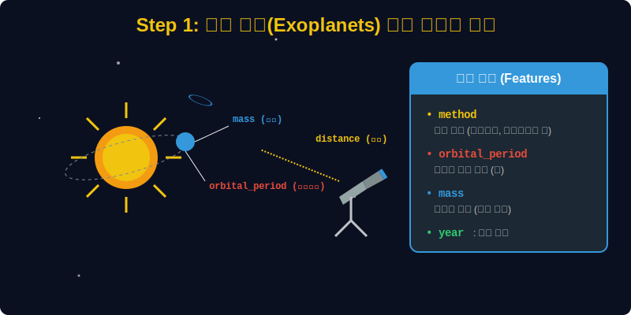
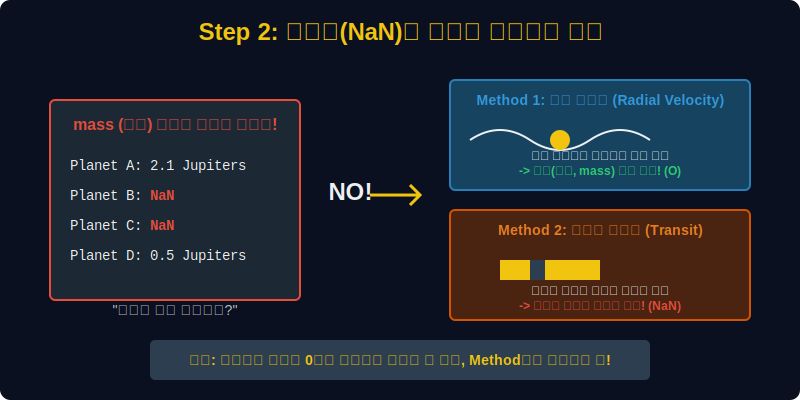
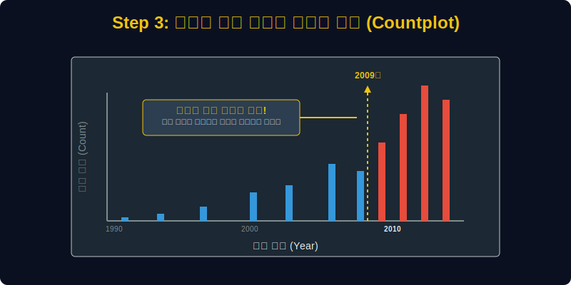
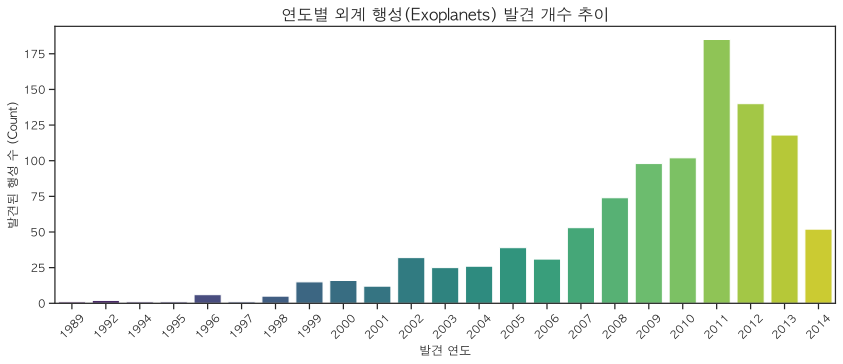
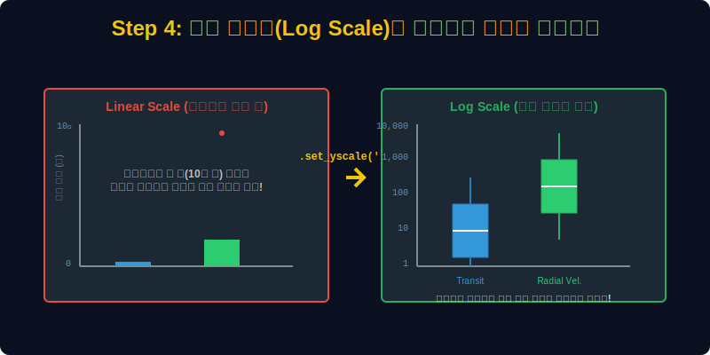
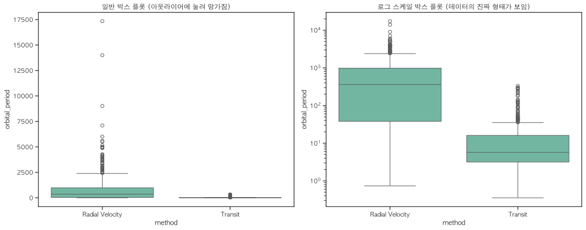

# 실전 데이터 분석 18: 결측치의 진실과 로그 스케일(Log Scale)의 구원

## 📌 강의 개요 (30분 완성)


우리가 살고 있는 태양계 밖에는 얼마나 많은 외계 행성(Exoplanets)들이 있을까요? NASA에서 제공하는 1,000개가 넘는 외계 행성 발견 데이터를 통해 우주 탐사의 역사와 스케일을 분석해 봅니다.

**학습 목표:**
* **결측치(Missing Values)의 재해석:** 데이터에 빈칸(`NaN`)이 있다고 해서 무조건 불량 데이터인 것은 아닙니다. 관측 방법(`method`)의 한계 때문에 태생적으로 빈칸일 수밖에 없는 '구조적 결측치'의 개념을 배웁니다.
* **카운트 플롯(`countplot`)과 시대의 흐름:** 특정 연도에 행성 발견 개수가 폭발적으로 증가하는 현상을 시각화하고, 그 이면에 숨겨진 과학 기술의 발전(케플러 망원경)을 유추해 봅니다.
* **로그 스케일 변환 (`set_yscale('log')`):** 데이터의 최솟값과 최댓값 차이가 수만 배 이상 벌어져 그래프가 완전히 찌그러질 때, 마법처럼 데이터를 구원해 내는 로그 스케일링 기법을 마스터합니다.

---

## Step 1: NASA 외계 행성 데이터의 구조 (Overview)



수십 광년 떨어진 별 주위를 도는 행성들의 정보를 어떻게 기록하고 있는지 살펴봅시다.

```python
import pandas as pd
import seaborn as sns
import matplotlib.pyplot as plt

# 그래프 설정
plt.rcParams['font.family'] = 'AppleGothic'
plt.rcParams['axes.unicode_minus'] = False
sns.set_palette("Set2")

# Planets 데이터셋 로드
df = sns.load_dataset('planets')

# 데이터 구조 및 결측치 확인
print(df.info())
display(df.head())
```

> **💻 [실행 결과]**
> ```text
> <class 'pandas.DataFrame'>
> RangeIndex: 1035 entries, 0 to 1034
> Data columns (total 6 columns):
>  #   Column          Non-Null Count  Dtype  
> ---  ------          --------------  -----  
>  0   method          1035 non-null   str    
>  1   number          1035 non-null   int64  
>  2   orbital_period  992 non-null    float64
>  3   mass            513 non-null    float64
>  4   distance        808 non-null    float64
>  5   year            1035 non-null   int64  
> dtypes: float64(3), int64(2), str(1)
> memory usage: 48.6 KB
> None
>             method  number  orbital_period   mass  distance  year
> 0  Radial Velocity       1         269.300   7.10     77.40  2006
> 1  Radial Velocity       1         874.774   2.21     56.95  2008
> 2  Radial Velocity       1         763.000   2.60     19.84  2011
> 3  Radial Velocity       1         326.030  19.40    110.62  2007
> 4  Radial Velocity       1         516.220  10.50    119.47  2009
> ```


### 💡 코드 딥다이브 (Code Deep Dive)
**주요 컬럼(Columns) 해석:**
* `method`: 행성을 발견한 천문학적 관측 기법 (예: Radial Velocity(시선 속도법), Transit(천체면 통과법) 등)
* `number`: 해당 항성계(별)에 속한 행성의 총개수
* `orbital_period`: 행성이 별을 한 바퀴 도는 데 걸리는 시간 (지구 기준의 일, Days)
* `mass`: 행성의 질량 (우리 태양계의 목성(Jupiter) 질량을 1.0으로 기준 삼음)
* `distance`: 지구로부터의 거리 (파섹, Parsec)
* `year`: 발견된 연도

---

## Step 2: 결측치(NaN)에 숨겨진 천문학적 이유 (Preprocess)



`df.info()`를 실행해 보면, 총 1035개의 데이터 중 `mass`(질량) 데이터는 고작 513개밖에 없고 나머지는 텅 비어(`NaN`) 있습니다. 왜 그럴까요?

```python
# 관측 방법(method)별로 데이터 개수 세기
print(df['method'].value_counts())

# 관측 방법(method)별로 질량(mass) 결측치가 얼마나 있는지 확인
missing_by_method = df[df['mass'].isnull()]['method'].value_counts()
print("\n[질량(mass) 데이터가 비어있는 행성들의 발견 방법]")
print(missing_by_method)
```

> **💻 [실행 결과]**
> ```text
> method
> Radial Velocity                  553
> Transit                          397
> Imaging                           38
> Microlensing                      23
> Eclipse Timing Variations          9
> Pulsar Timing                      5
> Transit Timing Variations          4
> Orbital Brightness Modulation      3
> Astrometry                         2
> Pulsation Timing Variations        1
> Name: count, dtype: int64
> 
> [질량(mass) 데이터가 비어있는 행성들의 발견 방법]
> method
> Transit                          396
> Radial Velocity                   43
> Imaging                           38
> Microlensing                      23
> Eclipse Timing Variations          7
> Pulsar Timing                      5
> Transit Timing Variations          4
> Orbital Brightness Modulation      3
> Astrometry                         2
> Pulsation Timing Variations        1
> Name: count, dtype: int64
> ```


### 💡 분석가의 통찰 (Analyst's Insight)
* **Radial Velocity (시선 속도법):** 행성의 중력이 별을 미세하게 흔드는 것을 포착하는 방식입니다. 중력을 이용하므로 **행성의 질량(`mass`)을 계산할 수 있습니다.**
* **Transit (천체면 통과법):** 행성이 별 앞을 지나갈 때 별빛이 어두워지는 그림자를 포착하는 방식입니다. 그림자의 크기를 통해 행성의 크기는 알 수 있지만, **질량(`mass`)은 알 수 없습니다.**
* **데이터 분석의 철학:** 이처럼 `Transit` 방법으로 발견된 행성의 질량 칸이 비어있는 것은 수집가의 실수가 아닙니다. 따라서 이 빈칸들을 0이나 평균값으로 함부로 채워 넣으면(Imputation) 천문학적 사실이 완전히 왜곡되는 대형 사고가 발생합니다.

---

## Step 3: 기술의 혁명과 폭발적인 발견 (Univariate EDA)



연도별로 발견된 외계 행성의 개수를 막대그래프(`countplot`)로 세어 봅시다.

```python
plt.figure(figsize=(14, 5))

# 연도별(Year) 데이터 빈도수(Count) 시각화
sns.countplot(data=df, x='year', palette='viridis')

plt.title('연도별 외계 행성(Exoplanets) 발견 개수 추이', fontsize=16)
plt.xlabel('발견 연도')
plt.ylabel('발견된 행성 수 (Count)')
plt.xticks(rotation=45) # 연도 글씨가 겹치지 않게 45도 기울임
plt.show()
```

> **💻 [실행 결과]**
> 


### 💡 시각화 차트 읽는 법
* 1989년부터 2000년대 중반까지는 1년에 고작 몇 개, 많아야 이삼십 개의 행성을 찔끔찔끔 발견했습니다.
* 그런데 **2009년을 기점으로 막대가 솟구치기 시작하더니, 2011년과 2014년에 폭발적으로(1년에 수백 개씩) 증가**합니다.
* 데이터는 거짓말을 하지 않습니다. 실제로 2009년에 행성 사냥꾼이라 불리는 **'케플러 우주 망원경(Kepler Space Telescope)'**이 우주로 발사되었고, 이로 인해 인류의 관측 기술 패러다임이 완전히 바뀌었음을 단 한 장의 차트가 증명하고 있습니다.

---

## Step 4: 박스 플롯(Boxplot)을 구원하는 로그 스케일 (Multivariate EDA)



발견 방법(`method`)에 따라 행성들이 별을 한 바퀴 도는 공전 주기(`orbital_period`)에 차이가 있는지 박스 플롯으로 비교해 봅시다.

```python
# 1. 캔버스를 2개(좌, 우)로 나눕니다.
fig, (ax1, ax2) = plt.subplots(1, 2, figsize=(15, 6))

# 가장 데이터가 많은 상위 2개 방법만 필터링
top_methods = ['Radial Velocity', 'Transit']
sub_df = df[df['method'].isin(top_methods)]

# 2. 왼쪽 그래프: 일반적인 선형 스케일 (Linear Scale)
sns.boxplot(data=sub_df, x='method', y='orbital_period', ax=ax1)
ax1.set_title('일반 박스 플롯 (아웃라이어에 눌려 망가짐)')

# 3. 오른쪽 그래프: Y축을 로그 스케일로 변환 (Log Scale)
sns.boxplot(data=sub_df, x='method', y='orbital_period', ax=ax2)
ax2.set_yscale('log') # 핵심 코드! Y축 눈금을 10배씩 뜀
ax2.set_title('로그 스케일 박스 플롯 (데이터의 진짜 형태가 보임)')

plt.tight_layout()
plt.show()
```

> **💻 [실행 결과]**
> 


### 💡 코드 딥다이브 & 인사이트 (매우 중요!)
* **왼쪽 차트의 참사:** 공전 주기가 무려 수십만 일(수백 년)에 달하는 극단적인 아웃라이어 행성 한두 개 때문에, Y축의 천장이 우주 끝까지 높아졌습니다. 그 결과 정작 중요한 대다수 행성(공전주기 1~1000일)의 박스 모양은 **바닥에 껌딱지처럼 납작하게 눌려** 아무런 정보도 얻을 수 없습니다.
* **오른쪽 차트 (로그 스케일의 마법):** `ax2.set_yscale('log')` 단 한 줄을 추가했습니다. Y축의 간격이 0, 10, 20이 아니라 **1, 10, 100, 1000, 10000** 식으로 10배씩 뜁니다.
* **결론 도출:** 납작하게 눌려있던 박스들이 비로소 펴지면서 진실이 드러납니다. 
  * `Transit`(별빛 가림막) 방법은 주로 **가까이서 빨리 도는 행성(평균 10일 전후)**을 찾는 데 특화되어 있습니다.
  * `Radial Velocity`(중력 흔들림) 방법은 **멀리서 천천히 도는 무거운 행성(평균 1,000일 전후)**까지 넓게 커버한다는 통계적 차이를 완벽하게 증명해 냈습니다.

---

## 🎯 30분 강의 마무리 및 심화 과제

데이터의 최솟값(1일)과 최댓값(30만 일) 차이가 너무 커서 도저히 하나의 그래프 캔버스에 담을 수 없을 때, **로그 스케일 변환(`set_yscale('log')`)**은 데이터 분석가의 필수 생존 기술입니다. 아울러 데이터의 결측치가 발생한 '도메인 지식(관측 방법의 차이)'을 이해하는 것이 기술적인 코딩보다 훨씬 중요하다는 것을 깨달았습니다.

### 📝 심화 과제 (Advanced Challenge)
1. **거리(Distance) 비교:** Step 4의 코드에서 Y축 변수인 `orbital_period`를 `distance`(지구로부터의 거리)로 바꾸어 실행해 보세요. `Transit`(케플러 망원경) 방식이 `Radial Velocity`(지상 망원경 위주) 방식보다 훨씬 더 멀리 있는(수천 파섹 밖의) 행성들을 찾아낸다는 엄청난 사실을 로그 스케일 박스 플롯으로 확인할 수 있습니다.
2. **Scatterplot 그려보기:** X축을 `mass`(질량)로, Y축을 `orbital_period`(공전주기)로 하여 산점도(`scatterplot`)를 그려보세요. 두 축 모두에 아웃라이어가 심하므로 `plt.xscale('log')`와 `plt.yscale('log')`를 동시에 적용해야 예쁜 은하수 같은 산점도가 나타납니다.
