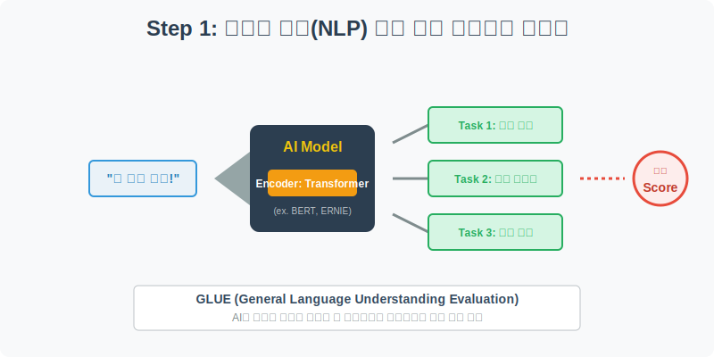
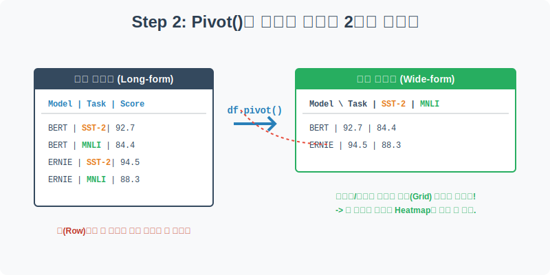
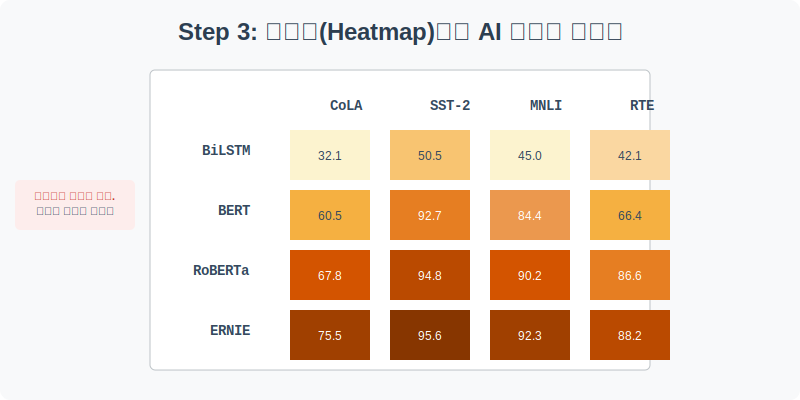
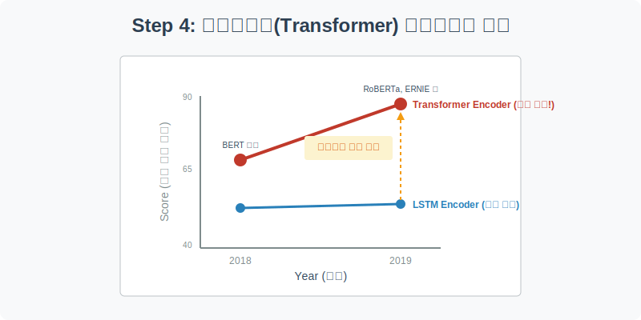

# 실전 데이터 분석 19: 데이터 2차원 재배치(`pivot`)와 히트맵(Heatmap)

## 📌 강의 개요 (30분 완성)
우리가 흔히 쓰는 ChatGPT 같은 인공지능은 사람의 언어를 얼마나 잘 이해할까요? 이를 평가하기 위해 고안된 종합 국어 수능 시험이 바로 **GLUE (General Language Understanding Evaluation)** 벤치마크입니다. 2018년과 2019년에 쏟아져 나온 다양한 인공지능 모델들의 성적표를 분석해 봅니다.

**학습 목표:**
* **데이터 피벗(`pivot`):** 아래로 길게 늘어선(Long-form) 데이터 프레임을, 내가 원하는 행과 열을 지정하여 엑셀 스타일의 2차원 격자(Wide-form)로 완벽하게 재배치하는 기술을 배웁니다.
* **히트맵 시각화(`heatmap`):** 숫자로 가득 찬 2차원 표를 색상의 진하기로 표현하여, 수십 개의 데이터를 1초 만에 스캔할 수 있는 강력한 직관성을 확보합니다.
* **트랜스포머(Transformer)의 위력:** 자연어 처리(NLP) 분야를 지배하던 과거의 LSTM 기술이, 최신 Transformer 기술로 넘어가며 얼마나 압도적인 성능 향상을 이뤄냈는지 증명합니다.

---

## Step 1: GLUE 벤치마크 데이터 구조 (Overview)



각기 다른 AI 모델들이 다양한 언어 시험(Task)에서 몇 점을 받았는지 데이터를 불러옵니다.

```python
import pandas as pd
import seaborn as sns
import matplotlib.pyplot as plt

# 그래프 설정
plt.rcParams['font.family'] = 'AppleGothic'
plt.rcParams['axes.unicode_minus'] = False

# GLUE 데이터셋 로드
df = sns.load_dataset('glue')

# 데이터 구조 및 첫 5행 확인
print(df.info())
display(df.head())
```

### 💡 코드 딥다이브 (Code Deep Dive)
**주요 컬럼(Columns) 해석:**
* `Model`: 평가를 받은 인공지능 모델의 이름 (BERT, ERNIE, RoBERTa, BiLSTM 등)
* `Year`: 해당 모델이 발표된 연도 (2018년, 2019년)
* `Encoder`: 모델의 핵심 뼈대 기술 (`LSTM` 방식 vs `Transformer` 방식)
* `Task`: 시험 과목 (예: 감정 분석(`SST-2`), 문장 유사도(`QQP`), 논리 추론(`MNLI`) 등 총 8개 과목)
* `Score`: 해당 과목에서 모델이 획득한 성적 (0~100점)

---

## Step 2: 피벗(`pivot`)을 활용한 데이터 2차원 재배치 (Preprocess)



현재 데이터는 `Model`과 `Task`가 아래로 길게 나열된 **Long-form** 구조입니다. 만약 "BERT 모델이 MNLI 과목에서 몇 점을 받았지?"라고 물으면 한참을 찾아야 합니다. 이를 엑셀처럼 행은 '모델', 열은 '시험 과목'으로 이루어진 깔끔한 표로 바꿔보겠습니다.

```python
# df.pivot(index='행 기준', columns='열 기준', values='채울 값')
# 행(index)에는 모델 이름을, 열(columns)에는 시험 과목을 배치하고, 그 교차점에 점수(Score)를 넣습니다.
pivot_df = df.pivot(index='Model', columns='Task', values='Score')

# 보기 좋게 모델명 알파벳 순서(또는 인덱스)로 정렬되어 출력됩니다.
display(pivot_df)
```

### 💡 분석가의 통찰 (Analyst's Insight)
* 이처럼 데이터를 2차원 격자(Grid)로 재조립하는 과정을 **피벗(Pivot)**이라고 합니다.
* 피벗 테이블을 만들고 나면, 빈칸(`NaN`)이 생길 수도 있습니다. (어떤 모델이 특정 과목 시험을 안 본 경우). 다행히 이 데이터셋은 모든 모델이 모든 시험을 치렀기 때문에 꽉 찬 숫자 배열이 완성되었습니다.
* **이 2차원 매트릭스 형태(Wide-form)가 완벽하게 준비되어야만, 비로소 Heatmap을 그릴 수 있습니다.**

---

## Step 3: 히트맵(Heatmap)으로 AI 성적표 스캔하기 (Multivariate EDA 1)



숫자만 빽빽하게 적힌 표는 뇌가 피곤해집니다. 이 숫자들을 '색상의 진하기'로 바꾸어 한눈에 성적을 파악해 봅시다.

```python
plt.figure(figsize=(10, 6))

# 히트맵 그리기
# annot=True : 칸 안에 실제 점수 숫자를 적어줌
# cmap='Oranges' : 점수가 높을수록 진한 오렌지색으로 칠함
# fmt='.1f' : 숫자를 소수점 첫째 자리까지만 표시
sns.heatmap(data=pivot_df, annot=True, cmap='Oranges', fmt='.1f', linewidths=0.5)

plt.title('AI 언어 모델별 GLUE 벤치마크 성적표 (Heatmap)', fontsize=16)
plt.xlabel('시험 과목 (Task)')
plt.ylabel('인공지능 모델 (Model)')

plt.show()
```

### 💡 시각화 차트 읽는 법
* **단 1초 만에 전체 판세를 읽을 수 있습니다.** 히트맵이 가진 가장 강력한 무기입니다.
* 가장 위쪽의 `BiLSTM+ELMo` 행을 보세요. 전체적으로 색이 매우 옅습니다. (대부분 30~50점대)
* 반면, 아래쪽의 `ERNIE`나 `RoBERTa` 행을 보면 짙은 오렌지색으로 도배되어 있습니다. (대부분 80~90점대)
* 특정 과목(`CoLA`)은 모든 모델이 유독 색이 옅습니다. AI에게 국어 문법을 따지는 CoLA 과목이 가장 가혹한 난이도의 시험이었음을 의미합니다.

---

## Step 4: 트랜스포머(Transformer) 아키텍처의 혁명 (Multivariate EDA 2)



대체 왜 어떤 모델은 점수가 바닥을 기고, 어떤 모델은 만점에 가까운 점수를 받았을까요? 바로 그들의 **두뇌 구조(Encoder)** 차이 때문입니다.

```python
plt.figure(figsize=(10, 6))

# 연도(Year)에 따른 점수(Score) 변화를 선 그래프로 그립니다.
# 이때 선의 색상(hue)을 핵심 기술(Encoder)로 나눕니다.
sns.pointplot(data=df, x='Year', y='Score', hue='Encoder', 
              palette={'LSTM': 'dodgerblue', 'Transformer': 'crimson'}, 
              markers=['o', 's'], dodge=True)

plt.title('엔코더(Encoder) 기술 진보에 따른 AI 언어 이해력 상승', fontsize=16)
plt.xlabel('발표 연도 (Year)')
plt.ylabel('종합 평균 점수 (Score)')
plt.grid(axis='y', linestyle='--', alpha=0.6)

plt.show()
```

### 💡 코드 딥다이브 & 인사이트 (매우 중요!)
* 과거 2018년 이전, 인공지능이 언어를 배울 때는 단어를 순서대로 하나씩 외우는 **`LSTM`** 기술을 썼습니다. 파란색 선을 보면 성적이 처참합니다.
* 하지만 2018년 구글이 문서 전체를 한 번에 조망하는 **`Transformer` (그 유명한 BERT의 심장)** 기술을 발표하면서 혁명이 일어납니다. 빨간색 선을 보면 2018년 등장하자마자 LSTM을 압도하더니, 2019년에 이를 깎고 개량한 후속 모델들이 쏟아지며 성적이 수직 상승합니다.
* 데이터 시각화는 이처럼 단순히 숫자를 예쁘게 그리는 것을 넘어, **"특정 산업(AI)의 패러다임이 언제, 어떤 기술에 의해 바뀌었는가?"**를 증명하는 강력한 프레젠테이션 도구입니다.

---

## 🎯 30분 강의 마무리 및 심화 과제

`df.pivot`을 활용해 Long-form 데이터를 표(Grid)로 재배치하고, 이를 `sns.heatmap`에 던져 넣어 수많은 숫자를 직관적인 색상 맵으로 변환하는 과정을 실습했습니다. 이 기술은 주식 포트폴리오의 상관관계, 지역별/연령대별 매출표 등 실무에서 가장 사랑받는 분석 기법 중 하나입니다.

### 📝 심화 과제 (Advanced Challenge)
1. **평균점수 순으로 정렬하기:** Step 2의 `pivot_df`는 단순히 모델 이름 알파벳 순서로 정렬되어 있습니다. `pivot_df['mean_score'] = pivot_df.mean(axis=1)` 코드를 통해 평균 점수 컬럼을 추가하고, `.sort_values('mean_score', ascending=False)`로 성적순으로 정렬한 뒤 히트맵을 다시 그려보세요. 1등 모델부터 꼴찌 모델까지 그라데이션이 훨씬 아름답게 펼쳐집니다.
2. **컬러맵(cmap) 바꾸기:** 히트맵의 `cmap='Oranges'`를 `cmap='YlGnBu'` (노랑-초록-파랑) 또는 `cmap='coolwarm'` (파랑-빨강)으로 바꾸어 실행해 보세요. 색상 테마 하나가 차트의 분위기를 얼마나 다르게 만드는지 체감할 수 있습니다.
