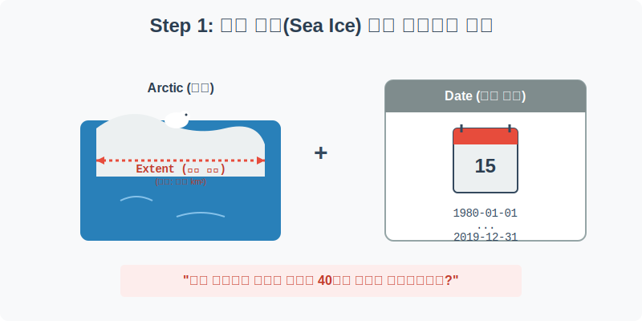
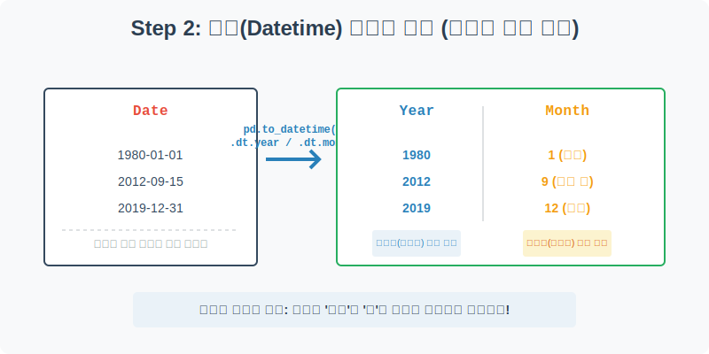
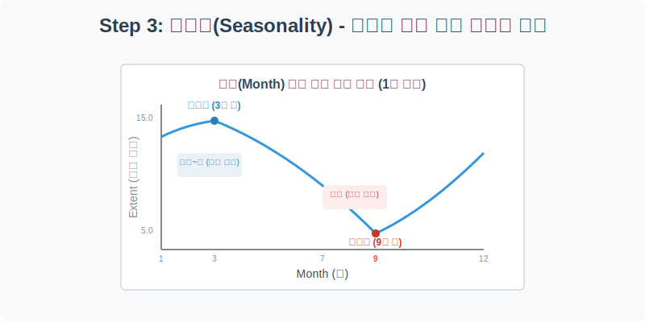
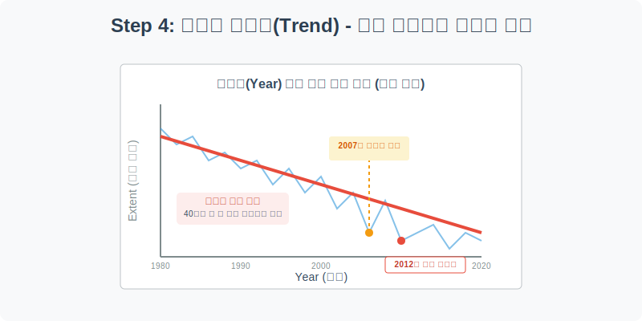

# 실전 데이터 분석 20: 미시적 계절성과 거시적 기후 변화 (Datetime 심화)

## 📌 강의 개요 (30분 완성)
"지구 온난화는 거짓말이다. 북극의 얼음은 겨울이 되면 다시 꽁꽁 얼어붙는다." 기후 변화 회의론자들의 이런 주장에 대해 데이터 분석가는 어떻게 반박해야 할까요? 1980년부터 2019년까지 40년간 매일 측정된 북극 해빙(Sea Ice) 면적 데이터를 통해, 그들의 주장에 숨겨진 통계적 함정을 파헤쳐 봅니다.

**학습 목표:**
* **날짜 분해(`dt.year`, `dt.month`):** 단순한 날짜 데이터에서 '연도'와 '월'을 분리 추출하여 다차원적인 시계열 분석을 준비하는 기법을 복습합니다.
* **미시적 관점 (Seasonality):** 월별(`Month`) 그룹핑을 통해 일 년 주기로 얼음이 얼고 녹는 '계절성' 패턴을 확인합니다.
* **거시적 관점 (Long-term Trend):** 연도별(`Year`) 그룹핑을 통해 40년간 얼음 면적이 회복 불가능한 수준으로 우하향하고 있음을 증명하는 데이터 스토리텔링을 전개합니다.

---

## Step 1: 북극 해빙(Sea Ice) 데이터 구조 (Overview)



수십 년간 위성으로 관측된 북극 얼음 면적 데이터를 불러옵니다.

```python
import pandas as pd
import seaborn as sns
import matplotlib.pyplot as plt

# 그래프 설정
plt.rcParams['font.family'] = 'AppleGothic'
plt.rcParams['axes.unicode_minus'] = False
sns.set_palette("muted")

# Seaice 데이터셋 로드
df = sns.load_dataset('seaice')

# 데이터 구조 및 첫 5행 확인
print(df.info())
display(df.head())
```

### 💡 코드 딥다이브 (Code Deep Dive)
**주요 컬럼(Columns) 해석:**
* `Date`: 위성이 얼음을 관측한 날짜 (1980년 ~ 2019년). 현재 문자열(object)이 아닌 `datetime64` 타입으로 잘 지정되어 있습니다.
* `Extent`: 그날 관측된 북극 해빙의 면적 (단위: 100만 제곱킬로미터). 우리의 분석 대상(Target)입니다.

---

## Step 2: 분석을 위한 날짜 분해 (Preprocess)



데이터가 하루 단위로 촘촘하게 찍혀있어 그대로 그래프를 그리면 너무 복잡합니다. 우리가 알고 싶은 것은 **"일 년 중 언제 얼음이 가장 많이 녹는가?(월별)"** 그리고 **"수십 년간 얼음이 진짜 줄어들고 있는가?(연도별)"**입니다. 따라서 `Date`에서 `Year`와 `Month`를 추출해야 합니다.

```python
# 1. dt 접근자를 사용하여 연도(Year) 추출
df['Year'] = df['Date'].dt.year

# 2. dt 접근자를 사용하여 월(Month) 추출
df['Month'] = df['Date'].dt.month

# 3. 새로운 파생 변수가 잘 추가되었는지 확인
display(df[['Date', 'Year', 'Month', 'Extent']].head())
display(df[['Date', 'Year', 'Month', 'Extent']].tail())
```

### 💡 분석가의 통찰 (Analyst's Insight)
* 이처럼 시계열 분석의 90%는 날짜를 자르고, 쪼개고, 묶는 작업에서 시작됩니다. 이제 `Month`를 축으로 그리면 미시적인 계절 패턴을 볼 수 있고, `Year`를 축으로 그리면 거시적인 기후 패턴을 볼 수 있는 완벽한 준비가 끝났습니다.

---

## Step 3: 미시적 관점 - 계절성(Seasonality) 확인 (Univariate EDA)



기후 변화 회의론자들의 말대로 "얼음은 겨울에 다시 어는지" 월별 흐름을 확인해 보겠습니다.

```python
plt.figure(figsize=(10, 6))

# X축을 '월(Month)', Y축을 '해빙 면적(Extent)'으로 하여 선 그래프 작성
# 기본적으로 해당 월의 40년 치 평균값을 계산하여 선으로 이어줍니다.
sns.lineplot(data=df, x='Month', y='Extent', color='dodgerblue', linewidth=3)

plt.title('북극 해빙 면적의 1년 주기 계절성(Seasonality)', fontsize=16)
plt.xlabel('월 (Month)')
plt.ylabel('해빙 면적 (Extent)')
plt.xticks(range(1, 13)) # 1월부터 12월까지 눈금 표시
plt.grid(True, linestyle='--', alpha=0.6)

plt.show()
```

### 💡 시각화 차트 읽는 법
* 차트가 아름다운 U자 형태를 그리고 있습니다. 
* **최대치 (3월):** 한겨울을 지나 초봄인 3월에 북극 얼음 면적이 15(백만 km²)를 넘으며 연중 최고치를 기록합니다.
* **최소치 (9월):** 여름 내내 맹렬하게 녹아내린 얼음은 9월에 6(백만 km²) 근처까지 떨어지며 연중 최저치를 기록합니다.
* 회의론자들의 말은 **절반만 맞습니다.** 얼음은 겨울(10월~3월)에 확실히 다시 얼어붙어 늘어납니다. 하지만 이 '계절적 반등'만 보고 안심하기엔 이릅니다. 거시적 관점(연도별)의 그래프를 봐야 진짜 진실이 나옵니다.

---

## Step 4: 거시적 관점 - 회복 불가능한 기후 변화 (Multivariate EDA)



이제 눈을 넓혀서, 1980년부터 2019년까지 40년 동안 연도별(`Year`)로 얼음 면적이 어떻게 변해왔는지 확인해 보겠습니다.

```python
plt.figure(figsize=(14, 6))

# X축을 '연도(Year)'로 변경하여 장기 추세 확인
sns.lineplot(data=df, x='Year', y='Extent', color='crimson', linewidth=2.5)

plt.title('40년간 북극 해빙 면적 장기 추세 (지구 온난화 증명)', fontsize=16)
plt.xlabel('연도 (Year)')
plt.ylabel('해빙 면적 평균 (Extent)')
plt.grid(True, linestyle=':', alpha=0.7)

plt.show()
```

### 💡 코드 딥다이브 & 인사이트 (매우 중요!)
* **잔인한 우하향 추세:** 겨울에 아무리 다시 얼음이 꽁꽁 얼어붙는다고(Step 3) 한들, 연평균으로 묶어서 40년을 길게 펴놓고 보면 **단 한 번의 의미 있는 반등조차 없이 끔찍한 속도로 우하향**하고 있습니다. 
* 1980년 연평균 약 12(백만 km²)에 달하던 얼음 면적이, 2019년 무렵에는 약 10(백만 km²)까지 곤두박질쳤습니다. 대한민국 면적의 무려 20배에 달하는 얼음이 영원히 사라진 것입니다.
* **결론 도출:** "겨울에 다시 언다"는 것은 일 년 단위의 미시적 착시일 뿐입니다. 데이터 분석가는 날짜를 `Month`(계절성)와 `Year`(장기 추세)로 분리 시각화함으로써, 회의론자들의 주장을 통계적으로 완벽하게 논파할 수 있습니다.

---

## 🎯 30분 강의 마무리 및 심화 과제

가장 단순해 보이는 `Date`와 `Extent`라는 단 두 개의 컬럼만으로도, 연도와 월을 추출하여 쪼개보면 이렇게나 심오한 지구의 역사를 파헤칠 수 있습니다. 시계열 데이터 시각화 시에는 내가 '계절성(Seasonality)'을 볼 것인지 '장기 추세(Trend)'를 볼 것인지에 따라 기준 축(X축)을 다르게 설정해야 한다는 점을 잊지 마세요.

### 📝 심화 과제 (Advanced Challenge)
1. **히트맵(Heatmap)으로 끝판왕 만들기:** `pivot_df = df.pivot_table(index='Year', columns='Month', values='Extent')` 코드를 사용하여 연도별(행), 월별(열) 면적 평균을 담은 피벗 테이블을 만들어 보세요. 그런 다음 `sns.heatmap(pivot_df, cmap='Blues')`를 그려보세요. 위쪽(과거)은 짙은 파란색(얼음 많음)인데, 아래쪽(현재)으로 올수록 특히 9월 부근이 하얗게 텅텅 비어가는(얼음 소멸) 소름 돋는 장면을 한 장의 예술 같은 차트로 뽑아낼 수 있습니다.
