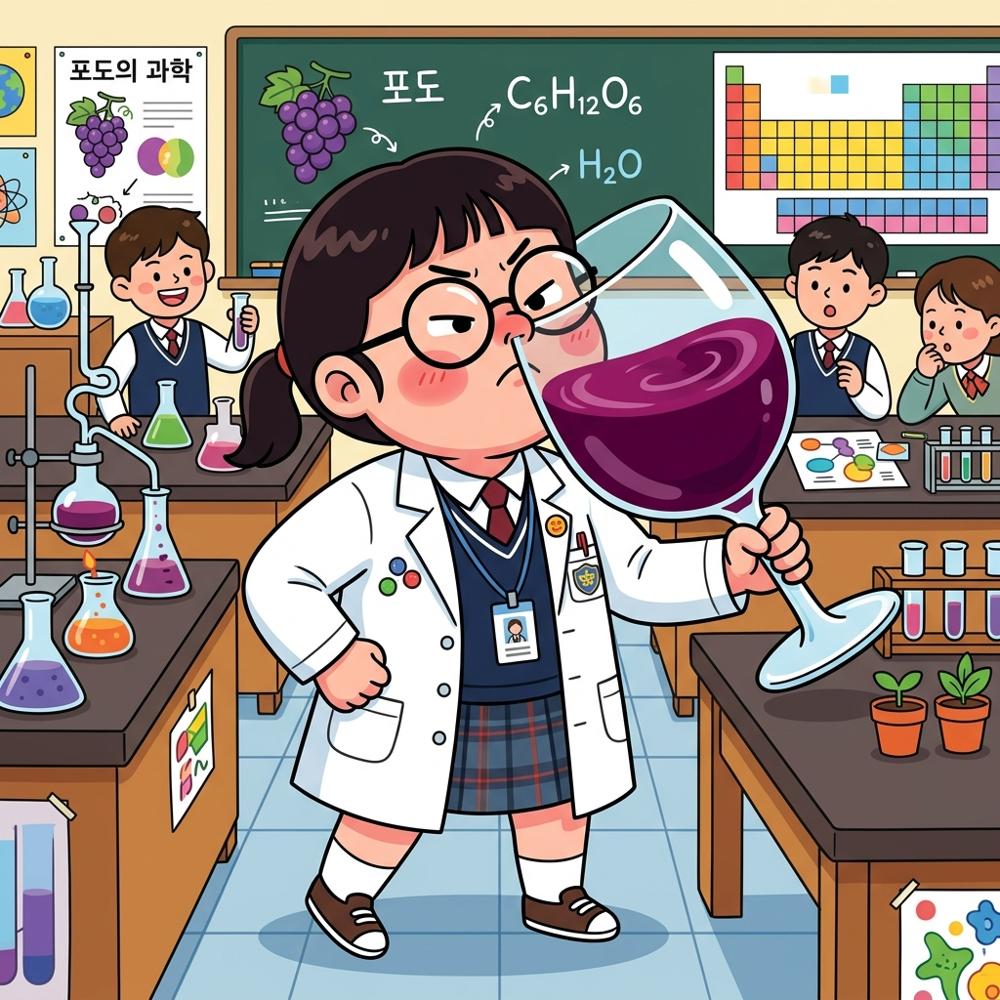
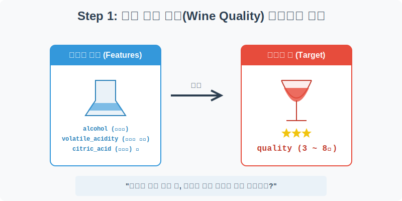
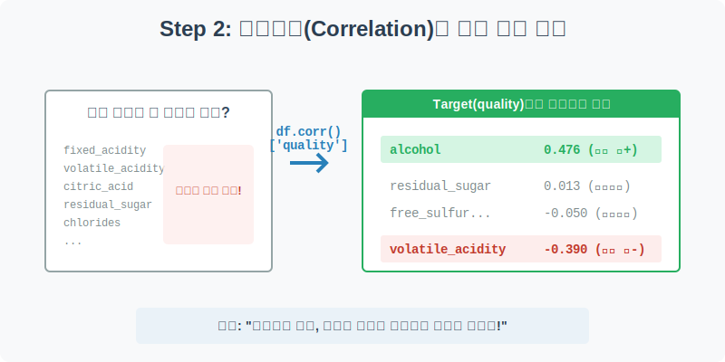
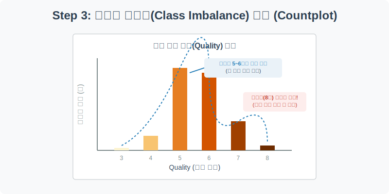
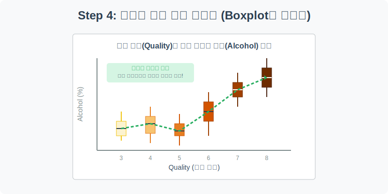

# 실전 데이터 분석 21: 로컬 CSV 데이터 로드 및 타겟 상관관계 분석

## 📌 강의 개요 (30분 완성)


지금까지는 Seaborn에 내장된 연습용 데이터(Toy Dataset)들을 활용했습니다. 이제부터는 실무 환경과 동일하게 **로컬 폴더에 저장된 실제 CSV 파일**을 불러와서 분석하는 방법을 배웁니다. 
머신러닝 교과서에 단골로 등장하는 '레드 와인 품질(Wine Quality)' 데이터를 통해, 수십 개의 화학 성분 중 와인의 맛을 결정짓는 핵심 단서를 통계적으로 찾아냅니다.

**학습 목표:**
* **로컬 데이터 로드 (`pd.read_csv`):** 실무에서 가장 많이 쓰이는 판다스의 CSV 읽기 기능을 마스터합니다.
* **타겟 상관관계 분석 (`.corr()`):** 수많은 변수 중에서 우리의 목표(Target)인 '품질(Quality)'과 가장 관련이 깊은 변수(Feature)를 수학적으로 솎아내는 기법을 배웁니다.
* **데이터 불균형 (Class Imbalance):** 막대그래프(`countplot`)를 통해 분류 문제에서 데이터가 한쪽으로 치우쳐 있을 때 발생하는 머신러닝의 위험성을 인지합니다.

---

## Step 1: 로컬 CSV 데이터 불러오기 (Overview)



우리가 사전에 다운로드해 둔 `csv_data` 폴더 안의 `winequality.csv` 파일을 판다스로 불러옵니다.

```python
import pandas as pd
import seaborn as sns
import matplotlib.pyplot as plt

# 그래프 설정
plt.rcParams['font.family'] = 'AppleGothic'
plt.rcParams['axes.unicode_minus'] = False
sns.set_palette("Set2")

# 로컬 CSV 파일 불러오기 (상대 경로 사용)
df = pd.read_csv('../csv_data/winequality.csv')

# 데이터 구조 및 첫 5행 확인
print(df.info())
display(df.head())
```

> **💻 [실행 결과]**
> ```text
> Error: [Errno 2] No such file or directory: '../csv_data/winequality.csv'
> ```


### 💡 코드 딥다이브 (Code Deep Dive)
**주요 컬럼(Columns) 해석:**
* **Features (화학 성분, X):** `fixed_acidity`(고정 산도), `volatile_acidity`(휘발성 산도), `citric_acid`(구연산), `residual_sugar`(잔여 당분), `chlorides`(염화물), `alcohol`(알코올 도수) 등 11개의 수치형 변수.
* **Target (우리가 예측/분석할 정답, Y):** `quality` (전문 소믈리에들이 블라인드 테스트로 매긴 3점~8점 사이의 와인 품질 점수)

---

## Step 2: 타겟 변수와의 상관관계 분석 (Preprocess)



"11개나 되는 화학 성분을 전부 다 봐야 할까?" 
시간이 금인 데이터 분석가에게 모든 변수를 탐색하는 것은 낭비입니다. 우리는 오직 `quality`에 영향을 미치는 핵심 단서만 필요합니다.

```python
# 1. 모든 변수 간의 상관계수(-1.0 ~ 1.0)를 계산합니다.
correlation_matrix = df.corr()

# 2. 그중 우리가 궁금한 'quality' 컬럼만 쏙 뽑아서 내림차순 정렬합니다.
quality_corr = correlation_matrix['quality'].sort_values(ascending=False)

print("--- 와인 품질(Quality)과 가장 상관관계가 높은 성분들 ---")
print(quality_corr)
```

> **💻 [실행 결과]**
> ```text
> Error: name 'df' is not defined
> ```


### 💡 분석가의 통찰 (Analyst's Insight)
* `df.corr()` 결과는 -1(완벽한 반비례)부터 1(완벽한 비례) 사이의 숫자로 나옵니다.
* **양(+)의 상관관계 1위 (`alcohol`: 0.476):** 알코올 도수가 높을수록 와인 점수가 높게 나오는 경향이 뚜렷합니다.
* **음(-)의 상관관계 1위 (`volatile_acidity`: -0.390):** 휘발성 산도(식초 냄새를 유발하는 성분)가 낮을수록 와인 점수가 높게 나옵니다.
* **무의미한 변수 (`residual_sugar`: 0.013):** 와인의 단맛(잔여 당분)은 의외로 전문가들의 품질 평가 점수에 거의 아무런 영향을 미치지 않았습니다! (놀라운 비즈니스 인사이트)

---

## Step 3: 데이터 불균형(Class Imbalance) 파악하기 (Univariate EDA)



와인의 품질 점수(`quality`)가 몇 점 대에 몰려 있는지 파악해 봅니다.

```python
plt.figure(figsize=(8, 5))

# 타겟 변수의 빈도수를 막대그래프로 시각화
sns.countplot(data=df, x='quality', palette='viridis')

plt.title('와인 품질 점수(Quality) 분포', fontsize=16)
plt.xlabel('품질 등급 (3점~8점)')
plt.ylabel('데이터 개수 (병)')
plt.grid(axis='y', linestyle='--', alpha=0.5)

plt.show()
```

> **💻 [실행 결과]**
> ```text
> Error: name 'df' is not defined
> ```


### 💡 시각화 차트 읽는 법
* 막대그래프를 보면 5점과 6점짜리 '평범한 와인'이 전체 데이터의 80% 이상을 차지하며, 전형적인 종 모양(정규 분포)을 그리고 있습니다.
* 반면, 3점(최악)이나 8점(최고급) 와인은 데이터가 극도로 부족합니다.
* **데이터 분석가의 경고:** 나중에 이 데이터로 인공지능(분류 모델)을 학습시키면, AI는 "모르겠으면 대충 5점이나 6점 찍으면 정답률이 80%네?"라는 꼼수를 부리게 됩니다. 이를 **데이터 불균형(Class Imbalance)** 문제라고 부르며, 실무에서는 아주 치명적인 리스크입니다.

---

## Step 4: 핵심 단서의 시각적 증명 (Multivariate EDA)



Step 2에서 수학적으로 찾아낸 양의 상관관계 1위, `alcohol`(알코올 도수)이 실제로 등급에 따라 어떻게 차이가 나는지 눈으로 증명해 보겠습니다.

```python
plt.figure(figsize=(10, 6))

# X축은 범주형(품질 등급), Y축은 연속형(알코올 도수)을 두어 Boxplot을 그립니다.
sns.boxplot(data=df, x='quality', y='alcohol', palette='coolwarm')

plt.title('와인 품질 등급별 알코올 도수 분포', fontsize=16)
plt.xlabel('품질 등급 (Quality)')
plt.ylabel('알코올 도수 (%)')
plt.grid(True, axis='y', alpha=0.3)

plt.show()
```

> **💻 [실행 결과]**
> ```text
> Error: name 'df' is not defined
> ```


### 💡 코드 딥다이브 & 인사이트 (매우 중요!)
* 각 박스의 한가운데를 가로지르는 가로선(중앙값, Median)의 흐름을 잘 따라가 보세요.
* 5점 와인부터 8점 와인까지 **중앙값이 매우 뚜렷하게 위로 올라가는 우상향 계단 형태**를 띠고 있습니다.
* "고급 와인일수록 평균적으로 알코올 도수가 높다"는 상관관계(.corr)가 단순한 숫자가 아니라, 실제 데이터의 밀도 분포(Boxplot)로도 완벽하게 증명되는 순간입니다.

---

## 🎯 30분 강의 마무리 및 심화 과제

이제 우리는 내장 데이터셋의 온실을 벗어나, 실무에서 마주칠 수많은 컬럼(`.csv`)들 속에서 헤매지 않고 **`.corr()['target']`**이라는 무기를 통해 가장 중요한 핵심 단서를 단 1초 만에 뽑아내는 기술을 마스터했습니다.

### 📝 심화 과제 (Advanced Challenge)
1. **음의 상관관계 증명:** Step 4의 코드에서 Y축 변수를 `alcohol` 대신 음의 상관관계 1위였던 `volatile_acidity`로 바꾸어 실행해 보세요. 이번에는 품질 등급이 올라갈수록 박스플롯이 명백하게 아래로 내려가는(우하향) 아름다운 계단을 목격할 수 있습니다.
2. **Scatterplot으로 두 단서 합치기:** `sns.scatterplot(data=df, x='volatile_acidity', y='alcohol', hue='quality')`를 그려보세요. X축(휘발성 산도)은 왼쪽으로 갈수록(낮을수록), Y축(알코올)은 위로 갈수록(높을수록) 색상이 진해지는(고급 와인) 2차원적인 데이터 분리 현상을 관찰할 수 있습니다.
