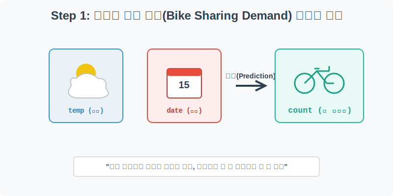
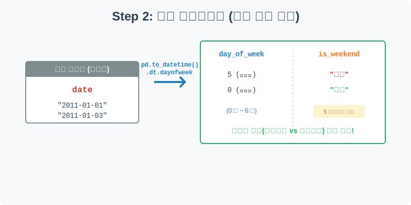
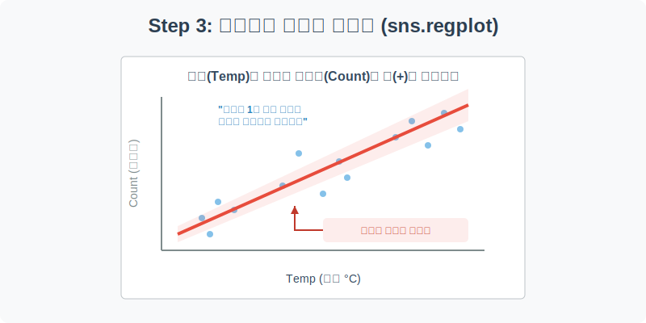
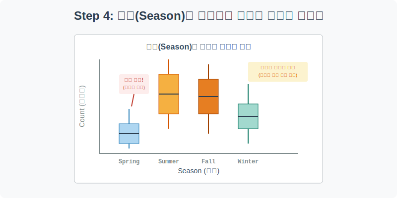

# 실전 데이터 분석 22: 시계열 피처 엔지니어링과 회귀 시각화

## 📌 강의 개요 (30분 완성)
우버(Uber)나 따릉이 같은 모빌리티 서비스에서 가장 중요한 것은 무엇일까요? 바로 "내일 몇 대의 자전거가 필요할까?"를 예측하는 것입니다. 날씨, 온도, 계절, 그리고 요일 등 수많은 외부 환경 요인이 사람들의 이동 수요에 어떤 영향을 미치는지 데이터로 증명해 봅니다.

**학습 목표:**
* **피처 엔지니어링 (Feature Engineering):** 단순한 날짜 텍스트에서 요일(`dayofweek`)을 뽑아내고, 이를 다시 '주말 여부(`is_weekend`)'라는 새로운 통찰력 있는 변수로 창조해 내는 연금술을 배웁니다.
* **회귀 시각화 (`sns.regplot`):** 기온과 자전거 대여량처럼 연속된 두 숫자의 관계를 점으로 찍고, 그 사이를 관통하는 수학적 최적의 직선(회귀선)을 그려 추세를 증명합니다.
* **환경적 지배력 확인 (Boxplot):** 기온 같은 세부 수치뿐만 아니라 '계절(Season)'이라는 거시적 카테고리가 비즈니스 매출에 얼마나 절대적인 영향을 미치는지 시각화합니다.

---

## Step 1: 자전거 수요 예측 데이터 구조 (Overview)



머신러닝 대회(Kaggle 등)의 단골 손님인 자전거 대여 수요 예측용 로컬 CSV 데이터를 불러옵니다.

```python
import pandas as pd
import seaborn as sns
import matplotlib.pyplot as plt

# 그래프 설정
plt.rcParams['font.family'] = 'AppleGothic'
plt.rcParams['axes.unicode_minus'] = False
sns.set_palette("colorblind")

# 로컬 CSV 파일 불러오기 (상대 경로)
df = pd.read_csv('../csv_data/bike_sharing.csv')

# 데이터 구조 및 첫 5행 확인
print(df.info())
display(df.head())
```

### 💡 코드 딥다이브 (Code Deep Dive)
**주요 컬럼(Columns) 해석:**
* **환경 요인 (X):** `date`(날짜), `season`(계절), `temp`(평균 기온), `humidity`(습도), `windspeed`(풍속).
* **예측 타겟 (Y):** `count` (그날 자전거가 대여된 총 횟수). 우리의 궁극적인 목표는 날씨와 날짜 정보를 보고 `count`를 맞추는 것입니다.

---

## Step 2: Datetime 피처 엔지니어링의 마법 (Preprocess)



사람들의 이동 패턴은 평일(출퇴근)과 주말(레저/소풍)에 완전히 다릅니다. 하지만 지금 우리 데이터에는 `date`라는 무미건조한 텍스트 덩어리밖에 없습니다. 여기서 황금을 캐내어 봅시다.

```python
# 1. 텍스트(Object)로 된 날짜를 진짜 Datetime(시간 객체)으로 변환
df['date'] = pd.to_datetime(df['date'])

# 2. 요일을 숫자로 추출 (0: 월요일 ~ 6: 일요일)
df['day_of_week'] = df['date'].dt.dayofweek

# 3. 람다(lambda) 함수를 이용해 5,6(토,일)이면 '주말', 아니면 '평일'이라는 글자를 입력
df['is_weekend'] = df['day_of_week'].apply(lambda x: '주말' if x >= 5 else '평일')

# 마법이 성공했는지 샘플 확인
display(df[['date', 'day_of_week', 'is_weekend', 'count']].sample(5))
```

### 💡 분석가의 통찰 (Analyst's Insight)
* 원본 데이터에는 없었던 `day_of_week`와 `is_weekend`라는 파생 컬럼을 우리가 직접 창조했습니다. 
* 기계(AI)는 `date` 텍스트만 보고 평일인지 주말인지 스스로 깨닫지 못합니다. 분석가가 이렇게 사람의 직관(도메인 지식)을 수학적 변수로 깎아서 먹여주는 과정을 **피처 엔지니어링(Feature Engineering)**이라고 하며, 데이터 과학에서 가장 비싸고 귀한 기술입니다.

---

## Step 3: 기온과 수요의 회귀 시각화 (Univariate EDA)



상식적으로 날씨가 따뜻할수록 자전거를 많이 탈 것 같습니다. 이 막연한 짐작을 `regplot`을 통해 수학적으로 팩트체크해 봅시다.

```python
plt.figure(figsize=(10, 6))

# X축은 기온(temp), Y축은 대여량(count)
# scatter_kws: 점의 투명도(alpha)와 색상 조절
# line_kws: 회귀선의 두께와 색상 조절
sns.regplot(data=df, x='temp', y='count', 
            scatter_kws={'alpha': 0.4, 'color': 'steelblue'},
            line_kws={'color': 'crimson', 'linewidth': 3})

plt.title('기온(Temp) 상승에 따른 자전거 대여량 증가 폭 (회귀선)', fontsize=16)
plt.xlabel('평균 기온 (Celsius)')
plt.ylabel('총 대여량 (Count)')
plt.grid(True, linestyle=':', alpha=0.7)

plt.show()
```

### 💡 시각화 차트 읽는 법
* 점들이 뭉게구름처럼 퍼져 있긴 하지만, 가운데를 관통하는 **빨간색 회귀선(Regression Line)**이 아주 매끄럽게 우상향하고 있습니다.
* 회귀선 주변의 옅은 그림자는 '신뢰구간'입니다. 선명한 우상향 선폭은 "기온이 1도 오를 때마다 평균적으로 몇 대의 자전거가 더 대여된다"라는 강력한 양(+)의 상관관계를 통계적으로 증명합니다.

---

## Step 4: 거시적 환경 요인 비교 시각화 (Multivariate EDA)



기온 1~2도 차이도 중요하지만, 애초에 '계절(Season)'이라는 거대한 환경 요인이 비즈니스의 판도를 어떻게 흔드는지 박스플롯으로 확인해 봅니다.

```python
plt.figure(figsize=(10, 6))

# 봄, 여름, 가을, 겨울의 논리적인 시간 순서를 리스트로 정의
season_order = ['Spring', 'Summer', 'Fall', 'Winter']

# 계절별 대여량 박스플롯 (order 파라미터로 순서 강제)
sns.boxplot(data=df, x='season', y='count', order=season_order, palette='Set2')

plt.title('계절(Season)이 자전거 대여 수요에 미치는 절대적 영향력', fontsize=16)
plt.xlabel('계절 (Season)')
plt.ylabel('총 대여량 (Count)')
plt.grid(axis='y', linestyle='--', alpha=0.5)

plt.show()
```

### 💡 코드 딥다이브 & 인사이트 (매우 중요!)
* 결과를 보면 여름(Summer)과 가을(Fall)의 대여량이 압도적으로 높습니다. (박스가 위에 있음)
* 겨울(Winter)에는 대여량이 떨어집니다. 추우니까 당연하죠.
* **충격적인 인사이트:** 그런데 벚꽃 피는 **봄(Spring)의 대여량이 가장 낮습니다!** 대체 왜일까요?
  * 우리가 보통 생각하는 따뜻한 봄(5월)과 달리, 기상 관측상 초봄(3월, 4월)은 꽃샘추위와 잦은 비바람으로 인해 자전거 타기에 매우 가혹한 환경이기 때문입니다. 데이터를 시각화하지 않고 막연한 상식에만 의존했다면(봄이니까 많이 타겠지?), 봄철 자전거 재고 배치 전략에서 대참사가 났을 것입니다.

---

## 🎯 30분 강의 마무리 및 심화 과제

주어진 데이터를 그대로 쓰는 수동적인 자세에서 벗어나, `pd.to_datetime`을 무기로 날짜를 분해하여 요일과 주말 여부를 뽑아내는 **피처 엔지니어링**의 강력함을 맛보았습니다. 아울러 `regplot`과 `boxplot`을 섞어 쓰며 기온과 계절이 매출(Count)에 미치는 영향을 완벽하게 논파했습니다.

### 📝 심화 과제 (Advanced Challenge)
1. **평일과 주말 비교:** Step 2에서 직접 만든 피처인 `is_weekend` 컬럼을 X축으로, `count`를 Y축으로 하는 막대그래프(`sns.barplot`)를 그려보세요. 통념상 레저용인 주말 대여량이 더 많을 것 같지만, 실제 데이터는 평일(출퇴근용) 수요가 주말보다 빵빵하게 받쳐준다는 반전 결과를 보여줄 것입니다.
2. **다차원 산점도 (Bubble Chart):** `sns.scatterplot`을 열고 X축은 기온(`temp`), Y축은 습도(`humidity`), 색상(`hue`)은 `is_weekend`로 지정하세요. 그리고 점의 크기(`size`)를 `count`로 넣으면 기온, 습도, 주말 여부, 대여량이라는 무려 4개의 차원을 한 장의 차트에서 설명하는 기적을 연출할 수 있습니다.
