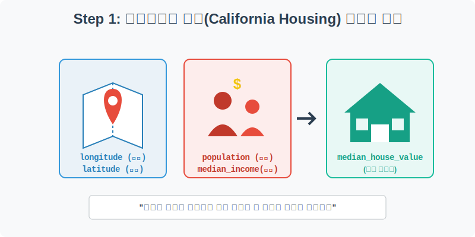
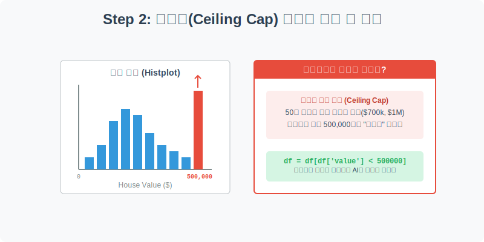
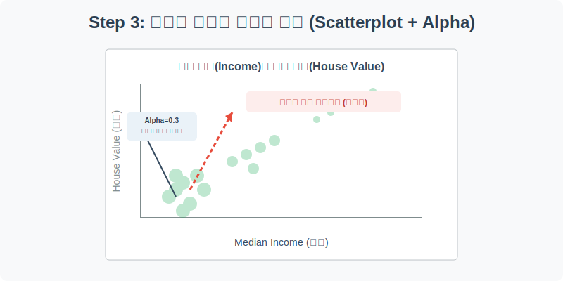
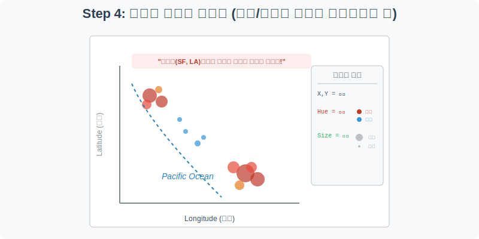

# 실전 데이터 분석 23: 인위적 이상치(Ceiling Cap) 제거와 4차원 지리 데이터

## 📌 강의 개요 (30분 완성)


머신러닝 부동산 예측 모델의 교과서라 불리는 **캘리포니아 주택 가격(California Housing)** 데이터 셋입니다. 이 데이터에는 데이터 수집 과정의 한계로 인해 발생한 끔찍한 이상치(Outlier)가 숨어 있습니다. 이를 찾아내어 제거하고, 지리적 위경도 데이터를 활용해 캘리포니아 지도를 데이터만으로 복원해 내는 화려한 4차원 시각화를 경험해 봅니다.

**학습 목표:**
* **상한값 캡(Ceiling Cap) 이상치 식별:** `sns.histplot`을 통해 데이터 수집 시스템이 측정 한곗값을 넘어가는 데이터를 어떻게 뭉뚱그려 기록하는지(이상치) 눈으로 직접 확인합니다.
* **데이터 필터링:** 판다스의 조건부 인덱싱을 활용하여 머신러닝 모델의 학습을 방해하는 찌그러진 이상치를 과감히 잘라냅니다.
* **4차원 지리적 산점도 (Geographic Scatterplot):** X축과 Y축(위치), Hue(색상=집값), Size(크기=인구수)를 총동원하여 단순한 점들의 집합을 '인구와 자본이 몰리는 해변가 지도'로 승화시킵니다.

---

## Step 1: 캘리포니아 집값 데이터 구조 (Overview)



우리가 미리 다운로드해 둔 `csv_data` 폴더 안의 `california_housing.csv` 파일을 판다스로 불러옵니다.

```python
import pandas as pd
import seaborn as sns
import matplotlib.pyplot as plt

# 그래프 설정
plt.rcParams['font.family'] = 'AppleGothic'
plt.rcParams['axes.unicode_minus'] = False
sns.set_palette("Set2")

# 로컬 CSV 파일 불러오기
df = pd.read_csv('../csv_data/california_housing.csv')

# 데이터 구조 및 첫 5행 확인
print(df.info())
display(df.head())
```

> **💻 [실행 결과]**
> ```text
> Error: [Errno 2] No such file or directory: '../csv_data/california_housing.csv'
> ```


### 💡 코드 딥다이브 (Code Deep Dive)
**주요 컬럼(Columns) 해석:**
* **지리적 요인:** `longitude`(경도), `latitude`(위도). (이 둘을 X, Y축에 놓으면 지도가 됩니다!)
* **경제/인구 요인:** `median_income`(해당 구역 주민들의 평균 소득), `population`(구역 인구수)
* **예측 타겟 (Y):** `median_house_value` (해당 구역 주택의 중간 가격, 달러 $)

---

## Step 2: 상한값(Ceiling Cap) 이상치 확인하기 (Preprocess)



현실의 데이터를 다루다 보면, 특정 값을 넘어가는 데이터를 제대로 측정하지 못하고 '최댓값'으로 퉁쳐서 기록하는 경우가 많습니다. 집값(`median_house_value`)의 분포를 히스토그램으로 확인해 봅시다.

```python
plt.figure(figsize=(10, 5))

# 집값 데이터의 분포(히스토그램) 확인
# bins=50 : 데이터를 50개의 구간으로 쪼개서 막대를 세움
sns.histplot(data=df, x='median_house_value', bins=50, color='steelblue')

plt.title('캘리포니아 주택 가격 분포 (우측 끝의 비정상적인 막대 확인)', fontsize=16)
plt.xlabel('집값 (Median House Value, $)')
plt.ylabel('데이터 개수 (구역 수)')
plt.grid(True, linestyle=':', alpha=0.6)

plt.show()
```

> **💻 [실행 결과]**
> ```text
> Error: name 'df' is not defined
> ```


### 💡 분석가의 통찰 (Analyst's Insight)
* 그래프를 보면 일반적인 종 모양(정규분포)을 띠다가, 그래프의 가장 오른쪽 끝(**$500,000 부근**)에 비정상적으로 높이 솟아오른 막대가 보입니다.
* 만약 이 데이터를 그대로 머신러닝 AI에게 먹이면, AI는 "아, 조건이 아무리 좋아도 집값은 무조건 50만 달러가 한계구나"라고 잘못 학습하게 됩니다. 따라서 이 이상치는 반드시 잘라내야(Drop) 합니다.

> 💡 **[수포자를 위한 통계 돋보기: 사분위수(IQR)와 이상치 울타리]**  
> 데이터 분석에서 '어디서부터 이상치(Outlier)로 보고 쳐낼 것인가?'는 늘 어려운 문제입니다. 통계학에서는 **IQR (Interquartile Range)**이라는 아주 직관적인 공식을 사용합니다.
> 
> 데이터를 크기 순으로 일렬로 세운 뒤 4등분(25%, 50%, 75%)합니다.
> - **$Q1$:** 하위 25% 지점
> - **$Q3$:** 상위 25% 지점 (즉, 75% 지점)
> - **$IQR = Q3 - Q1$:** 상위권과 하위권의 차이 (즉, 중간에 몰려 있는 50%의 덩치)
> 
> **이상치 울타리(Fence) 공식:**
> - 최대 허용선 (Upper Limit): $Q3 + (1.5 \times IQR)$
> - 최소 허용선 (Lower Limit): $Q1 - (1.5 \times IQR)$
> 
> 박스플롯(Boxplot)의 수염(Whisker)이 바로 이 공식으로 그려집니다! 이 울타리를 넘어가는 데이터들은 가차 없이 '이상치 점(Dot)'으로 찍어내어 우리에게 경고해 줍니다.

---

## Step 3: 이상치 필터링 및 산점도 밀집도 파악 (Univariate EDA)



50만 달러 미만의 정상적인 데이터만 남긴 후, 상식적으로 '주민들의 소득(`median_income`)이 높을수록 집값(`median_house_value`)이 비쌀 것이다'라는 가설을 확인해 보겠습니다.

```python
# 판다스 조건부 인덱싱: 집값이 500,000 이하인 정상 데이터만 필터링
df_filtered = df[df['median_house_value'] < 500000]

plt.figure(figsize=(10, 6))

# 소득과 집값의 산점도 (alpha로 투명도를 주어 밀집도 파악)
sns.scatterplot(data=df_filtered, x='median_income', y='median_house_value', 
                alpha=0.3, color='forestgreen', edgecolor=None)

plt.title('평균 소득(Income)과 주택 가격(House Value)의 양의 상관관계', fontsize=16)
plt.xlabel('평균 소득 (만 달러 단위)')
plt.ylabel('주택 가격 ($)')
plt.grid(True, linestyle='--', alpha=0.5)

plt.show()
```

> **💻 [실행 결과]**
> ```text
> Error: name 'df' is not defined
> ```


### 💡 시각화 차트 읽는 법
* 예상대로 소득이 높은 동네일수록 집값도 우상향하는 강한 **양의 상관관계**를 보입니다. 
* `alpha=0.3`으로 투명도를 주었기 때문에 점이 겹칠수록 색이 진해집니다. 시선을 진한 곳에 둬보세요.
* 왼쪽 아래(소득 2~4만 달러, 집값 10~20만 달러)에 아주 짙은 숲처럼 뭉쳐 있는 곳이 바로 평범한 대다수 서민층/중산층의 거주지임을 알 수 있습니다.

---

## Step 4: 위경도를 활용한 4차원 지리적 산점도 (Multivariate EDA)



이제 캘리포니아 집값 분석의 꽃, 지리적 산점도를 그려보겠습니다. 위치(X, Y)에 더해 집값(색상)과 인구수(크기)까지 4개의 차원을 한 장의 차트에 담아냅니다.

```python
plt.figure(figsize=(10, 8))

# x=경도, y=위도로 설정하면 신기하게도 캘리포니아 지도 모양이 찍힙니다.
sns.scatterplot(data=df_filtered, 
                x='longitude', y='latitude', 
                hue='median_house_value',  # 색상: 집값 (비쌀수록 붉은색 계열)
                size='population',         # 크기: 인구수 (많을수록 큰 원)
                sizes=(10, 200),           # 점의 최소~최대 크기 조정
                palette='coolwarm', alpha=0.7, edgecolor=None)

plt.title('캘리포니아 지역별 집값 및 인구 집중도 (4차원 맵핑)', fontsize=16)
plt.xlabel('경도 (Longitude)')
plt.ylabel('위도 (Latitude)')

# 범례(Legend)가 그래프를 가리지 않도록 바깥으로 빼줍니다.
plt.legend(bbox_to_anchor=(1.05, 1), loc='upper left')
plt.tight_layout()
plt.show()
```

> **💻 [실행 결과]**
> ```text
> Error: name 'df_filtered' is not defined
> ```


### 💡 코드 딥다이브 & 인사이트 (매우 중요!)
* 차트를 보면 신기하게도 왼쪽이 바다를 향해 비스듬하게 깎인 **캘리포니아주의 지도 모양**이 선명하게 나타납니다.
* **빨간색의 거대한 점들:** 좌측 하단(LA, 샌디에이고)과 중단 해안가(샌프란시스코 湾) 부근에 집값이 비싸고(빨간색) 인구가 밀집된(큰 원) 구역이 몰려 있습니다.
* **파란색의 작은 점들:** 우측 상단의 내륙 지방이나 데스밸리 사막 쪽으로는 인구도 적고(작은 원) 집값도 매우 저렴합니다(파란색).
* **결론 도출:** "바다에 가까운 대도시 해변가일수록 사람과 자본이 몰려 집값이 비싸다"는 부동산 불변의 진리를, 진짜 지도를 불러오지 않고 단지 위도와 경도 숫자표만으로 완벽하게 그려냈습니다.

---

## 🎯 30분 강의 마무리 및 심화 과제

이상치를 눈으로 확인하고 과감히 제거하는(`df[df['val'] < 500000]`) 실무적 판단과, `sns.scatterplot`의 `x, y, hue, size`를 영혼까지 끌어올려 한 장의 예술적인 지도를 그려내는 4차원 시각화 기법을 마스터했습니다.

### 📝 심화 과제 (Advanced Challenge)
1. **바다와의 거리 범주형 분석:** Step 4의 그래프에서 `hue` 옵션을 연속형 숫자가 아니라 `ocean_proximity`(바다 근접도: INLAND, NEAR OCEAN 등)라는 범주형 문자로 바꿔서 그려보세요. 캘리포니아가 내륙과 해변으로 어떻게 지리적으로 쪼개지는지 명확한 층을 볼 수 있습니다.
2. **Boxplot으로 팩트 체크:** `sns.boxplot`을 그리고 X축은 `ocean_proximity`, Y축은 `median_house_value`로 설정해 보세요. 앞서 지도로 확인했던 "정말로 해변가가 비싸고 내륙(INLAND)이 저렴한가?"에 대한 통계적 차이를 박스플롯으로 쐐기를 박을 수 있습니다.
