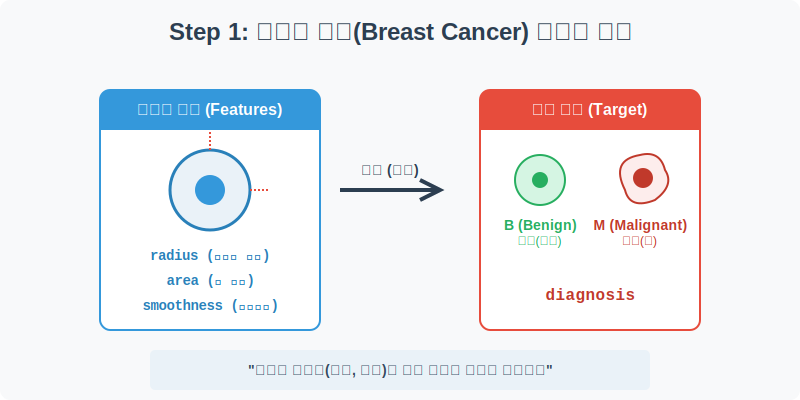
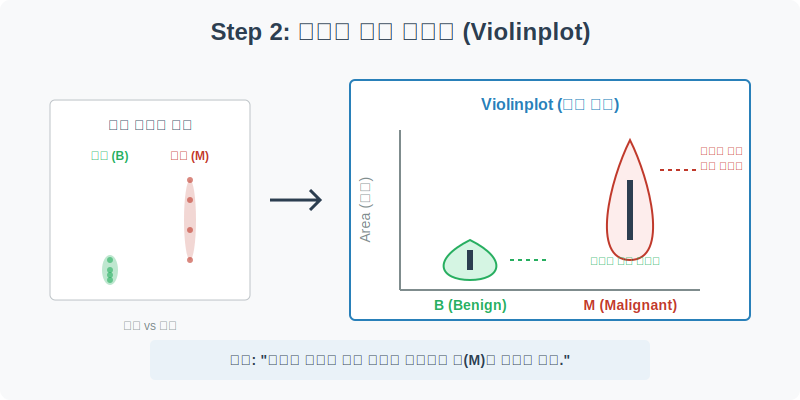
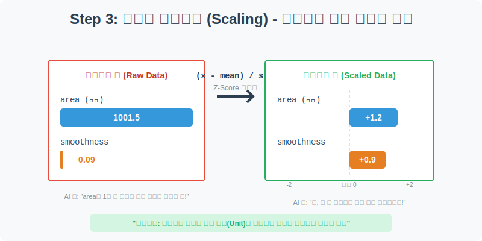
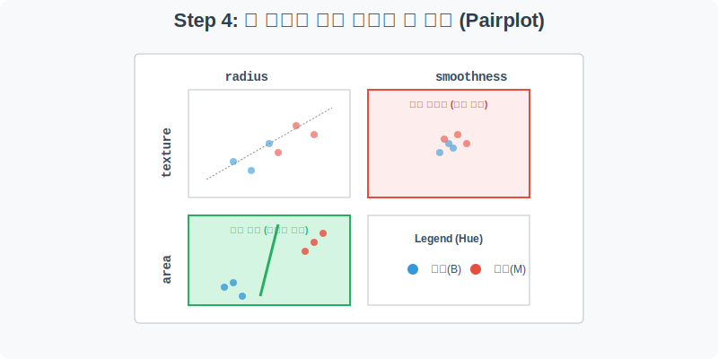

# 실전 데이터 분석 24: 유방암 종양 진단 (Violinplot과 Pairplot)

## 📌 강의 개요 (30분 완성)
의료 인공지능(Medical AI) 분야에서 가장 널리 쓰이는 표준 데이터인 **유방암 진단(Breast Cancer)** 데이터입니다. 세포 핵의 크기와 모양을 수치화한 데이터를 바탕으로, 이것이 단순한 혹(양성)인지 치명적인 암(악성)인지 판별하는 머신러닝 분류(Classification)의 기초를 다집니다.

**학습 목표:**
* **밀도 시각화 (`sns.violinplot`):** 박스플롯이 보여주지 못하는 '데이터가 어느 구간에 뚱뚱하게 뭉쳐 있는지'를 바이올린 모양으로 시각화하여 두 집단의 형태적 차이를 직관적으로 비교합니다.
* **데이터 스케일링 (Z-Score):** '코끼리의 몸무게'와 '쥐의 꼬리 길이'처럼 단위(Unit)가 완전히 다른 변수들을 공평하게 비교하기 위해 평균 0, 표준편차 1로 스케일링(Standardization)하는 기법을 배웁니다.
* **다차원 산점도 행렬 (`sns.pairplot`):** 수십 개의 변수 중 어떤 조합이 암(M)과 정상(B)을 가장 완벽하게 갈라치기할 수 있는지 한 장의 행렬 차트로 찾아내는 궁극기를 마스터합니다.

---

## Step 1: 유방암 진단 데이터 구조 (Overview)



`csv_data` 폴더 안의 `breast_cancer.csv` 파일을 판다스로 불러옵니다.

```python
import pandas as pd
import seaborn as sns
import matplotlib.pyplot as plt

# 그래프 설정
plt.rcParams['font.family'] = 'AppleGothic'
plt.rcParams['axes.unicode_minus'] = False
sns.set_palette("colorblind")

# 로컬 CSV 파일 불러오기
df = pd.read_csv('../csv_data/breast_cancer.csv')

# 데이터 구조 및 첫 5행 확인
print(df.info())
display(df.head())
```

### 💡 코드 딥다이브 (Code Deep Dive)
**주요 컬럼(Columns) 해석:**
* **세포 특성 (Features, X):** `radius_mean`(반지름), `texture_mean`(질감), `perimeter_mean`(둘레), `area_mean`(면적), `smoothness_mean`(매끄러움) 등 세포 핵의 기하학적 특성을 측정한 수치형 데이터들.
* **예측 타겟 (Y):** `diagnosis` (전문의의 최종 진단 결과. `M` = Malignant 악성/암, `B` = Benign 양성/정상)

---

## Step 2: 진단 결과별 세포 크기 밀도 비교 (Univariate EDA)



악성 종양(암)은 정상 세포에 비해 크기가 비대하고 불규칙하게 증식하는 특징이 있습니다. 이를 `violinplot`을 통해 세포의 면적(`area_mean`)이 어떻게 뭉쳐 있는지 시각적으로 증명해 봅시다.

```python
plt.figure(figsize=(8, 6))

# 진단(diagnosis)별 면적(area_mean) 분포 밀도를 바이올린 플롯으로 시각화
sns.violinplot(data=df, x='diagnosis', y='area_mean', 
               palette={'B': '#2ecc71', 'M': '#e74c3c'}, inner='quartile')

plt.title('양성(B) vs 악성(M) 종양의 면적 밀도 비교', fontsize=16)
plt.xlabel('진단 결과 (B: 양성, M: 악성)')
plt.ylabel('종양 면적 (Area)')
plt.grid(True, axis='y', linestyle='--', alpha=0.5)

plt.show()
```

### 💡 분석가의 통찰 (Analyst's Insight)
* **B (양성, 정상):** 초록색 바이올린을 보면 아래쪽(면적 500 부근)에 아주 뚱뚱하게 뭉쳐 있습니다. 정상 세포들은 크기가 작고 일정하게 유지됨을 의미합니다.
* **M (악성, 암):** 빨간색 바이올린은 평균적으로 위치가 훨씬 높으며(1000 이상), 위아래로 길쭉하게 찢어져(분산이 큼) 있습니다. 암세포는 제멋대로 커지며 통제 불능 상태임을 시각적으로 완벽하게 증명합니다.

---

## Step 3: 머신러닝을 위한 데이터 스케일링 (Preprocess)



종양 면적(`area_mean`)은 기본적으로 1,000 단위입니다. 반면 매끄러움(`smoothness_mean`)은 0.09 같은 아주 작은 소수점 단위입니다. 이대로 AI에게 주면, 숫자가 큰 '면적'이 천 배 더 중요한 단서라고 바보같이 착각하게 됩니다. 단위를 통일해 줍시다.

```python
# 분석에 사용할 주요 수치형 컬럼 5개만 선택
features = ['radius_mean', 'texture_mean', 'perimeter_mean', 'area_mean', 'smoothness_mean']

# 평균(mean)을 빼고 표준편차(std)로 나누어 스케일링 (Z-Score 표준화)
df_scaled = df.copy()
for col in features:
    df_scaled[col] = (df[col] - df[col].mean()) / df[col].std()

# 스케일링 결과 확인
display(df_scaled[['diagnosis'] + features].head())
```

### 💡 코드 딥다이브 & 인사이트 (매우 중요!)
* 결과를 보면 1,000이 넘던 면적 숫자도, 0.09이던 매끄러움 숫자도 모두 **-2.0 ~ +2.0 사이의 비슷한 잣대**로 변환되었습니다.
* 이를 **스케일링(Scaling)**이라고 하며, 변수들이 가진 태생적인 단위(Unit, 예: kg vs cm)를 벗겨내고 동일한 출발선에서 공평하게 경쟁하게 만드는 머신러닝 전처리의 핵심 필수 기법입니다.

> 💡 **[수포자를 위한 통계 돋보기: 표준화 (Z-Score)]**  
> 데이터가 서로 덩치가 다를 때 공평하게 비교하는 가장 완벽한 방법은 **"내가 속한 반 평균에서 몇 발자국이나 떨어져 있나?"**로 바꾸어 생각하는 것입니다.
> 
> $$ Z = \frac{x - \mu}{\sigma} $$
> - **$x$**: 내 진짜 점수 (원래 데이터)
> - **$\mu$**: 우리 반 평균 (Mean)
> - **$\sigma$**: 우리 반의 표준편차 (Standard Deviation, 한 발자국의 크기)
> 
> 즉, 내 점수에서 평균을 빼서 **거리**를 구한 다음, 그 거리를 **표준편차라는 보폭**으로 나누는 것입니다. 
> - $Z = 0$ 이면 나는 딱 평균입니다.
> - $Z = +1.5$ 이면 나는 반 평균보다 오른쪽으로 1.5 발자국 떨어져 있는 꽤 높은 수치입니다.
> - 이 공식을 거치면 천 달러, 만 킬로그램 등 **어떤 복잡한 단위도 모두 사라지고 딱 오차 없는 발자국 횟수(-3 ~ +3 사이)만 남게 됩니다.**

---

## Step 4: 암 판별을 위한 완벽한 선 찾기 (Multivariate EDA)



5개의 변수 중 어떤 2개를 엮어야 암(M)과 정상(B)을 칼로 자르듯 분리할 수 있을까요? 이럴 땐 모든 변수 조합의 산점도를 싹 다 그려주는 `sns.pairplot`을 씁니다.

```python
# 스케일링된 데이터에서 진단(diagnosis)과 특성 5개만 사용
plot_data = df_scaled[['diagnosis'] + features]

# 색상(hue)을 진단 결과로 주어 두 집단을 분리해서 그림 (corner=True로 중복 절반 제거)
sns.pairplot(plot_data, hue='diagnosis', palette={'B': 'steelblue', 'M': 'crimson'}, corner=True)

plt.suptitle('세포 특성 조합에 따른 유방암 분류 가능성 (Pairplot)', y=1.02, fontsize=16)
plt.show()
```

### 💡 시각화 차트 읽는 법
* 격자(Grid)의 각 칸은 두 변수가 만나는 산점도입니다.
* **분류 실패 칸 (섞임):** `smoothness`와 `texture`가 만나는 칸을 보세요. 파란 점(정상)과 빨간 점(암)이 보라색처럼 뒤섞여 있습니다. 이 두 변수만으로는 암을 판별하기 어렵습니다.
* **분류 성공 칸 (분리됨):** `radius`와 `texture`가 만나는 칸을 보세요. 파란 점들은 왼쪽 아래에, 빨간 점들은 오른쪽 위에 아주 예쁘게 나뉘어 있습니다. 
* **결론 도출:** 머신러닝이란 결국 저 두 집단 사이에 "어떻게 선(경계면)을 그을 것인가?"를 찾는 수학 게임입니다. `pairplot`은 이 게임이 승산이 있는지 시작 전에 알려주는 치트키입니다.

---

## 🎯 30분 강의 마무리 및 심화 과제

의료 데이터를 다루면서 박스플롯 대신 `violinplot`을 써서 밀도를 확인하고, 엉뚱한 착각을 막기 위해 데이터를 `Scaling` 했으며, 궁극기인 `pairplot`을 던져 변수 간의 분별력을 시각적으로 싹쓸이하는 최고급 탐색적 데이터 분석(EDA) 과정을 거쳤습니다.

### 📝 심화 과제 (Advanced Challenge)
1. **다중공선성(Multicollinearity) 주의:** Pairplot에서 `radius`(반지름)와 `area`(면적), `perimeter`(둘레)가 만나는 칸들을 잘 보세요. 점들이 둥글게 퍼져있는 게 아니라 아주 얇고 뾰족한 일직선(대각선)을 그립니다. 원의 넓이는 어차피 반지름으로 구하므로 이 셋은 사실상 완벽히 똑같은 정보입니다. 똑같은 정보를 3번이나 AI에게 알려주면 과적합(Overfitting)이 발생합니다. 실무에서는 이 중 하나만 남기고 버려야 합니다!
2. **KDE 플롯 그려보기:** `sns.kdeplot(data=df_scaled, x='radius_mean', hue='diagnosis', fill=True)`를 그려보세요. Pairplot의 대각선에 그려져 있던 산 모양의 밀도 그래프만 크게 확대해서 볼 수 있습니다. 두 산봉우리가 멀리 떨어져 있을수록 좋은 특성(Feature)입니다.
