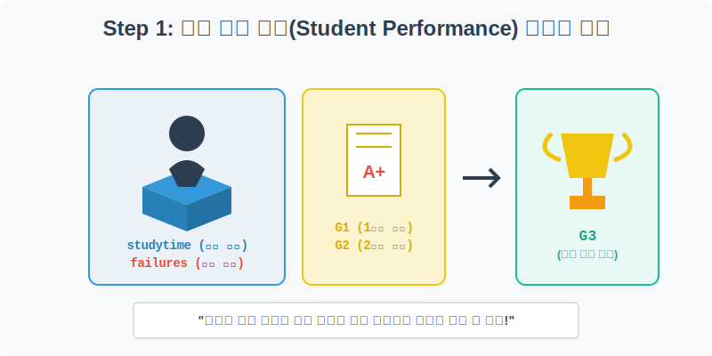
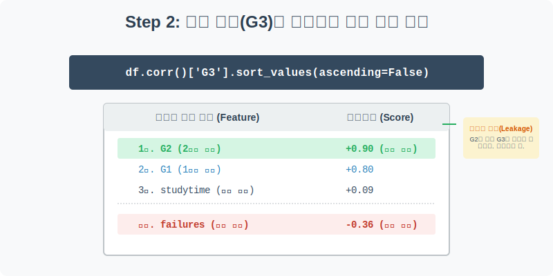
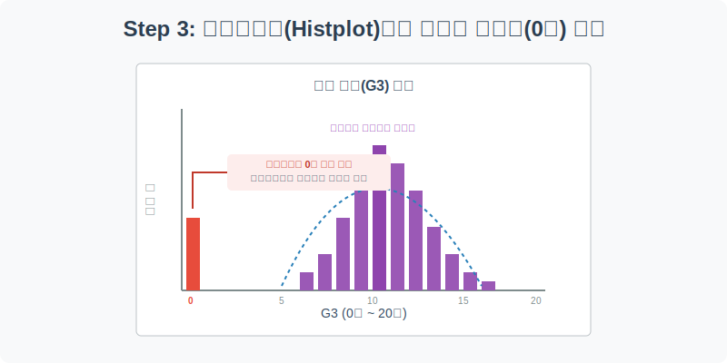
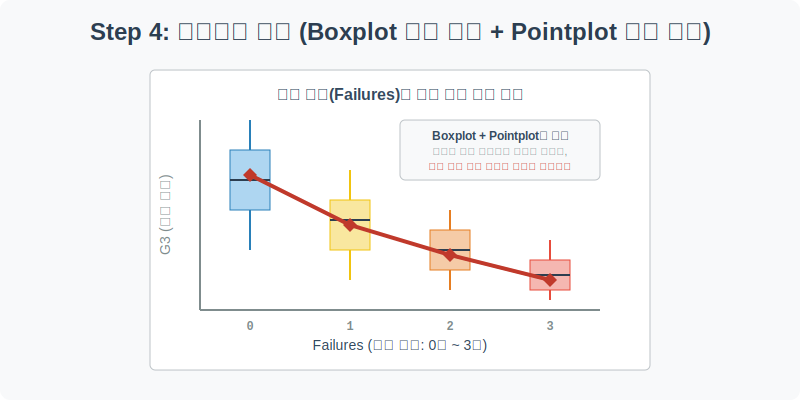

# 실전 데이터 분석 25: 학생 성적 예측과 다중 플롯 오버레이

## 📌 강의 개요 (30분 완성)
교육부나 학교 현장에서 자주 다루는 **학생 학업 성취도(Student Performance)** 데이터 셋입니다. 포르투갈 학생들의 과거 수학 성적, 공부 시간, 결석 횟수, 심지어 부모님의 직업까지 방대한 특성(Feature)이 담겨 있습니다. 이 실무 데이터를 통해 우리는 최종 기말고사 성적에 절대적인 영향을 미치는 요인들을 수학적으로 찾아내고 눈으로 증명해 봅니다.

**학습 목표:**
* **상관계수 랭킹 보드 추출 (`df.corr()`):** 수많은 요인 중 기말 성적을 좌우하는 핵심 요인(Top 3)과 오히려 점수를 깎아 먹는 위험 요인(Bottom 1)을 정렬하여 찾아냅니다.
* **숨겨진 이상치 발굴 (`sns.histplot`):** 커널 밀도 추정(KDE) 곡선을 동반한 히스토그램을 그려서, 데이터 수집 과정에서 누락되었거나 결시 처리된 '0점' 학생들의 비정상적인 분포를 잡아냅니다.
* **오버레이 플롯의 마법 (`boxplot` + `pointplot`):** 범주형 데이터의 퍼짐 정도를 보여주는 박스플롯 위에, 평균의 추락을 보여주는 선형 차트를 겹쳐 그려 시각적 설득력을 극대화합니다.

---

## Step 1: 학생 성적 예측 데이터 구조 (Overview)



`csv_data` 폴더에 다운로드해 둔 `student_performance.csv` 파일을 판다스로 불러옵니다.

```python
import pandas as pd
import seaborn as sns
import matplotlib.pyplot as plt

# 그래프 설정
plt.rcParams['font.family'] = 'AppleGothic'
plt.rcParams['axes.unicode_minus'] = False
sns.set_palette("Set2")

# 로컬 CSV 파일 불러오기
df = pd.read_csv('../csv_data/student_performance.csv')

# 데이터 구조 및 첫 5행 확인
print(df.info())
display(df.head())
```

### 💡 코드 딥다이브 (Code Deep Dive)
**주요 컬럼(Columns) 해석:**
* **학습 태도 요인 (X):** `studytime`(주당 공부 시간: 1~4단계), `failures`(과거 과목 낙제 횟수), `absences`(결석 일수).
* **과거 성적 요인 (X):** `G1`(1학기 중간고사 성적), `G2`(2학기 중간고사 성적). (포르투갈 시스템 기준 20점 만점)
* **예측 타겟 (Y):** `G3` (최종 기말고사 성적). 우리가 예측해야 할 궁극적인 목표입니다.

---

## Step 2: 기말 성적(G3)을 결정짓는 핵심 요인 랭킹 (Preprocess)



수학 성적을 올리려면 공부 시간을 늘려야 할까요, 결석을 줄여야 할까요? 감으로 찍지 말고 데이터에게 물어봅시다. 타겟 변수인 `G3`와의 상관계수를 뽑아내어 순위를 매겨봅니다.

```python
# 수치형 변수만 골라서 상관계수를 계산하고, G3와의 상관성만 내림차순 정렬
# (numeric_only=True로 설정하면 성별, 학교 등 문자형 데이터를 에러 없이 무시합니다)
g3_corr = df.corr(numeric_only=True)['G3'].sort_values(ascending=False)

print("--- 기말 성적(G3)을 끌어올리는 긍정(+) 요인 ---")
print(g3_corr.head(4)) # 상위 4개

print("\n--- 기말 성적(G3)을 깎아 먹는 부정(-) 요인 ---")
print(g3_corr.tail(3)) # 하위 3개
```

### 💡 분석가의 통찰 (Analyst's Insight)
* **데이터 누수(Data Leakage)의 함정:** 가장 상관계수가 높은 1, 2위는 뻔하게도 `G2`(0.90)와 `G1`(0.80)입니다. 2학기 중간고사를 잘 본 학생이 기말고사를 잘 보는 건 당연합니다. 실무 머신러닝 대회에서는 이런 '너무 뻔한 정답지(과거 성적)'를 변수로 주면 예측 난이도가 급락하므로 고의로 제거하고 학습시킵니다.
* **진짜 인사이트:** `studytime`(+0.09)은 의외로 성적 향상에 미치는 영향이 미미합니다. 반면 가장 꼴찌를 차지한 **`failures`(-0.36)**는 한 번이라도 과거에 낙제했던 경험이 기말 성적을 곤두박질치게 만드는 강력한 음(-)의 요인임을 입증합니다.

---

## Step 3: 히스토그램으로 0점 이상치(Anomaly) 발굴 (Univariate EDA)



우리 학교 학생들의 전체 기말 성적 수준을 히스토그램으로 그려봅니다.

```python
plt.figure(figsize=(10, 5))

# 히스토그램 위에 커널 밀도 곡선(kde=True)을 덮어 씌워 트렌드 파악
sns.histplot(data=df, x='G3', bins=20, kde=True, color='purple', alpha=0.6)

plt.title('전교생 기말 성적(G3) 분포 및 이상치 식별', fontsize=16)
plt.xlabel('기말 성적 (0점 ~ 20점 만점)')
plt.ylabel('학생 수')
plt.grid(True, axis='y', linestyle=':', alpha=0.7)

plt.show()
```

### 💡 시각화 차트 읽는 법
* 그래프 가운데를 보면, 대다수 학생이 10~15점 사이에 옹기종기 모여 있는 아름다운 종 모양(정규 분포) 곡선을 그립니다.
* **문제 발견:** 시선을 왼쪽 끝, **0점**으로 돌려보세요. 1점~3점은 거의 없는데 유독 0점에만 비정상적으로 솟아오른 막대가 있습니다.
* **원인 추론:** 이는 진짜로 모든 문제를 다 틀린 학생이라기보다는, 아예 시험을 보러 오지 않은 **결시생**, 중도 **자퇴생**, 혹은 시스템상의 **결측치(NaN)**가 0으로 퉁쳐져서 기록되었을 확률이 99%입니다. 이대로 AI를 학습시키면 망하므로 나중에 필터링으로 제거해야 합니다. (`df = df[df['G3'] > 0]`)

---

## Step 4: 시각화의 정점, 오버레이 플롯 (Multivariate EDA)



Step 2에서 확인한 무서운 팩트, "낙제 횟수(`failures`)가 늘어날수록 성적이 떨어진다(-0.36)"는 사실을 시각적으로 가장 잔인하고도 확실하게 보여주는 차트를 그려보겠습니다. Boxplot과 Pointplot을 겹쳐 그리는 기술입니다.

```python
plt.figure(figsize=(10, 6))

# 1층: 전체 학생들의 성적 분포가 퍼져있는 형태를 박스플롯으로 깝니다.
sns.boxplot(data=df, x='failures', y='G3', palette='pastel', width=0.6)

# 2층: 각 범주(낙제 횟수)의 '평균 점수'만 딱 찍어서 선으로 잇는 포인트플롯을 올립니다.
sns.pointplot(data=df, x='failures', y='G3', color='crimson', markers='D', scale=1.5, errorbar=None)

plt.title('과거 낙제 횟수(Failures)에 따른 기말 성적 추락 추이', fontsize=16)
plt.xlabel('과거 과목 낙제 횟수 (번)')
plt.ylabel('기말 성적 (G3)')
plt.grid(True, axis='y', linestyle='--', alpha=0.5)

plt.show()
```

### 💡 코드 딥다이브 & 인사이트 (매우 중요!)
* **Boxplot (배경):** 낙제 경험이 0번인 모범생들은 성적의 분포가 10~15점 사이에 위치합니다. 반면 낙제가 3번인 학생 그룹은 상자 자체가 바닥(5~10점)으로 푹 꺼져 있습니다.
* **Pointplot (빨간 선):** 상자들의 한가운데를 꿰뚫고 지나가는 빨간 다이아몬드 선을 보세요. 낙제 횟수가 0 → 1 → 2 → 3으로 늘어날수록 평균 성적이 폭포수처럼 곤두박질치는 끔찍한 우하향 그래프를 그립니다.
* **결론:** 보고서를 받는 사람(교장 선생님, 학부모)에게 상관계수 숫자(-0.36)를 들이미는 것보다, 이 **오버레이 차트** 한 장을 보여주는 것이 백 배 천 배 더 강력한 설득력을 가집니다. 이것이 데이터 시각화의 진정한 힘입니다.

---

## 🎯 30분 강의 마무리 및 심화 과제

`student` 데이터를 통해 상관계수 랭킹을 뽑아 진짜 중요한 범인을 찾고, `histplot`의 꼬리에서 0점짜리 시스템 에러를 잡아냈으며, 층을 겹쳐 그리는 `boxplot` + `pointplot` 기술로 완벽한 시각적 설득 보고서를 완성했습니다.

### 📝 심화 과제 (Advanced Challenge)
1. **0점 이상치 제거 후 랭킹 재계산:** Step 3에서 발견한 0점 학생들을 제외해 봅시다. `df_clean = df[df['G3'] > 0]` 코드를 실행한 뒤, `df_clean`으로 Step 2의 `corr()` 상관계수 코드를 다시 돌려보세요. 0점이라는 극단적인 노이즈가 사라지자마자, 다른 변수들(예: 부모님의 교육 수준, 음주량 등)이 성적에 미치는 진짜 영향력이 훨씬 선명하게 떠오르는 것을 목격할 수 있습니다.
2. **성별과 공부시간의 관계 (Barplot):** `sns.barplot(data=df, x='sex', y='studytime')`을 그려서 포르투갈 남학생과 여학생 중 평균적으로 누가 더 공부를 많이 하는지 비교해 보세요. (에러바 팁: 바 위에 달린 검은색 막대가 짧을수록 편차가 적고 꾸준하다는 뜻입니다.)
