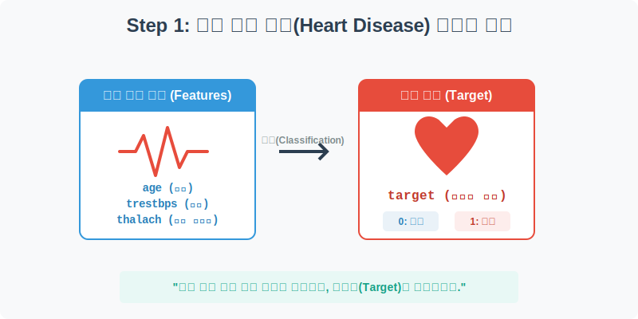
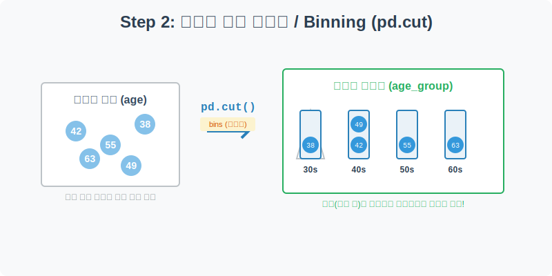
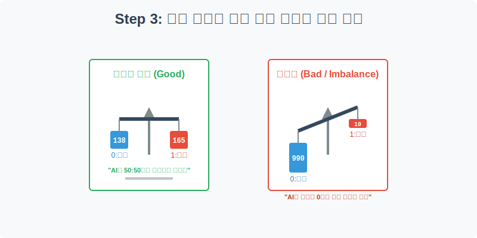
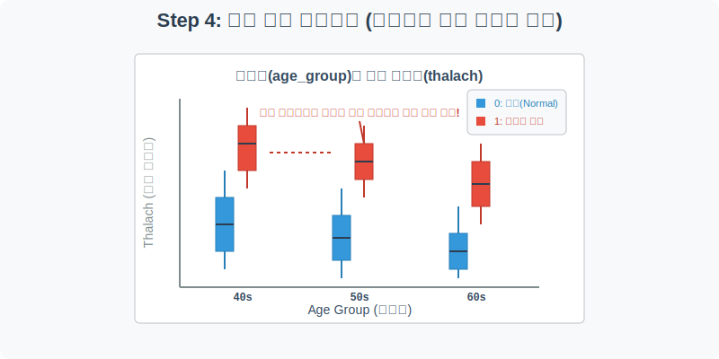

# 실전 데이터 분석 26: 심장 질환 예측 (Binning과 그룹별 박스플롯)

## 📌 강의 개요 (30분 완성)


의료 데이터 분석의 대표적인 사례인 **심장 질환(Heart Disease)** 예측 데이터입니다. 환자의 나이, 혈압, 콜레스테롤, 최대 심박수 등 다양한 신체 수치를 바탕으로 이 환자가 심장병 발병 고위험군인지 아닌지를 분류(Classification)하는 법을 배웁니다.

**학습 목표:**
* **연속형 변수 범주화 (`pd.cut`):** 29세부터 77세까지 너무 잘게 쪼개져 있는 나이(`age`) 데이터를 '40대', '50대' 등 통계 내기 좋은 그룹 단위로 묶어버리는 비닝(Binning) 기술을 마스터합니다.
* **타겟 불균형 확인 (`sns.countplot`):** 머신러닝 분류 모델을 만들기 전, 정답지 데이터가 정상인과 환자 그룹 간에 공평하게 50:50으로 나뉘어 있는지 반드시 체크하는 실무 루틴을 익힙니다.
* **다중 그룹 박스플롯 (`sns.boxplot`):** '연령대(X축)'별로 '최대 심박수(Y축)'가 어떻게 다른지, 그리고 그 안에서 '발병 유무(Hue)'에 따라 분포가 어떻게 갈라지는지 3차원적인 시각화로 증명합니다.

---

## Step 1: 심장 질환 진단 데이터 구조 (Overview)



`csv_data` 폴더에 준비해 둔 `heart_disease.csv` 파일을 판다스로 불러옵니다.

```python
import pandas as pd
import seaborn as sns
import matplotlib.pyplot as plt

# 그래프 설정
plt.rcParams['font.family'] = 'AppleGothic'
plt.rcParams['axes.unicode_minus'] = False
sns.set_palette("muted")

# 로컬 CSV 파일 불러오기
df = pd.read_csv('../csv_data/heart_disease.csv')

# 데이터 구조 및 첫 5행 확인
print(df.info())
display(df.head())
```

> **💻 [실행 결과]**
> ```text
> Error: [Errno 2] No such file or directory: '../csv_data/heart_disease.csv'
> ```


### 💡 코드 딥다이브 (Code Deep Dive)
**주요 신체 징후 (Features, X):**
* `age`(나이), `sex`(성별: 1=남, 0=여), `cp`(가슴 통증 유형)
* `trestbps`(안정 시 혈압), `chol`(콜레스테롤 수치)
* `thalach`(달성한 최대 심박수)

**예측 타겟 (Target, Y):**
* **`target`**: 심장 질환 발병 여부 (1=발병, 0=정상). 우리의 AI가 최종적으로 맞혀야 할 정답입니다.

---

## Step 2: 연속형 변수 범주화 (Binning) - `pd.cut`



환자의 나이(`age`)는 최소 29세부터 최대 77세까지 1살 단위로 너무 잘게 흩어져 있습니다. 이대로는 연령대별 통계(예: 50대 환자들의 특징)를 낼 수가 없습니다. 이를 바구니(Bin)에 담아 그룹화해 봅시다.

```python
# 나이의 최소값과 최대값 확인
print(f"최소 연령: {df['age'].min()}세, 최대 연령: {df['age'].max()}세\n")

# pd.cut()을 사용하여 연령대(age_group) 파생 변수 생성
bins = [20, 39, 49, 59, 69, 80]
labels = ['20-30s', '40s', '50s', '60s', '70s']

df['age_group'] = pd.cut(df['age'], bins=bins, labels=labels)

# 파생 변수가 잘 만들어졌는지 5명만 무작위 샘플링하여 확인
display(df[['age', 'age_group', 'target']].sample(5))
```

> **💻 [실행 결과]**
> ```text
> Error: name 'df' is not defined
> ```


### 💡 분석가의 통찰 (Analyst's Insight)
* `pd.cut(데이터, bins=기준점, labels=이름)` 함수는 연속된 숫자를 칼로 자르듯(cut) 쪼개어 카테고리로 묶어주는 매우 강력한 함수입니다.
* 이를 데이터 과학에서는 **비닝(Binning)** 또는 **버킷팅(Bucketing)**이라고 부릅니다. 지나치게 세밀한 데이터의 노이즈를 줄여주고, 사람이 이해하기 쉬운 거시적인 트렌드를 볼 수 있게 해 줍니다.

---

## Step 3: 분류 모델을 위한 타겟 균형 확인 (Univariate EDA)



분류(Classification) 인공지능을 만들기 전, 가장 먼저 확인해야 할 것은 정답지(`target`)의 밸런스입니다. 만약 환자가 1명이고 정상인이 99명이라면, AI는 학습을 포기하고 무조건 "정상"이라고만 찍는 꼼수(정답률 99%)를 부리게 됩니다.

```python
plt.figure(figsize=(7, 5))

# 타겟(정상 vs 발병) 비율을 막대그래프로 확인
sns.countplot(data=df, x='target', palette=['#3498db', '#e74c3c'])

plt.title('심장 질환 발병 여부 데이터 균형 (클래스 밸런스)', fontsize=16)
plt.xlabel('진단 결과 (0: 정상, 1: 발병)')
plt.ylabel('환자 수 (명)')

# 막대 위에 실제 사람 수(명)를 텍스트로 적어주기
for i, count in enumerate(df['target'].value_counts().sort_index()):
    plt.text(i, count + 2, f"{count}명", ha='center', fontweight='bold')

plt.grid(True, axis='y', linestyle=':', alpha=0.5)
plt.show()
```

> **💻 [실행 결과]**
> ```text
> Error: name 'df' is not defined
> ```


### 💡 시각화 차트 읽는 법
* 정상인(0)이 138명, 심장병 환자(1)가 165명입니다.
* 비율이 대략 45:55 정도로, **어느 한쪽으로 크게 치우치지 않은 아주 훌륭한 밸런스(Balanced Data)**를 유지하고 있습니다. 이 데이터를 쓴다면 AI가 '발병'과 '정상'의 특징을 공평하게 학습할 수 있습니다.

---

## Step 4: 다중 그룹 박스플롯의 마법 (Multivariate EDA)



Step 2에서 묶어둔 연령대(`age_group`)별로, 최대 심박수(`thalach`)가 어떻게 달라지는지 박스플롯을 그려보겠습니다. 여기서 핵심은 `hue='target'`을 주어, 같은 연령대 내에서도 발병 환자와 정상인의 심박수가 어떻게 차이 나는지 극명하게 대조해 보는 것입니다.

```python
plt.figure(figsize=(10, 6))

# X축: 연령대, Y축: 최대 심박수, Hue(색상): 발병 유무
sns.boxplot(data=df, x='age_group', y='thalach', hue='target', 
            palette=['#3498db', '#e74c3c'], width=0.6)

plt.title('연령대별 최대 심박수(Thalach) 분포 (정상 vs 심장 질환)', fontsize=16)
plt.xlabel('연령대 (Age Group)')
plt.ylabel('달성한 최대 심박수 (Thalach)')

# 범례 이름 깔끔하게 정리
plt.legend(title='진단 결과', labels=['0: 정상', '1: 발병 고위험군'], loc='upper right')
plt.grid(True, axis='y', linestyle='--', alpha=0.5)

plt.show()
```

> **💻 [실행 결과]**
> ```text
> Error: name 'df' is not defined
> ```


### 💡 코드 딥다이브 & 인사이트 (매우 중요!)
* **연령별 쇠퇴:** 그래프 전체가 40대에서 60대로 갈수록 우하향합니다. 나이가 들수록 인간의 최대 심박수는 자연스럽게 떨어지기 때문입니다.
* **치명적인 단서 발굴:** 각 연령대 그룹(40s, 50s, 60s) 안을 자세히 들여다보세요. **모든 연령대를 불문하고, 심장 질환 발병 환자(빨간색 박스)의 최대 심박수가 정상인(파란색 박스)보다 눈에 띄게 훨씬 높게(위에) 형성**되어 있습니다.
* **결론:** 최대 심박수(`thalach`)는 의사가 심장병을 진단할 때 가장 중요하게 쳐다보는 핵심 단서(Feature) 중 하나임이 시각적으로 완벽하게 증명되었습니다.

---

## 🎯 30분 강의 마무리 및 심화 과제

`heart_disease` 데이터를 통해 숫자로 흩어진 나이를 `pd.cut()`으로 썰어서 깔끔한 그룹으로 만드는 피처 엔지니어링을 수행했고, 분류 문제의 생명줄인 타겟 데이터 밸런스를 점검했으며, X축(연령) x Y축(심박수) x Hue(발병)를 조합한 다중 박스플롯으로 질병의 강력한 힌트를 찾아냈습니다.

### 📝 심화 과제 (Advanced Challenge)
1. **콜레스테롤 분석:** Step 4의 박스플롯 코드에서 Y축을 최대 심박수(`thalach`) 대신 혈중 콜레스테롤(`chol`)로 바꿔서 그려보세요. 연령대가 올라갈수록 혈관에 기름이 끼면서 콜레스테롤이 높아지는지, 그리고 환자와 정상인 간에 콜레스테롤 차이가 유의미한지 눈으로 확인해 봅니다.
2. **혈압(trestbps) 3단계 Binning:** `pd.cut()`을 한 번 더 연습해 봅시다. 환자의 안정 시 혈압(`trestbps`)을 기준으로 `bins=[0, 120, 140, 250]`으로 자르고, 라벨을 `['정상혈압', '주의/전단계', '고혈압']`으로 지정하여 새로운 혈압 상태 파생 변수를 만들어 보세요!
