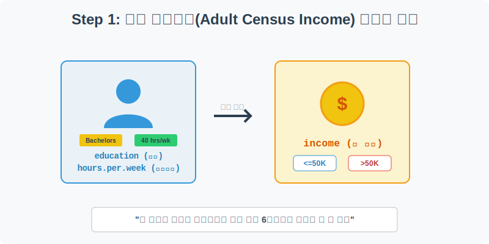
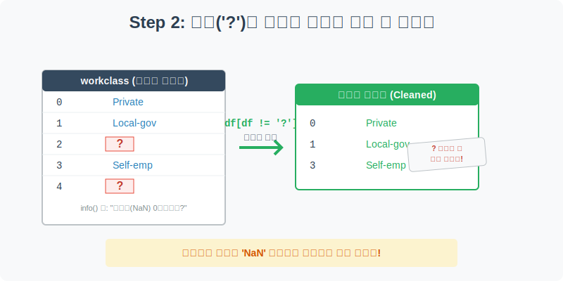
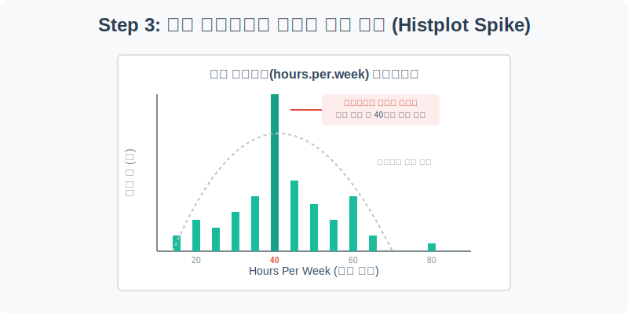
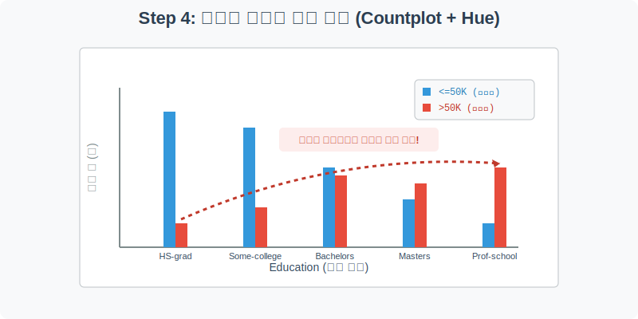

# 실전 데이터 분석 27: 소득 예측과 기만적 결측치(Imposter) 처리

## 📌 강의 개요 (30분 완성)


머신러닝 교과서에 반드시 등장하는 **성인 인구조사(Adult Census Income)** 데이터입니다. 나이, 직업, 학력, 결혼 상태, 근로 시간 등의 인적 사항을 바탕으로, 이 사람의 연 소득이 미국 평균 중산층 기준인 5만 달러(약 6~7천만 원)를 넘는지 못 넘는지 분류(Classification)하는 법을 탐구합니다.

**학습 목표:**
* **기만적 결측치 색출 (Filtering):** 겉보기엔 멀쩡한 데이터처럼 보이지만, 실제로는 '?'와 같은 특수문자로 숨겨져 있는 가짜 데이터(Imposter)를 찾아내고 판다스의 인덱싱으로 도려내는 법을 배웁니다.
* **법정 근로 시간의 쏠림 현상 (Histplot Spike):** 현실 데이터에서 매우 자주 관찰되는 "제도/법률로 인한 특정 수치 쏠림 현상"을 히스토그램의 거대한 막대(Spike)로 확인합니다.
* **범주형 교차 분석 (`countplot` + `hue`):** "학력이 높으면 무조건 돈을 많이 벌까?"라는 세속적인 호기심을, 엑셀의 피벗테이블보다 훨씬 직관적인 색상 분할 막대그래프로 증명합니다.

---

## Step 1: 인구조사 소득 데이터 구조 (Overview)



`csv_data` 폴더에 준비해 둔 `adult_income.csv` 파일을 판다스로 불러옵니다.

```python
import pandas as pd
import seaborn as sns
import matplotlib.pyplot as plt

# 그래프 설정
plt.rcParams['font.family'] = 'AppleGothic'
plt.rcParams['axes.unicode_minus'] = False
sns.set_palette("colorblind")

# 로컬 CSV 파일 불러오기
df = pd.read_csv('../csv_data/adult_income.csv')

# 데이터 구조 및 첫 5행 확인
print(df.info())
display(df.head())
```

> **💻 [실행 결과]**
> ```text
> Error: [Errno 2] No such file or directory: '../csv_data/adult_income.csv'
> ```


### 💡 코드 딥다이브 (Code Deep Dive)
**주요 인적 사항 (Features, X):**
* `age`(나이), `workclass`(고용 형태: 공무원, 사기업 등)
* `education`(최종 학력), `marital.status`(결혼 상태)
* `hours.per.week`(주당 근로 시간)

**예측 타겟 (Target, Y):**
* **`income`**: 연 소득. `>50K` (5만 달러 초과, 고소득) 또는 `<=50K` (5만 달러 이하, 저소득).

---

## Step 2: '?' 기호로 숨어 있는 결측치(Imposter) 색출 (Preprocess)



`df.info()`를 보면 결측치(NaN)가 0개라고 나옵니다. 하지만 정말 100% 꽉 차 있는 완벽한 데이터일까요? 데이터베이스 시스템에 따라 모르는 값을 `?`, `Unknown`, `999` 등으로 마음대로 적어두는 경우가 매우 많습니다. 

```python
# workclass(고용 형태) 컬럼에 어떤 값들이 몇 개씩 있는지 확인해 봅니다.
print("--- 정제 전 workclass 카테고리 구성 ---")
print(df['workclass'].value_counts())

# '?'(물음표) 값을 가진 행을 제외하고 정상적인 데이터만 남기는 필터링 수행
df_clean = df[df['workclass'] != '?']

print("\n--- 정제 후 데이터 크기 비교 ---")
print(f"원본 데이터: {len(df)}명 -> 정제 후: {len(df_clean)}명")
```

> **💻 [실행 결과]**
> ```text
> --- 정제 전 workclass 카테고리 구성 ---
> Error: name 'df' is not defined
> ```


### 💡 분석가의 통찰 (Analyst's Insight)
* `value_counts()`로 확인해 보니, 무려 수십~수백 명의 직업이 `?`로 기록되어 있었습니다.
* AI에게 이 데이터를 그대로 먹이면, `?`라는 새로운 신종 직업이 있는 줄 알고 엉뚱한 패턴을 학습하게 됩니다.
* 실무에서는 코드를 돌리기 전에 반드시 `value_counts()`나 `unique()`를 습관적으로 찍어보아 이처럼 **위장한 결측치(Imposter)**를 찾아내어 과감하게 도려내야(`df != '?'`) 합니다.

---

## Step 3: 주당 근로시간의 극단적 분포 확인 (Univariate EDA)



미국 직장인들은 일주일에 몇 시간이나 일할까요? 이 데이터의 분포를 히스토그램으로 확인해 봅니다.

```python
plt.figure(figsize=(10, 5))

# 주당 근로시간의 분포를 히스토그램으로 그리기 (bins=30으로 잘게 쪼갬)
sns.histplot(data=df_clean, x='hours.per.week', bins=30, color='teal', kde=False)

plt.title('미국 직장인들의 주당 근로시간(Hours per Week) 분포', fontsize=16)
plt.xlabel('근로 시간 (시간/주)')
plt.ylabel('응답자 수 (명)')
plt.grid(True, axis='y', linestyle=':', alpha=0.6)

plt.show()
```

> **💻 [실행 결과]**
> ```text
> Error: name 'df_clean' is not defined
> ```


### 💡 시각화 차트 읽는 법
* 보통 사람의 특성(키, 몸무게 등)은 가운데가 볼록한 종 모양(정규 분포)을 그립니다. 
* 하지만 이 차트는 **가운데(40시간)에 뾰족하고 거대한 빌딩(Spike) 하나가 비정상적으로 솟아** 있습니다.
* **이유:** 인간의 생물학적 특성이 아니라, **미국의 법정 표준 근로 시간이 주 40시간(하루 8시간 * 5일)**으로 정해져 있는 사회적 '제도' 데이터이기 때문입니다. 설문조사 시 대다수가 귀찮아서 40시간이라고 퉁쳐서 응답했거나 계약서상 수치를 적어 낸 것입니다.
* 우측의 50시간, 60시간 부근에도 작은 봉우리가 보입니다. 이는 잔업과 야근에 시달리는 소규모 과로 집단입니다.

> 💡 **[수포자를 위한 통계 돋보기: 정규 분포 (Normal Distribution)와 왜도]**  
> 자연계의 수많은 데이터(키, 몸무게, 시험 성적 등)는 아무런 제약이 없다면 자연스럽게 **가운데가 가장 불룩하고 양옆으로 대칭인 종 모양(Bell Curve)**을 띠게 됩니다. 이를 정규 분포라고 합니다.
> 
> $$ f(x) = \frac{1}{\sigma \sqrt{2\pi}} e^{-\frac{1}{2}(\frac{x-\mu}{\sigma})^2} $$
> - 공식이 외계어 같지만, 핵심은 딱 두 가지입니다. 평균($\mu$)에 데이터가 가장 많이 몰리고, 평균에서 멀어질수록($\sigma$) 비율이 기하급수적으로 팍팍 꺾인다는 뜻입니다.
> - 하지만 위의 '근로 시간' 차트는 종 모양이 아닙니다. 이처럼 데이터가 어느 한쪽으로 심하게 쏠리거나 찌그러진 상태를 **왜도(Skewness)**가 크다고 표현합니다.
> - 데이터 분석가는 이렇게 '정규 분포를 파괴하는 인위적인 스파이크'를 발견했을 때, "아! 이것은 자연 현상이 아니라 법이나 제도가 개입한 흔적이구나!"라는 통찰을 뽑아낼 수 있어야 합니다.

---

## Step 4: 학력과 고소득 달성 비율의 교차 분석 (Multivariate EDA)



"학력이 높을수록 돈을 많이 벌까?" 이 고전적인 질문에 답하기 위해, 학력(X축)별로 저소득자(<=50K)와 고소득자(>50K)의 막대그래프를 나란히 그려보겠습니다.

```python
plt.figure(figsize=(12, 6))

# 학력 수준의 순서를 낮은 순에서 높은 순으로 논리적으로 정렬해 줍니다.
edu_order = ['11th', 'HS-grad', 'Some-college', 'Assoc-acdm', 'Bachelors', 'Masters', 'Prof-school']

# x축: 학력, 색상(hue): 소득 타겟 (두 개의 막대가 나란히 섬)
sns.countplot(data=df_clean, x='education', hue='income', 
              order=edu_order, palette=['#3498db', '#e74c3c'])

plt.title('최종 학력(Education)에 따른 연 소득 5만 달러 돌파 비율', fontsize=16)
plt.xlabel('최종 학력 (고졸 -> 대학원/전문직)')
plt.ylabel('응답자 수 (명)')
plt.legend(title='연 소득', loc='upper right')
plt.grid(True, axis='y', linestyle='--', alpha=0.4)

plt.show()
```

> **💻 [실행 결과]**
> ```text
> Error: name 'df_clean' is not defined
> ```


### 💡 코드 딥다이브 & 인사이트 (매우 중요!)
* **고졸(HS-grad) 및 전문대(Some-college):** 파란색 막대(<=50K)가 압도적으로 높고, 빨간색 막대(>50K)는 바닥에 깔려 있습니다. 전체 파이는 크지만 고소득자의 비율은 매우 처참합니다.
* **학사(Bachelors):** 여기서부터 분위기가 바뀝니다. 여전히 파란색이 조금 더 높지만, 빨간색 막대가 맹렬하게 따라잡아 거의 절반 가까이 치고 올라옵니다.
* **석사(Masters) & 전문대학원(Prof-school - 의대/로스쿨):** 드디어 **크로스오버(역전)**가 일어납니다! 학력이 이 구간에 도달하면 빨간색 고소득자 막대가 파란색 저소득자 막대보다 훌쩍 높아집니다.
* **결론:** 학력(`education`)은 소득을 가르는 완벽한 계단식 변수(Feature)이며, 분류 인공지능이 5만 달러 돌파를 예측할 때 가장 먼저 쳐다볼 일등 공신임을 훌륭하게 증명했습니다.

---

## 🎯 30분 강의 마무리 및 심화 과제

`adult` 인구조사 데이터를 통해 판다스의 `.info()`만 믿지 않고 진짜 결측치(`?`)를 스스로 찾아내어 제거하는 안목을 길렀습니다. 사회 제도로 인해 발생한 거대한 쏠림 현상(40시간)을 히스토그램으로 확인했으며, `countplot`에 `hue` 옵션을 주어 범주형 데이터 간의 교차 분석(학력 vs 소득 비율)을 완벽하게 수행했습니다.

### 📝 심화 과제 (Advanced Challenge)
1. **결혼 상태(marital-status)의 파워:** Step 4의 그래프에서 X축을 학력이 아니라 `marital.status`(결혼 상태)로 변경해서 다시 그려보세요. 놀랍게도 기혼자(`Married-civ-spouse`) 그룹에서 엄청난 고소득자 빨간 막대를 볼 수 있을 것입니다. 미혼/이혼 그룹과의 압도적인 차이를 관찰해 보세요.
2. **연령 분포 오버레이 (KDE):** `sns.kdeplot(data=df_clean, x='age', hue='income', fill=True)`를 실행해 보세요. 연 소득 5만 달러 이하(파란색 산)는 20대 부근에 몰려 있고, 5만 달러 초과(빨간색 산)는 40~50대로 한참 이동해 있는 것을 볼 수 있습니다. 소득은 나이(경력)에 비례한다는 팩트를 확인해 봅니다.
