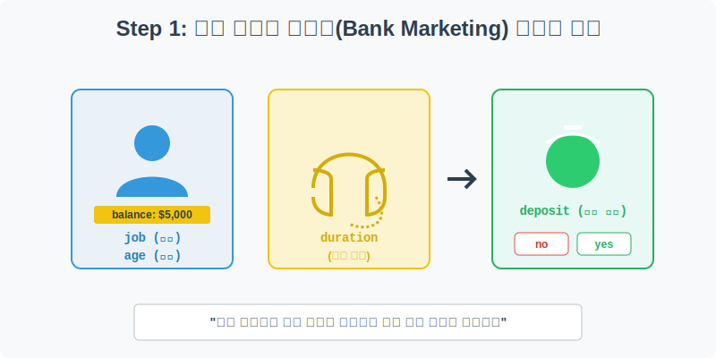
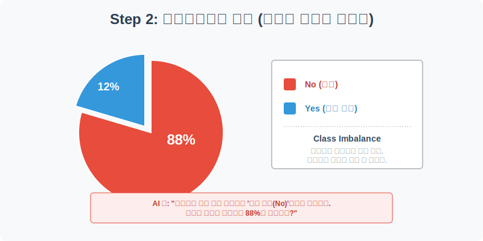
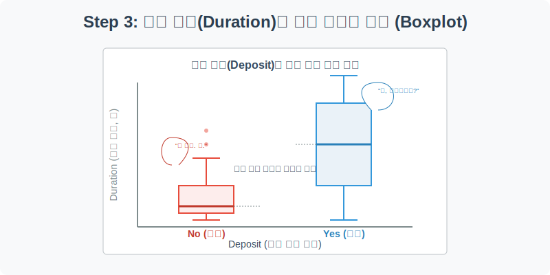
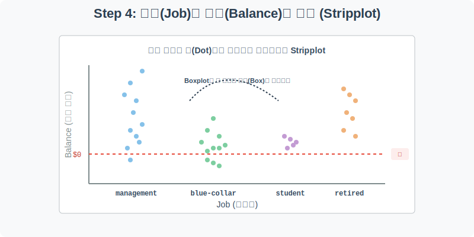

# 실전 데이터 분석 28: 은행 마케팅 성공 예측과 Stripplot의 시각적 파워

## 📌 강의 개요 (30분 완성)
포르투갈 은행 기관의 실제 **텔레마케팅 캠페인(Bank Marketing)** 데이터입니다. 고객의 직업, 나이, 결혼 여부, 대출 유무 등 프로필 데이터를 바탕으로 이 고객에게 전화를 걸었을 때 정기 예금(Term Deposit)에 가입할지 말지를 예측하는 것이 목표입니다.

**학습 목표:**
* **클래스 불균형 (Class Imbalance) 파악:** `plt.pie` 차트를 활용해 현실 비즈니스에서 흔히 마주치는 가혹한 현실(거절 88%, 성공 12%)을 눈으로 확인하고 그 위험성을 인지합니다.
* **마케팅 핵심 지표 발견 (`sns.boxplot`):** 수많은 변수 중 '전화 통화 시간(Duration)'이 영업 성공에 미치는 폭발적인 영향력을 박스플롯의 극단적인 차이로 증명해 냅니다.
* **숨겨진 개별 데이터 관찰 (`sns.stripplot`):** 박스플롯이 상자(Box) 속에 숨겨버린 수많은 고객들의 통장 잔고 데이터 점(Dot)을 화면에 흩뿌려 부유층과 빚쟁이의 분포를 생생하게 확인합니다.

---

## Step 1: 은행 마케팅 캠페인 데이터 구조 (Overview)



`csv_data` 폴더에 준비해 둔 `bank_marketing.csv` 파일을 판다스로 불러옵니다.

```python
import pandas as pd
import seaborn as sns
import matplotlib.pyplot as plt

# 그래프 설정
plt.rcParams['font.family'] = 'AppleGothic'
plt.rcParams['axes.unicode_minus'] = False
sns.set_palette("colorblind")

# 로컬 CSV 파일 불러오기
df = pd.read_csv('../csv_data/bank_marketing.csv')

# 데이터 구조 및 첫 5행 확인
print(df.info())
display(df.head())
```

### 💡 코드 딥다이브 (Code Deep Dive)
**고객 프로필 & 마케팅 변수 (Features, X):**
* `age`(나이), `job`(직업: 관리직, 학생, 은퇴자 등), `marital`(결혼 상태)
* `balance`(은행 통장 잔고, 달러), `housing`(주택 담보 대출 여부)
* `duration`(텔레마케터와의 마지막 통화 시간, 초 단위)

**예측 타겟 (Target, Y):**
* **`deposit`**: 정기 예금 최종 가입 여부. `yes`(가입 성공) 또는 `no`(가입 거절).

---

## Step 2: 텔레마케팅의 가혹한 현실 - 불균형 데이터 (Preprocess)



고객에게 전화를 걸었을 때 실제로 예금에 가입하는 사람의 비율은 얼마나 될까요? 머신러닝 모델을 만들기 전, 정답지(`deposit`)의 비율을 파이(Pie) 차트로 쪼개서 확인해 봅시다.

```python
plt.figure(figsize=(7, 7))

# deposit 컬럼의 yes/no 개수를 시리즈 형태로 카운트
deposit_counts = df['deposit'].value_counts()

# 파이 차트(원그래프) 그리기
plt.pie(deposit_counts, 
        labels=deposit_counts.index, 
        autopct='%1.1f%%',       # 퍼센트 텍스트 포맷 (소수점 1자리)
        startangle=90,           # 12시 방향부터 렌더링 시작
        colors=['#e74c3c', '#3498db'], 
        explode=[0, 0.1],        # 두 번째 조각('yes')을 피자 한 조각 빼듯 분리시킴
        shadow=True)             # 입체적인 그림자 효과

plt.title('텔레마케팅 예금 가입(Deposit) 성공/실패 비율', fontsize=16)
plt.show()
```

### 💡 분석가의 통찰 (Analyst's Insight)
* **Class Imbalance (클래스 불균형):** 실패(no)가 무려 약 88~90%에 육박하고, 성공(yes)은 10~12% 내외로 매우 희귀합니다. 
* 이는 현실의 영업 전환율(Conversion Rate)을 뼈저리게 보여줍니다.
* **AI의 꼼수 경고:** 이대로 멍청한 인공지능에게 학습을 시키면, AI는 고객의 나이나 통장 잔고는 쳐다보지도 않고 무조건 **"모든 고객은 가입 안 함(no)"**이라고 찍어버립니다. 그래도 정답률이 88%가 나오니까요. 이를 방지하기 위해 실무에서는 적은 데이터(yes)를 뻥튀기하는 '오버샘플링(SMOTE 등)' 기법을 반드시 적용해야 합니다.

---

## Step 3: 마케팅 영업의 절대 진리 발굴 (Univariate EDA)



영업 사원이 고객과의 통화를 길게 이어갈수록 가입할 확률이 오를까요? 이 가설을 증명하기 위해 타겟(`deposit`)별로 마지막 통화 시간(`duration`)의 분포를 박스플롯으로 그려보겠습니다.

```python
plt.figure(figsize=(9, 6))

# X축: 가입 여부(no/yes), Y축: 통화 시간(duration)
sns.boxplot(data=df, x='deposit', y='duration', palette=['#e74c3c', '#3498db'])

plt.title('가입 여부(Deposit)에 따른 텔레마케팅 통화 시간(Duration) 비교', fontsize=16)
plt.xlabel('정기 예금 가입 여부 (No / Yes)')
plt.ylabel('마지막 통화 유지 시간 (초)')
plt.grid(True, axis='y', linestyle=':', alpha=0.6)

plt.show()
```

### 💡 시각화 차트 읽는 법
* **가입 거절(No) 박스:** 박스 전체가 바닥(0~200초)에 납작하게 짓눌려 있습니다. 관심 없는 고객은 전화를 받자마자 1~2분 내로 칼같이 끊어버림을 뜻합니다.
* **가입 성공(Yes) 박스:** 박스의 중앙값(가로선)과 전체 길이가 위로 길쭉하게 치솟아 있습니다. 보통 5분~10분 이상 통화를 이어갑니다.
* **결론 도출:** 다른 그 어떤 변수보다도 **'통화 시간(Duration)'이 정기 예금 가입을 결정짓는 가장 폭발적인 변수**임이 증명되었습니다. (실무 전략: 통화 초반 30초 내에 혜택을 던져서 고객이 전화를 끊지 못하게 만들어라!)

---

## Step 4: 박스플롯의 한계를 깨는 Stripplot (Multivariate EDA)



마지막으로, 직업군(`job`)별로 사람들의 통장 잔고(`balance`)가 어떻게 분포하는지 그려보겠습니다. 박스플롯은 요약본만 보여주어 지루할 때가 있습니다. 점을 다 찍어버리는 `stripplot`을 써봅시다.

```python
plt.figure(figsize=(14, 7))

# 직업별(X) 통장 잔고(Y)를 점(Dot)으로 흩뿌려줍니다. 
# jitter=True를 주면 점들이 일직선으로 안 겹치고 좌우로 예쁘게 퍼집니다.
sns.stripplot(data=df, x='job', y='balance', alpha=0.4, jitter=True, palette='Set2')

plt.title('고객 직업(Job)에 따른 은행 통장 잔고(Balance) 분포 (Stripplot)', fontsize=16)
plt.xlabel('직업군 (Job)')
plt.ylabel('통장 잔고 (Balance, 달러)')
plt.xticks(rotation=45) # X축 직업군 이름이 길어서 겹치지 않게 45도 기울임

# 아주 중요한 기준선(잔고 0원) 추가
plt.axhline(y=0, color='red', linestyle='--', linewidth=2) 
plt.text(10, 500, '마이너스 통장(빚) 경계선', color='red', fontweight='bold')

plt.show()
```

### 💡 코드 딥다이브 & 인사이트 (매우 중요!)
* 상자(Box) 안에 숨겨져 있던 수천 명의 데이터가 밤하늘의 은하수처럼 찍힙니다. 밀집된 곳은 색이 진하고, 듬성듬성한 곳은 옅습니다.
* **관리직(management) & 은퇴자(retired):** 위쪽으로 점들이 넓게 퍼져 높이 치솟아 있습니다. 은행에 수만 달러씩 쌓아둔 현금 부자 타겟층입니다.
* **블루칼라(blue-collar) & 학생(student):** 0원 근처 바닥에 점들이 새까맣게 몰려 있습니다.
* **마이너스 통장 (빨간 선 아래):** 직업 불문하고 잔고가 0 미만인 빚쟁이 점들도 적나라하게 보입니다. 이 시각화 하나로 타겟 마케팅 대상(누구한테 전화해야 하는가?)이 너무나도 명확해집니다.

---

## 🎯 30분 강의 마무리 및 심화 과제

`marketing` 실무 데이터로 파이 차트를 그려 머신러닝 최대의 적인 '데이터 불균형'의 무서움을 깨달았습니다. 박스플롯으로 마케팅 성공의 열쇠(통화 시간)를 찾아냈고, 나아가 요약된 상자를 부수고 실제 점을 흩뿌리는 `stripplot`을 통해 고객들의 리얼한 빈부격차를 생생하게 시각화했습니다.

### 📝 심화 과제 (Advanced Challenge)
1. **Stripplot + Hue의 결합:** Step 4의 `stripplot` 코드에서 `palette='Set2'`를 삭제하고 `hue='deposit'`을 넣어보세요! 직업별 잔고 점들이 찍히는데, 그 점들의 색상이 '파란색(거절)'과 '주황색(가입)'으로 나뉩니다. 어떤 직업의, 어느 정도 잔고를 가진 사람들이 주로 주황색(가입) 점으로 찍히는지 엄청난 3차원 인사이트를 얻어 보세요.
2. **나이와 잔고의 산점도:** `sns.scatterplot(data=df, x='age', y='balance', hue='deposit')`를 실행해 보세요. 나이가 많아질수록 잔고의 최고점(상단 아웃라이어)이 어떻게 변하는지 볼 수 있습니다.
