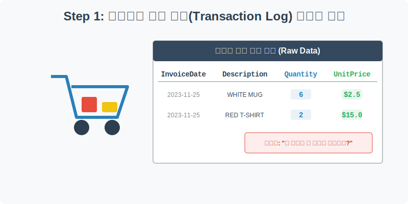
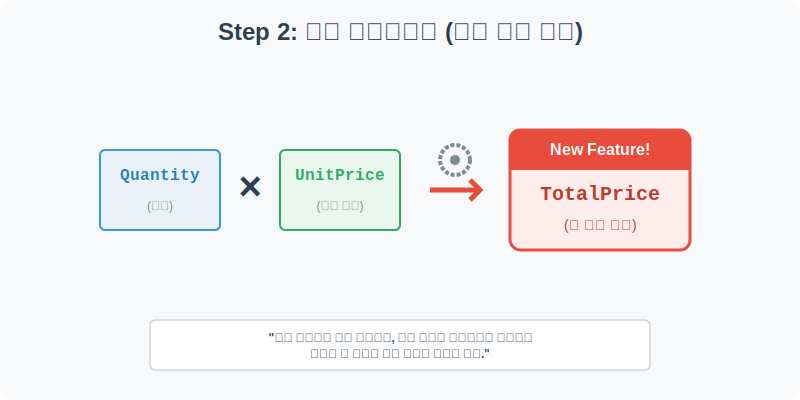
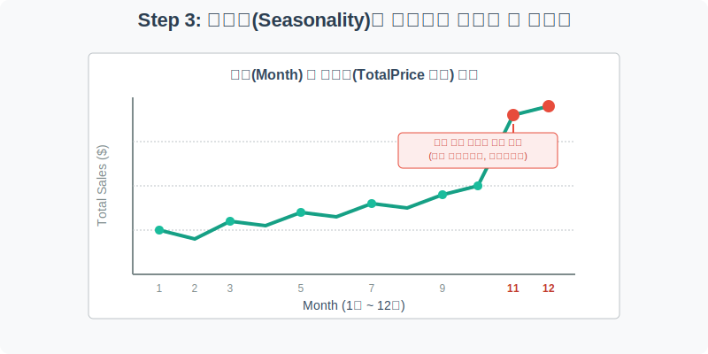
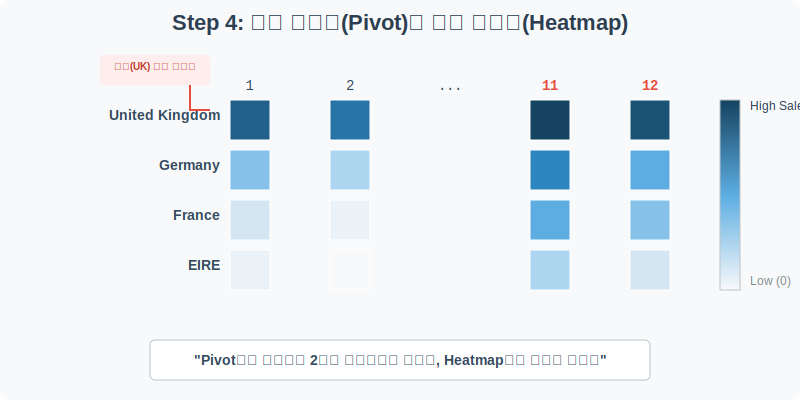

# 실전 데이터 분석 29: 이커머스 매출 분석과 피벗 히트맵

## 📌 강의 개요 (30분 완성)
온라인 쇼핑몰(이커머스)에서 하루에도 수만 건씩 쏟아지는 **실제 고객 결제 로그(Transaction Log)** 데이터입니다. 원시 데이터(Raw Data) 상태에서는 누가 언제 무엇을 샀다는 정보만 텍스트로 적혀 있을 뿐, 쇼핑몰의 전체적인 매출 현황을 알 수 없습니다.

**학습 목표:**
* **피처 엔지니어링 (Feature Engineering):** 수량과 단가를 곱하여 분석의 핵심이 되는 `총 결제 금액(TotalPrice)`이라는 새로운 파생 변수를 스스로 창조해 냅니다.
* **시계열 라인플롯 (`sns.lineplot`):** 주문 날짜에서 '월(Month)'을 추출하여, 1년 동안 쇼핑몰의 총 매출액 추이를 시계열 선 그래프로 그려 연말 시즌의 계절성(Seasonality)을 관찰합니다.
* **매트릭스 재구조화 (`pivot_table` & `heatmap`):** 엑셀의 꽃인 피벗 테이블을 파이썬으로 완벽하게 구현하여 데이터를 '국가별 x 월별' 2차원 매트릭스로 바꾼 뒤, 온도계 같은 히트맵으로 가장 돈을 많이 벌어다 준 핵심 시장을 직관적으로 시각화합니다.

---

## Step 1: 이커머스 원시 결제 로그 (Raw Data Overview)



`csv_data` 폴더에 준비해 둔 `ecommerce.csv` 파일을 판다스로 불러옵니다.

```python
import pandas as pd
import seaborn as sns
import matplotlib.pyplot as plt

# 그래프 설정
plt.rcParams['font.family'] = 'AppleGothic'
plt.rcParams['axes.unicode_minus'] = False
sns.set_palette("colorblind")

# 로컬 CSV 파일 불러오기
df = pd.read_csv('../csv_data/ecommerce.csv')

# 데이터 구조 및 첫 5행 확인
print(df.info())
display(df.head())
```

### 💡 코드 딥다이브 (Code Deep Dive)
**주요 결제 정보 컬럼:**
* `CustomerID`: 구매한 고객의 고유 번호 (누가 샀나?)
* `InvoiceDate`: 결제가 일어난 정확한 날짜와 시간 (언제 샀나?)
* `Description`: 장바구니에 담긴 상품의 텍스트 설명 (무엇을 샀나?)
* `Quantity`: 해당 상품을 몇 개나 샀나? (수량)
* `UnitPrice`: 상품 1개당 가격이 얼마인가? (단가)
* `Country`: 주문이 발생한 국가 (주요 타겟 시장)

---

## Step 2: 피처 엔지니어링 (파생 변수 창조)



가장 치명적인 문제가 있습니다. 원본 데이터에는 이 고객이 카드로 "총 얼마를 긁었는지(결제했는지)" 나와 있지 않습니다. 다행히 우리는 수량과 단가를 알고 있으므로, 두 개를 곱해서 직접 새로운 컬럼을 만들어 내야 합니다.

```python
# 1. 수량(Quantity)과 단가(UnitPrice)를 곱하여 '총 결제 금액(TotalPrice)' 생성
df['TotalPrice'] = df['Quantity'] * df['UnitPrice']

# 2. 문자열(글자)로 되어 있는 주문일 컬럼을 파이썬이 시간으로 인식하도록 변환
df['InvoiceDate'] = pd.to_datetime(df['InvoiceDate'])

# 3. 날짜에서 '월(Month)' 정보만 쏙 뽑아내어 새로운 컬럼 생성
df['Month'] = df['InvoiceDate'].dt.month

# 우리가 방금 땀 흘려 만든 파생 변수 3개가 잘 들어갔는지 확인!
display(df[['Quantity', 'UnitPrice', 'TotalPrice', 'Month']].head())
```

### 💡 분석가의 통찰 (Analyst's Insight)
* **Feature Engineering (피처 엔지니어링):** 원본 데이터에 없는 정보라도, 기존 변수를 수학적으로 조합하거나(곱하기) 시간 데이터에서 특정 부품만 빼내어(월 추출), 예측과 분석에 꼭 필요한 **새로운 변수를 창조해 내는 작업**을 뜻합니다. 
* 훌륭한 AI 모델을 만드는 비결의 80%는 이 피처 엔지니어링 능력에 달려 있습니다.

---

## Step 3: 시계열 라인플롯으로 매출 계절성 확인 (Univariate EDA)



방금 만든 `TotalPrice`와 `Month`를 결합하면 엄청난 마법을 부릴 수 있습니다. 우리 쇼핑몰이 1월부터 12월까지 돈을 어떻게 벌어들였는지 월간 매출 추이(Trend)를 선 그래프로 그려봅시다.

```python
plt.figure(figsize=(10, 5))

# estimator=sum을 주면, 같은 달(예: 11월)에 발생한 모든 결제 금액(TotalPrice)을 다 합쳐줍니다.
sns.lineplot(data=df, x='Month', y='TotalPrice', estimator=sum, 
             errorbar=None, color='teal', linewidth=3, marker='o', markersize=8)

plt.title('이커머스 쇼핑몰 월별(Month) 총 매출액 추이', fontsize=16)
plt.xlabel('월 (Month, 1월~12월)')
plt.ylabel('총 매출액 ($)')
plt.xticks(range(1, 13)) # X축 눈금을 1부터 12까지 꽉 채워 표시
plt.grid(True, axis='both', linestyle='--', alpha=0.5)

plt.show()
```

### 💡 시각화 차트 읽는 법
* 1월부터 8월까지는 그래프가 잔잔하게 오르락내리락하며 일정한 매출 볼륨을 유지합니다.
* 하지만 **11월을 기점으로 그래프가 하늘로 솟구치기 시작**하여 12월에 정점을 찍습니다. 
* 이것이 바로 서양 이커머스 시장 특유의 **연말 시즌(Seasonality)**입니다. 추수감사절(블랙 프라이데이)과 크리스마스로 이어지는 막대한 소비 요인이 작용했음을 데이터로 증명한 것입니다.

---

## Step 4: 피벗 테이블(Pivot)과 매출 히트맵 (Multivariate EDA)



사장님이 묻습니다. "그래서 어느 나라에서, 몇 월에 돈을 제일 많이 벌었나?" 이 복잡한 다차원 질문에 답하기 위해 데이터를 2차원 표(매트릭스)로 재구조화하는 `pivot_table`을 만들고, 숫자를 색상으로 보여주는 `heatmap`을 띄워보겠습니다.

```python
plt.figure(figsize=(12, 6))

# 데이터 랭글링의 꽃: 피벗 테이블(Pivot Table)
# 세로축(index)은 국가, 가로축(columns)은 월, 칸 안에 들어갈 값(values)은 매출액 합계(sum)
pivot_df = df.pivot_table(index='Country', columns='Month', values='TotalPrice', aggfunc='sum')

# 매출이 발생하지 않아 비어있는 칸(NaN)은 0달러로 채워줌
pivot_df = pivot_df.fillna(0)

# 피벗된 표를 히트맵으로 시각화 (색상이 진할수록 매출이 높음)
sns.heatmap(pivot_df, cmap='Blues', annot=False, linewidths=.5)

plt.title('국가별(Country) - 월별(Month) 총 매출액 히트맵', fontsize=16)
plt.xlabel('월 (Month)')
plt.ylabel('주문 국가 (Country)')
plt.show()
```

### 💡 코드 딥다이브 & 인사이트 (매우 중요!)
* **Pivot Table:** 긴 엑셀 줄글에 불과했던 로그 데이터가 가로(월)와 세로(국가)를 가진 바둑판 모양의 거대한 2차원 표(Matrix)로 재탄생했습니다.
* **Heatmap의 위력:** 표 안에 적힌 수백 개의 복잡한 숫자 단위(천 단위, 만 단위)를 읽을 필요가 전혀 없습니다. **가장 진한 띠가 길게 늘어선 곳은 'United Kingdom(영국)' 뿐**입니다. 우리 쇼핑몰은 사실상 영국 내수 시장에 완전히 의존하고 있으며, 다른 국가(독일, 프랑스 등)는 연말에만 찔끔 팔리는 마이너 시장임을 단 1초 만에 파악할 수 있습니다.

---

## 🎯 30분 강의 마무리 및 심화 과제

`ecommerce` 구매 로그를 활용해 수량과 단가를 곱하여 매출 파생 변수를 창조(`TotalPrice`)해 냈습니다. 시계열 `lineplot`으로 연말 특수라는 뚜렷한 계절성 패턴을 확인했고, `pivot_table`을 통해 거대한 데이터를 요약한 뒤 `heatmap`으로 영국이라는 절대적인 캐시카우 시장을 눈으로 짚어냈습니다.

### 📝 심화 과제 (Advanced Challenge)
1. **히트맵에 실제 매출액 찍어보기:** Step 4의 `heatmap` 코드에서 `annot=False`를 `annot=True`로 바꾸고, `fmt=".0f"` (소수점 없이 출력) 옵션을 추가해 보세요. 파란색 상자 안에 실제 매출 달러($) 수치가 텍스트로 박혀서 정확한 금액 보고서를 만들 수 있습니다.
2. **잘 팔리는 베스트셀러 발굴:** 가장 많이 팔린 상품 상위 10개를 바 플롯(`barplot`)으로 그려보세요. `df.groupby('Description')['Quantity'].sum().sort_values(ascending=False).head(10)` 구문을 활용하면 어떤 상품이 우리 쇼핑몰을 먹여 살리는지 찾아낼 수 있습니다.
