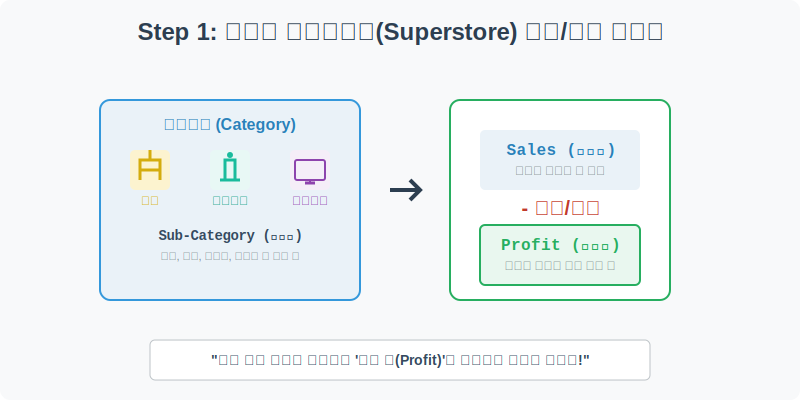
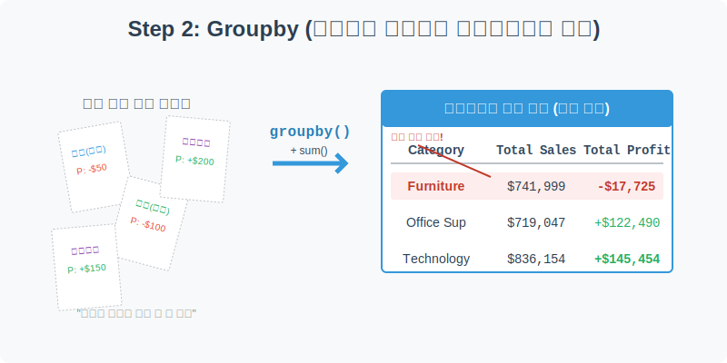
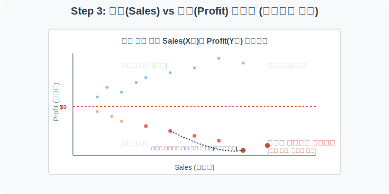
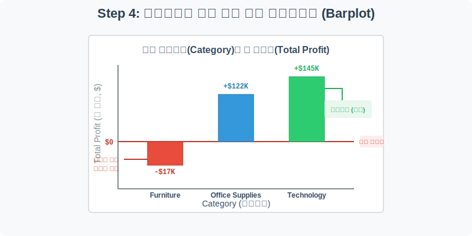

# 실전 데이터 분석 30: 글로벌 슈퍼스토어 비즈니스 KPI 분석

## 📌 강의 개요 (30분 완성)
글로벌 대형 마트(Superstore)의 방대한 **매출(Sales) 및 순이익(Profit)**이 담긴 결제 데이터셋입니다. 수만 건의 파편화된 영수증 데이터를 모아서, 회사의 운명을 결정짓는 핵심 KPI(핵심 성과 지표) 인사이트를 뽑아내는 훈련을 합니다.

**학습 목표:**
* **데이터 집계 (Groupby):** 엑셀의 피벗테이블과 같은 역할을 하는 `groupby` 함수를 사용하여, 수만 건의 결제 내역을 '카테고리별'로 병합하고 요약하여 큰 숲을 보는 방법을 배웁니다.
* **미끼 상품 발굴 (Scatterplot):** "매출이 높으면 수익도 높다"는 비즈니스의 상식을 깨부수는 산점도를 그립니다. 매출은 거대하지만 수익은 마이너스로 추락하는 골칫거리 상품(Loss Leader)들을 시각적으로 잡아냅니다.
* **부서별 성과 평가 (Barplot):** 회사에 막대한 현금을 벌어다 주는 캐시카우(Cash Cow) 부서와 회사의 돈을 까먹는 적자 부서를 0달러 기준선을 돌파하는 막대그래프로 명확하게 보고합니다.

---

## Step 1: 마트 결제 데이터 구조 (Data Overview)



`csv_data` 폴더에 준비해 둔 `superstore.csv` 파일을 판다스로 불러옵니다.

```python
import pandas as pd
import seaborn as sns
import matplotlib.pyplot as plt

# 그래프 설정
plt.rcParams['font.family'] = 'AppleGothic'
plt.rcParams['axes.unicode_minus'] = False
sns.set_palette("colorblind")

# 로컬 CSV 파일 불러오기
df = pd.read_csv('../csv_data/superstore.csv')

# 데이터 구조 및 첫 5행 확인
print(df.info())
display(df.head())
```

### 💡 코드 딥다이브 (Code Deep Dive)
**주요 분석 대상 컬럼:**
* `Order Date`: 고객이 주문을 완료한 날짜
* `Category`: 판매된 상품의 대분류 (가구, 사물용품, 전자기기)
* `Sub-Category`: 중분류 카테고리 (책상, 의자, 스마트폰 등)
* **`Sales` (매출액):** 고객이 결제한 총 금액 (크면 클수록 일단 좋음)
* **`Profit` (순이익):** 매출에서 원가, 할인, 세금 등을 다 빼고 회사가 실제로 주머니에 챙긴 진짜 돈 (마이너스가 되면 적자 발생)

---

## Step 2: 카테고리별 요약 통계 병합 (`groupby`)



원본 데이터는 영수증 1장당 1줄씩 수만 줄이 적혀 있는 파편화된 원시 로그입니다. 사장님이 "그래서 우리 가구 부서가 총 얼마 벌었어?"라고 물을 때 대답할 수 있으려면, `groupby` 함수로 데이터를 묶어서 요약(Aggregation)해야 합니다.

```python
# Category(대분류)를 기준으로 묶고, Sales와 Profit 컬럼만 콕 집어서 다 더해라(sum)
category_df = df.groupby('Category')[['Sales', 'Profit']].sum()

# 숫자가 너무 기니까 보기 편하게 소수점 2자리까지만 반올림해서 출력
display(category_df.round(2))
```

### 💡 분석가의 통찰 (Analyst's Insight)
* 단 한 줄의 `groupby` 코드로 복잡했던 수만 건의 데이터가 'Furniture(가구)', 'Office Supplies(사무용품)', 'Technology(전자기기)' 딱 3줄짜리 요약 보고서로 변신했습니다.
* **충격적인 팩트 체크:** Furniture(가구) 부서를 보세요. 고객들이 결제한 `Sales`는 74만 달러나 되는데, 회사가 남긴 `Profit`은 오히려 **-1만 7천 달러(마이너스)**입니다. 팔면 팔수록 회사가 손해를 보고 있다는 뜻입니다. 당장 원인을 시각화로 파헤쳐야 합니다.

---

## Step 3: 매출 vs 수익 산점도 (미끼 상품 발굴)



가구 부서에서 대체 무슨 일이 벌어지고 있는지 알아보기 위해, 결제 건 하나하나를 점(Dot)으로 찍어보는 `scatterplot`(산점도)을 그려보겠습니다. X축은 매출, Y축은 수익입니다.

```python
plt.figure(figsize=(10, 6))

# X축에 매출, Y축에 수익을 놓고, 카테고리별로 점의 색상(hue)을 다르게 칠함
sns.scatterplot(data=df, x='Sales', y='Profit', hue='Category', alpha=0.6)

# 경영 분석의 핵심: 손익분기점(Profit = 0)에 붉은색 점선을 가로로 긋기
plt.axhline(0, color='red', linestyle='--', linewidth=2)

plt.title('결제 건별 매출액(Sales)과 순이익(Profit) 상관관계', fontsize=16)
plt.xlabel('결제 매출액 ($)')
plt.ylabel('순이익 ($)')
plt.grid(True, alpha=0.3)

plt.show()
```

### 💡 시각화 차트 읽는 법
* **수익 정상 궤도 (빨간 선 위쪽):** 점들이 우상향(오른쪽 위)으로 퍼져 나갑니다. 비싼 물건(X 증가)을 팔면 마진(Y 증가)도 많이 남는 정상적인 비즈니스입니다. (주로 전자기기)
* **미끼 상품/할인 출혈 (빨간 선 아래쪽):** 엄청나게 특이한 현상이 보입니다. 그래프가 오른쪽으로 갈수록(매출액이 몇천 달러씩 커지는데), 점들이 밑으로 곤두박질칩니다(수익이 수천 달러씩 마이너스).
* **결론:** 마트가 고객을 끌어모으기 위해 거대한 가구(Furniture) 등을 원가 이하로 폭탄 세일하여 팔고 있는 것입니다. 이런 미끼 상품(Loss Leader) 전략이 도를 넘어서 회사 전체의 이익을 깎아 먹고 있는 상황입니다.

---

## Step 4: 카테고리별 최종 수익 비교 막대그래프 (Barplot)



경영진에게 보고하기 위해, 각 카테고리가 1년 동안 벌어들인 총 순이익(Profit)을 직관적인 막대그래프(`barplot`)로 요약하여 보여줍시다.

```python
plt.figure(figsize=(8, 6))

# 카테고리별 총 Profit을 그려줍니다. estimator=sum을 사용하면 알아서 합계를 냅니다.
sns.barplot(data=df, x='Category', y='Profit', estimator=sum, 
            errorbar=None, palette=['#e74c3c', '#3498db', '#2ecc71'])

# 손익분기점(Profit = 0) 적자 기준선 강조
plt.axhline(0, color='black', linestyle='-', linewidth=2)
plt.text(1.5, -5000, '적자 기준선 ($0)', color='black', fontweight='bold')

plt.title('상품 카테고리별 총 순이익(Total Profit) 비교', fontsize=16)
plt.xlabel('대분류 카테고리')
plt.ylabel('총 순이익 ($)')

plt.show()
```

### 💡 코드 딥다이브 & 인사이트 (매우 중요!)
* **전자기기(Technology) & 사무용품(Office Supplies):** 막대가 0선 위로 웅장하게 치솟아 있습니다. 이 두 부서가 회사의 직원 월급을 주고 운영하게 만드는 효자(캐시카우)입니다.
* **가구(Furniture):** 막대가 0선 아래로 시원하게 뚫고 내려갔습니다. 회사의 돈을 태워 없애고 있는 주범입니다. 사장님은 이 차트를 보는 즉시 가구 부서장에게 할인율 축소 정책이나 재고 관리 원가 절감 방안을 명령할 것입니다. 이것이 데이터 분석이 비즈니스를 움직이는 힘입니다.

---

## 🎯 30분 강의 마무리 및 심화 과제

`superstore` 실전 데이터를 통해, 쪼개진 영수증을 `groupby`로 병합하여 부서 단위의 통계를 내는 법을 배웠습니다. 또한 `scatterplot`으로 팔수록 손해 보는 폭탄 세일 상품들의 민낯을 확인했고, `barplot`으로 회사를 먹여 살리는 부서와 적자 부서를 명확하게 평가하는 시각화 보고서를 완성했습니다.

### 📝 심화 과제 (Advanced Challenge)
1. **서브 카테고리 적자 추적:** Step 4의 막대그래프 코드에서 X축을 `Category` 대신 `Sub-Category`(중분류)로 바꾸어 보세요. 가구 중에서도 책상(Tables), 의자(Chairs), 책장(Bookcases) 중 정확히 어떤 녀석이 가장 극악무도한 적자를 내고 있는지 진짜 범인을 찾아낼 수 있습니다.
2. **지역별 매출 비교:** `plt.pie()`를 활용하여 어떤 지역(`Region` - West, East, Central, South)이 회사 총매출(`Sales`)에서 가장 큰 파이를 차지하고 있는지 시각화해 보세요.
