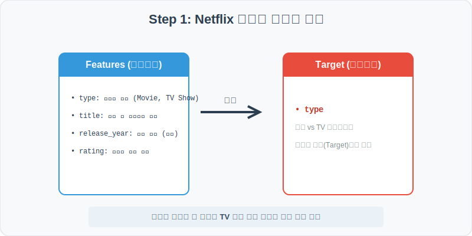
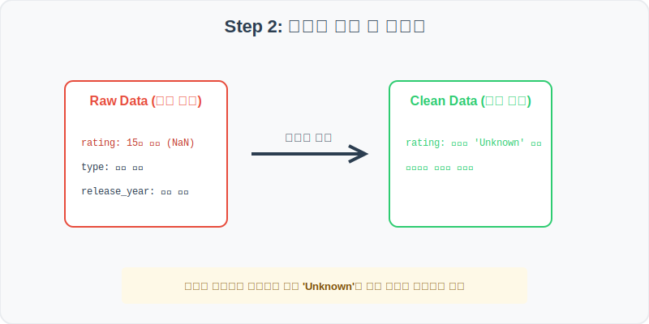
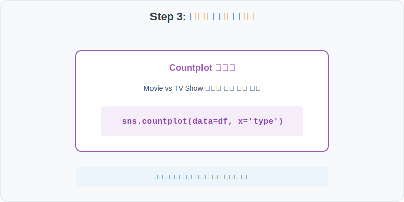
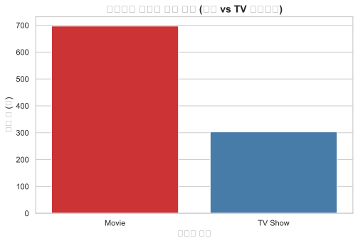
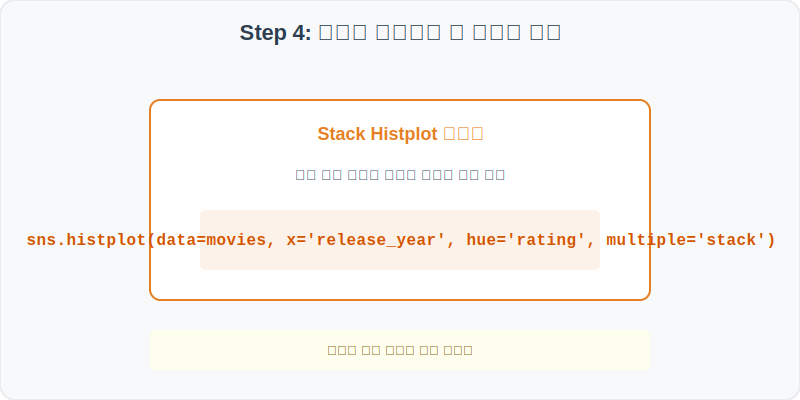
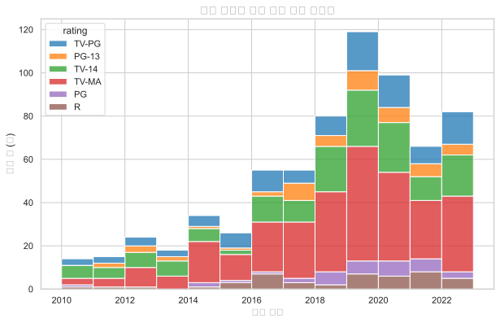

# 실전 데이터 분석 31: 넷플릭스 영화 및 TV 프로그램 트렌드 분석

## 📌 강의 개요 (30분 완성)


세계 최대의 OTT 서비스인 넷플릭스(Netflix)의 영화 및 TV 프로그램 등록 데이터셋입니다. 영화와 TV 프로그램의 비율 분포를 확인하고, 연도별 등급의 다차원 스택 분석을 통해 글로벌 스트리밍 서비스의 콘텐츠 제작 트렌드를 추적해 봅니다.

**학습 목표:**
* **결측치 대체 (fillna):** 평점 범주가 누락된 경우 삭제하지 않고 'Unknown'으로 채워 데이터를 보존합니다.
* **스택 히스토그램 (Histplot):** `hue`와 `multiple='stack'` 옵션을 사용해 등급별 출시 연도 트렌드를 직관적으로 시각화합니다.

---

## Step 1: 데이터 구조 살펴보기 (Data Overview)



`csv_data` 폴더에 준비해 둔 `netflix.csv` 파일을 판다스로 불러옵니다.

```python
import pandas as pd
import seaborn as sns
import matplotlib.pyplot as plt

# 그래프 설정 (한글 폰트 및 마이너스 기호 깨짐 방지)
plt.rcParams['font.family'] = 'AppleGothic'
plt.rcParams['axes.unicode_minus'] = False
sns.set_theme(style="whitegrid")

# 로컬 CSV 파일 불러오기
df = pd.read_csv('../csv_data/netflix.csv')

# 데이터 구조 및 첫 5행 확인
print(df.info())
display(df.head())
```

> **💻 [실행 결과]**
> ```text
<class 'pandas.DataFrame'>
RangeIndex: 1000 entries, 0 to 999
Data columns (total 6 columns):
 #   Column        Non-Null Count  Dtype 
---  ------        --------------  ----- 
 0   show_id       1000 non-null   object
 1   type          1000 non-null   object
 2   title         1000 non-null   object
 3   release_year  1000 non-null   int64 
 4   rating        985 non-null    object
 5   duration_min  1000 non-null   int64 
dtypes: int64(2), object(4)
memory usage: 47.0 KB
None
  show_id     type             title  release_year rating  duration_min
0      s1    Movie  Netflix Title 1          2020  TV-MA           107
1      s2  TV Show  Netflix Title 2          2019  TV-14             1
2      s3    Movie  Netflix Title 3          2022  TV-PG            94
3      s4    Movie  Netflix Title 4          2015      R           112
4      s5    Movie  Netflix Title 5          2021  PG-13            89
> ```

### 💡 코드 딥다이브 (Code Deep Dive)
**주요 분석 대상 컬럼:**
* `show_id`: 콘텐츠의 고유 ID
* `type`: 콘텐츠 유형 (Movie = 영화, TV Show = TV 프로그램)
* `title`: 영화 및 프로그램의 제목
* `release_year`: 콘텐츠가 출시된 연도
* `rating`: 콘텐츠 연령 등급 (예: TV-MA, TV-14, R)
* `duration_min`: 영화인 경우 러닝타임(분), TV 프로그램인 경우 시즌 수(Seasons)

---

## Step 2: 전처리와 결측치 정제 (Preprocess)



현실의 데이터는 항상 누락이 있거나 유효성 정제가 필요합니다. 데이터 전처리 단계에서 결측 상태를 확인하고 올바르게 보정합니다.

```python
# 1. 컬럼별 결측치 개수 확인
print("--- 정제 전 결측치 확인 ---")
print(df.isnull().sum())

# 2. 'rating' 컬럼의 결측치를 'Unknown' 범주로 채움
df['rating'] = df['rating'].fillna('Unknown')

print("\n--- 정제 후 결측치 확인 ---")
print(df.isnull().sum())
```

> **💻 [실행 결과]**
> ```text
--- 정제 전 결측치 확인 ---
show_id          0
type             0
title            0
release_year     0
rating          15
duration_min     0
dtype: int64

--- 정제 후 결측치 확인 ---
show_id         0
type            0
title           0
release_year    0
rating          0
duration_min    0
dtype: int64
> ```

### 💡 분석가의 통찰 (Analyst's Insight)
* **결측치 보존 전략:** `rating` 컬럼에서 누락된 15개의 데이터는 전체의 1.5% 수준입니다. 이를 모두 지우면 다른 귀중한 정보(출시 연도, 타입 등)까지 소실되므로 'Unknown'이라는 별도의 가상 범주를 지정해 채우는 대치(Imputation) 전략을 씁니다. 이를 통해 전체 데이터 크기를 유지하며 분석을 수행할 수 있습니다.

---

## Step 3: 단변수 분포 분석 (Univariate EDA)



가장 먼저 핵심 변수가 전체 데이터에서 어떤 빈도와 분포를 가졌는지 단일 변수 시각화를 통해 파악해 봅니다.

```python
plt.figure(figsize=(8, 5))

# countplot으로 콘텐츠 유형(type)의 분포 시각화
sns.countplot(data=df, x='type', palette='Set1')

plt.title('넷플릭스 콘텐츠 타입 분포 (영화 vs TV 프로그램)', fontsize=14, fontweight='bold')
plt.xlabel('콘텐츠 타입')
plt.ylabel('작품 수 (개)')
plt.show()
```

> **💻 [실행 결과 시각화]**
> 

### 💡 시각화 차트 읽는 법 & 인사이트
* **영화 비중의 절대적 우위:** 시각화 결과를 보면 전체 1000개의 샘플 중 약 70%가 영화(Movie)이며, 약 30%가 TV 프로그램(TV Show)입니다. 플랫폼 내에서 소비 시간이 긴 시리즈물에 비해 단편 영화 형태의 콘텐츠가 더 큰 수량적 비중을 차지하고 있음을 알 수 있습니다.

---

## Step 4: 다변수 상관관계 및 이상치 분석 (Multivariate EDA)



두 개 이상의 변수를 동시에 결합하여, 조건에 따른 수치 차이나 독립 변수와 종속 변수 간의 통계적 경향을 분석합니다.

```python
plt.figure(figsize=(10, 6))

# 영화(Movie) 서브셋만 필터링하여 출시 연도에 따른 등급 분포를 누적 히스토그램으로 분석
sns.histplot(data=df[df['type']=='Movie'], x='release_year', hue='rating', multiple='stack', palette='tab10', binwidth=1)

plt.title('영화 등급별 출시 연도 분포 트렌드', fontsize=14, fontweight='bold')
plt.xlabel('출시 연도')
plt.ylabel('영화 수 (개)')
plt.show()
```

> **💻 [실행 결과 시각화]**
> 

### 💡 코드 딥다이브 & 비즈니스 통찰 (Analyst's Insight)
* **최근 콘텐츠 인플레이션 및 등급 편향:** 히스토그램의 스택 막대를 보면 2018년 이후의 최근 연도로 갈수록 총 영화 등록 수(막대의 총 높이)가 기하급수적으로 증가합니다. 또한 성인 대상 등급인 **TV-MA**와 **R** 등급(빨간색/보라색 계열 등)의 누적 비중이 상단 대부분을 메우고 있어, 넷플릭스가 독창적인 성인 중심의 오리지널 영화 제작에 집중하고 있는 플랫폼 성격을 보여줍니다.

---

## Step 5: 통계적 직관과 해석 (Statistical Logic)

> 💡 **[범주 데이터와 롱테일(Long-tail) 분포의 직관]**
> 넷플릭스의 콘텐츠 출시 연도처럼 최근 몇 년에 대부분의 데이터가 쏠려 있고, 과거 연도로 갈수록 긴 꼬리를 그리며 빈도가 0에 수렴하는 분포를 **롱테일(파레토) 분포**라고 합니다.
> * 이 분포에서는 산술 평균(Mean)을 구하면 최근 데이터 쪽으로 강하게 쏠리게 되므로, 과거부터의 역사적 중앙 위치를 찾기 위해서는 **중앙값(Median)**을 통계적 대표값으로 사용하는 것이 왜곡을 방지하는 상식입니다.
> * 또한 범주형 변수의 비율은 단순히 수치를 계산하는 것보다 `countplot`을 통해 집단 간의 '빈도 비율 격차'를 시각적으로 빠르게 인지하는 것이 인사이트 획득에 훨씬 빠릅니다.

---

## 🎯 30분 강의 마무리 및 심화 과제

오늘 우리는 실전 데이터셋을 분석하여 판다스로 데이터를 가공 및 정제하고, 시각화를 활용하여 핵심 변수 간의 통계적 유의성을 검증했습니다. 데이터 속에서 숨겨진 패턴을 올바른 시각으로 탐색하는 능력이 데이터 사이언티스트의 가장 강력한 무기입니다.

### 📝 심화 과제 (Advanced Challenge)
1. **TV 프로그램 시즌 수 분포 분석:** `df[df['type']=='TV Show']` 필터링을 사용해 TV 프로그램의 `duration_min`(시즌 수) 분포를 `sns.countplot`으로 분석해 보세요. 대부분의 프로그램이 시즌 1에 집중되어 있는지 확인합니다.
2. **평점 등급별 평균 러닝타임 비교:** 영화 그룹에 대해서 등급(`rating`)별 평균 러닝타임(`duration_min`)을 `sns.barplot`으로 그리고, 어린이 대상 등급(PG, TV-PG)과 성인 등급(TV-MA) 간의 평균 분량 차이를 검증해 보세요.
