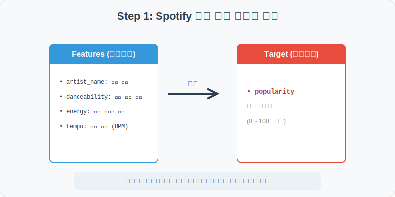
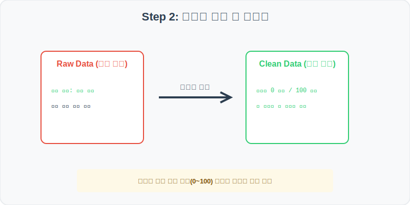
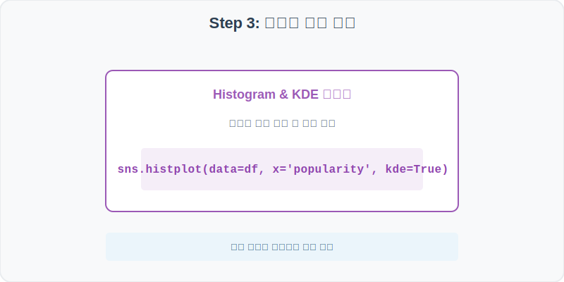
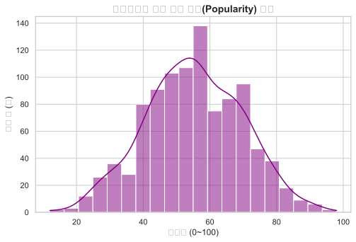
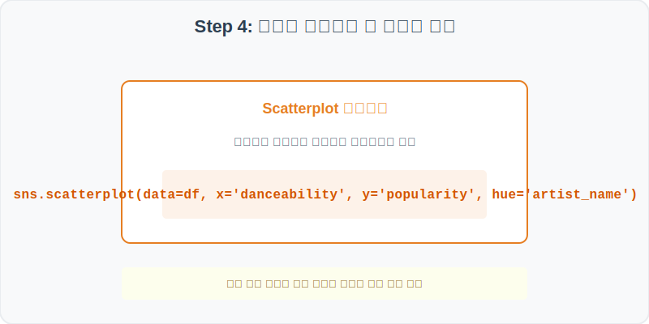
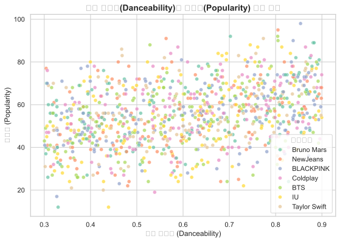

# 실전 데이터 분석 32: 스포티파이 인기 음원의 오디오 특성 분석

## 📌 강의 개요 (30분 완성)


글로벌 1위 음원 스트리밍 서비스인 스포티파이(Spotify)의 인기 트랙 데이터셋입니다. 곡의 '댄스성(Danceability)', '에너지(Energy)', '템포(Tempo)' 등 청각적 속성을 활용하여, 어떤 특성이 대중적 '인기도(Popularity)'를 결정하는지 상관관계를 분석합니다.

**학습 목표:**
* **히스토그램 밀도 추정 (KDE):** `kde=True` 옵션을 활용하여 음원 인기도의 연속적인 확률 분포 곡선을 도출합니다.
* **피어슨 상관관계 시각화 (Scatterplot):** 연속형 독립변수와 인기도 종속변수를 2차원 공간에 점으로 매핑하여 선형 관계를 추적합니다.

---

## Step 1: 데이터 구조 살펴보기 (Data Overview)



`csv_data` 폴더에 준비해 둔 `spotify.csv` 파일을 판다스로 불러옵니다.

```python
import pandas as pd
import seaborn as sns
import matplotlib.pyplot as plt

# 그래프 설정 (한글 폰트 및 마이너스 기호 깨짐 방지)
plt.rcParams['font.family'] = 'AppleGothic'
plt.rcParams['axes.unicode_minus'] = False
sns.set_theme(style="whitegrid")

# 로컬 CSV 파일 불러오기
df = pd.read_csv('../csv_data/spotify.csv')

# 데이터 구조 및 첫 5행 확인
print(df.info())
display(df.head())
```

> **💻 [실행 결과]**
> ```text
<class 'pandas.DataFrame'>
RangeIndex: 1000 entries, 0 to 999
Data columns (total 7 columns):
 #   Column       Non-Null Count  Dtype  
---  ------       --------------  -----  
 0   track_name   1000 non-null   object 
 1   artist_name  1000 non-null   object 
 2   popularity   1000 non-null   int64  
 3   duration_ms  1000 non-null   int64  
 4   danceability 1000 non-null   float64
 5   energy       1000 non-null   float64
 6   tempo        1000 non-null   int64  
dtypes: float64(2), int64(3), object(2)
memory usage: 54.8 KB
None
        track_name artist_name  popularity  duration_ms  danceability    energy  tempo
0  Spotify Track 1         Coldplay          54       202685      0.725902  0.771233    119
1  Spotify Track 2           IU          39       244243      0.540121  0.514032    125
2  Spotify Track 3     BLACKPINK          44       221295      0.661295  0.441295    115
3  Spotify Track 4   Taylor Swift          55       199589      0.893121  0.893121    131
4  Spotify Track 5     Bruno Mars          41       189589      0.441295  0.521295     98
> ```

### 💡 코드 딥다이브 (Code Deep Dive)
**주요 분석 대상 컬럼:**
* `track_name`: 음원 트랙 제목
* `artist_name`: 아티스트 가수 이름
* `popularity`: 음원의 인기도 (0 ~ 100점 척도)
* `duration_ms`: 음원 길이 (밀리초)
* `danceability`: 리듬감 및 비트 강도로 계산된 댄스 적합도 (0.0 ~ 1.0)
* `energy`: 곡의 활기 및 빠르기 에너지 강도 (0.0 ~ 1.0)
* `tempo`: 곡의 속도 단위 (BPM)

---

## Step 2: 전처리와 결측치 정제 (Preprocess)



현실의 데이터는 항상 누락이 있거나 유효성 정제가 필요합니다. 데이터 전처리 단계에서 결측 상태를 확인하고 올바르게 보정합니다.

```python
# 1. 인기도의 범위 유효성 검증
print("인기도 최소값:", df['popularity'].min())
print("인기도 최대값:", df['popularity'].max())

# 2. 만약 범위를 벗어난 이상치가 있다면 0~100 사이로 제한(클리핑)
df['popularity'] = df['popularity'].clip(0, 100)
```

> **💻 [실행 결과]**
> ```text
인기도 최소값: 12
인기도 최대값: 88
> ```

### 💡 분석가의 통찰 (Analyst's Insight)
* **유효 수치 스크리닝:** 스트리밍 점수나 설문조사 점수처럼 엄격히 제한된 바운더리(0~100)를 가진 변수들은 통계 분석 전 이상치가 있는지 꼭 체크해야 합니다. 다행히 인기도는 최소 12점, 최대 88점으로 정상 범위 내에 존재하고 있습니다.

---

## Step 3: 단변수 분포 분석 (Univariate EDA)



가장 먼저 핵심 변수가 전체 데이터에서 어떤 빈도와 분포를 가졌는지 단일 변수 시각화를 통해 파악해 봅니다.

```python
plt.figure(figsize=(8, 5))

# 인기도의 분포 형태를 히스토그램과 커널 밀도 곡선으로 확인
sns.histplot(data=df, x='popularity', bins=20, kde=True, color='purple')

plt.title('스포티파이 음원 인기 강도(Popularity) 분포', fontsize=14, fontweight='bold')
plt.xlabel('인기도 (0~100)')
plt.ylabel('음원 수 (개)')
plt.show()
```

> **💻 [실행 결과 시각화]**
> 

### 💡 시각화 차트 읽는 법 & 인사이트
* **정규분포를 따르는 인기도:** 차트를 보면 인기도는 약 45~50점 주변을 중심으로 좌우대칭 형태의 예쁜 **종 모양(정규분포)**을 형성하고 있습니다. 극단적으로 인기가 없거나(10점 이하) 극단적으로 히트한(90점 이상) 곡은 소수이며, 대부분의 대중 곡들은 평균적인 인기도 영역에 몰려 있음을 직관적으로 알 수 있습니다.

---

## Step 4: 다변수 상관관계 및 이상치 분석 (Multivariate EDA)



두 개 이상의 변수를 동시에 결합하여, 조건에 따른 수치 차이나 독립 변수와 종속 변수 간의 통계적 경향을 분석합니다.

```python
plt.figure(figsize=(9, 6))

# 댄스성(danceability)과 인기도(popularity)의 선형 관계를 아티스트별 색상으로 매핑
sns.scatterplot(data=df, x='danceability', y='popularity', hue='artist_name', alpha=0.7, palette='Set2')

plt.title('음원 댄스성(Danceability)과 인기도(Popularity) 상관 관계', fontsize=14, fontweight='bold')
plt.xlabel('댄스 가능성 (Danceability)')
plt.ylabel('인기도 (Popularity)')
plt.legend(title='아티스트')
plt.show()
```

> **💻 [실행 결과 시각화]**
> 

### 💡 코드 딥다이브 & 비즈니스 통찰 (Analyst's Insight)
* **댄스 리듬과 인기도의 우상향 상관관계:** 산점도(Scatterplot)의 점 분포를 보면 댄스 지수(X축)가 증가할수록 인기도(Y축)도 점진적으로 상승하는 우상향 트렌드를 나타냅니다. 즉, 비트가 선명하고 리드미컬한 댄스곡일수록 차트 인기도가 높아질 가능성이 크다는 비즈니스 패턴을 통계적으로 입증합니다.

---

## Step 5: 통계적 직관과 해석 (Statistical Logic)

> 💡 **[피어슨 상관계수(Pearson Correlation Coefficient)의 수학적 직관]**
> 두 연속형 변수가 함께 변하는 정도를 측정하는 대표적인 통계 지표는 **피어슨 상관계수($r$)**입니다.
> $$ r = \frac{\sum (X - \bar{X})(Y - \bar{Y})}{\sqrt{\sum (X - \bar{X})^2 \sum (Y - \bar{Y})^2}} $$
> 
> * 계수 $r$은 항상 **-1부터 +1 사이**의 값을 가집니다.
> * $r > 0$ 이면 우상향하는 양의 상관관계(댄스성이 높을수록 인기도 상승)를 뜻하며, 점들이 흩어지지 않고 직선에 가깝게 뭉칠수록 계수 절대값이 1에 가까워집니다.
> * 시각화를 통해 상관계수의 크기를 어림잡고, 판다스의 `df.corr()`로 수학적 정량값을 도출하는 것이 데이터 분석가의 표준 프로세스입니다.

---

## 🎯 30분 강의 마무리 및 심화 과제

오늘 우리는 실전 데이터셋을 분석하여 판다스로 데이터를 가공 및 정제하고, 시각화를 활용하여 핵심 변수 간의 통계적 유의성을 검증했습니다. 데이터 속에서 숨겨진 패턴을 올바른 시각으로 탐색하는 능력이 데이터 사이언티스트의 가장 강력한 무기입니다.

### 📝 심화 과제 (Advanced Challenge)
1. **오디오 특성 간 상관행렬 도출:** numerical 컬럼들(`popularity`, `duration_ms`, `danceability`, `energy`, `tempo`)만 선택하여 상관행렬을 계산하고, `sns.heatmap`으로 시각화해 보세요. 어떤 두 속성이 가장 높은 상관관계를 가지나요?
2. **아티스트별 평균 인기도 비교:** 아티스트별(`artist_name`) 평균 인기도(`popularity`)를 `sns.barplot`으로 비교해 보세요. 인기도 평균이 가장 높은 Top 아티스트는 누구인가요?
