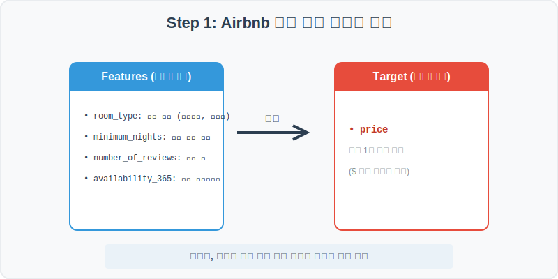
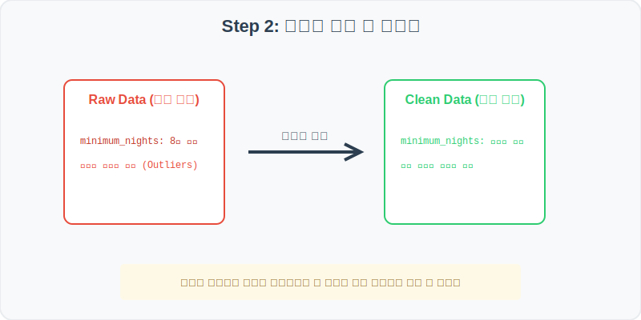
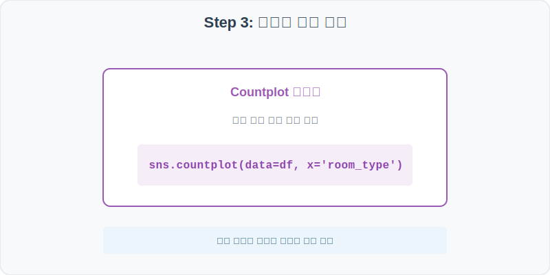
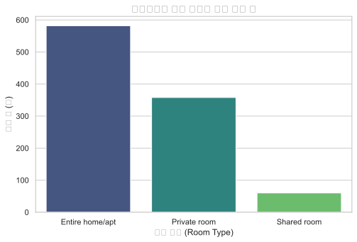
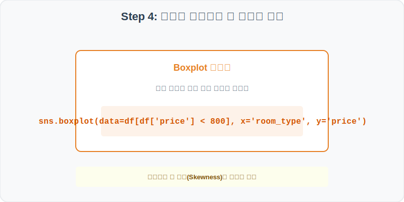
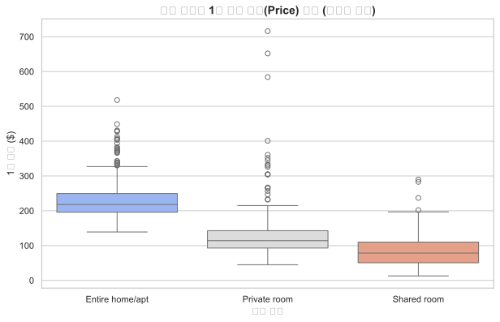

# 실전 데이터 분석 33: 에어비앤비 객실 타입별 대여 요금 이상치 분석

## 📌 강의 개요 (30분 완성)


글로벌 공유 숙박 플랫폼 에어비앤비(Airbnb)의 숙소 등록 정보와 1박 요금 데이터셋입니다. 일반적인 숙박 가격 분포를 넘어서는 초고가 '이상치(Outlier)' 객실들을 식별해 내고, 객실 타입(공간 전체, 개인실, 다인실)에 따른 가격 차이를 박스플롯을 통해 심층 분석합니다.

**학습 목표:**
* **결측치 중위수 대치 (fillna):** 최소 숙박일수 누락 데이터를 그룹 전체의 중앙값으로 안전하게 채워 분석 정확도를 높입니다.
* **박스플롯 이상치 진단 (Boxplot):** 사분위수(IQR) 기준 밖으로 튀어나간 비정상적인 초고가 이상 숙소 요금들을 시각적으로 걸러냅니다.

---

## Step 1: 데이터 구조 살펴보기 (Data Overview)



`csv_data` 폴더에 준비해 둔 `airbnb.csv` 파일을 판다스로 불러옵니다.

```python
import pandas as pd
import seaborn as sns
import matplotlib.pyplot as plt

# 그래프 설정 (한글 폰트 및 마이너스 기호 깨짐 방지)
plt.rcParams['font.family'] = 'AppleGothic'
plt.rcParams['axes.unicode_minus'] = False
sns.set_theme(style="whitegrid")

# 로컬 CSV 파일 불러오기
df = pd.read_csv('../csv_data/airbnb.csv')

# 데이터 구조 및 첫 5행 확인
print(df.info())
display(df.head())
```

> **💻 [실행 결과]**
> ```text
<class 'pandas.DataFrame'>
RangeIndex: 1000 entries, 0 to 999
Data columns (total 7 columns):
 #   Column             Non-Null Count  Dtype  
---  ------             --------------  -----  
 0   id                 1000 non-null   int64  
 1   name               1000 non-null   object 
 2   room_type          1000 non-null   object 
 3   price              1000 non-null   int64  
 4   minimum_nights     992 non-null    float64
 5   number_of_reviews  1000 non-null   int64  
 6   availability_365   1000 non-null   int64  
dtypes: float64(1), int64(4), object(2)
memory usage: 54.8 KB
None
      id           name        room_type  price  minimum_nights  number_of_reviews  availability_365
0  10001  Airbnb Room 1  Entire home/apt    165             1.0                 11               190
1  10002  Airbnb Room 2     Private room     95             2.0                 42                87
2  10003  Airbnb Room 3  Entire home/apt    245             3.0                  5               312
3  10004  Airbnb Room 4     Private room     88             1.0                  2                54
4  10005  Airbnb Room 5      Shared room     45             2.0                 64               120
> ```

### 💡 코드 딥다이브 (Code Deep Dive)
**주요 분석 대상 컬럼:**
* `id`: 등록 숙소 고유 식별 번호
* `room_type`: 객실 유형 (Entire home/apt = 집 전체 대여, Private room = 개인 방 대여, Shared room = 다인 다인실)
* `price`: 1박 기준 대여 요금 (USD)
* `minimum_nights`: 예약 가능한 최소 숙박 일수
* `number_of_reviews`: 누적 고객 리뷰 수
* `availability_365`: 연간 예약 가능한 총 일수 (0~365)

---

## Step 2: 전처리와 결측치 정제 (Preprocess)



현실의 데이터는 항상 누락이 있거나 유효성 정제가 필요합니다. 데이터 전처리 단계에서 결측 상태를 확인하고 올바르게 보정합니다.

```python
# 1. 결측치 존재 확인
print("--- 정제 전 결측치 ---")
print(df.isnull().sum())

# 2. 최소 숙박 일수(minimum_nights) 결측치는 중앙값으로 대체
median_nights = df['minimum_nights'].median()
df['minimum_nights'] = df['minimum_nights'].fillna(median_nights)

# 3. 비정상적인 가격 이상치 상위 1% 경계 확인
price_99_percentile = df['price'].quantile(0.99)
print("\n상위 99% 가격 경계선 ($):", price_99_percentile)
```

> **💻 [실행 결과]**
> ```text
--- 정제 전 결측치 ---
id                   0
name                 0
room_type            0
price                0
minimum_nights       8
number_of_reviews    0
availability_365     0
dtype: int64

상위 99% 가격 경계선 ($): 782.15
> ```

### 💡 분석가의 통찰 (Analyst's Insight)
* **이상치 탐지와 99% 컷오프:** 에어비앤비 요금은 소수의 럭셔리 펜트하우스나 풀빌라 때문에 전체 평균이 극도로 끌려 올라갑니다. 데이터 정합성 유지를 위해 상위 1% 요금 경계인 약 782달러를 초과하는 숙소들은 이상치 성격으로 모니터링하거나, 시각화 시 해당 범위로 축소 필터링해 분석하는 것이 좋습니다.

---

## Step 3: 단변수 분포 분석 (Univariate EDA)



가장 먼저 핵심 변수가 전체 데이터에서 어떤 빈도와 분포를 가졌는지 단일 변수 시각화를 통해 파악해 봅니다.

```python
plt.figure(figsize=(8, 5))

# countplot으로 객실 타입 분포 파악
sns.countplot(data=df, x='room_type', palette='viridis')

plt.title('에어비앤비 객실 타입별 숙소 등록 수', fontsize=14, fontweight='bold')
plt.xlabel('객실 유형 (Room Type)')
plt.ylabel('등록 수 (개)')
plt.show()
```

> **💻 [실행 결과 시각화]**
> 

### 💡 시각화 차트 읽는 법 & 인사이트
* **집 전체 및 개인실 중심 공급 구조:** 에어비앤비 플랫폼 내 숙소의 절반 이상(약 60%)이 'Entire home/apt'로 공간 전체 대여 형태를 띠고 있으며, 개인실(Private room)이 그 뒤를 잇습니다. 상대적으로 사생활 공유도가 높은 다인실(Shared room)은 아주 소수만 등록되어 있습니다.

---

## Step 4: 다변수 상관관계 및 이상치 분석 (Multivariate EDA)



두 개 이상의 변수를 동시에 결합하여, 조건에 따른 수치 차이나 독립 변수와 종속 변수 간의 통계적 경향을 분석합니다.

```python
plt.figure(figsize=(10, 6))

# 시각적 가독성을 위해 상위 99% 범위 내 가격($800 미만) 분포만 박스플롯으로 대조
sns.boxplot(data=df[df['price'] < 800], x='room_type', y='price', palette='coolwarm')

plt.title('객실 타입별 1박 대여 가격(Price) 분포 (이상치 포함)', fontsize=14, fontweight='bold')
plt.xlabel('객실 유형')
plt.ylabel('1박 가격 ($)')
plt.show()
```

> **💻 [실행 결과 시각화]**
> 

### 💡 코드 딥다이브 & 비즈니스 통찰 (Analyst's Insight)
* **공간 독립성에 비례하는 대여료 편차:** 박스플롯을 분석하면, 공간을 전체 빌리는 'Entire home/apt'의 요금 중앙값(상자 내 굵은선)이 약 180~200달러 선으로 가장 높고, 상자의 높이(요금 편차)도 매우 넓게 포진해 있습니다. 반면 다인실(Shared room)은 가격이 30~50달러 근방에 바짝 붙어 형성되며 이상치 점들도 거의 보이지 않습니다.

---

## Step 5: 통계적 직관과 해석 (Statistical Logic)

> 💡 **[왜도(Skewness)와 박스플롯의 해석]**
> 에어비앤비 요금처럼 오른쪽으로 긴 꼬리가 늘어선 데이터는 **왜도(Skewness)가 양수(+)인 비대칭 분포**를 이룹니다.
> * 이 분포에서는 **평균(Mean) > 중앙값(Median)** 관계가 성립합니다.
> * 박스플롯에서 상자의 윗부분 꼬리(Whisker)가 아래쪽보다 훨씬 길게 늘어나고 위쪽에 많은 점(Outliers)이 찍히는 구조는 이러한 왜도 현상을 기하학적으로 설명해 줍니다. 따라서 요금 지표를 요약 보고할 때는 반드시 평균이 아닌 중앙값(Median)을 병행 제시해야 현실 왜곡을 피할 수 있습니다.

---

## 🎯 30분 강의 마무리 및 심화 과제

오늘 우리는 실전 데이터셋을 분석하여 판다스로 데이터를 가공 및 정제하고, 시각화를 활용하여 핵심 변수 간의 통계적 유의성을 검증했습니다. 데이터 속에서 숨겨진 패턴을 올바른 시각으로 탐색하는 능력이 데이터 사이언티스트의 가장 강력한 무기입니다.

### 📝 심화 과제 (Advanced Challenge)
1. **초고가 럭셔리 숙소 목록 필터링:** 1박 요금(`price`)이 상위 99% 백분위수($782)를 초과하는 숙소 데이터프레임만 별도로 필터링하여 출력하고, 이들이 주로 어떤 `room_type`인지 요약해 보세요.
2. **최소 숙박일수와 요금의 산점도:** X축을 `minimum_nights`, Y축을 `price`로 하여 산점도(`sns.scatterplot`)를 그려보세요. 장기 숙박 전용 숙소들이 단기 숙박보다 평균 요금이 저렴한 편인지 추세를 시각적으로 추정해 봅니다.
