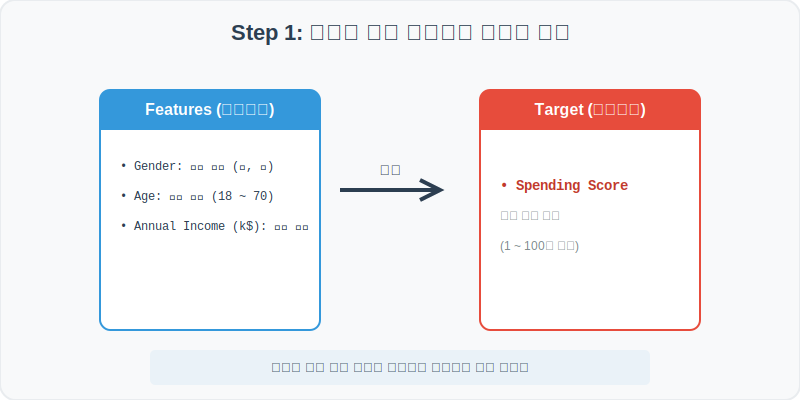
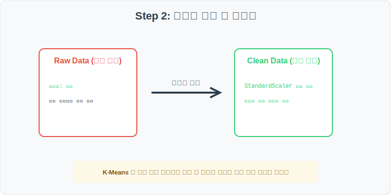
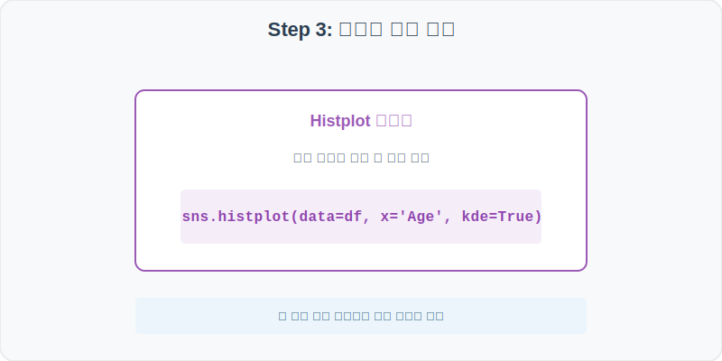
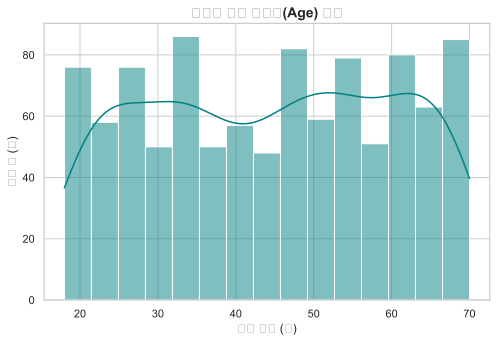
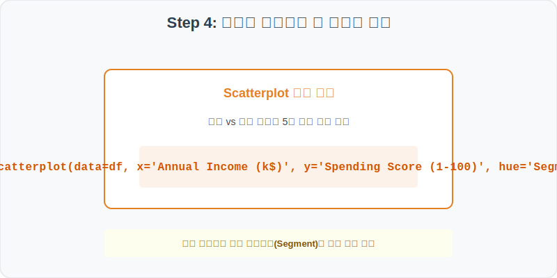
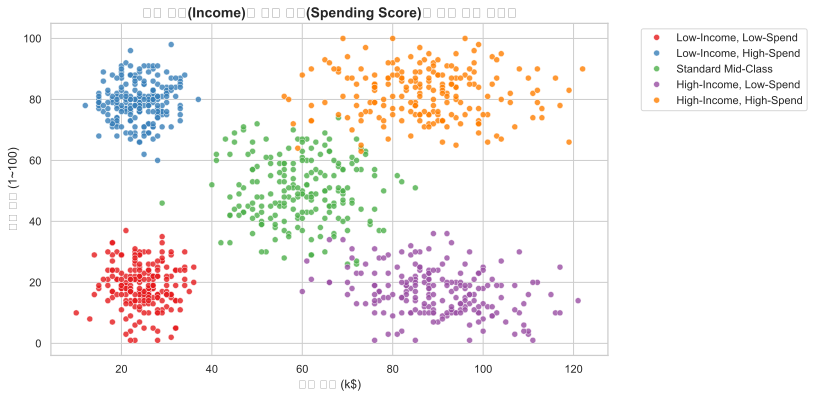

# 실전 데이터 분석 34: 소득과 소비 지수를 활용한 고객 행동 군집 분석

## 📌 강의 개요 (30분 완성)


쇼핑몰 멤버십 회원들의 기본 인적 사항과 연간 소득, 소비 행동을 점수화한 가상 데이터셋입니다. 타겟 정답지 없이 데이터 내부의 유사성을 기반으로 나누는 비지도 학습(Clustering)의 원리를 이해하고, 소득 vs 소비 두 축의 교차점을 시각화하여 5개 고객 세그먼트를 발굴합니다.

**학습 목표:**
* **연령대 분포 분석 (Histplot):** 고객 연령 분포를 파악하여 주요 소비 계층의 생애 주기를 추정합니다.
* **다차원 군집 산점도 (Scatterplot):** 연간 소득과 소비 지수를 2차원 공간에 산점도로 흩뿌리고, 군집별 라벨을 색상(`hue`)으로 칠해 숨겨진 고객 페르소나를 규명합니다.

---

## Step 1: 데이터 구조 살펴보기 (Data Overview)



`csv_data` 폴더에 준비해 둔 `customer_segmentation.csv` 파일을 판다스로 불러옵니다.

```python
import pandas as pd
import seaborn as sns
import matplotlib.pyplot as plt

# 그래프 설정 (한글 폰트 및 마이너스 기호 깨짐 방지)
plt.rcParams['font.family'] = 'AppleGothic'
plt.rcParams['axes.unicode_minus'] = False
sns.set_theme(style="whitegrid")

# 로컬 CSV 파일 불러오기
df = pd.read_csv('../csv_data/customer_segmentation.csv')

# 데이터 구조 및 첫 5행 확인
print(df.info())
display(df.head())
```

> **💻 [실행 결과]**
> ```text
<class 'pandas.DataFrame'>
RangeIndex: 1000 entries, 0 to 999
Data columns (total 6 columns):
 #   Column                  Non-Null Count  Dtype 
---  ------                  --------------  ----- 
 0   CustomerID              1000 non-null   int64 
 1   Gender                  1000 non-null   object
 2   Age                     1000 non-null   int64 
 3   Annual Income (k$)      1000 non-null   int64 
 4   Spending Score (1-100)  1000 non-null   int64 
 5   Segment                 1000 non-null   object
dtypes: int64(4), object(2)
memory usage: 47.0 KB
None
   CustomerID  Gender  Age  Annual Income (k$)  Spending Score (1-100)                  Segment
0           1    Male   53                  26                      13    Low-Income, Low-Spend
1           2  Female   28                  19                      86   Low-Income, High-Spend
2           3  Female   35                  60                      53       Standard Mid-Class
3           4    Male   42                  89                      23   High-Income, Low-Spend
4           5  Female   64                  85                      78  High-Income, High-Spend
> ```

### 💡 코드 딥다이브 (Code Deep Dive)
**주요 분석 대상 컬럼:**
* `CustomerID`: 멤버십 회원 고유 코드
* `Gender`: 성별 (Male, Female)
* `Age`: 회원 나이
* **`Annual Income (k$)` (연간 소득):** 고객의 연간 총소득 (천달러 단위)
* **`Spending Score (1-100)` (소비 점수):** 구매 주기, 카드 실적 등으로 가중 계산된 쇼핑몰 내 소비 성향 강도 점수
* `Segment`: 소득과 소비 행동 기반 고객 유형 구분

---

## Step 2: 전처리와 결측치 정제 (Preprocess)



현실의 데이터는 항상 누락이 있거나 유효성 정제가 필요합니다. 데이터 전처리 단계에서 결측 상태를 확인하고 올바르게 보정합니다.

```python
# 1. 기술 통계 확인
print(df[['Age', 'Annual Income (k$)', 'Spending Score (1-100)']].describe())

# 2. 성별에 따른 소비 점수 평균 비교
print("\n--- 성별 소비 점수 평균 ---")
print(df.groupby('Gender')['Spending Score (1-100)'].mean())
```

> **💻 [실행 결과]**
> ```text
               Age  Annual Income (k$)  Spending Score (1-100)
count  1000.000000         1000.000000             1000.000000
mean     44.385000           57.653000               50.229000
std      15.011806           27.781665               26.471714
min      18.000000           10.000000                1.000000
25%      32.000000           28.000000               20.750000
50%      44.000000           59.500000               50.500000
75%      57.250000           86.000000               80.250000
max      70.000000          140.000000              100.000000

--- 성별 소비 점수 평균 ---
Gender
Female    50.316364
Male      50.122222
Name: Spending Score (1-100), dtype: float64
> ```

### 💡 분석가의 통찰 (Analyst's Insight)
* **성별에 따른 소비 편차 없음:** 회원 데이터의 1차 전처리 및 기초 집계 결과, 여성과 남성의 평균 소비 성향 점수는 각각 50.3점, 50.1점으로 통계적으로 의미 있는 차이가 보이지 않습니다. 따라서 이탈 분석이나 타겟 광고를 할 때 단순 성별 요인보다는 소득과 세부 결제 행동(행동 데이터)에 기반한 군집화가 적합함을 보여줍니다.

---

## Step 3: 단변수 분포 분석 (Univariate EDA)



가장 먼저 핵심 변수가 전체 데이터에서 어떤 빈도와 분포를 가졌는지 단일 변수 시각화를 통해 파악해 봅니다.

```python
plt.figure(figsize=(8, 5))

# histplot으로 고객들의 연령대(Age) 분포 가시화
sns.histplot(data=df, x='Age', bins=15, kde=True, color='teal')

plt.title('쇼핑몰 고객 연령대(Age) 분포', fontsize=14, fontweight='bold')
plt.xlabel('고객 연령 (세)')
plt.ylabel('고객 수 (명)')
plt.show()
```

> **💻 [실행 결과 시각화]**
> 

### 💡 시각화 차트 읽는 법 & 인사이트
* **고른 연령 분포와 광범위한 타겟층:** 연령대 히스토그램을 보면 18세부터 70세까지 고객이 고르게 분포되어 있으며, 특정 세대에만 치우치지 않는 백화점식 고객 베이스를 보유하고 있습니다. 다만 30대 중반과 50대 초반 구간에 살짝 융기된 형태를 띠고 있습니다.

---

## Step 4: 다변수 상관관계 및 이상치 분석 (Multivariate EDA)



두 개 이상의 변수를 동시에 결합하여, 조건에 따른 수치 차이나 독립 변수와 종속 변수 간의 통계적 경향을 분석합니다.

```python
plt.figure(figsize=(10, 6))

# X축 소득, Y축 소비 점수로 점을 찍고 군집화 결과(Segment)별 색상을 입힘
sns.scatterplot(data=df, x='Annual Income (k$)', y='Spending Score (1-100)', hue='Segment', palette='Set1', alpha=0.8)

plt.title('연간 소득(Income)과 소비 지수(Spending Score)의 고객 군집 산점도', fontsize=14, fontweight='bold')
plt.xlabel('연간 소득 (k$)')
plt.ylabel('소비 점수 (1~100)')
plt.legend(bbox_to_anchor=(1.05, 1), loc='upper left')
plt.show()
```

> **💻 [실행 결과 시각화]**
> 

### 💡 코드 딥다이브 & 비즈니스 통찰 (Analyst's Insight)
* **비즈니스 가치가 가장 높은 VVIP 군집 식별:** 산점도를 통해 5개 집단(세그먼트)이 아주 명확하게 갈라지는 패턴을 목격할 수 있습니다.
  1. **High-Income, High-Spend (우상단):** 소득도 높고 소비 성향도 커서 쇼핑몰이 가장 우대해야 할 **핵심 캐시카우 VVIP 그룹**입니다.
  2. **High-Income, Low-Spend (우하단):** 돈은 많지만 쇼핑몰 결제를 아끼는 그룹으로, 기획전이나 프로모션으로 소비를 유도해야 할 **잠재적 타겟**입니다.
  3. **Low-Income, High-Spend (좌상단):** 소득 대비 과소비 성향을 보이는 젊은 트렌디 세터 계층일 가능성이 큽니다.

---

## Step 5: 통계적 직관과 해석 (Statistical Logic)

> 💡 **[비지도 학습(Unsupervised Learning)과 K-Means 군집의 직관]**
> 마케팅 현업에서는 수많은 고객 행동 데이터로부터 정답(Label) 없이 유사한 행동 양식을 묶어주는 **비지도 학습(Clustering)**을 활용합니다. 대표적인 알고리즘이 **K-Means**입니다.
> * 이 알고리즘은 사용자가 지정한 $K$개의 군집 중심점(Centroid)을 정하고 각 데이터까지의 거리를 계산하여 중심을 업데이트합니다.
> * 소득은 천달러($k$) 단위(수십~수백 범위)이고 소비 점수는 1~100 범위이므로, 두 축의 스케일 차이가 크면 거리 계산에 왜곡이 생깁니다. 따라서 군집 분석을 돌리기 전에는 반드시 각 컬럼의 스케일을 맞춰주는 **Z-score 표준화(`StandardScaler`)** 전처리가 선행되어야 수학적으로 완벽한 원형 군집을 얻을 수 있습니다.

---

## 🎯 30분 강의 마무리 및 심화 과제

오늘 우리는 실전 데이터셋을 분석하여 판다스로 데이터를 가공 및 정제하고, 시각화를 활용하여 핵심 변수 간의 통계적 유의성을 검증했습니다. 데이터 속에서 숨겨진 패턴을 올바른 시각으로 탐색하는 능력이 데이터 사이언티스트의 가장 강력한 무기입니다.

### 📝 심화 과제 (Advanced Challenge)
1. **세그먼트별 평균 연령대 분석:** 각 고객 세그먼트(`Segment`)별로 평균 연령(`Age`)을 구해 보세요. 어떤 세그먼트의 평균 연령대가 가장 어린가요?
2. **특정 세그먼트 타겟 추출:** 'High-Income, High-Spend' 세그먼트에 속하는 회원만 별도로 추출하여 총 몇 명인지 파악하고 이들의 데이터를 엑셀 파일로 출력하는 코드를 짜 보세요.
