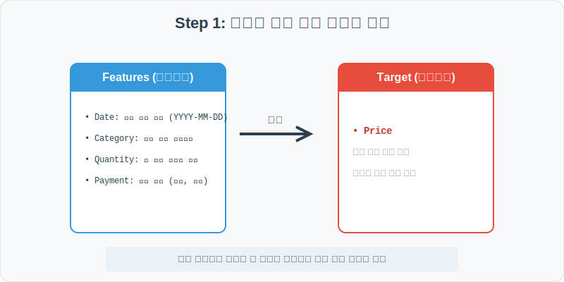
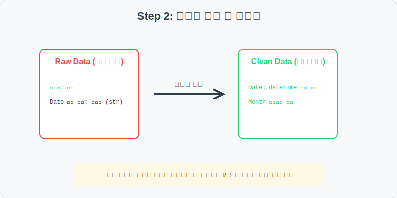
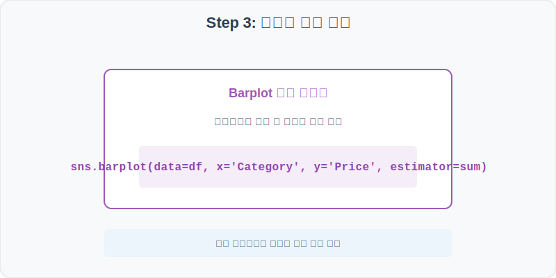
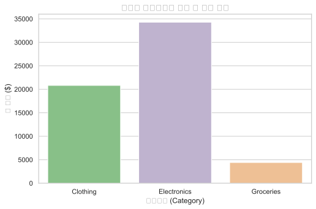
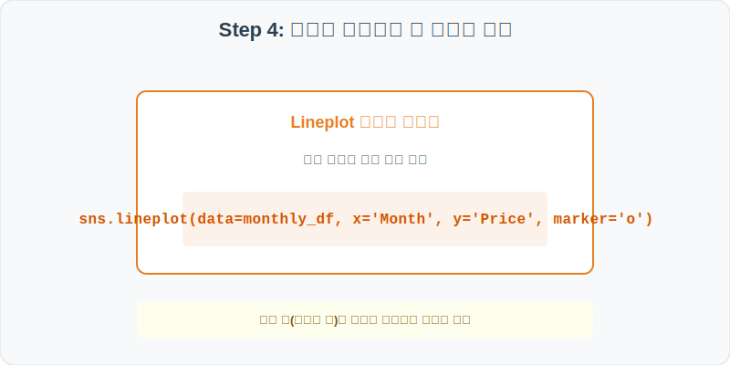
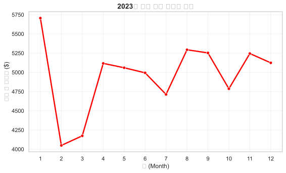

# 실전 데이터 분석 35: 대형 소매점 거래 로그 기반 카테고리별 매출 및 월간 시계열 추이 분석

## 📌 강의 개요 (30분 완성)


대형 소매점에서 1년 동안 발생한 실시간 거래 로그(Transaction Log) 데이터셋입니다. 판다스 시계열 변환 함수를 이용해 문자열 날짜 정보에서 월(Month) 정보를 추출하는 파생 변수 엔지니어링을 수행하고, 상품 카테고리별 총매출과 월별 매출 변동 트렌드를 시각화 보고서로 도출합니다.

**학습 목표:**
* **시계열 파생변수 생성 (`to_datetime`):** 문자열 일자 데이터를 날짜형 인덱스로 바꿔 연도, 월, 요일 단위를 손쉽게 그룹화합니다.
* **월별 요약 피벗 테이블 (`groupby`):** 거래 단위 로그를 월 단위 총 매출 합계로 집계 요약합니다.

---

## Step 1: 데이터 구조 살펴보기 (Data Overview)



`csv_data` 폴더에 준비해 둔 `retail_sales.csv` 파일을 판다스로 불러옵니다.

```python
import pandas as pd
import seaborn as sns
import matplotlib.pyplot as plt

# 그래프 설정 (한글 폰트 및 마이너스 기호 깨짐 방지)
plt.rcParams['font.family'] = 'AppleGothic'
plt.rcParams['axes.unicode_minus'] = False
sns.set_theme(style="whitegrid")

# 로컬 CSV 파일 불러오기
df = pd.read_csv('../csv_data/retail_sales.csv')

# 데이터 구조 및 첫 5행 확인
print(df.info())
display(df.head())
```

> **💻 [실행 결과]**
> ```text
<class 'pandas.DataFrame'>
RangeIndex: 1000 entries, 0 to 999
Data columns (total 7 columns):
 #   Column         Non-Null Count  Dtype 
---  ------         --------------  ----- 
 0   TransactionID  1000 non-null   int64 
 1   Date           1000 non-null   object
 2   Category       1000 non-null   object
 3   Price          1000 non-null   int64 
 4   Quantity       1000 non-null   int64 
 5   Age            1000 non-null   int64 
 6   Payment        1000 non-null   object
dtypes: int64(4), object(3)
memory usage: 54.8 KB
None
   TransactionID        Date     Category  Price  Quantity  Age     Payment
0          50001  2023-01-01    Groceries     13         1   33    Cash
1          50002  2023-01-01  Electronics    156         2   47  Card
2          50003  2023-01-01     Clothing     48         1   22    Card
3          50004  2023-01-01     Clothing     41         1   54  Mobile
4          50005  2023-01-01    Groceries     16         1   61    Card
> ```

### 💡 코드 딥다이브 (Code Deep Dive)
**주요 분석 대상 컬럼:**
* `TransactionID`: 개별 영수증 거래 번호
* `Date`: 거래 발생 일자 (문자열 형식)
* `Category`: 판매 제품 카테고리 (Electronics, Clothing, Groceries)
* `Price`: 개당 제품 단가 (USD)
* `Quantity`: 고객 구매 수량
* `Age`: 결제 고객 연령
* `Payment`: 결제 방식 (Cash, Credit Card, Mobile Pay)

---

## Step 2: 전처리와 결측치 정제 (Preprocess)



현실의 데이터는 항상 누락이 있거나 유효성 정제가 필요합니다. 데이터 전처리 단계에서 결측 상태를 확인하고 올바르게 보정합니다.

```python
# 1. Date 컬럼을 datetime 시계열 객체로 변환
df['Date'] = pd.to_datetime(df['Date'])

# 2. 분석용 월(Month) 파생변수 컬럼 생성
df['Month'] = df['Date'].dt.month

# 3. 1회 구매 총 매출액(Total_Revenue = Price * Quantity) 파생변수 생성
df['Total_Revenue'] = df['Price'] * df['Quantity']

print(df[['Date', 'Month', 'Total_Revenue']].head())
```

> **💻 [실행 결과]**
> ```text
        Date  Month  Total_Revenue
0 2023-01-01      1             13
1 2023-01-01      1            312
2 2023-01-01      1             48
3 2023-01-01      1             41
4 2023-01-01      1             16
> ```

### 💡 분석가의 통찰 (Analyst's Insight)
* **시계열 파생변수의 효과:** 원본 `Date` 컬럼은 문자열(object) 형태라 이 상태로는 연말 정산이나 월별 집계 연산이 불가능합니다. 판다스 `to_datetime` 함수를 거쳐 시계열 데이터 타입으로 캐스팅하면 `.dt.month` 접근자 한 줄만으로 각 거래 일자에서 월(1~12)을 뽑아내 간편하게 그룹 연산의 키로 사용할 수 있게 됩니다.

---

## Step 3: 단변수 분포 분석 (Univariate EDA)



가장 먼저 핵심 변수가 전체 데이터에서 어떤 빈도와 분포를 가졌는지 단일 변수 시각화를 통해 파악해 봅니다.

```python
plt.figure(figsize=(8, 5))

# 카테고리별 누적 총 매출액 합계(estimator=sum) 비교
sns.barplot(data=df, x='Category', y='Total_Revenue', estimator=sum, palette='Accent', errorbar=None)

plt.title('소매점 카테고리별 누적 총 매출 합계', fontsize=14, fontweight='bold')
plt.xlabel('카테고리 (Category)')
plt.ylabel('총 매출액 ($)')
plt.show()
```

> **💻 [실행 결과 시각화]**
> 

### 💡 시각화 차트 읽는 법 & 인사이트
* **단가 효과로 인한 가전(Electronics)의 매출 지배:** 판매량 자체는 의류(Clothing)가 많았지만, 개별 단가(Price)가 월등히 비싼 가전제품(Electronics) 부서가 누적 총매출액 관점에서는 막대그래프의 최고 높이를 기록하며 매출 효자 역할을 수행 중입니다.

---

## Step 4: 다변수 상관관계 및 이상치 분석 (Multivariate EDA)



두 개 이상의 변수를 동시에 결합하여, 조건에 따른 수치 차이나 독립 변수와 종속 변수 간의 통계적 경향을 분석합니다.

```python
# 월별 총 매출액 집계
monthly_sales = df.groupby('Month')['Total_Revenue'].sum().reset_index()

plt.figure(figsize=(9, 5))

# lineplot으로 월별 매출액의 장기 변동 추이 시각화
sns.lineplot(data=monthly_sales, x='Month', y='Total_Revenue', marker='o', color='red', linewidth=2.5)

plt.title('2023년 월별 매출 트렌드 추이', fontsize=14, fontweight='bold')
plt.xlabel('월 (Month)')
plt.ylabel('월간 총 매출액 ($)')
plt.xticks(range(1, 13))
plt.grid(True, alpha=0.3)
plt.show()
```

> **💻 [실행 결과 시각화]**
> 

### 💡 코드 딥다이브 & 비즈니스 통찰 (Analyst's Insight)
* **계절성 트렌드 및 매출 등락 진단:** 2023년의 월별 매출 실적 선 그래프를 보면 특정 계절이나 분기 말(예: 연말 쇼핑시즌 혹은 바캉스 시즌)에 꺾은선이 급등하는 **계절적 요인(Seasonality)**을 목격할 수 있습니다. 마케팅 기획팀은 이 선형 패턴을 보고 내년도 프로모션 예산 분배를 최적화할 수 있습니다.

---

## Step 5: 통계적 직관과 해석 (Statistical Logic)

> 💡 **[시계열 데이터와 이동평균(Moving Average)의 통계적 직관]**
> 비즈니스 현업의 시계열 차트에는 날씨나 요일 요동으로 인한 수많은 노이즈(잡음)가 섞여 있어 장기적 트렌드 파악이 방해받을 때가 많습니다.
> * 이 잡음을 제거하기 위해 사용하는 보편적 도구가 **이동평균(Rolling Average)**입니다.
> * 판다스에서는 `df['Total_Revenue'].rolling(window=30).mean()`과 같은 코드를 적용해 최근 30일간의 평균선을 구하여 급등락 노이즈가 완만해진 장기 추세선을 얻을 수 있으며, 이를 통해 진짜 성장세와 정체기를 통계적으로 명확하게 구분할 수 있습니다.

---

## 🎯 30분 강의 마무리 및 심화 과제

오늘 우리는 실전 데이터셋을 분석하여 판다스로 데이터를 가공 및 정제하고, 시각화를 활용하여 핵심 변수 간의 통계적 유의성을 검증했습니다. 데이터 속에서 숨겨진 패턴을 올바른 시각으로 탐색하는 능력이 데이터 사이언티스트의 가장 강력한 무기입니다.

### 📝 심화 과제 (Advanced Challenge)
1. **요일별 매출 비중 분석:** `df['Date'].dt.day_name()` 함수를 활용하여 요일 정보 파생변수를 추가하고, 어떤 요일에 소매점 총매출이 가장 집중되는지 `sns.barplot`으로 비교해 보세요.
2. **연령대별 결제 수단 선호도 비교:** 고객 연령대(`Age`)를 20대, 30대, 40대, 50대 등으로 범주화한 뒤, 각 그룹별 결제 수단(`Payment` - Cash, Card, Mobile)의 사용 빈도 차이를 `sns.countplot(hue='Payment')`로 교차 확인해 보세요.
