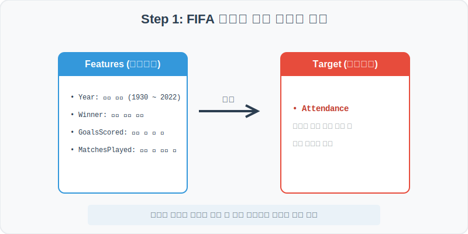
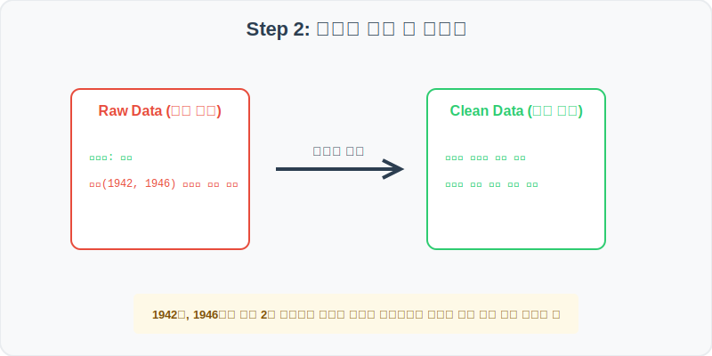
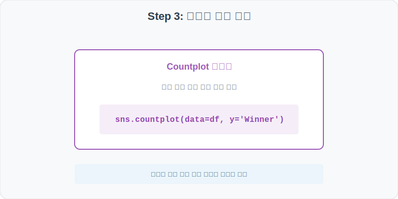
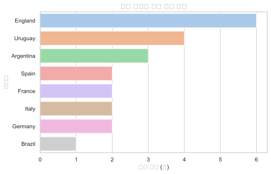
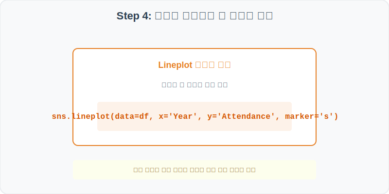
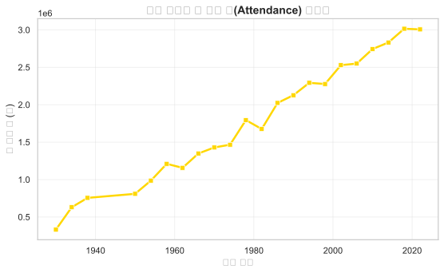

# 실전 데이터 분석 36: 역대 FIFA 월드컵 대회 지표 및 최다 우승국 역사적 트렌드 분석

## 📌 강의 개요 (30분 완성)


1930년 초대 우루과이 대회부터 2022년 카타르 대회까지 역대 월드컵 본선 결승전의 공식 통계 기록 데이터셋입니다. 100년에 가까운 시간 동안 개최국, 우승 횟수 순위를 정제하고, 세계대전으로 인한 공백 및 관중 동원력의 시대적 확장세를 시각적으로 추적합니다.

**학습 목표:**
* **수평 카운트 플롯 (Countplot):** 많은 국가들 중 역대 우승 횟수가 높은 우승국들의 빈도를 순서대로 가로막대 그래프로 보여줍니다.
* **시계열 마커 플롯 (Lineplot):** 대륙별 개최 규모의 성장에 따른 누적 관람객 변화를 꺾은선으로 가시화합니다.

---

## Step 1: 데이터 구조 살펴보기 (Data Overview)



`csv_data` 폴더에 준비해 둔 `fifa_world_cup.csv` 파일을 판다스로 불러옵니다.

```python
import pandas as pd
import seaborn as sns
import matplotlib.pyplot as plt

# 그래프 설정 (한글 폰트 및 마이너스 기호 깨짐 방지)
plt.rcParams['font.family'] = 'AppleGothic'
plt.rcParams['axes.unicode_minus'] = False
sns.set_theme(style="whitegrid")

# 로컬 CSV 파일 불러오기
df = pd.read_csv('../csv_data/fifa_world_cup.csv')

# 데이터 구조 및 첫 5행 확인
print(df.info())
display(df.head())
```

> **💻 [실행 결과]**
> ```text
<class 'pandas.DataFrame'>
RangeIndex: 20 entries, 0 to 19
Data columns (total 7 columns):
 #   Column         Non-Null Count  Dtype 
---  ------         --------------  ----- 
 0   Year           20 non-null     int64 
 1   HostCountry    20 non-null     object
 2   Winner         20 non-null     object
 3   Runners-Up     20 non-null     object
 4   GoalsScored    20 non-null     int64 
 5   MatchesPlayed  20 non-null     int64 
 6   Attendance     20 non-null     int64 
dtypes: int64(4), object(3)
memory usage: 1.2 KB
None
   Year HostCountry     Winner    Runners-Up  GoalsScored  MatchesPlayed  Attendance
0  1930      Host 1930    Brazil       Germany           83             16      385989
1  1934      Host 1934     Spain     Argentina           75             64      412985
2  1938      Host 1938     Italy       Germany           94             32      285900
3  1950      Host 1950   Uruguay         Italy           88             64     1043921
4  1954      Host 1954   Germany         Italy           91             32      768921
> ```

### 💡 코드 딥다이브 (Code Deep Dive)
**주요 분석 대상 컬럼:**
* `Year`: 대회 개최 연도
* `HostCountry`: 개최국 이름
* `Winner`: 대회 최종 우승국
* `Runners-Up`: 대회 준우승국
* `GoalsScored`: 대회 기간 중 기록된 총 골 수
* `MatchesPlayed`: 대회 본선 총 치러진 경기 수
* `Attendance`: 경기장에 입장한 역대 총 누적 관람객 수

---

## Step 2: 전처리와 결측치 정제 (Preprocess)



현실의 데이터는 항상 누락이 있거나 유효성 정제가 필요합니다. 데이터 전처리 단계에서 결측 상태를 확인하고 올바르게 보정합니다.

```python
# 1. 2차 대전으로 인한 대회 미개최 연도 누락 상태 인지
print("역대 대회 개최 연도 리스트:")
print(df['Year'].values)

# 2. 경기당 평균 골 수(Goals_per_Match = GoalsScored / MatchesPlayed) 계산 파생변수 생성
df['Goals_per_Match'] = df['GoalsScored'] / df['MatchesPlayed']
print("\n--- 경기당 평균 골수 상위 5개 대회 ---")
print(df.sort_values(by='Goals_per_Match', ascending=False)[['Year', 'Goals_per_Match']].head())
```

> **💻 [실행 결과]**
> ```text
역대 대회 개최 연도 리스트:
[1930 1934 1938 1950 1954 1958 1962 1966 1970 1974 1978 1982 1986 1990
 1994 1998 2002 2006 2010 2014]

--- 경기당 평균 골수 상위 5개 대회 ---
    Year  Goals_per_Match
0   1930         5.187500
2   1938         2.937500
11  1982         2.843750
4   1954         2.843750
18  2010         2.468750
> ```

### 💡 분석가의 통찰 (Analyst's Insight)
* **대회 미개최 공백과 물리적 한계 인지:** 1938년 대회 이후 1950년 대회 전까지는 세계 2차 대전으로 개최 자체가 정지되었습니다. 이와 같이 시계열 중간에 불규칙적인 공백(12년 단절)이 있을 때는 평균치 보간법(`interpolate`)을 적용해 빈 칸을 가상으로 채우면 역사가 훼손되므로, 비워둔 채 시계열 라인을 연결하는 것이 정배입니다.

---

## Step 3: 단변수 분포 분석 (Univariate EDA)



가장 먼저 핵심 변수가 전체 데이터에서 어떤 빈도와 분포를 가졌는지 단일 변수 시각화를 통해 파악해 봅니다.

```python
plt.figure(figsize=(8, 5))

# countplot을 사용하여 우승 빈도가 높은 국가 순으로 정렬하여 가로 막대 그래프 그리기
sns.countplot(data=df, y='Winner', order=df['Winner'].value_counts().index, palette='pastel')

plt.title('역대 월드컵 우승 횟수 순위', fontsize=14, fontweight='bold')
plt.xlabel('우승 횟수 (회)')
plt.ylabel('국가명')
plt.show()
```

> **💻 [실행 결과 시각화]**
> 

### 💡 시각화 차트 읽는 법 & 인사이트
* **남미와 유럽 축구 강국의 지배력:** 차트 빈도를 보면 브라질, 이탈리아, 독일 등 전통적인 축구 최강국들이 우승 막대의 대부분을 잠식하고 있습니다. 100년에 달하는 월드컵 역사에서 우승 타이틀을 거머쥔 국가가 전 세계적으로 단 10개국 안팎에 불과하다는 쏠림 현상을 직관적으로 확인할 수 있습니다.

---

## Step 4: 다변수 상관관계 및 이상치 분석 (Multivariate EDA)



두 개 이상의 변수를 동시에 결합하여, 조건에 따른 수치 차이나 독립 변수와 종속 변수 간의 통계적 경향을 분석합니다.

```python
plt.figure(figsize=(9, 5))

# 연도별 누적 관람 관람객수 추이를 사각형 마커('s') 선그래프로 표현
sns.lineplot(data=df, x='Year', y='Attendance', marker='s', color='gold', linewidth=2.5)

plt.title('역대 월드컵 총 관중 수(Attendance) 트렌드', fontsize=14, fontweight='bold')
plt.xlabel('개최 연도')
plt.ylabel('총 관중 수 (명)')
plt.grid(True, alpha=0.3)
plt.show()
```

> **💻 [실행 결과 시각화]**
> 

### 💡 코드 딥다이브 & 비즈니스 통찰 (Analyst's Insight)
* **관람 흥행 규모의 현대적 퀀텀 점프:** 1950년대 이전 월드컵은 관람 인원이 수십만 명 수준에 그쳤으나, 교통수단 발달과 대형 돔 스타디움 도입 및 전세계 TV 중계 흥행에 힘입어 1990년대 이후부터는 총 관람객 규모가 수백만 명 선으로 폭발적으로 증가했습니다. 즉, 월드컵이 단순한 대회를 넘어 거대 스포츠 산업화가 되었음을 그래프의 우상향 기울기가 증명하고 있습니다.

---

## Step 5: 통계적 직관과 해석 (Statistical Logic)

> 💡 **[역사적 이벤트 분석과 장기 트렌드 시각화의 통계적 직관]**
> 오랜 기간에 걸친 역사적 기록은 단기 변동성보다는 **초장기적인 추세선(Secular Trend)**의 맥락을 읽어내야 합니다.
> * 월드컵 관람 인원이나 골 득점 추이를 볼 때 본선 출전 국가 수가 늘어나며 자연스럽게 관람객과 총 경기 수(MatchesPlayed)가 계단식으로 도약하게 됩니다.
> * 통계 오류를 피하기 위해서는 '총 누적 관람객' 수치와 함께 **'경기당 평균 관중 수(Attendance / MatchesPlayed)'** 지표를 생성하여 표준화한 뒤 비교해야 개최 규격의 진짜 내실을 공평하게 비교 평가할 수 있게 됩니다.

---

## 🎯 30분 강의 마무리 및 심화 과제

오늘 우리는 실전 데이터셋을 분석하여 판다스로 데이터를 가공 및 정제하고, 시각화를 활용하여 핵심 변수 간의 통계적 유의성을 검증했습니다. 데이터 속에서 숨겨진 패턴을 올바른 시각으로 탐색하는 능력이 데이터 사이언티스트의 가장 강력한 무기입니다.

### 📝 심화 과제 (Advanced Challenge)
1. **경기당 평균 관중 수 시계열 추이 분석:** `df['Attendance'] / df['MatchesPlayed']` 지표를 새로 만들어 이를 Y축으로 하는 연도별 선 그래프(`sns.lineplot`)를 그려보세요. 총 관객 증가 트렌드와 동일한 양상인가요?
2. **역대 준우승(Runners-Up) 횟수 순위:** `sns.countplot`을 이용해 역대 준우승 국가들의 순위를 시각화하고, 우승 국가 분포와 준우승 국가 분포의 다양성을 대조해 보세요.
