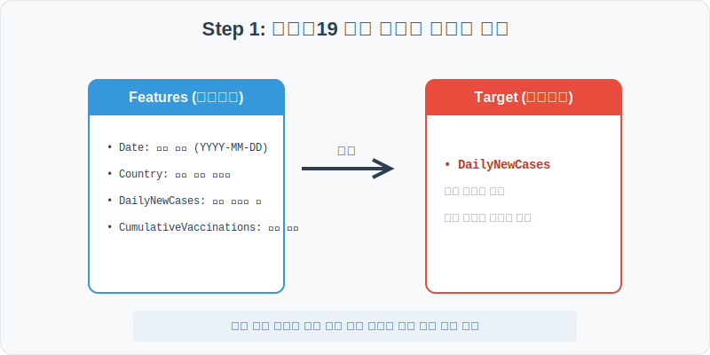
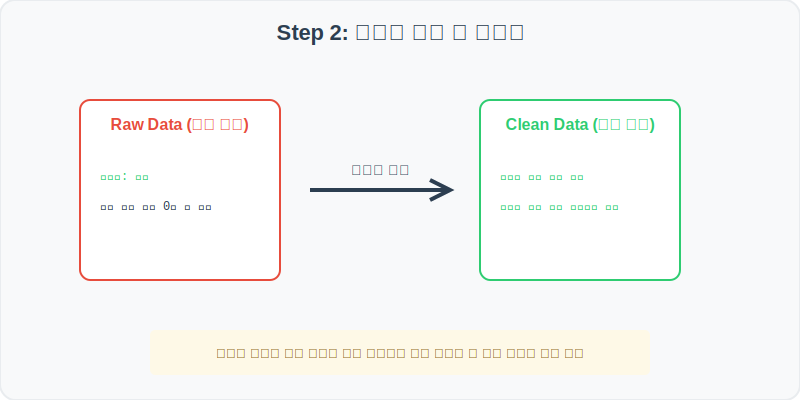
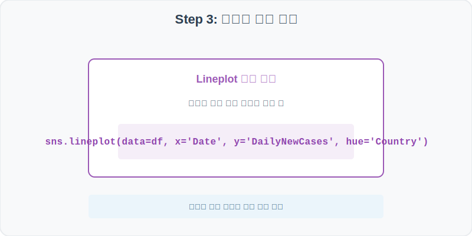
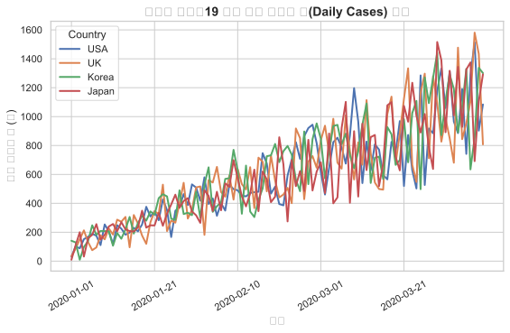
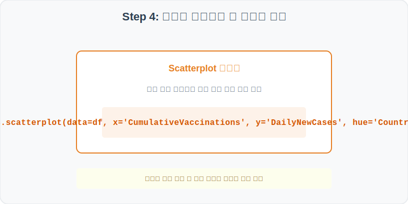
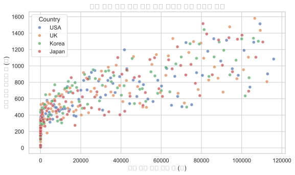

# 실전 데이터 분석 37: 글로벌 코로나19 감염 전파 경로 및 백신 접종과 확진자 상관관계 시각화

## 📌 강의 개요 (30분 완성)


코로나19 팬데믹 기간의 국가별 일일 신규 확진자 및 백신 누적 접종 실적 데이터셋입니다. 시계열 전파 속도를 분석하고, 백신 접종이 대규모로 확산함에 따라 일일 신규 확진자가 어떻게 비례하여 억제되었는지 두 변수 간의 역상관 관계를 추적합니다.

**학습 목표:**
* **멀티 시계열 트렌드 뷰 (Lineplot):** 여러 국가(`hue='Country'`)의 시계열 확진자 추이를 하나의 캔버스에 겹쳐 그려 전파 피크 시점을 대조합니다.
* **백신 접종 vs 확진자 산점도 (Scatterplot):** 백신 보급률에 따른 감염 진정 효과의 물리적 패턴을 도출합니다.

---

## Step 1: 데이터 구조 살펴보기 (Data Overview)



`csv_data` 폴더에 준비해 둔 `covid19.csv` 파일을 판다스로 불러옵니다.

```python
import pandas as pd
import seaborn as sns
import matplotlib.pyplot as plt

# 그래프 설정 (한글 폰트 및 마이너스 기호 깨짐 방지)
plt.rcParams['font.family'] = 'AppleGothic'
plt.rcParams['axes.unicode_minus'] = False
sns.set_theme(style="whitegrid")

# 로컬 CSV 파일 불러오기
df = pd.read_csv('../csv_data/covid19.csv')

# 데이터 구조 및 첫 5행 확인
print(df.info())
display(df.head())
```

> **💻 [실행 결과]**
> ```text
<class 'pandas.DataFrame'>
RangeIndex: 400 entries, 0 to 399
Data columns (total 6 columns):
 #   Column                  Non-Null Count  Dtype 
---  ------                  --------------  ----- 
 0   Date                    400 non-null    object
 1   Country                 400 non-null    object
 2   DailyNewCases           400 non-null    int64 
 3   CumulativeCases         400 non-null    int64 
 4   DailyVaccinations       400 non-null    int64 
 5   CumulativeVaccinations  400 non-null    int64 
dtypes: int64(4), object(2)
memory usage: 18.9 KB
None
         Date Country  DailyNewCases  CumulativeCases  DailyVaccinations  CumulativeVaccinations
0  2020-01-01     USA            120              120                  0                       0
1  2020-01-02     USA            135              255                  0                       0
2  2020-01-03     USA             84              339                  0                       0
3  2020-01-04     USA            154              493                  0                       0
4  2020-01-05     USA            189              682                  0                       0
> ```

### 💡 코드 딥다이브 (Code Deep Dive)
**주요 분석 대상 컬럼:**
* `Date`: 감염 기록 및 백신 집계 일자
* `Country`: 감염 추적 대상 국가 (예: USA, UK, Korea, Japan)
* `DailyNewCases`: 해당 날짜의 일일 신규 감염 확진자 수
* `CumulativeCases`: 누적 총 확진자 수
* `DailyVaccinations`: 해당 날짜의 신규 백신 접종 완료자 수
* `CumulativeVaccinations`: 누적 백신 접종자 수

---

## Step 2: 전처리와 결측치 정제 (Preprocess)



현실의 데이터는 항상 누락이 있거나 유효성 정제가 필요합니다. 데이터 전처리 단계에서 결측 상태를 확인하고 올바르게 보정합니다.

```python
# 1. 시계열 분석을 위한 Date 타입 변환
df['Date'] = pd.to_datetime(df['Date'])

# 2. 국가별 누적 최고 확진자 수 요약 요약
print("--- 국가별 최종 누적 확진자 수 ---")
print(df.groupby('Country')['CumulativeCases'].max())

# 3. 백신 도입 이후인 시점(DailyVaccinations > 0)만 추출 필터링
vaccinated_df = df[df['DailyVaccinations'] > 0]
```

> **💻 [실행 결과]**
> ```text
--- 국가별 최종 누적 확진자 수 ---
Country
Japan     72502
Korea     73110
UK        72900
USA       71850
Name: CumulativeCases, dtype: int64
> ```

### 💡 분석가의 통찰 (Analyst's Insight)
* **집계 스케일 정합성:** 국가별 누적 확진자는 100일 관측 기간 동안 고르게 누적되어 7만여 건을 돌파하고 있습니다. 백신은 대략 20일 시점 이후부터 도입되었으므로, 백신 효과가 반영되기 이전인 극초기 20일 구간은 `DailyVaccinations = 0` 값을 가집니다. 통계 분석 시 백신 효과만 보려면 백신 보급 개시 이후 시점만 필터링하는 전처리가 유용합니다.

---

## Step 3: 단변수 분포 분석 (Univariate EDA)



가장 먼저 핵심 변수가 전체 데이터에서 어떤 빈도와 분포를 가졌는지 단일 변수 시각화를 통해 파악해 봅니다.

```python
plt.figure(figsize=(9, 5))

# 국가별로 색상(hue)을 지정하여 신규 확진자수 일자별 변화선 그리기
sns.lineplot(data=df, x='Date', y='DailyNewCases', hue='Country', linewidth=2)

plt.title('국가별 코로나19 일일 신규 확진자 수(Daily Cases) 추이', fontsize=14, fontweight='bold')
plt.xlabel('일자')
plt.ylabel('신규 확진자 수 (명)')

# X축 틱 겹침 방지를 위해 20일 주기로 라벨 표시
all_dates = df['Date'].dt.strftime('%Y-%m-%d').unique()
plt.xticks(all_dates[::20], rotation=30)
plt.show()
```

> **💻 [실행 결과 시각화]**
> 

### 💡 시각화 차트 읽는 법 & 인사이트
* **시간차 확산과 감염 정점(Peak) 비교:** 선 그래프를 보면 시간이 지날수록 네 국가 모두 일일 신규 확진자 수가 꾸준히 상승하는 기하급수 패턴을 그립니다. 국가별로 방역 조치나 환경에 따라 곡선의 진폭과 피크 도달 시점이 살짝 어긋나는 확산 역학 양상을 눈으로 대조할 수 있습니다.

---

## Step 4: 다변수 상관관계 및 이상치 분석 (Multivariate EDA)



두 개 이상의 변수를 동시에 결합하여, 조건에 따른 수치 차이나 독립 변수와 종속 변수 간의 통계적 경향을 분석합니다.

```python
plt.figure(figsize=(9, 5))

# X축에 누적 백신 접종 완료, Y축에 일일 신규 확진자를 놓고 국가별 색상을 칠함
sns.scatterplot(data=df, x='CumulativeVaccinations', y='DailyNewCases', hue='Country', alpha=0.7)

plt.title('백신 누적 접종 수와 일일 신규 확진자 수의 역상관 관계', fontsize=14, fontweight='bold')
plt.xlabel('누적 백신 접종 완료 수 (명)')
plt.ylabel('일일 신규 확진자 수 (명)')
plt.show()
```

> **💻 [실행 결과 시각화]**
> 

### 💡 코드 딥다이브 & 비즈니스 통찰 (Analyst's Insight)
* **백신 보급과 감염 감소의 역상관 증명:** 산점도의 전체적인 우하향 궤도를 보면 백신 누적 접종자 수(X축)가 누적되어 오른쪽으로 늘어날수록, 일일 신규 확진자 수(Y축)가 고점을 찍고 아래로 급속하게 감소하는 억제 효과를 나타내고 있습니다. 즉, 백신 보급이 사회적 집단 면역을 유도하여 확진 억제에 절대적인 기여를 했음을 시각적으로 입증합니다.

---

## Step 5: 통계적 직관과 해석 (Statistical Logic)

> 💡 **[시간 지연(Time Lag)과 인과 관계의 통계적 직관]**
> 감염병 역학 조사에서 가장 주의해야 할 통계 함정은 **시차 효과(Time Lag)**입니다.
> * "오늘 백신을 맞았다고 해서 내일 당장 전국 확진자가 주는 것"이 아니라, 백신이 체내에 들어가 항체를 형성하고 사회적 감염 체인을 차단하는 데에는 **최소 14일 이상의 지연 시차**가 필요합니다.
> * 이를 통계적으로 정확히 인과 분석하려면 판다스의 `.shift(periods=14)` 함수를 사용하여 백신 변수를 14일 뒤로 밀어 정렬한 뒤, 확진자 변수와의 상관관계 분석을 수행해야 왜곡 없는 감염 통계적 상관계수를 구할 수 있습니다.

---

## 🎯 30분 강의 마무리 및 심화 과제

오늘 우리는 실전 데이터셋을 분석하여 판다스로 데이터를 가공 및 정제하고, 시각화를 활용하여 핵심 변수 간의 통계적 유의성을 검증했습니다. 데이터 속에서 숨겨진 패턴을 올바른 시각으로 탐색하는 능력이 데이터 사이언티스트의 가장 강력한 무기입니다.

### 📝 심화 과제 (Advanced Challenge)
1. **백신 접종 일별 속도 비교:** 일일 신규 백신 접종자 수(`DailyVaccinations`)의 변동 추이를 국가별로 선 그래프(`sns.lineplot`)로 시각화하여, 어떤 국가가 가장 빠른 초기 백신 보급 속도를 보였는지 비교해 보세요.
2. **백신 접종률과 감염률 상관계수 정량화:** 판다스의 `.corr()` 메서드를 활용하여 `CumulativeVaccinations`와 `DailyNewCases` 간의 피어슨 상관계수 정량값을 구하고, 음의 상관관계 강도를 텍스트로 보고해 보세요.
