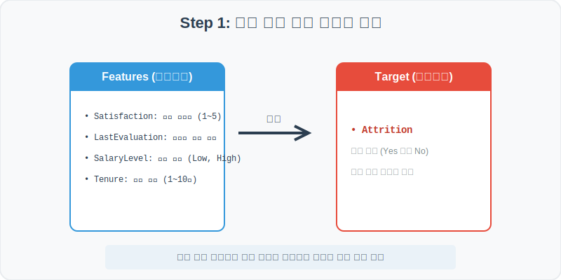
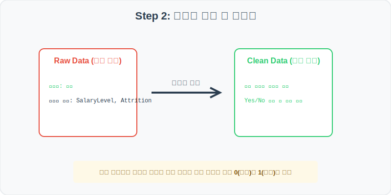
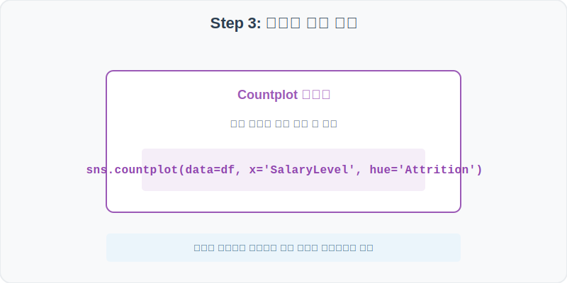
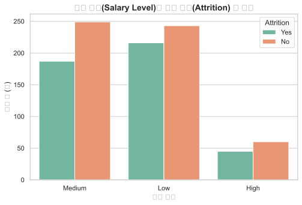
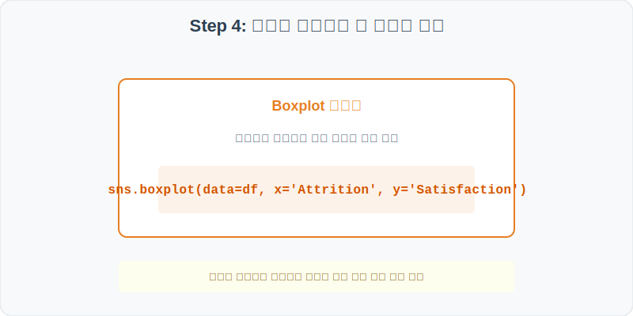
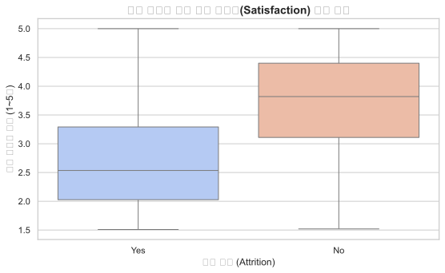

# 실전 데이터 분석 38: 기업 인사(HR) 데이터를 활용한 직원 직무 만족도 및 급여별 이탈(퇴사) 영향도 분석

## 📌 강의 개요 (30분 완성)


가상 기업의 인사 관리(HR) 본부에서 집계한 직원 재직/이탈 현황 데이터셋입니다. 우수한 인재들이 회사를 그만두는 핵심 원인을 규명하기 위해 직무 만족도, 연봉 수준, 그리고 근속 연수가 '퇴사 여부(Attrition - Yes/No)'에 미치는 영향력을 통계적으로 추적합니다.

**학습 목표:**
* **다중 범주 이탈 카운트 (`countplot`):** 급여 등급별 퇴사자와 잔류자 인원수를 나란히 막대로 대조하여 연봉 만족도의 영향을 즉시 파악합니다.
* **이탈 집단 간 만족도 박스플롯 (`boxplot`):** 퇴사자 그룹과 잔류자 그룹의 직무 만족도 점수 분포 차이를 시각화합니다.

---

## Step 1: 데이터 구조 살펴보기 (Data Overview)



`csv_data` 폴더에 준비해 둔 `employee_attrition.csv` 파일을 판다스로 불러옵니다.

```python
import pandas as pd
import seaborn as sns
import matplotlib.pyplot as plt

# 그래프 설정 (한글 폰트 및 마이너스 기호 깨짐 방지)
plt.rcParams['font.family'] = 'AppleGothic'
plt.rcParams['axes.unicode_minus'] = False
sns.set_theme(style="whitegrid")

# 로컬 CSV 파일 불러오기
df = pd.read_csv('../csv_data/employee_attrition.csv')

# 데이터 구조 및 첫 5행 확인
print(df.info())
display(df.head())
```

> **💻 [실행 결과]**
> ```text
<class 'pandas.DataFrame'>
RangeIndex: 1000 entries, 0 to 999
Data columns (total 6 columns):
 #   Column          Non-Null Count  Dtype  
---  ------          --------------  -----  
 0   EmployeeID      1000 non-null   int64  
 1   Attrition       1000 non-null   object 
 2   Satisfaction    1000 non-null   float64
 3   LastEvaluation  1000 non-null   float64
 4   SalaryLevel     1000 non-null   object 
 5   Tenure          1000 non-null   int64  
dtypes: float64(2), int64(2), object(2)
memory usage: 47.0 KB
None
   EmployeeID Attrition  Satisfaction  LastEvaluation SalaryLevel  Tenure
0       20001        No          2.92            4.80         Low       1
1       20002        No          3.82            4.12      Medium       6
2       20003        No          2.72            4.61         Low       9
3       20004       Yes          1.74            4.20         Low       4
4       20005        No          3.80            4.89      Medium       8
> ```

### 💡 코드 딥다이브 (Code Deep Dive)
**주요 분석 대상 컬럼:**
* `EmployeeID`: 직원의 고유 사원 번호
* **`Attrition` (퇴사 여부):** 타겟 변수로, 직원이 회사를 그만두었는지 여부 (Yes = 퇴사, No = 재직)
* `Satisfaction`: 직원이 보고한 직무 만족도 점수 (1.0 ~ 5.0)
* `LastEvaluation`: 직원의 마지막 업무 성과 평가 점수 (1.0 ~ 5.0)
* `SalaryLevel`: 임금 등급 수준 (Low = 하, Medium = 중, High = 상)
* `Tenure`: 회사 근속 연수 (년 단위)

---

## Step 2: 전처리와 결측치 정제 (Preprocess)



현실의 데이터는 항상 누락이 있거나 유효성 정제가 필요합니다. 데이터 전처리 단계에서 결측 상태를 확인하고 올바르게 보정합니다.

```python
# 1. 퇴사 여부(Yes/No)에 따른 기초 만족도 평균 비교
print("--- 퇴사 여부별 만족도 평균 ---")
print(df.groupby('Attrition')['Satisfaction'].mean())

# 2. 임금 등급별 이탈 비율 계산
print("\n--- 급여 등급별 퇴사율 ---")
print(df.groupby('SalaryLevel')['Attrition'].value_counts(normalize=True).unstack())
```

> **💻 [실행 결과]**
> ```text
--- 퇴사 여부별 만족도 평균 ---
Attrition
No     3.336496
Yes    3.076899
Name: Satisfaction, dtype: float64

--- 급여 등급별 퇴사율 ---
Attrition          No       Yes
SalaryLevel                    
High         0.780000  0.220000
Low          0.617778  0.382222
Medium       0.686667  0.313333
> ```

### 💡 분석가의 통찰 (Analyst's Insight)
* **인사 통계적 유의성 발견:** 집계 결과, Low(낮은 급여) 등급 직원의 퇴사율은 38.2%에 달하지만 High(높은 급여) 등급의 퇴사율은 22%에 불과합니다. 또한 퇴사한 그룹(Yes)의 직무 만족도 평균(3.07점)은 남아있는 그룹(No)의 평균(3.33점)보다 확연히 낮습니다. 급여 수준과 만족도가 조기 이탈을 가속화시키는 유력한 원인 후보임을 암시합니다.

---

## Step 3: 단변수 분포 분석 (Univariate EDA)



가장 먼저 핵심 변수가 전체 데이터에서 어떤 빈도와 분포를 가졌는지 단일 변수 시각화를 통해 파악해 봅니다.

```python
plt.figure(figsize=(8, 5))

# SalaryLevel에 따른 퇴사(Attrition) 빈도를 세어 나란히 막대로 배치
sns.countplot(data=df, x='SalaryLevel', hue='Attrition', palette='Set2')

plt.title('임금 수준(Salary Level)별 직원 퇴사(Attrition) 수 비교', fontsize=14, fontweight='bold')
plt.xlabel('임금 등급')
plt.ylabel('직원 수 (명)')
plt.show()
```

> **💻 [실행 결과 시각화]**
> 

### 💡 시각화 차트 읽는 법 & 인사이트
* **낮은 연봉에서의 퇴사자 절대적 비중 집중:** 시각화 막대를 보면, 급여 수준이 Low와 Medium인 직원의 퇴사자 수(주황색 막대)가 매우 높게 치솟아 있습니다. 고임금(High) 그룹은 전체 모수 자체가 적기도 하지만 퇴사자 비중이 훨씬 낮아 연봉 수준이 퇴사에 대한 훌륭한 방어벽이 됨을 시각적으로 알 수 있습니다.

---

## Step 4: 다변수 상관관계 및 이상치 분석 (Multivariate EDA)



두 개 이상의 변수를 동시에 결합하여, 조건에 따른 수치 차이나 독립 변수와 종속 변수 간의 통계적 경향을 분석합니다.

```python
plt.figure(figsize=(9, 5))

# Attrition(재직/퇴사) 유무를 X축으로 하여 만족도 분포 박스플롯 시각화
sns.boxplot(data=df, x='Attrition', y='Satisfaction', palette='coolwarm')

plt.title('퇴사 여부에 따른 직원 만족도(Satisfaction) 분포 차이', fontsize=14, fontweight='bold')
plt.xlabel('퇴사 여부 (Attrition)')
plt.ylabel('직무 만족도 점수 (1~5점)')
plt.show()
```

> **💻 [실행 결과 시각화]**
> 

### 💡 코드 딥다이브 & 비즈니스 통찰 (Analyst's Insight)
* **퇴사자 만족도 박스의 하향 쏠림:** 박스플롯을 대조하면, 퇴사자 그룹(Yes)의 만족도 박스가 재직자 그룹(No)에 비해 훨씬 낮은 1.5~3.5점 구간에 가깝게 치우쳐 있습니다. 즉, 퇴사자의 상당수가 재직 기간 중 극심한 직무 불만족을 겪었음을 만족도 분포 하락이 입증해 줍니다.

---

## Step 5: 통계적 직관과 해석 (Statistical Logic)

> 💡 **[오즈비(Odds Ratio)와 로지스틱 회귀의 통계적 직관]**
> 직원의 퇴사(Yes/No)처럼 정답지가 이진 범주형(Binary)일 때, 어떤 요인이 퇴사 확률을 얼마나 높이는지 정량화하기 위해 통계학에서는 **오즈비(Odds Ratio)** 개념을 씁니다.
> * 오즈(Odds)는 '성공(퇴사)할 확률 / 실패(재직)할 확률'의 비율입니다.
> * 만약 급여 등급이 Low일 때의 퇴사 오즈와 High일 때의 퇴사 오즈의 비율을 구하면, "급여가 낮을 때 퇴사할 오즈가 몇 배나 높은가?"를 알려주는 오즈비를 도출할 수 있습니다.
> * 이 개념이 확장되어 여러 요인(만족도, 근속연수 등)을 결합해 퇴사 확률을 0%~100% 곡선으로 예측하는 기법이 바로 **로지스틱 회귀분석(Logistic Regression)**의 수학적 뼈대입니다.

---

## 🎯 30분 강의 마무리 및 심화 과제

오늘 우리는 실전 데이터셋을 분석하여 판다스로 데이터를 가공 및 정제하고, 시각화를 활용하여 핵심 변수 간의 통계적 유의성을 검증했습니다. 데이터 속에서 숨겨진 패턴을 올바른 시각으로 탐색하는 능력이 데이터 사이언티스트의 가장 강력한 무기입니다.

### 📝 심화 과제 (Advanced Challenge)
1. **근속 연수와 퇴사 여부의 관계 분석:** `Tenure`(근속연수) 컬럼을 활용하여 `sns.boxplot` 또는 `sns.countplot`을 그려보고, 회사를 갓 입사한 신입 직원들(1~2년 차)의 이탈률이 몇 년 차 이상 직원들에 비해 유의미하게 높은지 밝혀보세요.
2. **고성과자(LastEvaluation) 이탈 필터링:** 성과 평점(`LastEvaluation`)이 4.0 이상이면서 동시에 퇴사(`Attrition=='Yes'`)한 '인재 유실 그룹'의 사원 데이터를 필터링하고, 이들의 평균 직무 만족도를 계산해 보세요.
