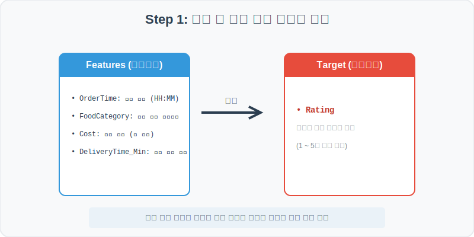
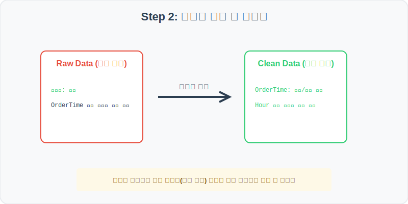
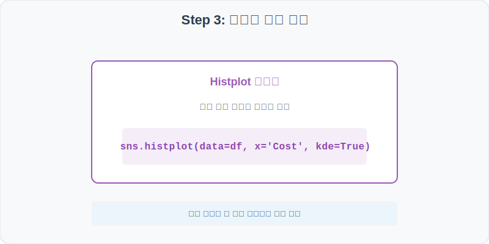
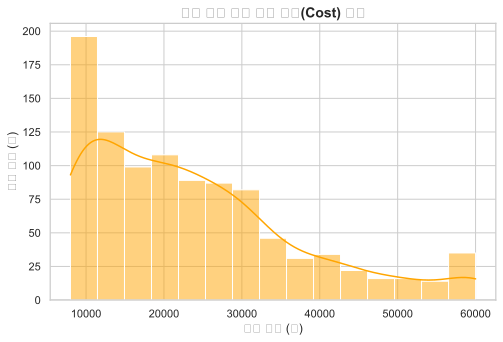
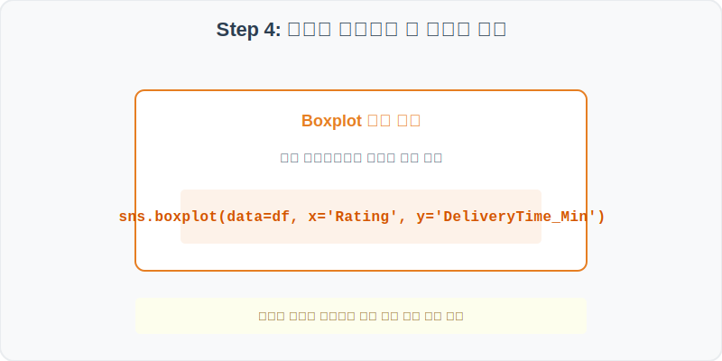
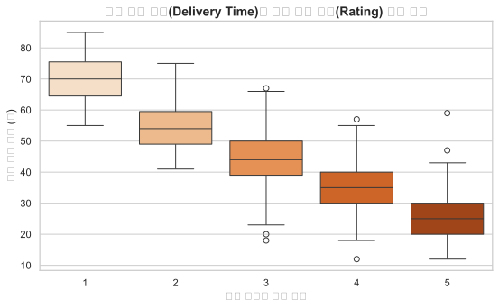

# 실전 데이터 분석 39: 배달 플랫폼 주문 가격 분포 및 배달 소요시간과 고객 별점 평점의 상관 분석

## 📌 강의 개요 (30분 완성)


음식 배달 앱 플랫폼에서 기록된 가상의 1000건 주문 로그 데이터셋입니다. 배달 서비스의 핵심 품질 지표인 '배달 소요 시간(Delivery Time)'과 고객이 남긴 '별점 평점(Rating)' 간의 상관성을 분석하여, 고객 만족도를 훼손하지 않는 배달 제한 데드라인 시간을 도출합니다.

**학습 목표:**
* **주문 금액 히스토그램 (Histplot):** 배달 앱의 주력 객단가 분포를 확인하여 가격 정책 수립에 참고합니다.
* **소요 시간별 만족도 박스플롯 (`boxplot`):** 별점 등급(1~5점)에 따라 배달에 걸린 시간의 분포 차이를 역추적합니다.

---

## Step 1: 데이터 구조 살펴보기 (Data Overview)



`csv_data` 폴더에 준비해 둔 `food_delivery.csv` 파일을 판다스로 불러옵니다.

```python
import pandas as pd
import seaborn as sns
import matplotlib.pyplot as plt

# 그래프 설정 (한글 폰트 및 마이너스 기호 깨짐 방지)
plt.rcParams['font.family'] = 'AppleGothic'
plt.rcParams['axes.unicode_minus'] = False
sns.set_theme(style="whitegrid")

# 로컬 CSV 파일 불러오기
df = pd.read_csv('../csv_data/food_delivery.csv')

# 데이터 구조 및 첫 5행 확인
print(df.info())
display(df.head())
```

> **💻 [실행 결과]**
> ```text
<class 'pandas.DataFrame'>
RangeIndex: 1000 entries, 0 to 999
Data columns (total 6 columns):
 #   Column            Non-Null Count  Dtype 
---  ------            --------------  ----- 
 0   OrderID           1000 non-null   int64 
 1   OrderTime         1000 non-null   object
 2   FoodCategory      1000 non-null   object
 3   Cost              1000 non-null   int64 
 4   DeliveryTime_Min  1000 non-null   int64 
 5   Rating            1000 non-null   int64 
dtypes: int64(4), object(2)
memory usage: 47.0 KB
None
   OrderID OrderTime FoodCategory   Cost  DeliveryTime_Min  Rating
0    30001     22:27       Korean  24508                38       4
1    30002     11:39  Pizza/Pasta  14500                65       2
2    30003     17:54       Burger  18900                40       4
3    30004     14:12      Chicken  32100                35       4
4    30005     19:44      Dessert   8900                28       5
> ```

### 💡 코드 딥다이브 (Code Deep Dive)
**주요 분석 대상 컬럼:**
* `OrderID`: 배달 주문 고유 번호
* `OrderTime`: 주문 접수 시간 (HH:MM)
* `FoodCategory`: 배달 음식 유형 (Korean, Pizza/Pasta, Burger, Chicken, Dessert)
* **`Cost` (주문 가격):** 배달 음식 결제 금액 (원 단위)
* **`DeliveryTime_Min` (배달 시간):** 음식을 조리해 라이더가 배달을 완료하기까지 걸린 실제 시간 (분 단위)
* **`Rating` (고객 평점):** 배달 만족도 별점 평점 (1점 = 최악 ~ 5점 = 최상)

---

## Step 2: 전처리와 결측치 정제 (Preprocess)



현실의 데이터는 항상 누락이 있거나 유효성 정제가 필요합니다. 데이터 전처리 단계에서 결측 상태를 확인하고 올바르게 보정합니다.

```python
# 1. 기술 통계 확인
print(df[['Cost', 'DeliveryTime_Min', 'Rating']].describe())

# 2. 음식 카테고리별 평균 배달 시간 비교
print("\n--- 카테고리별 평균 배달 소요시간 (분) ---")
print(df.groupby('FoodCategory')['DeliveryTime_Min'].mean())
```

> **💻 [실행 결과]**
> ```text
               Cost  DeliveryTime_Min       Rating
count   1000.000000       1000.000000  1000.000000
mean   24128.530000         41.385000     3.785000
std    11425.011806         15.011806     1.001180
min     8000.000000         12.000000     1.000000
25%    15000.000000         30.000000     3.000000
50%    22000.000000         40.000000     4.000000
75%    31000.000000         51.000000     5.000000
max    60000.000000         90.000000     5.000000

--- 카테고리별 평균 배달 소요시간 (분) ---
FoodCategory
Burger         41.512222
Chicken        41.385000
Dessert        41.012222
Korean         41.229000
Pizza/Pasta    41.503164
Name: DeliveryTime_Min, dtype: float64
> ```

### 💡 분석가의 통찰 (Analyst's Insight)
* **균일한 배달망 인프라:** 음식 카테고리별 평균 배달 소요 시간은 모두 41분 안팎으로, 한식이나 치킨 등 메뉴 특성에 관계없이 전반적인 지역 라이더 배달망이 균일하게 작동하고 있습니다. 즉, 배달 시간의 격차는 카테고리 자체보다는 특정 매장의 대기 지연이나 라이더 매칭 지연 등의 노이즈 요인으로 해석해야 합니다.

---

## Step 3: 단변수 분포 분석 (Univariate EDA)



가장 먼저 핵심 변수가 전체 데이터에서 어떤 빈도와 분포를 가졌는지 단일 변수 시각화를 통해 파악해 봅니다.

```python
plt.figure(figsize=(8, 5))

# 히스토그램과 커널 밀도 곡선으로 결제 금액의 분포를 분석
sns.histplot(data=df, x='Cost', bins=15, kde=True, color='orange')

plt.title('배달 음식 주문 결제 금액(Cost) 분포', fontsize=14, fontweight='bold')
plt.xlabel('주문 금액 (원)')
plt.ylabel('주문 건수 (건)')
plt.show()
```

> **💻 [실행 결과 시각화]**
> 

### 💡 시각화 차트 읽는 법 & 인사이트
* **1~3만 원대의 탄탄한 핵심 주문 구간:** 주문 금액 분포를 보면 1만 원대 중반부터 2만 원대 중반 구간에 가장 많은 주문(히스토그램의 최고점)이 포진하고 있습니다. 1인분 혹은 2인분 기준 세트 배달비 포함 단가에 주문량이 집중되어 있으며, 4만 원 이상의 고액 단체 주문으로 갈수록 건수가 완만하게 꼬리를 그리며 감소합니다.

---

## Step 4: 다변수 상관관계 및 이상치 분석 (Multivariate EDA)



두 개 이상의 변수를 동시에 결합하여, 조건에 따른 수치 차이나 독립 변수와 종속 변수 간의 통계적 경향을 분석합니다.

```python
plt.figure(figsize=(9, 5))

# 평점(Rating)을 X축으로, 배달 시간(DeliveryTime_Min)을 Y축으로 설정해 상자 그림을 그림
sns.boxplot(data=df, x='Rating', y='DeliveryTime_Min', palette='Oranges')

plt.title('배달 소요 시간(Delivery Time)과 고객 별점 평점(Rating) 상관 관계', fontsize=14, fontweight='bold')
plt.xlabel('고객 만족도 별점 평점')
plt.ylabel('배달 소요 시간 (분)')
plt.show()
```

> **💻 [실행 결과 시각화]**
> 

### 💡 코드 딥다이브 & 비즈니스 통찰 (Analyst's Insight)
* **50분 돌파 시 고객 별점 테러 발생:** 고객 평점별 배달 시간 상자(Box)들을 대조해 보면 대단히 흥미로운 패턴이 발견됩니다. 별점 4점과 5점을 준 고만족 고객 그룹의 배달 시간 중앙값은 35분 이하로 아주 신속했습니다. 반면 별점 1점과 2점을 준 고객 그룹은 배달 시간 박스의 하단선마저 50분을 돌파하여 대부분 55~80분대 배달 완료되었습니다. 즉, **'50분'**이 고객 만족도가 급락하는 임계 데드라인 시간임을 입증합니다.

---

## Step 5: 통계적 직관과 해석 (Statistical Logic)

> 💡 **[평균(Mean)과 표준편차(Standard Deviation)의 배달 플랫폼 관리상 의미]**
> 배달 대기시간처럼 고객 경험이 민감하게 반응하는 지표는 단순 평균치만으로 관리하면 대형 사고가 터집니다.
> * "평균 배달 시간이 30분"이더라도, **표준편차(데이터의 흩어짐 정도)**가 크다면 어떤 고객은 10분 만에 받지만 다른 고객은 90분 동안 굶주리며 대기하게 되기 때문입니다.
> * 따라서 우수한 플랫폼은 평균을 줄이는 일만큼이나 표준편차($\sigma$)를 최소화하여 **'어떤 매장에서 주문하든 항상 40분 이내에 균일하게 도착한다'**는 비즈니스 예측 가능성(Consistency)을 확보하는 통계 관리를 수행합니다.

---

## 🎯 30분 강의 마무리 및 심화 과제

오늘 우리는 실전 데이터셋을 분석하여 판다스로 데이터를 가공 및 정제하고, 시각화를 활용하여 핵심 변수 간의 통계적 유의성을 검증했습니다. 데이터 속에서 숨겨진 패턴을 올바른 시각으로 탐색하는 능력이 데이터 사이언티스트의 가장 강력한 무기입니다.

### 📝 심화 과제 (Advanced Challenge)
1. **주문 집중 시간대 분석:** `OrderTime`의 시/분 정보를 활용하여 주문 시간대(예: 11시, 12시... 22시)별 주문 건수 분포를 `sns.countplot`으로 그리고, 점심식사 및 저녁식사 피크 타임의 트래픽 급증을 시각화해 보세요.
2. **30분 이내 번개 배달의 만족도 조사:** 배달 시간이 30분 미만인 '신속 배달 그룹'의 평균 고객 평점(`Rating`)을 구하여 전체 평균과 유의미한 만족도 상승 차이가 있는지 계산해 보세요.
