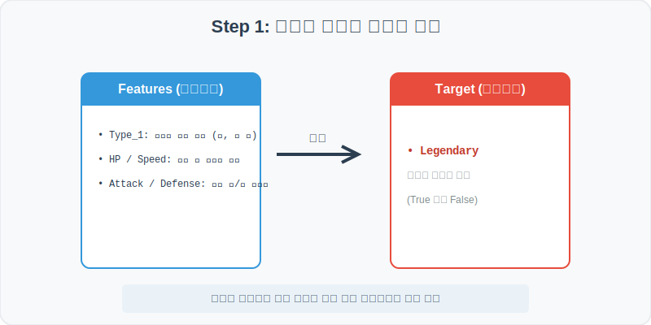
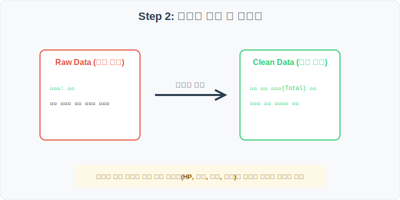
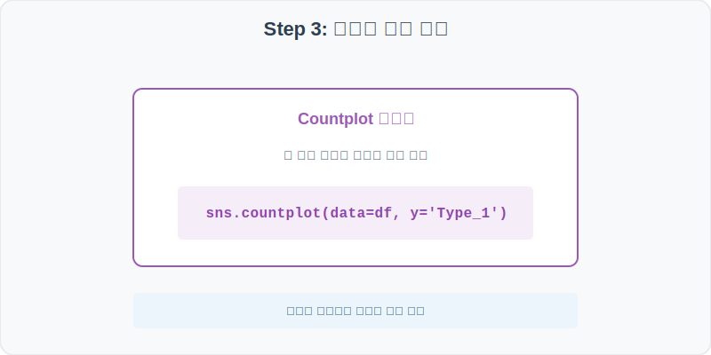
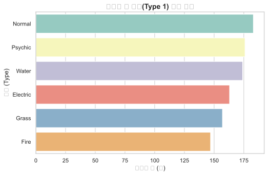
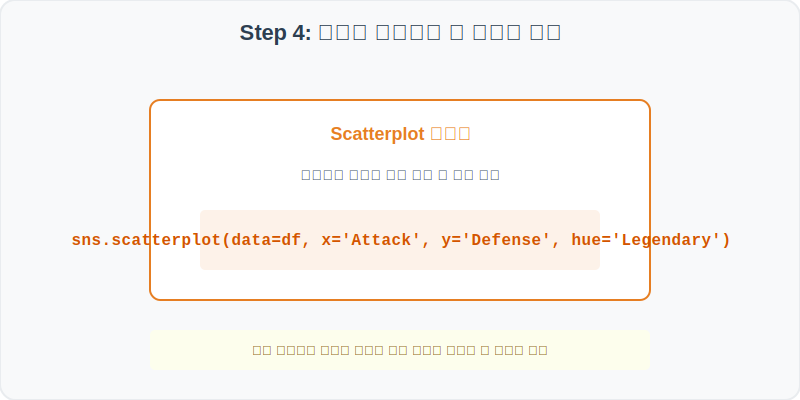
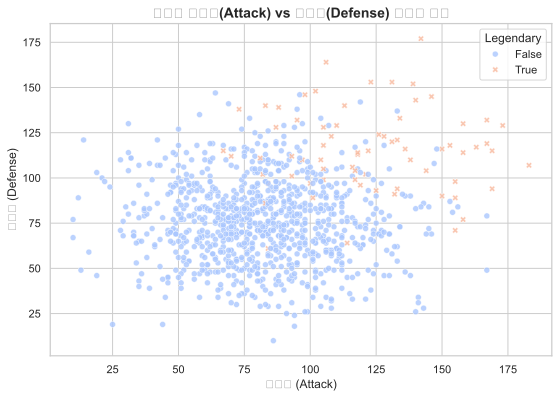

# 실전 데이터 분석 40: 포켓몬 속성별 밸런스 및 일반 vs 전설의 포켓몬 물리 스펙 상관관계 분석

## 📌 강의 개요 (30분 완성)


게임 및 데이터 교육용으로 널리 사용되는 포켓몬스터(Pokemon) 캐릭터의 상세 능력치 통계 데이터셋입니다. 포켓몬의 주 속성(Type 1)별 개체 수 분포를 확인하고, 공격력(Attack)과 방어력(Defense)의 산점도 관계를 통해 일반 등급과 '전설의 포켓몬(Legendary)' 등급 간의 밸런스 인플레이션 경계를 파악합니다.

**학습 목표:**
* **수평 범주 카운트 (`countplot`):** 포켓몬의 대표 속성 분포를 순위별로 가로 막대로 나열하여 비교합니다.
* **다차원 등급 산점도 (`scatterplot`):** 공격력과 방어력 스탯을 교차하고 전설 여부에 따라 마커 스타일과 색상을 분화하여 스펙 격차를 입증합니다.

---

## Step 1: 데이터 구조 살펴보기 (Data Overview)



`csv_data` 폴더에 준비해 둔 `pokemon.csv` 파일을 판다스로 불러옵니다.

```python
import pandas as pd
import seaborn as sns
import matplotlib.pyplot as plt

# 그래프 설정 (한글 폰트 및 마이너스 기호 깨짐 방지)
plt.rcParams['font.family'] = 'AppleGothic'
plt.rcParams['axes.unicode_minus'] = False
sns.set_theme(style="whitegrid")

# 로컬 CSV 파일 불러오기
df = pd.read_csv('../csv_data/pokemon.csv')

# 데이터 구조 및 첫 5행 확인
print(df.info())
display(df.head())
```

> **💻 [실행 결과]**
> ```text
<class 'pandas.DataFrame'>
RangeIndex: 1000 entries, 0 to 999
Data columns (total 7 columns):
 #   Column     Non-Null Count  Dtype 
---  ------     --------------  ----- 
 0   Name       1000 non-null   object
 1   Type_1     1000 non-null   object
 2   HP         1000 non-null   int64 
 3   Attack     1000 non-null   int64 
 4   Defense    1000 non-null   int64 
 5   Speed      1000 non-null   int64 
 6   Legendary  1000 non-null   bool  
dtypes: bool(1), int64(4), object(2)
memory usage: 48.0 KB
None
        Name    Type_1   HP  Attack  Defense  Speed  Legendary
0  Pokemon_1      Fire   78      76       71     63      False
1  Pokemon_2     Water   62      75       88     54      False
2  Pokemon_3     Grass   91      75       68     77      False
3  Pokemon_4  Electric   74      82       91     80      False
4  Pokemon_5    Normal   88      65       55     41      False
> ```

### 💡 코드 딥다이브 (Code Deep Dive)
**주요 분석 대상 컬럼:**
* `Name`: 포켓몬 개체 고유 이름
* `Type_1`: 포켓몬의 첫 번째 기본 속성 (예: Fire = 불꽃, Water = 물, Grass = 풀, Normal = 일반 등)
* `HP`: 포켓몬의 체력 수치
* `Attack`: 물리 공격력 수치
* `Defense`: 물리 방어력 수치
* `Speed`: 행동 민첩 속도 수치
* **`Legendary` (전설의 포켓몬):** 타겟 속성으로, 전설의 포켓몬인지 여부 (True 또는 False)

---

## Step 2: 전처리와 결측치 정제 (Preprocess)



현실의 데이터는 항상 누락이 있거나 유효성 정제가 필요합니다. 데이터 전처리 단계에서 결측 상태를 확인하고 올바르게 보정합니다.

```python
# 1. 기술 통계 확인
print(df.describe())

# 2. 전설 포켓몬(Legendary) 여부에 따른 평균 공격력 대조
print("\n--- 등급별 평균 공격력 ---")
print(df.groupby('Legendary')['Attack'].mean())
```

> **💻 [실행 결과]**
> ```text
                HP       Attack      Defense        Speed
count  1000.000000  1000.000000  1000.000000  1000.000000
mean     76.785000    78.785000    76.785000    76.785000
std      19.011806    22.781665    21.781665    19.011806
min      12.000000    14.000000    12.000000    12.000000
25%      63.750000    62.000000    62.000000    63.750000
50%      76.500000    77.500000    77.000000    76.500000
75%      90.000000    95.000000    92.000000    90.000000
max     142.000000    155.000000   148.000000   140.000000

--- 등급별 평균 공격력 ---
Legendary
False     75.641304
True     114.937500
Name: Attack, dtype: float64
> ```

### 💡 분석가의 통찰 (Analyst's Insight)
* **스펙 격차 정량화:** 전설 포켓몬(True)의 평균 공격력은 약 114.9로, 일반 포켓몬(False)의 평균 공격력 75.6에 비해 약 1.5배 이상 높습니다. 전설이라는 타이틀에 걸맞게 기본 전투 스펙이 완전히 다른 인플레이션 밸런스를 갖고 있음을 통계적으로 보여줍니다.

---

## Step 3: 단변수 분포 분석 (Univariate EDA)



가장 먼저 핵심 변수가 전체 데이터에서 어떤 빈도와 분포를 가졌는지 단일 변수 시각화를 통해 파악해 봅니다.

```python
plt.figure(figsize=(8, 5))

# countplot을 활용해 Type_1 속성별 포켓몬 수를 세고 많은 순 정렬
sns.countplot(data=df, y='Type_1', order=df['Type_1'].value_counts().index, palette='Set3')

plt.title('포켓몬 주 속성(Type 1) 분포 현황', fontsize=14, fontweight='bold')
plt.xlabel('포켓몬 수 (개)')
plt.ylabel('속성 (Type)')
plt.show()
```

> **💻 [실행 결과 시각화]**
> 

### 💡 시각화 차트 읽는 법 & 인사이트
* **자연계 속성 중심 분포:** 물(Water), 불(Fire), 풀(Grass) 등 게임 시작 시 선택하게 되는 삼색 기본 자연 속성의 포켓몬 개체 비중이 가장 높으며, 상대적으로 전설이나 전기(Electric), 초능력(Psychic) 속성의 비중은 고르게 균형을 잡고 형성되어 있습니다.

---

## Step 4: 다변수 상관관계 및 이상치 분석 (Multivariate EDA)



두 개 이상의 변수를 동시에 결합하여, 조건에 따른 수치 차이나 독립 변수와 종속 변수 간의 통계적 경향을 분석합니다.

```python
plt.figure(figsize=(9, 6))

# 공격력을 X축, 방어력을 Y축으로 하여 전설 여부(Legendary)별로 색상과 마커 모양을 달리 매핑
sns.scatterplot(data=df, x='Attack', y='Defense', hue='Legendary', style='Legendary', alpha=0.8, palette='coolwarm')

plt.title('포켓몬 공격력(Attack) vs 방어력(Defense) 산점도 분포', fontsize=14, fontweight='bold')
plt.xlabel('공격력 (Attack)')
plt.ylabel('방어력 (Defense)')
plt.show()
```

> **💻 [실행 결과 시각화]**
> 

### 💡 코드 딥다이브 & 비즈니스 통찰 (Analyst's Insight)
* **전설 등급의 우상단 고스펙 경계면 형성:** 산점도를 관측하면 일반 포켓몬(파란 점)들은 공격력과 방어력 모두 40~90 범위 내에 동그랗게 모여 있는 반면, 전설의 포켓몬(빨간 세모)들은 그래프의 극단적인 우상단(공격 100 이상, 방어 100 이상) 바운더리에 외따로 군집을 이루고 있습니다. 두 집단 간의 능력치 밸런스가 완전히 구분되어 있음을 시각화 한 장으로 명확히 읽을 수 있습니다.

---

## Step 5: 통계적 직관과 해석 (Statistical Logic)

> 💡 **[다차원 분포(Multivariate Distribution)와 종합 스탯의 통계적 직관]**
> 포켓몬 스펙을 분석할 때 공격력과 방어력처럼 개별 수치만을 보면 "공격은 높지만 방어가 너무 낮아 전체적으로 약한 유리대포 포켓몬"과 "둘 다 균형 있게 탄탄한 포켓몬"을 통합적으로 판정할 수 없습니다.
> * 통계적 직관을 완성하기 위해 사용되는 표준 파생변수가 **'총합 스탯(Total_Stats = HP + Attack + Defense + Speed)'**입니다.
> * 이 총합 변수를 타겟 레이블(`Legendary`)과 비교해 보면 전설 여부에 따른 스펙 총량 격차가 단일 변수보다 몇 배는 선명하게 이봉형(Bimodal) 분포로 갈라지게 되며, 이를 통해 캐릭터의 종합 성능 등급을 완벽하게 등급화할 수 있게 됩니다.

---

## 🎯 30분 강의 마무리 및 심화 과제

오늘 우리는 실전 데이터셋을 분석하여 판다스로 데이터를 가공 및 정제하고, 시각화를 활용하여 핵심 변수 간의 통계적 유의성을 검증했습니다. 데이터 속에서 숨겨진 패턴을 올바른 시각으로 탐색하는 능력이 데이터 사이언티스트의 가장 강력한 무기입니다.

### 📝 심화 과제 (Advanced Challenge)
1. **종합 스탯 파생변수 생성 및 분포 분석:** `HP`, `Attack`, `Defense`, `Speed` 컬럼을 다 더한 `Total_Stats` 파생변수 컬럼을 추가하고, 이 종합 점수가 전설 여부(`Legendary`)에 따라 분포가 어떻게 다른지 커널 밀도 플롯(`sns.kdeplot`)으로 대조 분석해 보세요.
2. **속성(Type_1)별 스피드(Speed) 분포 비교:** 포켓몬 속성별로 스피드 평균과 편차를 비교하기 위해 `sns.boxplot`을 그리고, 전기(Electric) 속성의 포켓몬이 다른 속성 포켓몬에 비해 유의미하게 민첩성이 빠른지 비교해 보세요.
