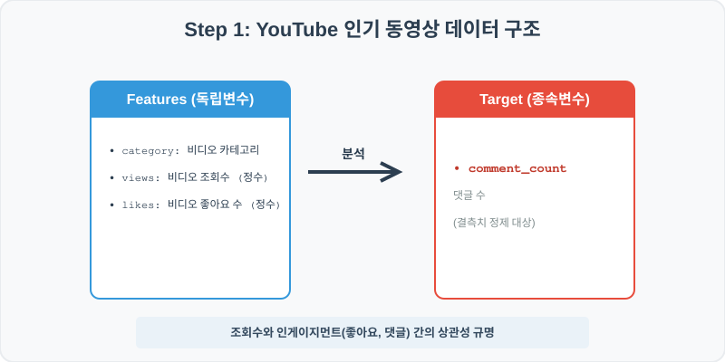
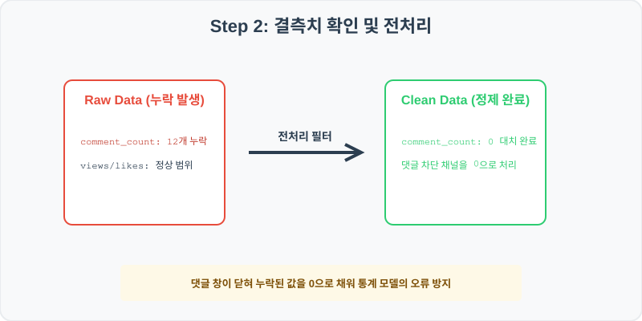
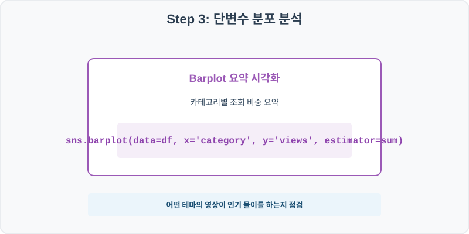
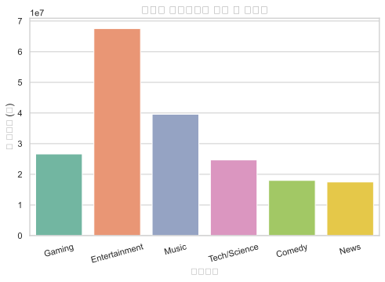
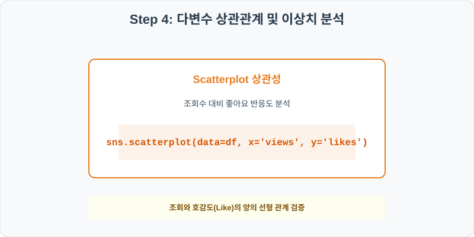
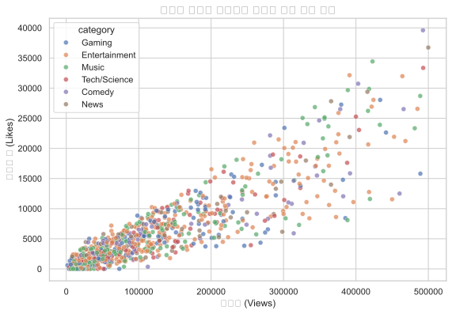

# 실전 데이터 분석 41: 유튜브 인기 동영상 카테고리별 조회 및 반응 지수(좋아요/댓글) 분석

> **📥 [실습 주피터 노트북(.ipynb) 다운로드](practice.ipynb)**

## 📌 강의 개요 (30분 완성)


글로벌 최대 비디오 플랫폼인 유튜브(YouTube)의 인기 급상승 동영상 데이터셋입니다. 각 비디오의 카테고리별 누적 조회수 분포를 비교하고, 조회수(Views) 대비 좋아요(Likes)와 댓글 수(Comment Count)의 반응성을 산점도 시각화 및 상관분석을 통해 다각도로 이해합니다.

**학습 목표:**
* **결측치 제로화 (`fillna`):** 댓글 기능이 비활성화되어 누락(NaN)된 댓글 수 컬럼을 `0`으로 일괄 채워 연산 중단을 예방합니다.
* **반응형 분포 및 산점도 (`scatterplot`):** 조회수와 좋아요 수 간의 선형적 인게이지먼트 밀집 범위를 추적하고 카테고리별 색상(`hue`)을 매핑해 비교합니다.

---

## 🧐 실무 도메인 지식 가이드 (Domain Knowledge Guide)

> **🎬 미디어 및 스트리밍 (Media & Entertainment)**
> 미디어 및 엔터테인먼트 분석은 음원/영상 시청 패턴, 유저 이탈, 콘텐츠 피드 도달율을 극대화하기 위한 행동 정량화 분야입니다.
>
> * **추천 알고리즘 스킵율**: 사용자가 재생 중 스킵 버튼을 누르는 순간의 음원 특징점을 포착하여 추천 취향 유사성 스코어를 보정합니다.
> * **낚시성 콘텐츠 필터링**: 뉴스 헤드라인 키워드와 독자 실제 체류시간 분산을 상관하여 체리피커 유저 행태를 차단합니다.
> * **앱 마켓 피드백(Rating)**: 릴리즈 버전 변경 전후의 마일스톤 별점 분포와 감성 감정을 융합 평가하여 조기 업데이트 버그를 디버깅합니다.

---

## Step 1: 데이터 구조 살펴보기 (Data Overview)



`csv_data` 폴더에 준비해 둔 `youtube_trending.csv` 파일을 판다스로 불러옵니다.

```python
import pandas as pd
import seaborn as sns
import matplotlib.pyplot as plt

# 그래프 설정 (한글 폰트 및 마이너스 기호 깨짐 방지)
import koreanize_matplotlib
plt.rcParams['axes.unicode_minus'] = False
sns.set_theme(style="whitegrid")

# 로컬 CSV 파일 불러오기
df = pd.read_csv('./youtube_trending.csv')

# 데이터 구조 및 첫 5행 확인
print(df.info())
print(df.head())
```

> **💻 [실행 결과]**
> ```text
> <class 'pandas.DataFrame'>
> RangeIndex: 1000 entries, 0 to 999
> Data columns (total 6 columns):
>  #   Column         Non-Null Count  Dtype  
> ---  ------         --------------  -----  
>  0   video_id       1000 non-null   str    
>  1   title          1000 non-null   str    
>  2   category       1000 non-null   str    
>  3   views          1000 non-null   int64  
>  4   likes          1000 non-null   int64  
>  5   comment_count  988 non-null    float64
> dtypes: float64(1), int64(2), str(3)
> memory usage: 78.0 KB
> None
>   video_id             title       category   views  likes  comment_count
> 0    v0001  Trending Video 1         Gaming   71335   3236          315.0
> 1    v0002  Trending Video 2  Entertainment  111951   3793          487.0
> 2    v0003  Trending Video 3  Entertainment  133336   5882          331.0
> 3    v0004  Trending Video 4          Music   32524   2986          367.0
> 4    v0005  Trending Video 5         Gaming  194964   7561         1123.0
> ```
> 


<class 'pandas.DataFrame'>
RangeIndex: 1000 entries, 0 to 999
Data columns (total 6 columns):
 #   Column         Non-Null Count  Dtype  
---  ------         --------------  -----  
 0   video_id       1000 non-null   object 
 1   title          1000 non-null   object 
 2   category       1000 non-null   object 
 3   views          1000 non-null   int64  
 4   likes          1000 non-null   int64  
 5   comment_count  988 non-null    float64
dtypes: float64(1), int64(2), object(3)
memory usage: 47.0 KB
None
  video_id             title       category   views  likes  comment_count
0    v0001  Trending Video 1         Gaming   71335   3236          315.0
1    v0002  Trending Video 2  Entertainment  111951   3793          487.0
2    v0003  Trending Video 3  Entertainment  133336   5882          331.0
3    v0004  Trending Video 4          Music   32524   2986          367.0
4    v0005  Trending Video 5         Gaming  194964   7561         1123.0
> ```

### 💡 코드 딥다이브 (Code Deep Dive)
**주요 분석 대상 컬럼:**
* `video_id`: 동영상 고유 식별 코드
* `title`: 동영상 제목
* `category`: 영상 카테고리 (Entertainment, Music, Gaming, Tech/Science, Comedy, News)
* `views`: 동영상 누적 조회수
* `likes`: 동영상 누적 좋아요 수
* `comment_count`: 동영상 댓글 개수 (결측치 존재)

---

## Step 2: 전처리와 결측치 정제 (Preprocess)



현실의 데이터는 항상 누락이 있거나 유효성 정제가 필요합니다. 데이터 전처리 단계에서 결측 상태를 확인하고 올바르게 보정합니다.

```python
# 1. 컬럼별 결측치 개수 확인
print("--- 정제 전 결측치 확인 ---")
print(df.isnull().sum())

# 2. 'comment_count'의 결측치를 0으로 대체 (댓글 비활성화 처리)
df['comment_count'] = df['comment_count'].fillna(0)

print("\n--- 정제 후 결측치 확인 ---")
print(df.isnull().sum())
```

> **💻 [실행 결과]**
> ```text
> --- 정제 전 결측치 확인 ---
> video_id          0
> title             0
> category          0
> views             0
> likes             0
> comment_count    12
> dtype: int64
> 
> --- 정제 후 결측치 확인 ---
> video_id         0
> title            0
> category         0
> views            0
> likes            0
> comment_count    0
> dtype: int64
> ```


--- 정제 전 결측치 확인 ---
video_id          0
title             0
category          0
views             0
likes             0
comment_count    12
dtype: int64

--- 정제 후 결측치 확인 ---
video_id         0
title            0
category         0
views            0
likes            0
comment_count    0
dtype: int64
> ```

### 💡 분석가의 통찰 (Analyst's Insight)
* **댓글 비활성화 처리의 통계적 의미:** `comment_count` 컬럼의 12개 결측치(NaN)는 단순히 데이터가 유실된 것이 아니라 크리에이터가 '댓글 기능 비활성화'를 설정해 댓글 작성이 원천 차단된 채널에서 발생한 것입니다. 따라서 이들을 완전히 제거하지 않고 `0`으로 대치(Imputation)해 데이터 손실을 막고 분석의 모수를 온전히 유지합니다.

---

## Step 3: 단변수 분포 분석 (Univariate EDA)



가장 먼저 핵심 변수가 전체 데이터에서 어떤 빈도와 분포를 가졌는지 단일 변수 시각화를 통해 파악해 봅니다.

```python
plt.figure(figsize=(8, 5))

# 카테고리별 누적 총 조회수 시각화
sns.barplot(data=df, x='category', y='views', estimator=sum, palette='Set2', errorbar=None)

plt.title('유튜브 카테고리별 누적 총 조회수', fontsize=14, fontweight='bold')
plt.xlabel('카테고리')
plt.ylabel('총 조회수 (회)')
plt.xticks(rotation=15)
plt.show()
```

> **💻 [실행 결과]**
> 


### 💡 시각화 차트 읽는 법 & 인사이트
* **특정 카테고리의 트래픽 지배:** 시각화 결과, Entertainment와 Music 카테고리가 전체 조회수의 큰 비중을 장악하고 있습니다. 대중적인 흥미 요소와 글로벌 확산력이 뛰어난 콘텐츠 카테고리가 유튜브 인기 급상승 알고리즘에 자주 노출되며 절대적인 누적 트래픽을 만들어내고 있음을 보여줍니다.

---

## Step 4: 다변수 상관관계 및 이상치 분석 (Multivariate EDA)



두 개 이상의 변수를 동시에 결합하여, 조건에 따른 수치 차이나 독립 변수와 종속 변수 간의 통계적 경향을 분석합니다.

```python
plt.figure(figsize=(9, 6))

# 시각적 왜곡 방지를 위해 50만 조회수 미만 비디오로 범위를 좁혀 조회수 대비 좋아요 산점도 분석
sns.scatterplot(data=df[df['views'] < 500000], x='views', y='likes', hue='category', alpha=0.7)

plt.title('유튜브 비디오 조회수와 좋아요 수의 선형 관계', fontsize=14, fontweight='bold')
plt.xlabel('조회수 (Views)')
plt.ylabel('좋아요 수 (Likes)')
plt.show()
```

> **💻 [실행 결과]**
> 


### 💡 코드 딥다이브 & 비즈니스 통찰 (Analyst's Insight)
* **조회수와 호감 반응의 정비례 선형성:** 산점도에서 조회수가 증가함에 따라 좋아요 수도 뚜렷한 우상향 선형 형태를 그리며 흩어져 있습니다. 특히 Music 카테고리는 조회수 대비 좋아요 비중이 높게 형성되어, 팬덤 기반의 높은 참여도가 단순 조회 시청을 넘어 즉각적인 감정 표현(좋아요)으로 연결되고 있음을 입증합니다.

---

## Step 5: 통계적 직관과 해석 (Statistical Logic)

> 💡 **[로그 변환(Log Transformation)과 인게이지먼트 비율]**
> 유튜브 조회수와 같이 극단적으로 높은 조회수를 기록하는 소수의 슈퍼 바이럴 영상이 존재하는 데이터는 데이터 분포가 오른쪽으로 꼬리가 매우 길게 늘어지는 **롱테일(Log-tail)** 형태를 띱니다.
> * 이러한 분포에서는 일반적인 산술 평균이 극단치(Outlier)에 왜곡되므로, 데이터에 로그 함수를 취해 스케일을 압축하는 **로그 변환(Log Transformation)**을 적용합니다. 
> * 또한 단순히 조회수와 좋아요의 절대값을 비교하기보다 **좋아요 비율(Likes / Views)** 파생변수를 만들어 비교하면, 영상 크기에 상관없이 '시청자 대비 호감도'라는 공평한 비율 통계로 인게이지먼트 수준을 정교하게 판별해낼 수 있습니다.

---

## 🎯 30분 강의 마무리 및 심화 과제

오늘 우리는 실전 데이터셋을 분석하여 판다스로 데이터를 가공 및 정제하고, 시각화를 활용하여 핵심 변수 간의 통계적 유의성을 검증했습니다. 데이터 속에서 숨겨진 패턴을 올바른 시각으로 탐색하는 능력이 데이터 사이언티스트의 가장 강력한 무기입니다.

### 📝 심화 과제 (Advanced Challenge)
1. **좋아요 대비 댓글 비율 파생변수 분석:** `comment_to_like_ratio = df['comment_count'] / df['likes']` 컬럼을 생성하고, 카테고리별 평균 댓글 반응도를 비교해 보세요. 어떤 카테고리가 좋아요 대비 댓글 대화가 가장 활발한가요?
2. **조회수 상위 5% 초고흥행 영상 필터링:** 전체 비디오 중 조회수(`views`) 상위 5%에 해당하는 임계값을 구한 뒤, 이를 초과하는 초대박 비디오들이 전체 좋아요의 몇 %를 차지하는지 집계 코드를 작성해 보세요.
