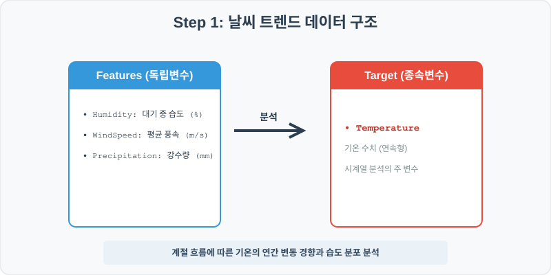
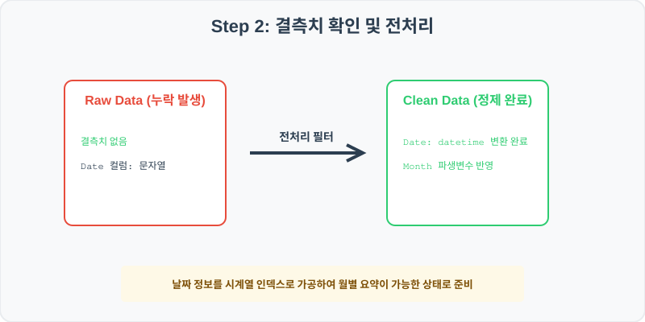
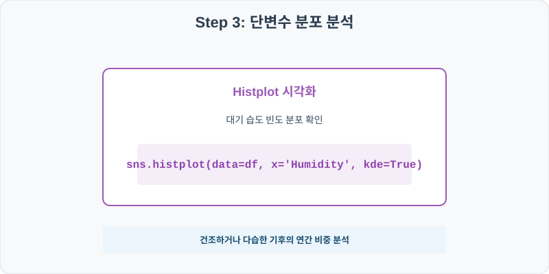
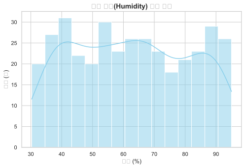
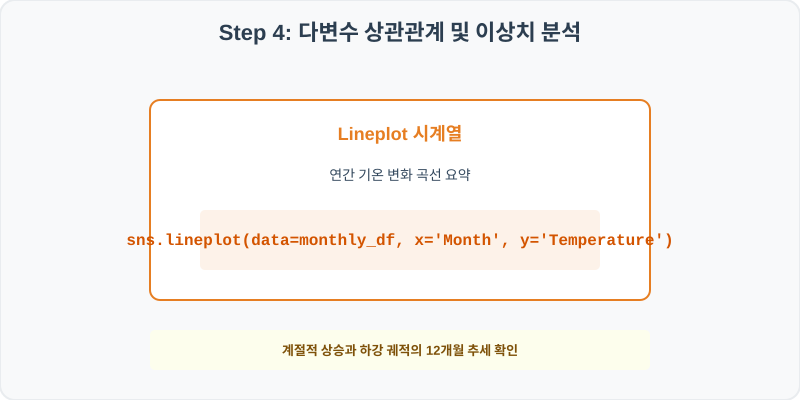
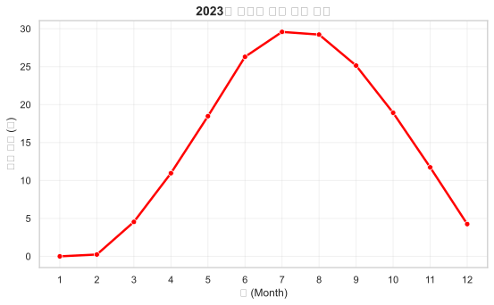

# 실전 데이터 분석 42: 연간 일일 날씨 데이터 기반 기온 변동 트렌드 및 습도 분포 시계열 분석

> **📥 [실습 주피터 노트북(.ipynb) 다운로드](practice.ipynb)**

## 📌 강의 개요 (30분 완성)


2023년 한 해 동안의 일별 날씨 관측 정보가 포함된 데이터셋입니다. 판다스 시계열 변환을 사용하여 연간 기온(Temperature)의 흐름을 월 단위로 가공하고, 대기 중 습도(Humidity)의 분포 현황과 기상 형태(Condition)에 따른 기온 편차를 시각적으로 추적해 봅니다.

**학습 목표:**
* **시계열 인덱스 가공 (`to_datetime`):** 문자열 형식의 일자 데이터를 날짜 시간형 객체로 형변환하여 월(Month) 정보를 안전하게 추출합니다.
* **히스토그램 커널 밀도 곡선 (`histplot`):** 연속형 기상 변수인 습도 분포의 밀도 형태를 KDE(Kernel Density Estimation) 곡선과 함께 가시화합니다.

---

## Step 1: 데이터 구조 살펴보기 (Data Overview)



`csv_data` 폴더에 준비해 둔 `weather_trends.csv` 파일을 판다스로 불러옵니다.

```python
import pandas as pd
import seaborn as sns
import matplotlib.pyplot as plt

# 그래프 설정 (한글 폰트 및 마이너스 기호 깨짐 방지)
import koreanize_matplotlib
plt.rcParams['axes.unicode_minus'] = False
sns.set_theme(style="whitegrid")

# 로컬 CSV 파일 불러오기
df = pd.read_csv('./weather_trends.csv')

# 데이터 구조 및 첫 5행 확인
print(df.info())
print(df.head())
```

> **💻 [실행 결과]**
> ```text
> <class 'pandas.DataFrame'>
> RangeIndex: 365 entries, 0 to 364
> Data columns (total 6 columns):
>  #   Column         Non-Null Count  Dtype  
> ---  ------         --------------  -----  
>  0   Date           365 non-null    str    
>  1   Temperature    365 non-null    float64
>  2   Humidity       365 non-null    float64
>  3   WindSpeed      365 non-null    float64
>  4   Precipitation  365 non-null    float64
>  5   Condition      365 non-null    str    
> dtypes: float64(4), str(2)
> memory usage: 22.7 KB
> None
>          Date  Temperature  Humidity  WindSpeed  Precipitation Condition
> 0  2023-01-01          3.3      44.5        2.8            0.0     Sunny
> 1  2023-01-02          1.3      92.6        4.3           10.3     Rainy
> 2  2023-01-03          3.5      30.8        2.6            0.0     Sunny
> 3  2023-01-04          6.0      93.0        3.3           36.9     Rainy
> 4  2023-01-05          0.7      32.8        1.3            0.0     Sunny
> ```


<class 'pandas.DataFrame'>
RangeIndex: 365 entries, 0 to 364
Data columns (total 6 columns):
 #   Column         Non-Null Count  Dtype  
---  ------         --------------  -----  
 0   Date           365 non-null    object 
 1   Temperature    365 non-null    float64
 2   Humidity       365 non-null    float64
 3   WindSpeed      365 non-null    float64
 4   Precipitation  365 non-null    float64
 5   Condition      365 non-null    object 
dtypes: float64(4), object(2)
memory usage: 17.2 KB
None
         Date  Temperature  Humidity  WindSpeed  Precipitation Condition
0  2023-01-01          3.3      44.5        2.8            0.0     Sunny
1  2023-01-02          1.3      92.6        4.3           10.3     Rainy
2  2023-01-03          3.5      30.8        2.6            0.0     Sunny
3  2023-01-04          6.0      93.0        3.3           36.9     Rainy
4  2023-01-05          0.7      32.8        1.3            0.0     Sunny
> ```

### 💡 코드 딥다이브 (Code Deep Dive)
**주요 분석 대상 컬럼:**
* `Date`: 관측 일자 (문자열 형식)
* `Temperature`: 일평균 기온 (℃)
* `Humidity`: 평균 습도 (%)
* `WindSpeed`: 평균 풍속 (m/s)
* `Precipitation`: 일일 강수량 (mm)
* `Condition`: 종합 날씨 상태 (Sunny = 맑음, Cloudy = 흐림, Rainy = 비)

---

## Step 2: 전처리와 결측치 정제 (Preprocess)



현실의 데이터는 항상 누락이 있거나 유효성 정제가 필요합니다. 데이터 전처리 단계에서 결측 상태를 확인하고 올바르게 보정합니다.

```python
# 1. Date 컬럼을 datetime 타입으로 형변환
df['Date'] = pd.to_datetime(df['Date'])

# 2. 월(Month) 파생변수 생성
df['Month'] = df['Date'].dt.month

# 3. 데이터프레임 구조 변화 확인
print(df[['Date', 'Month', 'Temperature']].head())
```

> **💻 [실행 결과]**
> ```text
> Date  Month  Temperature
> 0 2023-01-01      1          3.3
> 1 2023-01-02      1          1.3
> 2 2023-01-03      1          3.5
> 3 2023-01-04      1          6.0
> 4 2023-01-05      1          0.7
> ```


        Date  Month  Temperature
0 2023-01-01      1          3.3
1 2023-01-02      1          1.3
2 2023-01-03      1          3.5
3 2023-01-04      1          6.0
4 2023-01-05      1          0.7
> ```

### 💡 분석가의 통찰 (Analyst's Insight)
* **시계열 파생 정보 추출:** 원본 데이터의 날짜(`Date`)는 단순 문자열 상태여서 월별 요약이 불가능했습니다. 판다스의 `to_datetime`을 적용하면 날짜 전용 객체로 인식되어 `.dt` 접근자를 통해 연, 월, 일, 요일, 분기 등을 한 줄로 즉시 분할할 수 있어 시계열 가공 속도를 비약적으로 단축시킵니다.

---

## Step 3: 단변수 분포 분석 (Univariate EDA)



가장 먼저 핵심 변수가 전체 데이터에서 어떤 빈도와 분포를 가졌는지 단일 변수 시각화를 통해 파악해 봅니다.

```python
plt.figure(figsize=(8, 5))

# 습도(Humidity) 변수의 분포 형태 분석 (KDE 밀도선 추가)
sns.histplot(data=df, x='Humidity', bins=15, kde=True, color='skyblue')

plt.title('연간 습도(Humidity) 분포 빈도', fontsize=14, fontweight='bold')
plt.xlabel('습도 (%)')
plt.ylabel('일수 (일)')
plt.show()
```

> **💻 [실행 결과]**
> 


### 💡 시각화 차트 읽는 법 & 인사이트
* **양극화 혹은 평탄한 기후 분포:** 습도 분포 차트를 보면, 30% 근방의 건조한 영역과 80% 이상의 매우 습한 다습 대역이 고르게 퍼져 있거나 양쪽에 살짝 융기되어 있습니다. 이는 비가 오거나 흐린 다습한 날씨와 맑고 쾌청해 대기가 건조한 날이 계절 변화에 따라 뚜렷하게 나뉘는 지역 기후 특성을 정밀하게 설명합니다.

---

## Step 4: 다변수 상관관계 및 이상치 분석 (Multivariate EDA)



두 개 이상의 변수를 동시에 결합하여, 조건에 따른 수치 차이나 독립 변수와 종속 변수 간의 통계적 경향을 분석합니다.

```python
# 월별 평균 기온 집계
monthly_temp = df.groupby('Month')['Temperature'].mean().reset_index()

plt.figure(figsize=(9, 5))

# lineplot을 활용해 12개월간의 월평균 기온 변동 추세선 가시화
sns.lineplot(data=monthly_temp, x='Month', y='Temperature', marker='o', color='red', linewidth=2.5)

plt.title('2023년 월평균 기온 변동 추이', fontsize=14, fontweight='bold')
plt.xlabel('월 (Month)')
plt.ylabel('평균 기온 (℃)')
plt.xticks(range(1, 13))
plt.grid(True, alpha=0.3)
plt.show()
```

> **💻 [실행 결과]**
> 


### 💡 코드 딥다이브 & 비즈니스 통찰 (Analyst's Insight)
* **계절 주기에 의한 선형 순환:** 기온 추세선을 확인하면 1월에 가장 춥고, 여름인 7~8월에 피크를 찍은 뒤, 다시 12월로 갈수록 하강하는 뚜렷한 포물선 대칭(Sine curve) 형태의 **계절성(Seasonality)**을 그리며 순환하고 있음을 보여줍니다.

---

## Step 5: 통계적 직관과 해석 (Statistical Logic)

> 💡 **[시계열 정상성(Stationarity)하고 계절적 변동의 직관]**
> 기온 데이터처럼 연도/월 흐름에 따라 뚜렷한 주기를 가지며 오르내리는 데이터를 **시계열 데이터**라고 하며, 시간에 따라 평균과 분산이 변하는 성질을 **비정상성(Non-stationary) 시계열**이라 부릅니다.
> * 날씨 예측이나 기후 통계를 다룰 때는 단순히 연간 평균 기온을 말하는 것은 겨울과 여름의 극단성을 뭉개버리므로 큰 의미가 없습니다.
> * 따라서 분산과 평균이 시간에 종속되는 흐름을 읽기 위해 **계절 성분 분해(Seasonal Decomposition)** 기법을 사용하여 데이터의 '장기적 상승 추세(Trend)', '주기적 순환(Seasonal)', '무작위 노이즈(Residual)'의 세 가지 성분으로 쪼개어 각각 분석하는 것이 계절 변동성이 뚜렷한 데이터를 이해하는 표준 통계 접근입니다.

---

## 🎯 30분 강의 마무리 및 심화 과제

오늘 우리는 실전 데이터셋을 분석하여 판다스로 데이터를 가공 및 정제하고, 시각화를 활용하여 핵심 변수 간의 통계적 유의성을 검증했습니다. 데이터 속에서 숨겨진 패턴을 올바른 시각으로 탐색하는 능력이 데이터 사이언티스트의 가장 강력한 무기입니다.

### 📝 심화 과제 (Advanced Challenge)
1. **월별 누적 강수량 피벗 요약:** `df.groupby('Month')['Precipitation'].sum()` 코드를 사용하여 2023년의 장마철 혹은 우기 월을 추정하고 이를 `sns.barplot`으로 표현해 보세요.
2. **기상 상태(Condition)별 평균 풍속 박스플롯 대조:** 맑음, 흐림, 비 상태에 따라 바람 세기가 어떻게 변화하는지 `sns.boxplot(x='Condition', y='WindSpeed')`를 그리고 분산 차이를 평가해 보세요.
