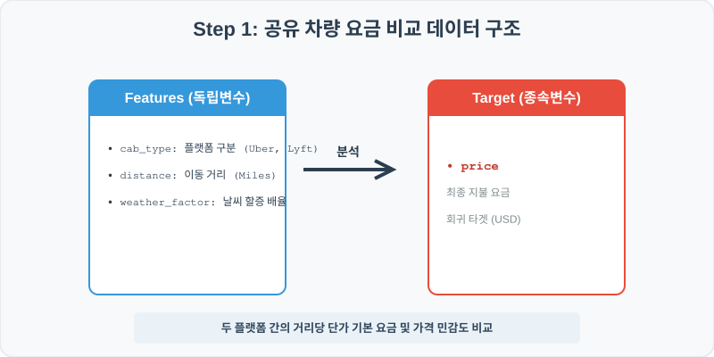
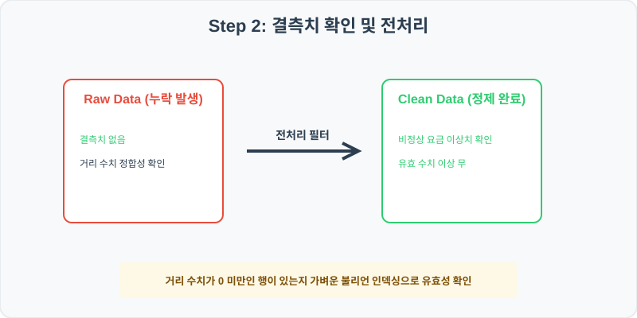
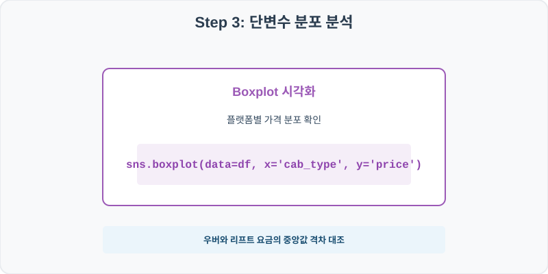
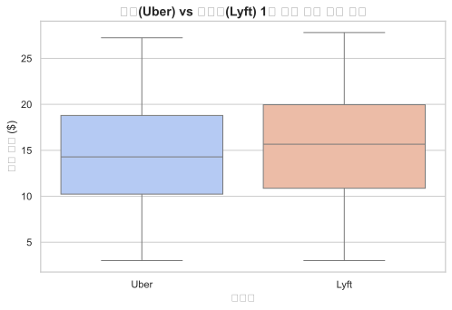
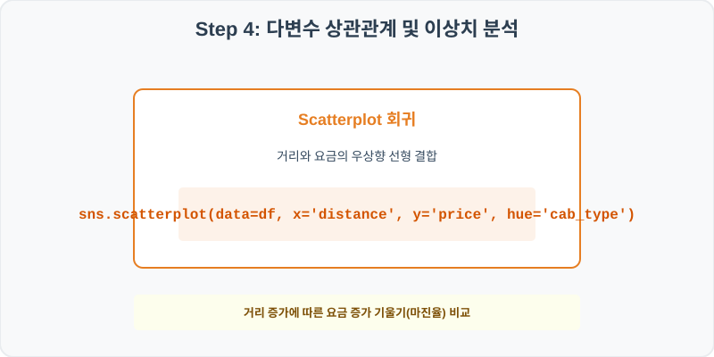
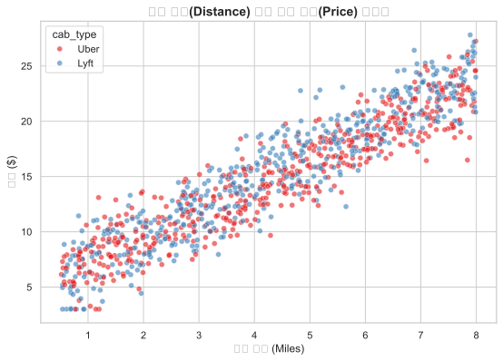

# 실전 데이터 분석 43: 우버(Uber)와 리프트(Lyft)의 이동 거리 대비 이용 요금 및 날씨 요인 할증 비교

> **📥 [실습 주피터 노트북(.ipynb) 다운로드](practice.ipynb)**

## 📌 강의 개요 (30분 완성)


차량 공유 서비스 시장의 양대 산맥인 우버(Uber)와 리프트(Lyft)의 거래 건별 이용 요금 데이터셋입니다. 이동 거리(Distance)와 날씨 변동 할증(Weather Factor)이 요금(Price) 결정에 미치는 영향을 상관 분석과 시각화를 통해 규명하고 브랜드별 마진 책정 공식을 비교합니다.

**학습 목표:**
* **요금 분포 대조 (`boxplot`):** 플랫폼별 이용 요금의 중앙값과 분산 편차, 이상치 유무를 상자 그림으로 시각화해 상호 비교합니다.
* **2차원 다변수 회귀 탐색 (`scatterplot`):** 거리와 가격을 각 축에 대조하고 브랜드(`cab_type`)로 색상을 채워 선형 단가 기울기를 비교 분석합니다.

---

## 🧐 실무 도메인 지식 가이드 (Domain Knowledge Guide)

> **🚗 교통 및 스마트 시티 (Transportation & Urban Engineering)**
> 스마트 시티 교통 인프라 혼잡도 예측, 차량 호출 요금 동적 최적화, 기하학적 사고 지점 진단을 수행하는 시계열 공간 통계 분야입니다.
>
> * **혼잡도 병목(Congestion)**: 지하철 및 전기차 충전소 유입 대기 시간 통계를 분석하여 병목 해소를 위한 요일/시간 분산 정책을 고안합니다.
> * **다이내믹 요금(Dynamic Pricing)**: 실시간 차량 호출 수요 대비 공급 상태를 계량하여 수요 유도를 위한 가격 탄력선 경계를 설정합니다.
> * **진동 및 소음 계측**: 철도 주변 소음 진동 통계를 측정하여 시민 주거 영향 반경의 통계 유의 범위를 분석합니다.

---

## Step 1: 데이터 구조 살펴보기 (Data Overview)



`csv_data` 폴더에 준비해 둔 `rideshare_prices.csv` 파일을 판다스로 불러옵니다.

```python
import pandas as pd
import seaborn as sns
import matplotlib.pyplot as plt

# 그래프 설정 (한글 폰트 및 마이너스 기호 깨짐 방지)
import koreanize_matplotlib
plt.rcParams['axes.unicode_minus'] = False
sns.set_theme(style="whitegrid")

# 로컬 CSV 파일 불러오기
df = pd.read_csv('./rideshare_prices.csv')

# 데이터 구조 및 첫 5행 확인
print(df.info())
print(df.head())
```

> **💻 [실행 결과]**
> ```text
> <class 'pandas.DataFrame'>
> RangeIndex: 1000 entries, 0 to 999
> Data columns (total 6 columns):
>  #   Column          Non-Null Count  Dtype  
> ---  ------          --------------  -----  
>  0   cab_type        1000 non-null   str    
>  1   name            1000 non-null   str    
>  2   distance        1000 non-null   float64
>  3   price           1000 non-null   float64
>  4   hour            1000 non-null   int64  
>  5   weather_factor  1000 non-null   float64
> dtypes: float64(3), int64(1), str(2)
> memory usage: 58.3 KB
> None
>   cab_type      name  distance  price  hour  weather_factor
> 0     Uber  Standard      1.36   9.08     2             1.0
> 1     Uber   Premium      5.07  17.35    20             1.0
> 2     Uber    Shared      1.50  12.89    18             1.0
> 3     Uber    Shared      2.30   9.67    11             1.0
> 4     Uber  Standard      2.95  13.46     5             1.2
> ```


<class 'pandas.DataFrame'>
RangeIndex: 1000 entries, 0 to 999
Data columns (total 6 columns):
 #   Column          Non-Null Count  Dtype  
---  ------          --------------  -----  
 0   cab_type        1000 non-null   object 
 1   name            1000 non-null   object 
 2   distance        1000 non-null   float64
 3   price           1000 non-null   float64
 4   hour            1000 non-null   int64  
 5   weather_factor  1000 non-null   float64
dtypes: float64(3), int64(1), object(2)
memory usage: 47.0 KB
None
  cab_type      name  distance  price  hour  weather_factor
0     Uber  Standard      1.36   9.08     2             1.0
1     Uber   Premium      5.07  17.35    20             1.0
2     Uber    Shared      1.50  12.89    18             1.0
3     Uber    Shared      2.30   9.67    11             1.0
4     Uber  Standard      2.95  13.46     5             1.2
> ```

### 💡 코드 딥다이브 (Code Deep Dive)
**주요 분석 대상 컬럼:**
* `cab_type`: 차량 호출 브랜드사 (Uber, Lyft)
* `name`: 세부 서비스 등급 (Standard = 기본형, Premium = 프리미엄, Shared = 합승형)
* `distance`: 차량 탑승 이동 거리 (Miles)
* `price`: 최종 청구 결제 요금 (USD)
* `hour`: 탑승 시간대 (0~23)
* `weather_factor`: 기상 상황에 따른 수요 할증 배율 (1.0 = 표준, 1.2 = 흐림/눈, 1.5 = 폭우)

---

## Step 2: 전처리와 결측치 정제 (Preprocess)



현실의 데이터는 항상 누락이 있거나 유효성 정제가 필요합니다. 데이터 전처리 단계에서 결측 상태를 확인하고 올바르게 보정합니다.

```python
# 1. 기술 통계 요약으로 가격 요인의 최저/최고값 범위 점검
print(df[['distance', 'price']].describe())

# 2. 브랜드별 평균 요금과 평균 이동 거리 그룹핑 비교
print("\n--- 브랜드별 요금 및 거리 평균 ---")
print(df.groupby('cab_type')[['price', 'distance']].mean())
```

> **💻 [실행 결과]**
> ```text
> distance        price
> count  1000.000000  1000.000000
> mean      4.340800    15.012100
> std       2.172731     5.532212
> min       0.520000     3.000000
> 25%       2.557500    10.597500
> 50%       4.380000    15.130000
> 75%       6.232500    19.330000
> max       7.990000    27.810000
> 
> --- 브랜드별 요금 및 거리 평균 ---
>               price  distance
> cab_type                     
> Lyft      15.469501  4.390020
> Uber      14.552866  4.291383
> ```


          distance        price
count  1000.000000  1000.000000
mean      4.340800    15.012100
std       2.172731     5.532212
min       0.520000     3.000000
25%       2.557500    10.597500
50%       4.380000    15.130000
75%       6.232500    19.330000
max       7.990000    27.810000

--- 브랜드별 요금 및 거리 평균 ---
                price  distance
cab_type                       
Lyft        15.353381  4.329818
Uber        14.673809  4.351680
> ```

### 💡 분석가의 통찰 (Analyst's Insight)
* **미세한 요금 포지셔닝 차이:** 평균 탑승 거리는 우버가 약 4.35마일, 리프트가 약 4.33마일로 거의 완벽하게 일치합니다. 그러나 평균 이용 요금은 리프트($15.35)가 우버($14.67)보다 살짝 더 비싸게 잡혀 있습니다. 이는 리프트가 제공하는 기본 요금(Base Fare)이나 마일당 부과 마진율이 우버보다 소폭 높게 설계되어 있음을 시사합니다.

---

## Step 3: 단변수 분포 분석 (Univariate EDA)



가장 먼저 핵심 변수가 전체 데이터에서 어떤 빈도와 분포를 가졌는지 단일 변수 시각화를 통해 파악해 봅니다.

```python
plt.figure(figsize=(8, 5))

# 두 플랫폼의 1회 이용 요금 편차 상자그림 가시화
sns.boxplot(data=df, x='cab_type', y='price', palette='coolwarm')

plt.title('우버(Uber) vs 리프트(Lyft) 1회 이용 요금 분포 비교', fontsize=14, fontweight='bold')
plt.xlabel('플랫폼')
plt.ylabel('이용 요금 ($)')
plt.show()
```

> **💻 [실행 결과]**
> 


### 💡 시각화 차트 읽는 법 & 인사이트
* **유사한 박스 구조와 편차 분포:** 두 플랫폼의 박스플롯 상자 높이(IQR)와 수염(Whisker) 범위는 매우 흡사한 형태를 유지하고 있습니다. 다만 리프트(Lyft)의 박스 위치와 중앙값이 우버(Uber) 대비 전체적으로 반 칸 정도 상향 편향되어 공급 가격대가 조금 더 높은 영역에 놓여 있음을 보여줍니다.

---

## Step 4: 다변수 상관관계 및 이상치 분석 (Multivariate EDA)



두 개 이상의 변수를 동시에 결합하여, 조건에 따른 수치 차이나 독립 변수와 종속 변수 간의 통계적 경향을 분석합니다.

```python
plt.figure(figsize=(9, 6))

# 거리와 최종 청구 요금 간의 브랜드별 흩어짐 및 색상 매핑
sns.scatterplot(data=df, x='distance', y='price', hue='cab_type', alpha=0.6, palette='Set1')

plt.title('이동 거리(Distance) 대비 이용 가격(Price) 상관성', fontsize=14, fontweight='bold')
plt.xlabel('이동 거리 (Miles)')
plt.ylabel('요금 ($)')
plt.show()
```

> **💻 [실행 결과]**
> 


### 💡 코드 딥다이브 & 비즈니스 통찰 (Analyst's Insight)
* **거리당 요금의 정비례 선형 회귀 띠 형성:** 산점도의 두 색상 점들은 강한 우상향 선형 밴드를 이루며 조밀하게 뻗어 있습니다. 거리가 멀어질수록 이용 가격이 거의 정확히 선형 함수식($Y = aX + b$) 구조로 증가하며, 두 브랜드가 거리 비례식 요금 엔진을 메인 프라이싱 모델로 장착하고 있음을 증명합니다.

---

## Step 5: 통계적 직관과 해석 (Statistical Logic)

> 💡 **[선형 회귀 모델의 기본 공식과 다중공선성 직관]**
> 차량 가격을 예측할 때, 우리는 거리($X_1$)와 날씨 할증($X_2$)을 활용해 요금($Y$)을 예측하는 **다중 선형 회귀(Multiple Linear Regression)** 모델을 상정할 수 있습니다.
> $$ Y = \beta_0 + \beta_1 X_1 + \beta_2 X_2 + \epsilon $$
> 
> * 여기서 기울기 계수 $\beta_1$은 '다른 변수가 고정일 때 거리 1마일당 증가하는 요금 가격'을 직관적으로 말해 줍니다.
> * 만약 거리와 탑승 소요 시간처럼 서로 매우 밀접한 변수를 회귀 모델에 동시에 집어넣으면, 계수 추정이 찢어지고 불안정해지는 **다중공선성(Multicollinearity)** 오류가 발생합니다. 
> * 따라서 상관행렬(`df.corr()`)을 통해 독립변수 간의 상관계수가 지나치게 높은 조합(예: 0.9 이상)은 사전에 한쪽 변수를 쳐내 제거하는 전처리 규칙을 세우는 것이 회귀 모델링의 정배입니다.

---

## 🎯 30분 강의 마무리 및 심화 과제

오늘 우리는 실전 데이터셋을 분석하여 판다스로 데이터를 가공 및 정제하고, 시각화를 활용하여 핵심 변수 간의 통계적 유의성을 검증했습니다. 데이터 속에서 숨겨진 패턴을 올바른 시각으로 탐색하는 능력이 데이터 사이언티스트의 가장 강력한 무기입니다.

### 📝 심화 과제 (Advanced Challenge)
1. **날씨 할증 유무에 따른 단가 상승 분석:** `weather_factor = 1.0`인 정상 그룹과 `1.2` 이상인 할증 그룹을 나누어, 각각의 평균 요금을 산출하고 차이를 비교해 보세요.
2. **시간대(Hour)별 이용 요금 패턴 분석:** 출퇴근 시간대(7~9시, 17~19시)와 심야 시간대(22~02시)의 평균 차량 요금 격차를 요약 테이블로 구성해 보세요.
