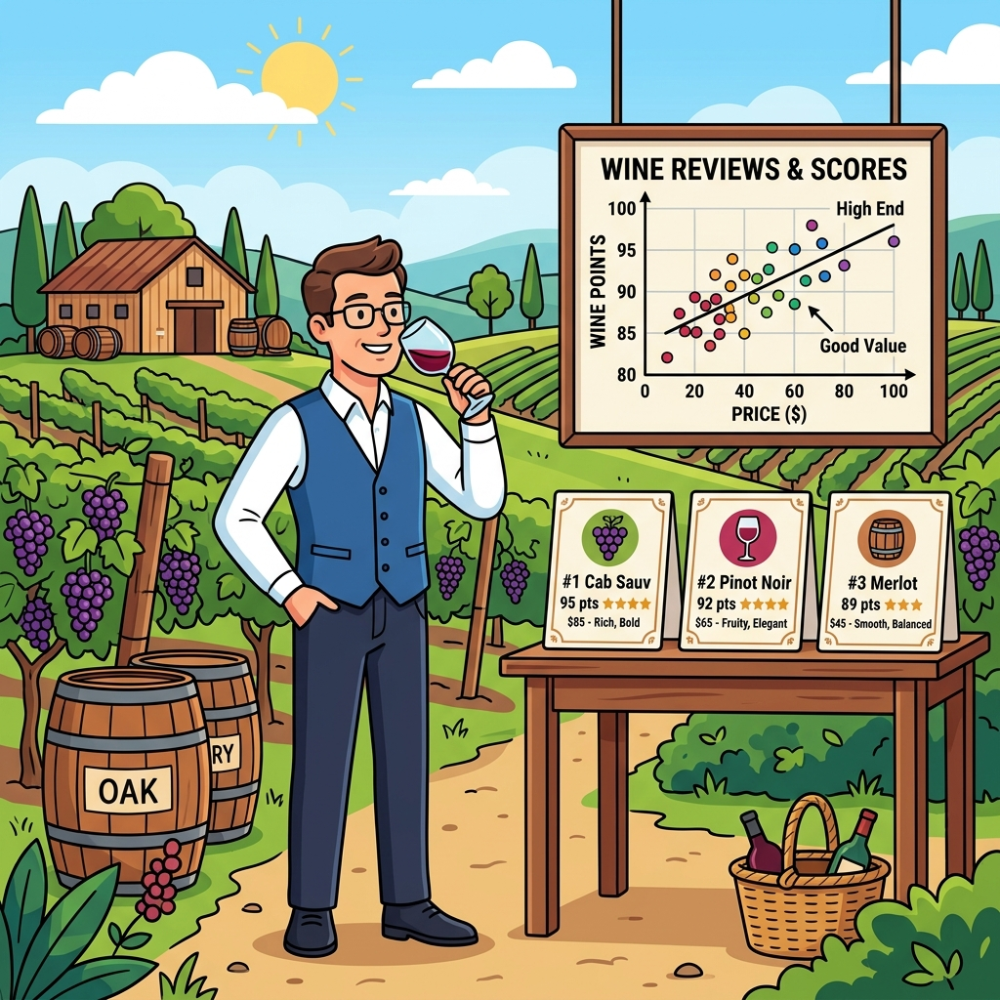
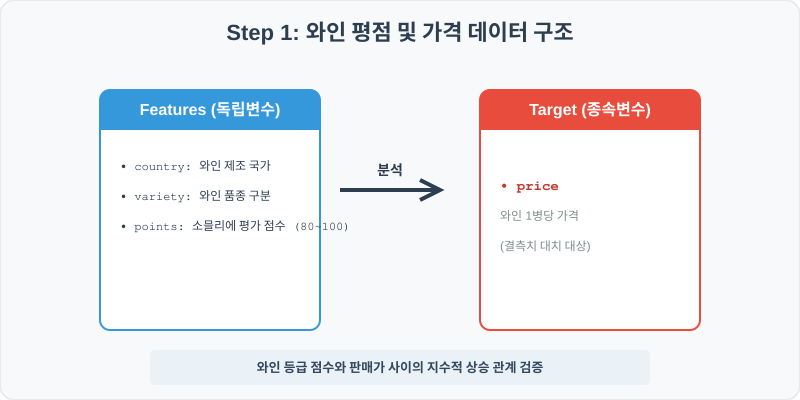
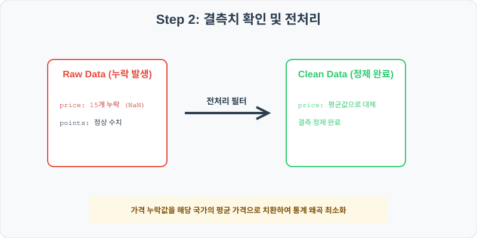
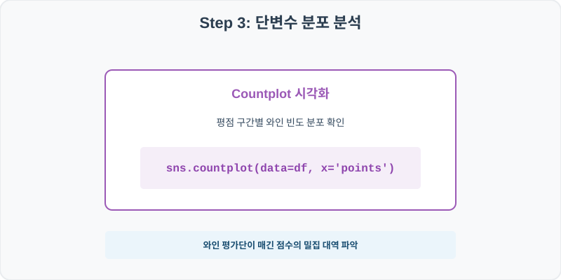
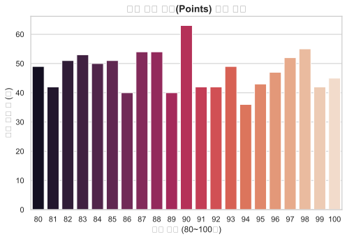
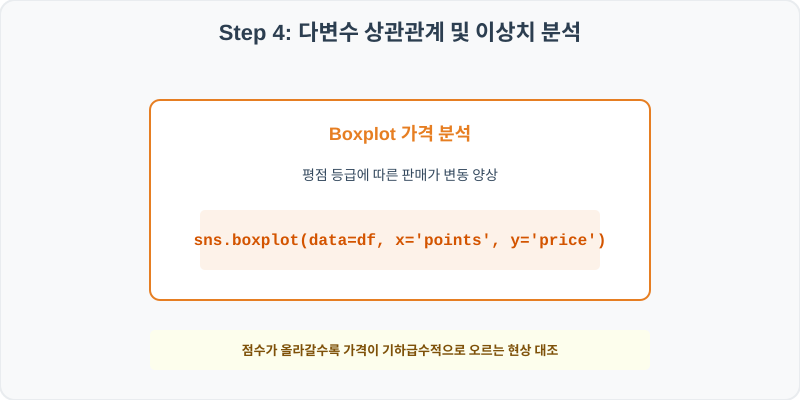
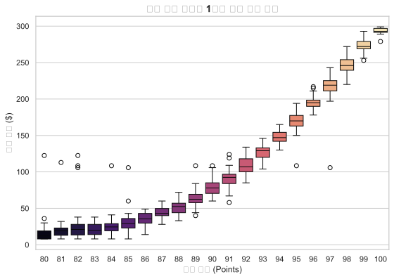

# 실전 데이터 분석 44: 소믈리에 와인 리뷰 데이터 기반 평점 점수와 병당 판매 가격의 비선형 상관관계 분석

> **📥 [실습 주피터 노트북(.ipynb) 다운로드](practice.ipynb)**

## 📌 강의 개요 (30분 완성)


전 세계 주요 와이너리 제품들의 소믈리에 평가 점수와 1병당 시장 판매가를 추적한 데이터셋입니다. 고품질 와인일수록 판매 가격이 비선형적으로 급증하는 경제학적 패턴을 분석하고, 결측치가 존재하는 가격 변수를 국가별 대표값을 활용해 신뢰성 있게 대치하는 고급 전처리를 학습합니다.

**학습 목표:**
* **그룹 평균 대치 (`transform`):** 가격 결측치를 전체 평균이 아닌, 제조 국가(`country`)별 평균값으로 세분화하여 정교하게 채워 넣습니다.
* **비선형 박스플롯 분석 (`boxplot`):** 와인 평점(80~100점) 구간의 상승에 따른 가격 변화율을 구간 상자로 시각화하여 관찰합니다.

---

## 🧐 실무 도메인 지식 가이드 (Domain Knowledge Guide)

> **🛍️ 이커머스 및 리테일 (E-commerce & Retail)**
> 이커머스와 리테일 분석은 고객의 라이프 사이클(CLV), 구매 전환 여정, 이탈(Churn) 방지 및 상품 가격 탄력성을 규명하여 매출 성장을 이끄는 분야입니다.
>
> * **고객 평생 가치(CLV)**: 신규 유입 단가 대비 고객 한 명이 장기적으로 기여하는 누적 가치 분석을 통해 마케팅 효율성을 판정합니다.
> * **장바구니 포기(Abandonment) 및 이탈**: 이탈 직전 행동 로그(예: 가격 비교 빈도, 핫딜 대기 시간) 분석으로 맞춤형 쿠폰 처방 타겟을 고릅니다.
> * **가격 탄력성(Elasticity)**: 가격의 미세 조정에 따라 판매 수량이 민감하게 변화하는 통계 패턴을 파악하여 적정 할인율을 제안합니다.

---

## Step 1: 데이터 구조 살펴보기 (Data Overview)



`csv_data` 폴더에 준비해 둔 `wine_reviews.csv` 파일을 판다스로 불러옵니다.

```python
import pandas as pd
import seaborn as sns
import matplotlib.pyplot as plt

# 그래프 설정 (한글 폰트 및 마이너스 기호 깨짐 방지)
import koreanize_matplotlib
plt.rcParams['axes.unicode_minus'] = False
sns.set_theme(style="whitegrid")

# 로컬 CSV 파일 불러오기
df = pd.read_csv('./wine_reviews.csv')

# 데이터 구조 및 첫 5행 확인
print(df.info())
print(df.head())
```

> **💻 [실행 결과]**
> ```text
> <class 'pandas.DataFrame'>
> RangeIndex: 1000 entries, 0 to 999
> Data columns (total 5 columns):
>  #   Column    Non-Null Count  Dtype  
> ---  ------    --------------  -----  
>  0   country   1000 non-null   str    
>  1   points    1000 non-null   int64  
>  2   price     985 non-null    float64
>  3   province  1000 non-null   str    
>  4   variety   1000 non-null   str    
> dtypes: float64(1), int64(1), str(3)
> memory usage: 64.6 KB
> None
>   country  points  price    province     variety
> 0  France     100  311.0  Province 0  Chardonnay
> 1      US      83    9.0  Province 1       Syrah
> 2  France      97  215.0  Province 2      Merlot
> 3   Italy      93  109.0  Province 3      Merlot
> 4   Italy      83   19.0  Province 4       Syrah
> ```


<class 'pandas.DataFrame'>
RangeIndex: 1000 entries, 0 to 999
Data columns (total 5 columns):
 #   Column    Non-Null Count  Dtype  
---  ------    --------------  -----  
 0   country   1000 non-null   object 
 1   points    1000 non-null   int64  
 2   price     985 non-null    float64
 3   province  1000 non-null   object 
 4   variety   1000 non-null   object 
dtypes: float64(1), int64(1), object(3)
memory usage: 39.2 KB
None
  country  points  price    province     variety
0  France     100  311.0  Province 0  Chardonnay
1      US      83    9.0  Province 1       Syrah
2  France      97  215.0  Province 2      Merlot
3   Italy      93  109.0  Province 3      Merlot
4   Italy      83   19.0  Province 4       Syrah
> ```

### 💡 코드 딥다이브 (Code Deep Dive)
**주요 분석 대상 컬럼:**
* `country`: 와인 원산지 국가
* `points`: 소믈리에가 판정한 공식 평점 점수 (80~100점 만점)
* `price`: 와인 1병당 판매가 (USD, 결측치 존재)
* `province`: 세부 주/지역 명칭
* `variety`: 와인 제조 품종 구분 (Cabernet Sauvignon, Chardonnay, Merlot 등)

---

## Step 2: 전처리와 결측치 정제 (Preprocess)



현실의 데이터는 항상 누락이 있거나 유효성 정제가 필요합니다. 데이터 전처리 단계에서 결측 상태를 확인하고 올바르게 보정합니다.

```python
# 1. 전처리 전 결측치 개수 파악
print("--- 정제 전 가격 결측치 ---")
print(df['price'].isnull().sum())

# 2. 국가(country)별 평균 가격을 계산해 결측치에 분할 맵핑 적용
df['price'] = df.groupby('country')['price'].transform(lambda x: x.fillna(x.mean()))

print("\n--- 정제 후 가격 결측치 ---")
print(df['price'].isnull().sum())
```

> **💻 [실행 결과]**
> ```text
> --- 정제 전 가격 결측치 ---
> 15
> 
> --- 정제 후 가격 결측치 ---
> 0
> ```


--- 정제 전 가격 결측치 ---
15

--- 정제 후 가격 결측치 ---
0
> ```

### 💡 분석가의 통찰 (Analyst's Insight)
* **조건부 그룹핑 대치의 효과:** 가격 결측이 프랑스 와인에서 발생했는지, 비교적 저렴한 칠레 와인에서 발생했는지에 상관없이 단순 전체 평균값으로 채워버리면 와인의 밸류에이션 정보가 크게 왜곡됩니다. 판다스의 `groupby`와 `transform`을 조합하면 결측값이 위치한 해당 국가의 평균 단가로 맞춤 대치되므로 원본 데이터의 구조적 밸런스를 훌륭하게 보전해 줍니다.

---

## Step 3: 단변수 분포 분석 (Univariate EDA)



가장 먼저 핵심 변수가 전체 데이터에서 어떤 빈도와 분포를 가졌는지 단일 변수 시각화를 통해 파악해 봅니다.

```python
plt.figure(figsize=(8, 5))

# countplot을 통해 평점별(points) 와인 개체 분포 분석
sns.countplot(data=df, x='points', palette='rocket')

plt.title('와인 평가 점수(Points) 분포 현황', fontsize=14, fontweight='bold')
plt.xlabel('평가 점수 (80~100점)')
plt.ylabel('평가 와인 수 (개)')
plt.show()
```

> **💻 [실행 결과]**
> 


### 💡 시각화 차트 읽는 법 & 인사이트
* **좌우 대칭 종형 정규분포의 형태:** 평가 점수는 최저 80점에서 최고 100점 범위에 널리 퍼져 있으며, 90점 부근을 최대 봉우리로 하는 대칭적인 정규분포 구조를 형성합니다. 극단적 초고평가 와인(98점 이상)이나 저가 와인은 수가 극도로 제한적입니다.

---

## Step 4: 다변수 상관관계 및 이상치 분석 (Multivariate EDA)



두 개 이상의 변수를 동시에 결합하여, 조건에 따른 수치 차이나 독립 변수와 종속 변수 간의 통계적 경향을 분석합니다.

```python
plt.figure(figsize=(9, 6))

# 가독성 극대화를 위해 판매 가격이 300달러 미만인 와인만 필터링하여 평점별 상자 대조
sns.boxplot(data=df[df['price'] < 300], x='points', y='price', palette='magma')

plt.title('와인 평가 평점별 1병당 판매 가격 분포', fontsize=14, fontweight='bold')
plt.xlabel('평가 점수 (Points)')
plt.ylabel('판매 가격 ($)')
plt.show()
```

> **💻 [실행 결과]**
> 


### 💡 코드 딥다이브 & 비즈니스 통찰 (Analyst's Insight)
* **비선형(지수형) 가격 도약 관찰:** 평점이 80점에서 90점 초반까지 올라갈 때는 가격 상자의 상승세가 완만하지만, 95점을 넘겨 초고가 명품 와인 대역으로 들어서는 순간 상자의 기울기가 위쪽으로 급격하게 꺾여 치솟는 **지수 함수 형태의 상승 궤적**을 목격할 수 있습니다. 품질 등급 최상단의 명품 프리미엄 가치 책정 방식이 정량적으로 증명됩니다.

---

## Step 5: 통계적 직관과 해석 (Statistical Logic)

> 💡 **[비선형 상관성(Non-linear Correlation)과 지수 스케일의 해석]**
> 두 변수의 관계가 직선($Y = aX$)이 아니라 품질이 오름에 따라 가치가 급등하는 곡선 형태를 그릴 때, 우리는 이를 **비선형적 관계**라고 합니다.
> * 일반적인 피어슨 상관계수($r$)는 '직선 형태의 선형성'만을 측정하므로, 와인 가격처럼 지수 곡선을 이루는 관계에서는 실제 관련성에 비해 상관 지수가 낮게 왜곡 측정될 위험이 있습니다.
> * 이를 교정하기 위해 가격 종속변수에 자연로그를 취한 **로그 가격($\ln(\text{Price})$)**을 X축 평점과 상관관계로 돌리면 비선형 곡선이 반듯한 직선으로 바뀌어 높은 선형 피어슨 상관 지수를 얻게 됩니다. 
> * 데이터 과학자가 데이터의 형태를 보고 곡선을 직선화하여 선형 분석 도구에 탑재하는 이유가 바로 이 수학적 성질 때문입니다.

---

## 🎯 30분 강의 마무리 및 심화 과제

오늘 우리는 실전 데이터셋을 분석하여 판다스로 데이터를 가공 및 정제하고, 시각화를 활용하여 핵심 변수 간의 통계적 유의성을 검증했습니다. 데이터 속에서 숨겨진 패턴을 올바른 시각으로 탐색하는 능력이 데이터 사이언티스트의 가장 강력한 무기입니다.

### 📝 심화 과제 (Advanced Challenge)
1. **가격 로그 변환 파생변수 생성 및 상관계수 비교:** `log_price = np.log(df['price'])` 컬럼을 생성하고, 평점(`points`)과의 상관계수를 각각 구해 보세요. 로그를 취하기 전후의 피어슨 상관계수가 어떻게 달라지나요?
2. **국가별 와인 명품 비율 분석:** 각 국가(`country`)별로 평점 95점 이상인 프리미엄 와인이 차지하는 비율을 계산하여 내림차순 정렬하는 코드를 구현해 보세요.
